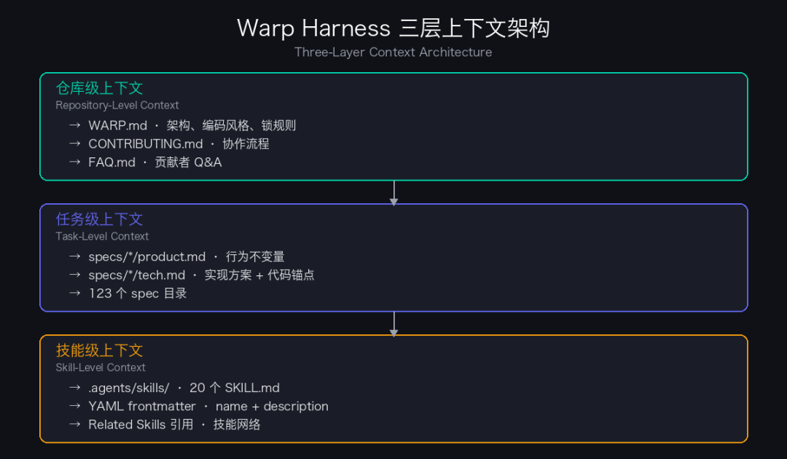
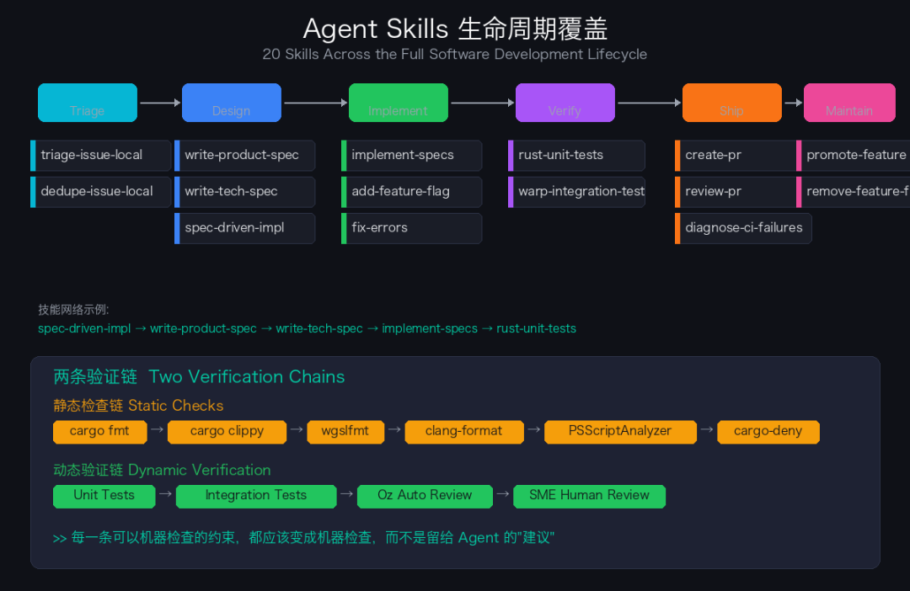
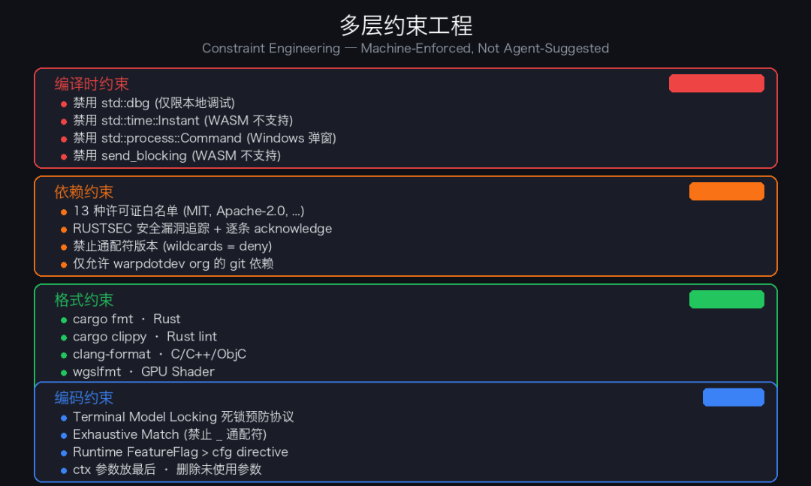
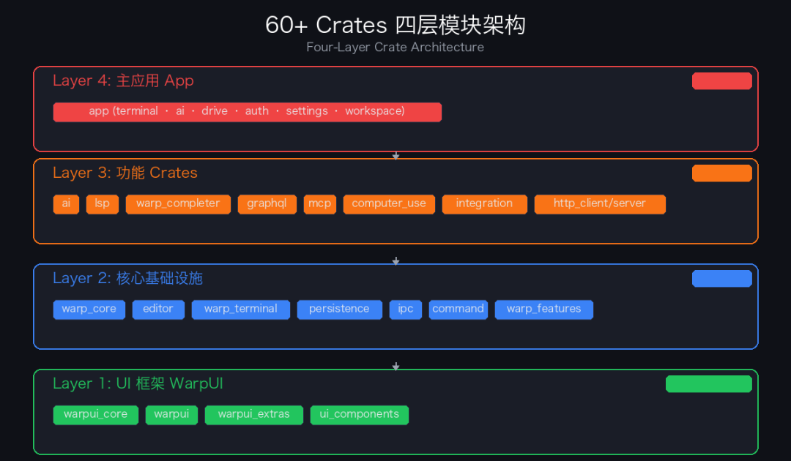

> 原文链接：https://mp.weixin.qq.com/s/JMCaLnjsy85hmbiFReuyQA

> 公众号：歪脖抠腚

# 123 个结构化需求、20 个技能、5 种格式检查器、3 层上下文：拆解 Warp 让 Agent 在 124 万行 Rust 中稳定交付的 Harness 工程

*
Warp 内部 60% 以上的 merged PR 由 Oz agent 生成。这个数字背后不是"模型够聪明"，而是一整套&nbsp;**Harness Engineering**&nbsp;实践：从仓库结构到 CI 流水线，每个环节都在约束 agent 的行为空间、提供结构化上下文、验证输出正确性。

本文基于 Warp 开源仓库的源码、配置文件和 agent 技能定义进行逆向分析，拆解这套体系的设计思路。
## 一、整体架构：三层上下文 + 两条验证链

Warp 的 harness 工程不是靠一个&nbsp;`AGENTS.md`&nbsp;文件解决所有问题。它是一个分层结构，每层解决不同的问题：
层级载体解决的问题**仓库级上下文**`WARP.md`&nbsp;/&nbsp;`CONTRIBUTING.md`&nbsp;/&nbsp;`FAQ.md`agent 理解项目架构、编码风格、协作流程**任务级上下文**`specs/`&nbsp;目录下的 product.md / tech.mdagent 理解要实现什么、怎么实现、怎么验证**技能级上下文**`.agents/skills/`&nbsp;目录下的 20 个 SKILL.mdagent 知道怎么执行特定类型的操作
两条验证链分别是：

•**静态检查链**：`cargo fmt`&nbsp;→&nbsp;`cargo clippy`&nbsp;→&nbsp;`wgslfmt`&nbsp;→&nbsp;`clang-format`&nbsp;→&nbsp;`PSScriptAnalyzer`&nbsp;→&nbsp;`cargo-deny`（许可证和安全审计）•**动态验证链**：单元测试 → 集成测试 → Oz 自动 review → 人类 SME review

这个分层设计的关键洞察是：**agent 的可靠性不取决于模型有多聪明，而取决于你在每个决策点提供了多少结构化约束**。一个 GPT-5.5 在面对一个 60 crate 的 Rust workspace 时，如果没有&nbsp;`WARP.md`&nbsp;告诉它"锁模型时不要嵌套"、没有&nbsp;`write-product-spec`&nbsp;技能告诉它 spec 的格式、没有&nbsp;`presubmit`&nbsp;脚本做门禁检查，它的输出质量会显著下降。
## 二、Spec-Driven Development：让 agent 有"需求文档"可依据
### 2.1 specs/ 目录：123 个结构化需求

`specs/`&nbsp;目录下有 123 个子目录，每个对应一个 feature 或 issue。命名格式混合了三种 ID 系统：

•Linear ticket：`APP-1915`、`APP-3076`&nbsp;等（内部 Linear 项目管理工具的 ID）•GitHub issue：`GH408`、`GH1063`&nbsp;等•工程师名：`alokedesai`、`zachlloyd`&nbsp;等（早期 spec 的遗留格式）

每个 spec 目录包含两个文件：`product.md`（产品 spec）和&nbsp;`tech.md`（技术 spec）。这不是摆设——CONTRIBUTING.md 明确规定：feature request 必须走&nbsp;`ready-to-spec`&nbsp;→ spec PR →&nbsp;`ready-to-implement`&nbsp;→ code PR 的分阶段流程。只有 bug fix 可以跳过 spec 阶段。
### 2.2 产品 Spec 的设计哲学

`write-product-spec`&nbsp;技能文件（165 行）定义了产品 spec 的写作标准。核心原则：**Behavior 是 spec 的全部，其余都是框架**。

一个合格的 Behavior section 必须以编号的、可测试的不变量（invariants）来描述特性行为，覆盖：

•默认行为和 happy path•所有用户可见状态和状态转换•所有输入和对应响应•空状态、错误状态、加载状态、取消•边界情况：权限拒绝、离线、超时、竞态、多实例并发、数据丢失、焦点切换

以&nbsp;`specs/GH408/product.md`&nbsp;为例——这是一个修复&nbsp;`/open-file`&nbsp;命令中&nbsp;`~`&nbsp;展开的小功能。即便如此简单，产品 spec 依然列出了 7 条 success criteria 和 5 个边界情况（`~`&nbsp;alone、`~/`&nbsp;prefix、无 tilde、绝对路径、autosuggestion 转义）。

这种粒度的 spec 做了一件很关键的事：**把"agent 实现错了怎么办"的问题前移到了"agent 应该实现什么"**。当 Behavior section 足够详细时，agent 的实现就变成了对 spec 的翻译，而不是对模糊需求的猜测。
### 2.3 技术 Spec 的锚定策略

`write-tech-spec`&nbsp;技能要求技术 spec 必须"grounded in actual codebase structure and patterns"。三个必选 section：

**Context**&nbsp;不是泛泛的架构描述，而是精确到文件和行号的代码引用：

- 
- 

```
-&nbsp;app/src/terminal/input/slash_commands/mod.rs (445-450) — /open-file handler-&nbsp;app/src/search/command_palette/files/data_source.rs:196&nbsp;—&nbsp;Cmd-O&nbsp;的 tilde expansion
```
**Proposed changes**&nbsp;要求说明哪些模块改变、新增哪些类型/API、数据流怎么走、为什么选这种方案而不是其他方案。

**Testing and validation**&nbsp;是技术 spec 的独占内容——产品 spec 有意不包含 Validation section，所有验证规划都放在技术 spec 中。每个重要的 Behavior invariant 必须映射到一个具体的测试或验证步骤。

这种设计让&nbsp;`implement-specs`&nbsp;技能在实现时有两个明确的"真相来源"：产品 spec 决定"做什么"，技术 spec 决定"怎么做和怎么验证"。
## 三、Agent Skills：20 个结构化能力模块

`.agents/skills/`&nbsp;目录包含 20 个技能，覆盖了从需求分析到发布的完整软件生命周期。这不是一组散装 prompt，而是一个有明确接口和依赖关系的技能系统。
### 3.1 生命周期覆盖

按阶段组织，每个技能有明确的前置条件和输出：

**需求阶段**

•`triage-issue-local`：issue 分诊，最多问 2 个 follow-up 问题，不发明新 label•`dedupe-issue-local`：重复 issue 检测

**设计阶段**

•`write-product-spec`：生成 product.md，定义 Behavior invariants•`write-tech-spec`：生成 tech.md，锚定到具体代码位置•`spec-driven-implementation`：编排 spec → implement 的完整流程

**实现阶段**

•`implement-specs`：根据 approved specs 写代码•`add-feature-flag`：添加 feature flag 门控•`fix-errors`：修复编译错误、lint 问题、测试失败

**验证阶段**

•`rust-unit-tests`：单元测试，提供 App::test 快速 harness•`warp-integration-test`：集成测试，387 行指南，启动真实 Warp 实例

**发布阶段**

•`create-pr`：创建 PR，包含 presubmit 检查、changelog 格式、reviewer 分配•`review-pr`：PR review，输出 JSON 格式的结构化反馈•`diagnose-ci-failures`：CI 失败诊断，生成修复计划•`promote-feature`：从 dogfood 推进到 release•`remove-feature-flag`：清除已稳定的 feature flag

**维护阶段**

•`resolve-merge-conflicts`：合并冲突解决，附带 Python 脚本提取冲突上下文•`update-skill`：技能自身的迭代和改进
### 3.2 技能之间的引用关系

技能不是孤立的——它们通过&nbsp;`Related Skills`&nbsp;形成网络。例如&nbsp;`spec-driven-implementation`&nbsp;会引用&nbsp;`write-product-spec`&nbsp;→&nbsp;`write-tech-spec`&nbsp;→&nbsp;`implement-specs`&nbsp;→&nbsp;`rust-unit-tests`。这意味着 agent 可以按依赖顺序调用技能链，而不是每次从零开始理解流程。
### 3.3 技能的约束性设计

每个技能不只是"教 agent 怎么做"，更重要的是"约束 agent 不能怎么做"。几个典型例子：

**`triage-issue-local`**&nbsp;限制最多问 2 个 follow-up 问题，每个问题必须"meaningfully change the label assignment, owner routing, or reproduction confidence"。对 billing 和 account appeals 类 issue，直接导向客服渠道而不是尝试分诊。

**`review-pr`**&nbsp;要求所有输出写入&nbsp;`review.json`，禁止直接调用&nbsp;`gh pr review`&nbsp;或任何 GitHub API。comment 必须以标签开头（🚨 CRITICAL / ⚠️ IMPORTANT / 💡 SUGGESTION / 🧹 NIT），NIT 类 comment 只有在提供 suggestion block 时才允许。

**`warp-ui-guidelines`**&nbsp;专门防止 agent 在 UI 代码中犯的常见错误：不要自创 button theme（用现有的&nbsp;`PrimaryTheme`、`SecondaryTheme`），不要硬编码&nbsp;`ColorU::new(...)`，不要把 theme 命名为 feature-specific 的名字。

这种"negative constraint"（不允许做什么）比"positive instruction"（应该怎么做）对 agent 更有效——因为 LLM 的失败模式往往不是"不知道该做什么"，而是"在错误的方向上过度自信"。
## 四、约束工程：从 Clippy 到 deny.toml 的多层防护

Warp 的约束体系不依赖 agent 的自律，而是通过工具链强制执行。
### 4.1 编译时约束：.clippy.toml

`.clippy.toml`&nbsp;定义了四类禁用规则：

**禁用宏**：`std::dbg`&nbsp;被禁止提交——"only for use in local testing, not submitted code"。

**禁用类型**：

•`std::time::Instant`&nbsp;→ 因为 WASM 目标不支持，必须用&nbsp;`instant::Instant`•`std::process::Command`&nbsp;→ 因为 Windows 上会弹出终端窗口，必须用&nbsp;`command::blocking::Command`•`async_process::Command`&nbsp;→ 同理

**禁用方法**：

•`async_channel::Sender::send_blocking`&nbsp;→ WASM 不支持•`line_ending::LineEnding::from_current_platform`&nbsp;→ 不处理 Windows Unix 子系统的情况

这些约束不是文档里写的"建议"——它们在&nbsp;`cargo clippy -- -D warnings`&nbsp;时会变成编译错误。agent 生成的代码如果用了&nbsp;`std::time::Instant`，presubmit 直接失败，没有商量余地。
### 4.2 依赖约束：deny.toml

`cargo-deny`&nbsp;配置执行两类检查：

**许可证白名单**：只允许 0BSD、Apache-2.0、BSD-2/3-Clause、MIT、MPL-2.0、Unlicense 等 13 种许可证。任何引入了 GPL 依赖的 crate 都会被拒绝。

**安全审计**：追踪 RUSTSEC 漏洞，每个 ignore 都必须注明原因。目前有 9 个 acknowledged-but-deferred 的安全问题（如&nbsp;`bincode`&nbsp;unmaintained、`derivative`&nbsp;unmaintained），说明团队在主动跟踪依赖风险。

**通配符禁止**：`wildcards = "deny"`——不允许依赖版本使用&nbsp;`*`，只有 workspace 内部的 path 依赖例外。这防止了 agent 在添加依赖时用&nbsp;`*`&nbsp;了事。
### 4.3 格式约束：五种格式检查器

`presubmit`&nbsp;脚本串联了五种格式检查：

1.`cargo fmt`&nbsp;— Rust 代码格式化2.`cargo clippy`&nbsp;— Rust lint（workspace 级和 warp_completer 独立跑）3.`run-clang-format.py`&nbsp;— C/C++/Objective-C 代码格式化（`warpui/src/`&nbsp;和&nbsp;`app/src/`&nbsp;中的 native 代码）4.`wgslfmt`&nbsp;— WGSL shader 格式化5.`PSScriptAnalyzer`&nbsp;— PowerShell 脚本 lint（Windows 平台代码）

这意味着 agent 生成的代码不管动了哪一层（Rust 业务逻辑、native 渲染代码、GPU shader、Windows 脚本），都有对应的格式门禁。
### 4.4 WARP.md 中的编码约束

除了工具链级别的约束，`WARP.md`&nbsp;还定义了一系列必须由 agent 自行遵守的编码规范：

**Terminal Model Locking**——可能是整个仓库里最重要的一条约束：

> Be extremely careful when calling&nbsp;`model.lock()`&nbsp;on the terminal model. Acquiring multiple locks on the same model from different call sites can cause a deadlock, resulting in a UI freeze (beach ball on macOS).

这条规则附带了具体的操作指导：优先传递已锁定的 model 引用，而不是获取新锁；如果必须锁定，缩短 scope 并避免调用可能再次锁定的函数。这是一个典型的"agent 不看这条会写出死锁"的约束。

**Exhaustive Matching**——禁止在 match 语句中使用&nbsp;`_`&nbsp;通配符：

> Exhaustive matching is helpful for ensuring that all variants are handled, especially when adding new variants to enums in the future.

这条规则对 agent 的约束效果特别强——LLM 生成 Rust match 语句时，默认倾向于用&nbsp;`_ =&gt;`&nbsp;做 catch-all，而 exhaustive matching 强制 agent 明确处理每个 variant，从而避免新增 enum variant 时的隐性回归。

**Feature Flag 偏好**——runtime check 优先于 cfg directive：

> Prefer&nbsp;`FeatureFlag::YourFlag.is_enabled()`&nbsp;over&nbsp;`#[cfg(...)]`&nbsp;compile-time directives so flags can be toggled without recompilation and are easier to clean up later.
## 五、测试验证体系：从单元到集成的闭环
### 5.1 单元测试：rust-unit-tests 技能

`rust-unit-tests`&nbsp;技能定义了 Warp 的单元测试规范：

**文件组织**：测试放在独立文件&nbsp;`${filename}_tests.rs`&nbsp;或&nbsp;`mod_test.rs`&nbsp;中，通过&nbsp;`#[cfg(test)] #[path = "..."] mod tests;`&nbsp;引入。这比内联&nbsp;`#[cfg(test)] mod tests {}`&nbsp;更清晰，也更适合 agent 操作——agent 可以直接创建或修改测试文件，不需要在已有的业务代码中寻找测试 module 的插入点。

**快速 harness**：`warpui::App::test`&nbsp;提供了确定性的 UI/model 测试环境。一个典型的测试只需要 initialize → update → read 三步：

- 
- 
- 
- 
- 
- 
- 
- 
- 
- 

```
App::test((), |mut app|&nbsp;async&nbsp;move {&nbsp; &nbsp; initialize_app_for_terminal_view(&amp;mut app);&nbsp; &nbsp; let term = add_window_with_terminal(&amp;mut app,&nbsp;None);&nbsp; &nbsp; term.update(&amp;mut app, |view, _ctx| {&nbsp; &nbsp; &nbsp; &nbsp; view.model.lock().simulate_block("ls",&nbsp;"out");&nbsp; &nbsp; });&nbsp; &nbsp; term.read(&amp;app, |view, _ctx| {&nbsp; &nbsp; &nbsp; &nbsp;&nbsp;assert!(view.model.lock().block_list().len() &gt;&nbsp;0);&nbsp; &nbsp; });})
```
**虚拟文件系统**：`virtual_fs::VirtualFS`&nbsp;让 IO-heavy 的测试脱离真实文件系统，agent 不需要处理 temp dir 清理之类的脏活。

**Feature Flag 作用域控制**：`FeatureFlag::X.override_enabled(true)`&nbsp;返回一个 RAII guard，离开 scope 自动恢复。agent 可以安全地在单个测试中切换 flag 而不影响并行测试。
### 5.2 集成测试：真实 Warp 实例的端到端验证

`warp-integration-test`&nbsp;是整个技能集中最长的一个（387 行），因为集成测试框架的复杂度远超单元测试。

**运行机制**：集成测试不是 mock，而是启动一个真实的 Warp 应用实例，创建隔离的 HOME 目录和 shell rc 文件，通过合成的 UI 和 terminal 事件驱动测试，然后轮询断言直到成功或超时。

框架的核心组件：
文件作用`crates/integration/src/bin/integration.rs`手动测试 runner，按名称执行单个测试`crates/integration/tests/common/mod.rs`nextest 入口，shell out 到 integration binary`crates/integration/src/builder.rs`测试构建器，提供隔离环境`crates/warpui_core/src/integration/driver.rs`执行引擎，处理重试、截图、视频`crates/warpui_core/src/integration/step.rs`TestStep 定义，输入/断言/数据传递`app/src/integration_testing/`高级 helper：terminal 命令执行、block list、command palette 等
**PreconditionFailed 机制**：当环境进入无效状态时，断言可以返回&nbsp;`PreconditionFailed`&nbsp;而不是硬失败，外层 harness 会重试整个测试（最多 10 次）。这个设计承认了一个现实：在真实 app 中做集成测试，环境的不确定性是不可避免的——与其写脆弱的 workaround，不如建立一个优雅的重试机制。

**Agent 友好的注册清单**：每个新测试必须完成 7 步注册才能被 CI 执行——这对 agent 来说是一个容易遗漏的多文件操作。技能文件用清单形式一条一条列出，并在末尾设置了 verification checklist，确保 agent 不会写了测试代码但忘了把它接入 CI。
### 5.3 测试要求与 PR 的关联

`create-pr`&nbsp;技能把测试和 PR 类型绑定：

•**Bug fix**&nbsp;→ 必须有回归测试（"would have caught the bug"）•**算法/非平凡逻辑**&nbsp;→ 必须有单元测试•**UI 组件**&nbsp;→ 必须有 layout validation 测试（不 panic 即可）•**P0 use case**&nbsp;→ 必须有集成测试（"behavior that, if broken, warrants an out-of-band release"）

如果 PR 改变了用户可见的流程，`create-pr`&nbsp;技能要求 agent 先问用户是否需要集成测试，而不是自行判断。这是一个有意的设计——让人类决定"要不要测试"，让 agent 决定"怎么写测试"。
## 六、Workspace 治理中的 Agent 友好设计

Warp 的 60+ crates 四层架构（UI 框架 → 核心基础设施 → 功能 Crates → 主应用）在前篇[3]中已有详细分析。这里只补充对 agent 开发有直接影响的 workspace 治理细节。

根&nbsp;`Cargo.toml`&nbsp;的&nbsp;`default-members`&nbsp;只包含 12 个核心 crate，`integration`&nbsp;和&nbsp;`serve-wasm`&nbsp;被排除在外。这意味着 agent 执行&nbsp;`cargo build`&nbsp;不会触发完整 workspace 的编译，减少了等待时间和噪音。但 agent 运行&nbsp;`presubmit`&nbsp;或 CI 时，会显式编译整个 workspace（`--workspace`），确保跨 crate 的兼容性。

`workspace.dependencies`&nbsp;统一管理所有 crate 的版本——当 agent 需要添加依赖时，应该在 workspace 级别声明版本，然后在目标 crate 的&nbsp;`Cargo.toml`&nbsp;中引用。这个约定没有写进技能文件，但&nbsp;`fix-errors`&nbsp;技能会帮 agent 修复因依赖声明不当导致的编译错误，形成一个"犯错 → 自动修复 → 学习"的闭环。

`.github/STAKEHOLDERS`&nbsp;把源码路径映射到 subject-matter expert（约 30 个规则、15+ 位 SME）。当 Oz 完成 PR review 后，根据 PR 涉及的文件路径自动分配人类 reviewer：

- 
- 
- 
- 

```
/app/src/ai/agent/&nbsp;@zachbai/app/src/ai/mcp/&nbsp;@peicodes/crates/warpui/&nbsp;@vorporeal/crates/editor/&nbsp;@kevinyang372
```
这让 agent 写的代码被对应模块的专家 review，而不是随机分配——对跨 60+ crate 的大型仓库来说，这种精确路由至关重要。
## 七、CI/CD 自动化：从 Issue 到 Release 的 Pipeline
### 7.1 GitHub Workflows 全景

`.github/workflows/`&nbsp;包含 28 个 workflow 文件，构成了从 issue 到 release 的完整自动化链：

**Issue 管理**

•`triage-new-issues-local.yml`&nbsp;— 新 issue 自动分诊•`update-triage-local.yml`&nbsp;— 分诊信息更新•`respond-to-triaged-issue-comment-local.yml`&nbsp;— 回复已分诊 issue 的 comment•`update-dedupe-local.yml`&nbsp;— 重复 issue 检测

**Spec 和实现**

•`create-spec-from-issue-local.yml`&nbsp;— 从 issue 自动生成 spec PR•`create-implementation-from-issue-local.yml`&nbsp;— 从 issue 自动生成实现 PR•`trigger-implementation-on-plan-approved-local.yml`&nbsp;— spec 批准后触发实现

**PR 管理**

•`review-pull-request.yml`&nbsp;— 自动 PR review（Oz → SME）•`respond-to-pr-comment-local.yml`&nbsp;— 回复 PR comment•`verify-pr-comment-local.yml`&nbsp;— 验证 PR comment•`enforce-pr-issue-state.yml`&nbsp;— 确保 PR 关联到正确状态的 issue•`check_approvals.yml`&nbsp;— 审批检查•`sync-pr-checks.yml`&nbsp;— 同步 PR 检查状态•`close_stale_fix_prs.yml`&nbsp;— 关闭过期修复 PR•`warp_cleanup_fix_prs.yml`&nbsp;— 清理 fix PR

**CI/CD**

•`ci.yml`&nbsp;— 主 CI：格式化、clippy、测试（macOS/Linux/Windows）•`create_release.yml`&nbsp;— 创建发布•`cut_new_releases.yml`&nbsp;/&nbsp;`cut_new_release_candidate.yml`&nbsp;— 发布裁剪•`populate_build_cache.yml`&nbsp;— 预热编译缓存•`feature_flag_cleanup.yml`&nbsp;— 清理已稳定的 feature flag
### 7.2 Oz 的 Workflow 集成

大部分自动化 workflow 都委托给&nbsp;`warpdotdev/oz-for-oss`&nbsp;这个外部仓库的 reusable workflow。以 PR review 为例：

- 
- 
- 
- 
- 
- 

```
uses: warpdotdev/oz-for-oss/.github/workflows/review-pull-request.yml@mainwith:&nbsp; pr_number:&nbsp;${{ needs.resolve.outputs.pr_number }}secrets:&nbsp; OZ_MGMT_GHA_APP_ID:&nbsp;${{ secrets.OZ_MGMT_GHA_APP_ID }}&nbsp; OSS_WARP_API_KEY:&nbsp;${{ secrets.OSS_WARP_API_KEY }}
```
本地 workflow 只做事件匹配和权限控制（比如判断是否是 draft PR、是否已 triaged、是否是 cherrypick 分支），实际的 agent 逻辑在 Oz 的闭源 workflow 中执行。这是一个精巧的架构选择——**本地仓库控制"什么时候触发"，Oz 控制"怎么执行"**，两者解耦。
### 7.3 STAKEHOLDERS：路径级别的 SME 映射

`.github/STAKEHOLDERS`&nbsp;把源码路径映射到 subject-matter expert。当 Oz 完成 PR review 后，它会根据 PR 涉及的文件路径自动分配人类 reviewer：

- 
- 
- 
- 

```
/app/src/ai/agent/&nbsp;@zachbai/app/src/ai/mcp/&nbsp;@peicodes/crates/warpui/&nbsp;@vorporeal/crates/editor/&nbsp;@kevinyang372
```
这意味着 agent 写的代码，会被对应模块的专家 review，而不是随机分配。覆盖面从 AI agent 到 UI 框架、从 MCP 集成到 OAuth 流程，当前列出了约 30 个路径规则和 15+ 位 SME。
## 八、Oz Review 的结构化协议

`review-pr`&nbsp;技能定义了一个机器可读的 review 协议。Oz 的 PR review 不是直接在 GitHub 上写 comment——它生成一个&nbsp;`review.json`&nbsp;文件，由 workflow 发布到 GitHub。

JSON 结构：

- 
- 
- 
- 
- 
- 
- 
- 
- 
- 
- 

```
{&nbsp;&nbsp;"summary":&nbsp;"## Overview\n...\n## Verdict\nFound: 1 critical, 2 important\n**Request changes**",&nbsp;&nbsp;"comments": [&nbsp; &nbsp; {&nbsp; &nbsp; &nbsp;&nbsp;"path":&nbsp;"app/src/terminal/input/slash_commands/mod.rs",&nbsp; &nbsp; &nbsp;&nbsp;"line":&nbsp;42,&nbsp; &nbsp; &nbsp;&nbsp;"side":&nbsp;"RIGHT",&nbsp; &nbsp; &nbsp;&nbsp;"body":&nbsp;"⚠️ [IMPORTANT] Missing null check\n\n```suggestion\nif let Some(path) = ...\n```"&nbsp; &nbsp; }&nbsp; ]}
```
这种设计的好处：

1.**可审计**：review 输出是结构化的，可以被后续 workflow 解析、聚合、统计2.**可约束**：每条 comment 必须有 severity 标签，NIT 必须附带 suggestion block3.**防越权**：技能明确禁止直接调用&nbsp;`gh pr review`&nbsp;或&nbsp;`gh api`，agent 不能绕过 workflow 直接操作 GitHub

review scope 也有明确约束：

•V0/初始实现的 PR，鲁棒性建议（timeout、retry、lifecycle）作为"optional future work"而不是 blocking concern•不建议仅改变构造器参数或 struct 字段的测试用例——只有覆盖不同代码路径的测试才值得建议•对未修改代码的 concern 放在 summary 里，不做 inline comment
## 九、Feature Flag 生命周期管理

Warp 的 feature flag 不是简单的 bool 开关——它有一个从创建到清理的完整生命周期，由三个技能覆盖。

**`add-feature-flag`**：在&nbsp;`warp_core/src/features.rs`&nbsp;添加&nbsp;`FeatureFlag`&nbsp;enum variant，在&nbsp;`app/Cargo.toml`&nbsp;添加 feature，在&nbsp;`app/src/lib.rs`&nbsp;添加 cfg 属性。新 flag 默认不启用，可以通过加入&nbsp;`DOGFOOD_FLAGS`&nbsp;数组让 dev 构建启用。

**`promote-feature`**：把 flag 从&nbsp;`DOGFOOD_FLAGS`&nbsp;推进到&nbsp;`PREVIEW_FLAGS`&nbsp;或&nbsp;`RELEASE_FLAGS`，最终加入&nbsp;`default`&nbsp;features。每一步推进都是一个独立的 PR。

**`remove-feature-flag`**：当 feature 在 stable 稳定后，清除 flag 和所有相关的条件分支。这是最容易遗漏的步骤——agent 需要搜索所有&nbsp;`FeatureFlag::YourFlag.is_enabled()`&nbsp;调用和&nbsp;`#[cfg(feature = "...")]`&nbsp;属性，删除条件分支但保留启用时的代码路径。

`feature_flag_cleanup.yml`&nbsp;workflow 定期检查可以清理的 flag，防止 flag 积累。

这套生命周期管理对 agent 的意义在于：flag 的创建、推进、清理都有确定性的步骤可以遵循，而不是"凭感觉判断什么时候该删"。
## 十、Agent-Readable 上下文设计
### 10.1 WARP.md 的双重角色

`WARP.md`（181 行）同时服务于人类工程师和 agent。它不是泛泛的 README，而是一个精确的工程手册：

•**Development Commands**：每个命令都是 copy-paste 可执行的•**Architecture Overview**：从 WarpUI framework 到 AI Integration 的分层描述•**Coding Style**：不是"保持一致"这种废话，而是具体到"闭包参数不写类型标注"、"ctx 参数放最后除非最后是闭包"、"永远删除未使用参数而不是加下划线"•**Terminal Model Locking**：死锁预防的完整 protocol

每一条都是从 review 教训中提炼出来的——"这个 pattern 之前有人搞错过，所以写进规则"。
### 10.2 .mcp.json 的极简设计

- 
- 
- 
- 
- 
- 
- 
- 

```
{&nbsp;&nbsp;"mcpServers": {&nbsp; &nbsp;&nbsp;"github": {&nbsp; &nbsp; &nbsp;&nbsp;"command":&nbsp;"npx",&nbsp; &nbsp; &nbsp;&nbsp;"args": ["-y",&nbsp;"@modelcontextprotocol/server-github"]&nbsp; &nbsp; }&nbsp; }}
```
仓库只配了一个 MCP server：GitHub。这个配置让支持 MCP 的 agent（如 Claude Code）自动获得 GitHub API 访问能力，而不需要 agent 自己去配置 token 和 endpoint。极简但有效。
### 10.3 .warp/workflows/ 的开发快捷方式

`.warp/workflows/`&nbsp;下的 10 个 YAML 文件是 Warp IDE 内置的 workflow，但它们的设计也暴露了团队日常的开发模式：

•`start_new_task.yaml`：从 master 切新分支，如果分支已存在就切换到它•`run_unit_test.yaml`&nbsp;/&nbsp;`run_integration_test.yaml`：一键运行测试•`run_warp_with_shell.yaml`：指定 shell 启动 Warp（调试 shell 兼容性）•`build_image_and_start_container_for_ssh_testing.yaml`：Docker + SSH 测试环境

这些 workflow 对 agent 来说是隐性上下文——它们描述了团队实际的工作流，agent 可以复用相同的命令序列。
## 十一、Warp 的 Harness 工程给我们的启示
### 11.1 约束 &gt; 指令

Warp 的实践表明：告诉 agent "不要用&nbsp;`std::time::Instant`" 并通过 clippy 强制执行，比告诉 agent "请注意跨平台兼容性" 有效得多。**每一条可以机器检查的约束，都应该变成机器检查，而不是留给 agent 的"建议"。**

`.clippy.toml`&nbsp;中的&nbsp;`disallowed-types`、`deny.toml`&nbsp;中的 license whitelist、`presubmit`&nbsp;中的五种格式检查器——这些都是把人类判断固化为自动化门禁的例子。
### 11.2 Spec 是 Agent 时代的"类型系统"

在传统开发中，类型系统约束了代码的行为空间。在 agent 开发中，spec 起到了类似的作用——它约束了 agent 的实现空间。`write-product-spec`&nbsp;要求 Behavior section 以"编号的、可测试的不变量"来表达，这实际上是在为 agent 定义一个"行为类型系统"：

•invariant 1:&nbsp;`/open-file ~/path`&nbsp;展开&nbsp;`~`&nbsp;到&nbsp;`$HOME`•invariant 2:&nbsp;`/open-file relative/path`&nbsp;仍然相对于 cwd 解析•invariant 3: error toast 显示展开后的路径

agent 的实现可以自由选择代码结构，但必须满足这些 invariants——和 Rust 的类型检查器只关心函数签名不关心实现细节的逻辑一模一样。
### 11.3 Multi-Tool 约束比 Single-Tool 指令更可靠

Warp 没有依赖单一的 "agent rules" 文件。它把约束分散到了多个工具链中：

•**Clippy**&nbsp;检查类型安全和 API 使用•**deny.toml**&nbsp;检查依赖许可证和安全•**presubmit**&nbsp;检查格式•**nextest**&nbsp;检查功能正确性•**Oz review**&nbsp;检查代码质量•**SME review**&nbsp;检查领域正确性

每个工具只检查自己擅长的部分。这比写一个巨大的 system prompt 试图覆盖所有约束要可靠得多——因为 LLM 对 system prompt 的遵循会随上下文长度衰减，而工具链的检查不会。
### 11.4 技能系统的网络效应

20 个技能不是 20 个独立的 prompt——它们通过&nbsp;`Related Skills`&nbsp;引用形成了一个有向图。当&nbsp;`spec-driven-implementation`&nbsp;需要写产品 spec 时，它指向&nbsp;`write-product-spec`；当&nbsp;`create-pr`&nbsp;发现 presubmit 失败时，它指向&nbsp;`fix-errors`。这种网络化设计让 agent 可以沿着依赖链逐步完成复杂任务，而不是在一个 mega-skill 里处理所有情况。

对于想建设自己的 agent 技能体系的团队，Warp 的经验是：**技能应该小而专注，每个技能有明确的触发条件、前置条件、输出格式和相关技能引用**。`update-skill`&nbsp;技能甚至提供了创建新技能的 meta 指导——技能系统可以自我演进。
### 11.5 开放的上下文格式

Warp 的 FAQ.md 特别提到："This repository ships agent-readable context (skills under&nbsp;`.agents/skills/`, specs under&nbsp;`specs/`, and&nbsp;`WARP.md`) that any harness supporting these formats can pick up."

这意味着不仅 Oz 可以使用这些上下文，Claude Code、Codex、Gemini CLI 等任何支持读取 markdown 文件的 agent 都可以利用它们。`.agents/skills/`&nbsp;的 YAML frontmatter 格式（`name`&nbsp;+&nbsp;`description`）是一个轻量级的技能发现协议——agent 可以扫描 frontmatter 来决定哪个技能和当前任务相关。

这是 Harness Engineering 的一个重要设计原则：**上下文格式应该是 agent-agnostic 的**。不要为特定的 agent 框架定制格式，用 markdown + YAML frontmatter 这种任何 agent 都能解析的通用格式。

### References

`
``[4]`Warp 开源公告:https://www.warp.dev/blog/warp-is-now-open-source*
`[5]`Warp GitHub 仓库:*https://github.com/warpdotdev/warp*
`[6]`CONTRIBUTING.md:*https://github.com/warpdotdev/warp/blob/master/CONTRIBUTING.md*
`[7]`WARP.md 工程指南:*https://github.com/warpdotdev/warp/blob/master/WARP.md*
`[8]`FAQ.md:*https://github.com/warpdotdev/warp/blob/master/FAQ.md*
`[9]`.agents/skills/ 技能目录:*https://github.com/warpdotdev/warp/tree/master/.agents/skills*
`[10]`specs/ Spec 目录:*https://github.com/warpdotdev/warp/tree/master/specs*
`[11]`Oz 编排平台:&nbsp;*https://www.warp.dev/oz*
