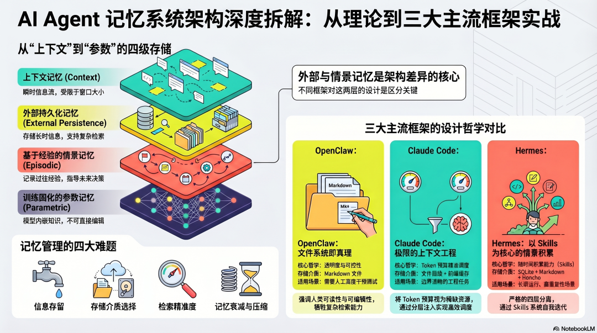

> 原文链接：https://mp.weixin.qq.com/s/Bwmr8vmAgsBz4g5S8SWX7g

## 系列：AI Agent 架构设计（一）：记忆系统设计目标：从架构层面理解三个主流框架的记忆系统设计决策，以及背后的工程取舍适合：对 Agent 底层设计感兴趣，想真正理解"为什么这样设计"的读者预计阅读：15 分钟为什么记忆系统是 Agent 架构的核心问题？设计一个 AI Agent，第一个绕不过去的问题不是"用什么模型"，而是：语言模型本身没有状态。每次调用都从零开始，它不记得任何事情。这个根本约束，决定了所有 Agent 框架都必须在模型外面搭一套记忆系统。这套系统要回答四个架构问题：存什么——哪些信息值得保留，哪些该丢弃存在哪——用什么介质，什么格式，什么生命周期怎么取——需要的时候怎么找到，精确匹配还是语义搜索怎么管——记忆怎么衰减、更新、压缩，防止积累成噪音OpenClaw、Claude Code、Hermes Agent 对这四个问题给出了三种不同的答案。把它们放在一起看，能看清楚记忆系统设计的核心取舍。理论框架：记忆的四个层次在拆解三个框架之前，先建立一个分析框架。研究界把 Agent 记忆分成四种类型，对应不同的存储机制和访问方式：上下文记忆（In-context）：当前 Token 窗口里的所有内容。访问成本最低，但容量有限，会话结束即消失。外部记忆（External）：持久化在模型外部的存储——文件、数据库、向量库。跨会话存活，但每次访问需要检索步骤。情景记忆（Episodic）：过去行为的结构化记录。不只是存事实，而是存"做过什么、怎么做的、结果如何"。是 Agent 从自身经验学习的基础。参数记忆（Parametric）：模型训练权重里编码的知识。始终存在，不需要检索，但运行时无法更新，也存在幻觉风险。真正有趣的架构问题，是外部记忆和情景记忆怎么设计——这是三个框架差异最大的地方。OpenClaw：文件系统即记忆核心设计决策：文件是唯一真理OpenClaw 的记忆架构建立在一个极简原则上：没有写进文件的，不存在。这不是一句口号，而是一个架构约束。Agent 的所有长期状态，必须持久化到磁盘上的 Markdown 文件里。文件本身就是记忆的存储介质，也是人机协作的接口。~/.openclaw/workspace/├── MEMORY.md ← 长期记忆（精华）├── SOUL.md ← Agent 身份定义└── memory/ ├── 2026-04-12.md ← 当日日志（短期） ├── 2026-04-11.md ← 昨日日志 └──...为什么选择文件而不是数据库？这是一个刻意的设计取舍。文件有三个数据库没有的特性：人类可读、可编辑、可版本控制。你可以用任何文本编辑器打开 MEMORY.md，看到 Agent 记住了什么，直接修改错误的记忆，用 Git 追踪变化历史。这种透明性在调试和信任建立上有很大价值。代价是：文件系统的查询能力远不如数据库。复杂的关系型查询、快速的精确匹配，都是文件的弱项。两层记忆结构：短期与长期的分离OpenClaw 把外部记忆分成两层，对应两种不同的信息生命周期：短期层（memory/YYYY-MM-DD.md）：当天的工作日志。追加写入，不做整理，捕获所有可能有用的上下文。今天和昨天的日志自动注入上下文，更早的通过检索访问。长期层（MEMORY.md）：精华提炼。从日志中沉淀出来的稳定事实、用户偏好、工作规范。每次会话都加载，始终在场。这个两层设计解决了一个根本矛盾：你想要 Agent 记住很多东西，但上下文窗口放不下很多东西。短期层解决"不丢失"，长期层解决"高效访问"。代价是需要一个主动的提炼过程——谁来决定什么东西从日志升级到 MEMORY.md？OpenClaw 的答案是：主要靠人，辅以实验性的自动化（Dreaming 机制）。这意味着记忆质量依赖用户的主动维护。检索设计：混合搜索单纯的语义搜索（向量相似度）有一个问题：它找的是"意思相近"，但有时候你需要"精确匹配"。比如搜索一个具体的 API 端点名称，语义搜索可能返回一堆相关但不准确的结果。OpenClaw 用混合搜索解决这个问题：语义搜索 + BM25 关键词搜索并行运行，结果合并取最相关片段。两种搜索互补：语义搜索处理措辞不同但含义相近的情况，BM25 处理精确词匹配的情况。实现上，向量索引存在 SQLite（通过 sqlite-vec 扩展），而不是独立的向量数据库。这个选择降低了部署复杂度，代价是大规模下性能不如专用向量库。最危险的环节：Context CompactionOpenClaw 的记忆系统最复杂的部分，不是存储，而是压缩。长会话会撑爆 Token 窗口。当历史对话积累到接近上限，系统必须压缩——把旧的对话历史替换成摘要，腾出空间。压缩本身是正确的操作，但会引入一个隐患：只存在于对话历史里的约定，会在压缩中消失。这产生了一个有名的 bug 模式：用户在对话里告诉 Agent 某个重要规则，Agent 说"好的"，但没有写进文件。几轮对话后触发 Compaction，这个约定消失，Agent 之后的行为违反了用户以为已经被记住的规则。OpenClaw 的解法是 Memory Flush：在 Compaction 触发前，系统先发起一个静默的 Agent 轮次——提示模型把当前上下文里所有重要信息写进磁盘文件，然后再压缩。这个设计很聪明：把"写进文件才算记住"这个原则，从人工操作变成了系统级的自动保障。检测到即将 Compaction ↓触发静默 Memory Flush ↓Agent 把重要信息写入 memory/YYYY-MM-DD.md ↓执行 Compaction（压缩历史对话） ↓继续会话文件里的内容，压缩不会碰。只有对话历史会被压缩。Dreaming：情景记忆的实验性尝试OpenClaw 新版本加入了 Dreaming 机制——一个定期运行的后台任务，扫描日志文件，对内容打分，把达到阈值的内容提升到 MEMORY.md。这是向自动化情景记忆迈出的一步：让系统而不是人来做记忆的沉淀工作。但目前仍是实验性的，默认关闭。背后的挑战是：什么信息"值得"长期保留，很难用规则描述，需要上下文判断。Claude Code：上下文工程优先核心设计决策：Token 预算是稀缺资源，必须主动管理Claude Code 的记忆架构建立在一个明确的工程判断上：上下文窗口的容量不等于可用容量，模型对不同位置的信息注意力分布是不均匀的。研究表明语言模型对上下文头部和尾部注意力最强，中间最弱——这就是"Lost in the Middle"现象。这意味着把记忆直接堆进上下文不够，还需要主动管理哪些信息放在哪里、放多少。Claude Code 的记忆架构不是一个"存储系统"，而是一套 Token 预算分配和信息注入机制。系统提示的精确构建：分层注入从泄露的源码可以看到，Claude Code 在每次调用模型之前，会精细地组装系统提示。这个过程不是简单拼接，而是有条件的分层注入：固定注入层（每次都有，走 Prefix Cache）：Agent 身份定义和基本行为规范编码哲学：最小化修改、不过度工程化、只做被要求的事工具使用规范和风险操作确认逻辑条件注入层（按需加载，不浪费 Token）：CLAUDE.md文件内容（按作用域层级加载）Git 状态快照（当前分支、最近提交、工作区变更）Skills 名称和描述列表（只有索引，不是完整内容）Token 预算指令（当用户设定了消耗目标时）固定层走 Prefix Cache，只需付一次费用；条件层按需注入，不浪费 Token。这个分层是 Claude Code 上下文优化的基础设计。分层文件体系：用路径编码相关性Claude Code 用作用域层级解决"哪些规则对当前任务有用"的问题：~/.claude/CLAUDE.md ← 用户级：所有项目都加载~/project/CLAUDE.md ← 项目级：进入项目加载~/project/src/CLAUDE.md ← 目录级：进入该目录加载不需要写检索算法——当前工作目录在哪，文件系统路径本身就决定加载哪些规则。相关性被编码进了目录结构，用 O(1) 的路径查找替代了语义检索。代价是只能做静态的"这个目录用什么规则"，不能做动态的"这个任务需要什么知识"。Token 预算的三档预警：让 Agent 感知自身状态Claude Code 对 Token 消耗有明确的三档预警：70% 阈值 → 第一次提示：压缩可能即将发生85% 阈值 → 第二次提示：压缩即将触发90% 阈值 → 执行自动压缩（或停止并提示）更重要的设计：Token 使用量会注入 Agent 自身的上下文，让 Agent 能在规划任务时感知剩余预算："我还有足够的 Token 分析三个文件，然后就会触发压缩。"Agent 可以据此主动决策——优先处理哪些文件、在压缩前完成哪些关键步骤。记忆系统的状态成为 Agent 推理的输入，而不只是被动的存储后端。 这是上下文工程里一个很值得借鉴的设计思路。Hermes Agent：四层分离，情景记忆是核心核心设计决策：把记忆按访问模式分层Hermes 的记忆架构是三者中最系统化的。它的核心设计思路是：不同访问模式的记忆，必须在不同的存储介质里，用不同的方式管理。把所有东西混在一起是大多数 Agent 记忆系统变得不可靠的根本原因。Hermes 把记忆严格分成四层：第一层：热记忆（始终注入，永远在场）~/.hermes/memories/├── MEMORY.md ← 环境事实，上限 ~800 token└── USER.md ← 用户偏好，上限 ~500 token这两个文件在每次会话开始时直接注入系统提示，不需要检索，零延迟访问。为什么把上限设得这么小？这是一个反直觉但正确的设计决策。上限小，强制你做信息的质量控制。每次想写进去一条新记忆，你必须问：这条信息值得占用宝贵的系统提示空间吗？它比已有的哪条更重要？如果上限很大，记忆会自然地退化成一个什么都往里堆的垃圾桶，检索质量随着积累不断下降。同时，小的系统提示对 Prefix Cache 友好——固定的前缀意味着更高的缓存命中率，降低推理成本。第二层：历史归档（按需检索）~/.hermes/state.db ← SQLite，FTS5 全文索引所有会话历史都存进这个数据库。当 Agent 判断当前任务可能和历史相关，它主动调用 session\_search 工具搜索数据库，召回相关历史，经过轻量 LLM 摘要压缩后注入当前上下文。这里有一个重要的架构决策：历史归档不是自动注入的，是 Agent 主动决策检索的。这是"架构决定访问方式，而不是 Agent 的判断"原则的体现。为什么这样设计？如果每次会话都自动加载历史，系统提示会随着使用时间增长而不断膨胀。按需检索让系统提示保持稳定，历史记忆只在真正需要的时候才进来。FTS5 全文搜索的局限是语义理解弱——搜"auth service"不一定能找到记录里写的"身份验证微服务"。这是当前架构的一个已知权衡点，Hermes 社区有一些用向量搜索替代或增强 FTS5 的扩展方案。第三层：情景记忆（Skills，Hermes 的核心差异）这是 Hermes 和 OpenClaw、Claude Code 最根本的架构差异。情景记忆存储的不是事实，而是经验——做过什么、怎么做的、效果如何。Hermes 的实现是 Skills 系统：~/.hermes/skills/├── research-workflow.md ← 某类任务的最优执行路径├── image-generation.md ← 图片生成任务的经验积累└── data-analysis.md ← 数据分析任务的方法论每当 Agent 完成一个复杂任务（通常是五次以上工具调用），系统评估这次执行过程是否值得保留为 Skill。如果值得，Agent 自动把执行步骤、使用的工具、遇到的问题、解决方法，结构化写入一份 Markdown 文件。Skills 的加载方式用了渐进式披露：Level 0：只加载 Skill 名称和描述（极少 Token） ↓（如果相关）Level 1：加载完整 Skill 内容平时只知道"有哪些 Skill 可用"，当判断当前任务和某个 Skill 相关，才加载完整内容。这让你可以积累几十上百个 Skill 而不撑爆上下文。更重要的是：Skill 会在使用中自我更新。Agent 用一个已有的 Skill 执行任务，发现某个步骤有更好的做法，会自动修改 Skill 文档。经验在积累，方法在迭代。这是真正意义上的情景记忆——不只记住发生了什么，还知道下次怎么做更好。这个设计回答了情景记忆最核心的问题：如何让 Agent 从自己的执行历史里学习，而不只是从人类事先定义的规则里执行？第四层：深度用户建模（可选）通过接入 Honcho，Hermes 可以建立对用户的结构化模型——不只是记录"用户说了什么"，而是建立"用户怎么思考、倾向于什么决策风格"的持久模型。这层是可选的，使用了一种叫"对话式用户建模"的方法：通过分析用户的历史表达，推断用户的偏好和价值观，在未来的交互中主动适应。这是最接近"真正了解用户"的记忆层，但也是最重的——需要额外服务，有隐私考量，适合有特定需求的场景。三种架构哲学的本质差异把三个框架放在一起，可以看出三种根本不同的设计哲学：OpenClaw：文件系统作为真理来源设计核心是可见性和可控性。所有记忆都在磁盘上，人类可以直接读写，系统行为透明可预期。代价是需要用户主动维护记忆质量，记忆的准确性依赖人的持续投入。这个架构适合重视控制感和透明度的场景——你想知道 Agent 记住了什么，你想能随时纠正它的记忆。Claude Code：上下文工程优先设计核心是信息的精准调度。不追求存储更多，而是追求在正确时机注入正确信息。文件系统的层级结构本身就是相关性的编码。代价是没有情景记忆，每次任务都是全新开始。这个架构适合边界清晰的工程任务——规则是稳定的，任务是相对独立的，不需要从历史经验里学习。Hermes：分层积累，情景记忆是核心设计核心是随时间积累能力。四层分离确保不同访问模式的信息不互相干扰，情景记忆让 Agent 从自身经验中学习。代价是系统更复杂，需要时间积累才能看到效果。这个架构适合长期运行、重复性高的场景——任务类型相对固定，时间越长 Agent 越熟悉你的工作方式。
