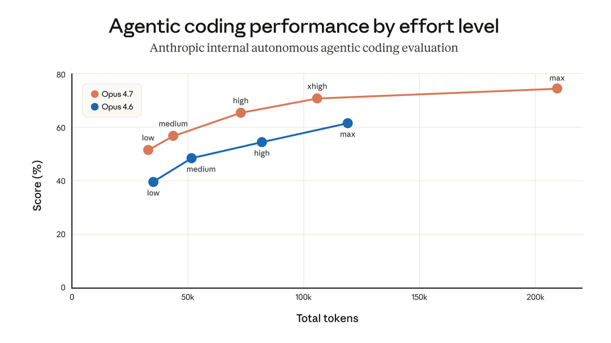
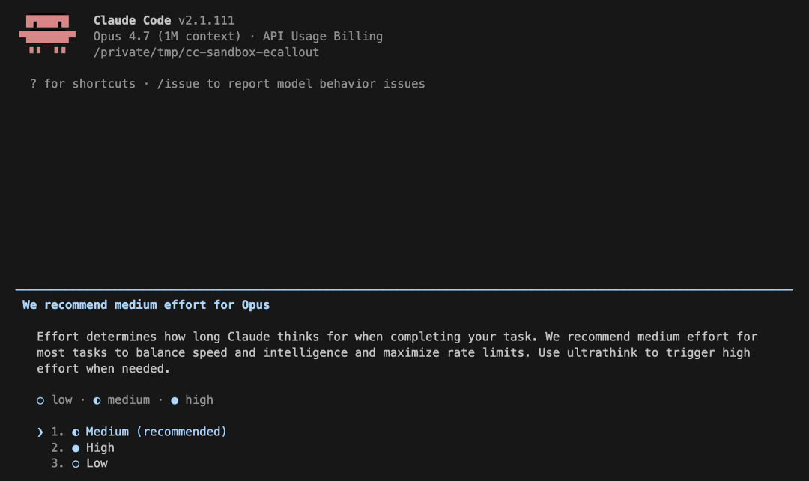
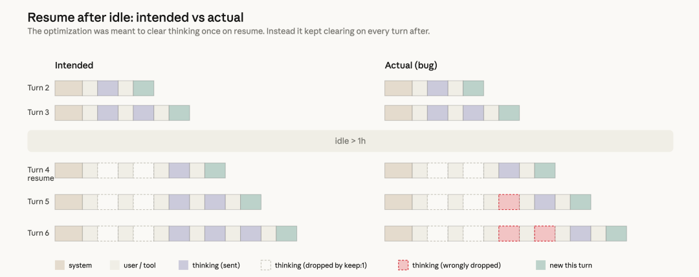

> 原文链接：https://mp.weixin.qq.com/s/-U14OuMOUUufO1uy6_iEZA

# Anthropic 工程博客自爆：一条 25 词的 system prompt 限制如何摧毁 Claude Code

> **来源：** Anthropic Engineering Blog[1] · 2026 年 4 月 23 日

**TL;DR** — 2026 年 3 月至 4 月，大量 Claude Code 用户报告模型"变笨了"。AMD AI 高级总监 Stella Laurenzo 对 6,852 个会话的量化分析显示，thinking 深度暴跌 67%，盲编辑率从 6.2% 飙升到 33.7%。Anthropic 最终追踪到三个独立的产品层变更：将默认推理努力从 `high` 降到 `medium`（3 月 4 日）；一个缓存优化 bug 导致 thinking 历史在整个会话中被持续清除而非仅清除一次（3 月 26 日）；以及一条限制输出字数的 system prompt 指令（4 月 16 日）。三个问题分别影响不同用户群体、在不同时间窗口生效，叠加在一起看起来像是模型本身的全面退化。所有修复于 4 月 20 日的 v2.1.116 完成，Anthropic 同时重置了所有订阅用户的使用限额。这是 AI 编码工具领域迄今为止最有教育意义的一次产品事故——它证明了"模型没变，harness 变了"可以制造出与模型退化完全相同的用户体验。
## 一、事件全景

### 时间线
时间事件影响范围2 月 5 日Opus 4.6 发布，默认 effort 为 `high`Claude Code 全量用户3 月 4 日默认 effort 从 `high` 改为 `medium`Sonnet 4.6 + Opus 4.6 用户3 月 8 日Laurenzo 数据中 redacted thinking 占比超过 50%标志性转折点3 月 26 日上线缓存优化，意图是清除空闲超过 1h 的会话 thinking空闲过的 Sonnet 4.6 + Opus 4.6 会话4 月 2 日Stella Laurenzo 在 GitHub 发布 6,852 会话量化分析引发广泛关注，GitHub Issue #42796 获 1,901 upvotes4 月 7 日回滚 effort 默认值（Opus 4.7 → `xhigh`，其他 → `high`）修复第一个问题4 月 10 日修复缓存 bug（v2.1.101）修复第二个问题4 月 16 日上线 Opus 4.7 + 新 system prompt 限制输出字数Sonnet 4.6 + Opus 4.6 + Opus 4.74 月 20 日回滚 system prompt 变更（v2.1.116）修复第三个问题4 月 23 日发布公开 postmortem，重置所有订阅用户限额—

三个问题的时间窗口互相交错——第一个从 3 月 4 日持续到 4 月 7 日，第二个从 3 月 26 日持续到 4 月 10 日，第三个从 4 月 16 日持续到 4 月 20 日。对于一个在 3 月 26 日到 4 月 7 日之间使用 Claude Code 的用户来说，前两个问题可能同时生效：effort 被降档 + thinking 被反复清除。这解释了为什么社区报告呈现出"全面、不一致的退化"——不同用户在不同时间点命中不同的 bug 组合。
### 社区反应的烈度

这次事件引爆了 AI 编码工具用户群体中少见的集体愤怒。Laurenzo 在 GitHub Issue #42796 中的分析覆盖了 234,760 次工具调用和 17,871 个 thinking block，得出的结论是"Claude cannot be trusted to perform complex engineering tasks"，并宣布 AMD 团队正在切换 AI 编码供应商。这条 Issue 获得 1,901 个 upvote、128+ 条评论，随后被 The Register、VentureBeat、Mint 等主流科技媒体转载。

Hacker News 上的讨论更尖锐。最高票评论质疑的不是 bug 本身，而是透明度："with zero transparency, it's hard to trust Anthropic not to continue to silently optimize for cost"。$200/月的 Pro 订阅用户面对"随时可能被静默降级"的可能性，信任成本比技术成本更高。
## 二、三个问题的根因分析

### 问题一：默认推理努力从 `high` 降到 `medium`

**表面原因很直接：** 部分用户在 `high` effort 下遇到了极端长尾延迟，UI 看起来像是卡死了。Anthropic 团队看到内部 eval 显示 `medium` 在"大多数任务"上只损失了"slightly lower intelligence"，但显著降低了延迟，于是做出了切换。

**但为什么这个决定是错的？** 这里有一个产品经理思维和工程师思维的经典冲突。从产品指标看，`medium` 似乎是帕累托改进——大多数用户的大多数任务变快了，少数用户的少数任务变慢了一点。但 Claude Code 的用户群体不是"大多数用户"——他们是付费 $20–$200/月的专业开发者，选择 Claude Code 而不是免费替代品的核心原因就是"更聪明"。对这个群体来说，5% 的智力损失比 50% 的延迟增加更不可接受。

更深层的问题在于 test-time compute 曲线的非线性。Anthropic 自己在 postmortem 中画出了这条曲线：effort 和输出质量不是线性关系，在 `medium` 到 `high` 的区间有一个陡峭的上升段。这意味着从 `high` 降到 `medium` 的智力损失，不是 eval 上看到的那个平均数字能概括的——在简单任务上差异微乎其微，在复杂任务上差异会被放大。而 Claude Code 的核心用例恰恰是复杂任务。

Anthropic 做了一些设计迭代来缓解——启动提示、内联 effort 选择器、重新引入 ultrathink——但大多数用户保持了 `medium` 默认值不变。这暴露了一个用户行为事实：默认值的力量远大于"你可以手动调"的承诺。当产品把默认值设为 `medium` 时，90%+ 的用户不会主动切换，即使他们感觉到了质量下降，第一反应也是"模型变笨了"而不是"我该调个参数"。

**根本教训：** 对于以智力为核心卖点的产品，默认值的选择等同于产品定位的选择。选择 `medium` 意味着 Anthropic 在事实上将 Claude Code 从"最聪明的编码工具"重新定位为"最快的编码工具"，而他们的用户群体并没有要求这个转变。回滚后所有模型默认 `high`，Opus 4.7 默认 `xhigh`，才是对用户选择这个产品的原因的正确回应。
### 问题二：缓存优化 bug 导致 thinking 历史被持续清除

这是三个问题中技术复杂度最高、影响最深、也最难复现的一个。

**要理解这个 bug，先要理解 Anthropic 的 prompt caching 架构。** Claude 的 API 使用前缀缓存（prefix caching）：当一个 API 请求发出时，系统将 input token 写入缓存；下一次请求如果前缀匹配，就直接读缓存而不重新处理。缓存有 TTL（存活时间）——默认 5 分钟，可选 1 小时。当 TTL 过期，缓存被驱逐（eviction），下一次请求变成 cache miss，需要重新处理全部 input token。

在 Claude Code 中，extended thinking（扩展思维）是核心功能：模型在每一轮对话中生成 thinking block，这些 block 会被保留在对话历史中，让模型在后续 turn 能"看到"自己之前的推理过程。这些 thinking block 的 token 数量可观——Laurenzo 的数据显示，高质量会话中单个 thinking block 的中位长度约 2,200 字符。随着会话推进，累积的 thinking token 会显著增加 input token 数量。

**优化的设计意图完全合理。** 如果一个会话已经空闲超过 1 小时，缓存已经被驱逐（cache miss），下次请求需要重新处理全部 input token。此时清除旧的 thinking section 可以减少 uncached token 的数量，降低恢复会话的成本和延迟，而不会影响缓存命中率（因为缓存已经 miss 了）。技术实现使用了 `clear_thinking_20251015` API header 配合 `keep:1`（只保留最近一个 thinking block）。

**bug 的本质是一个状态标志没有被正确重置。** 代码应该在检测到"空闲 > 1h"时设置一个 flag，在该 turn 发送带 `clear_thinking` 的请求，然后在下一个 turn 清除这个 flag，恢复发送完整 thinking 历史。但实际实现中，这个 flag 一旦被设置，就在整个会话的剩余生命周期中持续生效。每一个后续 turn 都告诉 API "只保留最近一个 thinking block，丢弃之前的全部"。

这产生了两个级联效应。第一，模型的"记忆"被逐 turn 擦除。每次请求只包含最近一轮的 thinking，之前几十轮的推理链条全部丢失。模型继续执行，但越来越不知道自己为什么做出之前的选择——这就是用户报告的"健忘、重复、莫名其妙的工具调用"。第二，由于 thinking block 被持续删除，每次请求的前缀都在变化，导致连续的 cache miss。这不仅没有实现"节省 token"的原始目标，反而让 token 消耗更快——用户报告的"用量限额消耗异常快"正是这个原因。

**为什么花了两周才发现？** Anthropic 提到了两个不相关的实验干扰了复现：一个是内部消息队列实验，另一个是 thinking 显示方式的变更在大多数 CLI 会话中恰好掩盖了这个 bug。但更根本的原因是这个 bug 的触发条件——会话需要先空闲超过 1 小时——意味着正常的开发测试和 dogfooding 很难命中。开发者在测试时通常会连续操作，不会故意等 1 小时再继续。而真实用户恰恰相反：他们会开着会话去开会、吃饭、睡觉，第二天早上继续。

Anthropic 额外透露了一个值得注意的细节：他们用 Opus 4.7 对引起 bug 的 PR 做了回溯 Code Review，Opus 4.7 能找到这个 bug，Opus 4.6 找不到。这同时是对 Opus 4.7 能力的侧面验证，也说明了为什么人工 review 和自动化测试都没有捕获它——这个 bug 需要理解 Claude Code 的 context management、Anthropic API 的 caching 行为、以及 extended thinking 三者之间的交互才能被识别。这种跨系统边界的 bug 是传统单元测试和端到端测试最容易漏掉的类型。

**根本教训：** 当你在产品层对 LLM 的 thinking 做优化时，你实际上是在修改模型的"工作记忆"。这和修改普通的缓存或状态管理不同——传统软件中的缓存清除最多导致性能下降或重新加载，但对 LLM 来说，thinking 历史就是它的推理链条，清除 thinking 等于截断推理。任何对 thinking 的自动化修剪策略都应该被视为与"修改模型参数"同等级别的变更来审查。
### 问题三：System prompt 限制输出字数

**背景是 Opus 4.7 的一个已知特性。** Anthropic 在 Opus 4.7 的发布公告中就提到过，这个模型比前代更 verbose——更长的输出通常意味着更好的推理，但也意味着更多的 output token 和更高的成本。在发布前几周，团队就开始调优 Claude Code 的 harness 以适配新模型。

控制 verbosity 有三条路径：模型训练层（在训练数据中调整）、提示层（在 system prompt 中添加指令）、产品层（在 UX 中改善 thinking 的展示）。Anthropic 三条路径都用了，但其中一条 system prompt 指令造成了不成比例的智力损伤：
> "Length limits: keep text between tool calls to ≤25 words. Keep final responses to ≤100 words unless the task requires more detail."

**为什么一条字数限制指令会影响编码质量？** 这涉及 LLM 的一个基本特性：对这类模型来说，输出长度和推理深度不是独立变量。当你强制限制"工具调用之间只能写 25 个词"时，模型不只是在缩短输出——它在缩短每次工具调用之间的推理步骤。在编码场景中，模型在调用文件读取、代码编辑、测试运行等工具之间，需要用文本来"自言自语"——解释它看到了什么、计划下一步做什么、为什么选择这个方案而不是那个。25 个词的限制本质上是在要求模型跳过这些中间推理步骤，直接执行。

这和 Chain-of-Thought 的原理直接矛盾。CoT 的核心发现是：让模型"说出"中间推理步骤会显著提高最终答案的质量。当你限制模型在工具调用之间的输出长度时，你在物理上阻止了 CoT 的发生。模型仍然会做 extended thinking（thinking block 不受这条指令影响），但工具调用之间的 visible reasoning 被压缩了——而这些 visible reasoning 是模型在 agentic loop 中维持执行计划一致性的关键机制。

**为什么内部测试没有捕获？** Anthropic 说"经过多周内部测试且在我们运行的 eval 集上没有回归"。这暴露了 eval 覆盖率的问题：他们的 eval 集可能偏重于短任务和标准化任务，而字数限制对这类任务的影响确实微小。只有在更广泛的 eval 集上做 ablation（逐行移除 system prompt 再测试）时，才发现了 3% 的性能下降——而且这个 3% 是平均值，在复杂编码任务上的下降幅度大概率远高于此。

**根本教训：** 对 LLM 来说，output token 不仅是"输出"，也是"推理的一部分"。任何限制输出长度的指令都是在限制推理深度。在 agentic 场景中这个问题尤其严重，因为工具调用之间的文本输出承担着 CoT 推理链条的功能。"让模型少说话"和"让模型少思考"在技术上是同一件事。
## 三、三个 Bug 的共性模式

表面上这三个问题完全不同——一个是产品决策、一个是实现 bug、一个是 prompt engineering 失误。但它们共享一个底层结构：都是在 harness 层（模型和用户之间的产品/工程层）做了降低成本或改善延迟的优化，而这些优化直接或间接地削减了模型的推理能力。
优化目标优化手段被削减的推理维度Effort 降档减少延迟、节省用量限额降低 test-time computethinking 深度Caching bug减少 uncached input token清除 thinking 历史thinking 记忆（跨 turn 推理连续性）字数限制减少 output token限制工具调用间输出长度可见推理链条（inter-tool CoT）

三者攻击了推理能力的三个不同切面：深度、记忆、链条。任何一个单独来看影响可能有限，但叠加在一起就产生了用户描述的那种"全面变笨"的体验——模型思考得更浅、记不住之前做了什么、也不再解释自己的决策。

这个模式对整个 AI 编码工具行业都有警示意义。当产品团队在优化延迟、成本、用量限额时，每一个优化都可能在某个维度上削减模型的推理能力。而这些削减在简单任务的 eval 上可能完全不可见——只有在复杂、长时间、多步骤的真实工作流中才会暴露。
## 四、Anthropic 的改进承诺与行业启示

### Anthropic 的具体措施

postmortem 的最后部分列出了几项改进：

**Dogfooding 对齐。** 确保更大比例的内部员工使用公开版本的 Claude Code，而不是用于测试新功能的内部版本。这直接回应了社区最大的质疑之一——"你们自己用的和我们用的不一样"。当内部版本和公开版本有差异时，开发团队对用户实际体验的感知就会失真。

**System prompt 变更管控。** 对每一次 system prompt 变更运行全模型 eval 套件、持续做逐行 ablation、新建的审计工具使 prompt 变更更易 review。还在 CLAUDE.md 中添加了规则确保模型特定的变更只在对应模型上生效。对可能影响智力的变更增加了 soak period（渗透测试期）、更广泛的 eval 套件和渐进式发布。

**Code Review 工具增强。** 既然 Opus 4.7 在回溯 review 中找到了 Opus 4.6 错过的 bug，Anthropic 正在为 Code Review 工具增加更多仓库作为上下文——让 AI reviewer 能看到更完整的代码库，而不只是 PR 本身。
### 对行业的更广泛启示

这次事故的最大教训不在于具体的 bug——而在于它揭示了 AI 编码工具的一个结构性脆弱点：模型能力和产品 harness 之间的耦合远比看起来更紧密。

用户感知到的"模型智力"不等于模型本身的能力。它是模型能力经过 effort 参数、thinking 管理策略、system prompt、context window 管理等多层 harness 过滤后的最终产出。当模型本身没变但 harness 变了，用户体验到的就是"模型变笨了"——而且他们的体验是对的，因为到达他们手中的确实是一个受损的推理结果。

这对所有 AI 工具厂商提出了一个质量保证的新要求：你不能只 eval 模型，你必须 eval 整个 harness + 模型的组合。System prompt 的每一行、thinking 管理的每一个策略、默认参数的每一次调整，都需要被视为"可能改变模型有效智力"的变更来审查和测试。
## 五、一个未被充分讨论的问题

Anthropic 在 postmortem 中坦承"我们从未有意降低模型质量"，社区的即时反应是"但你们的优化客观上降低了质量"。这里存在一个值得深思的张力：为了让更多用户以更低成本使用 AI 编码工具，平台方不可避免地要做成本/性能的权衡——降低默认 effort、压缩 thinking、控制输出长度，这些从运营角度看都是合理的优化。但当这些优化累积到一定程度时，产品的核心价值主张（"更聪明"）就被侵蚀了。

Anthropic 这次的处理方式——公开 postmortem、技术细节全部披露、重置用户限额——在行业中已经是高标准。但信任一旦受损，恢复的成本远高于维护的成本。

Laurenzo 的那组数据——thinking 深度下降 67%、盲编辑率从 6.2% 升到 33.7%、文件读取/编辑比从 6.6 降到 2.0——将成为其他 AI 编码工具进行自我审计的参照基线。当你的用户能够用量化数据证明你的产品"变笨了"时，你已经失去了"这只是感知偏差"的辩护空间。
> **来源：** An update on recent Claude Code quality reports[2] · Anthropic Engineering Blog · 2026 年 4 月 23 日

### References

`[1]` Anthropic Engineering Blog: *https://www.anthropic.com/engineering/april-23-postmortem*
`[2]` An update on recent Claude Code quality reports: *https://www.anthropic.com/engineering/april-23-postmortem*
