> 原文链接：https://mp.weixin.qq.com/s/8eryiI69Ib9a41PABOOdlg

> 公众号：AGI Hunt

# Anthropic 的 Harness 哲学：把 Agent 当牲口，而非宠物

今天分享 Anthropic 最新的两篇博客，一篇讲怎么造 Agent，一篇讲怎么管 Agent。

两篇拼在一起看，其实讲的是同一件事。
01## 宠物会死

运维圈有个经典比喻，叫「宠物 vs 牲口」。

宠物服务器有名字，叫 Zeus、Athena、Poseidon。它生病了，你得半夜爬起来抢救。它要是死了……那就完了，整个系统可能跟着一起挂。

牲口服务器有编号，叫&nbsp;#001、#002、#003。有人生病了？拉走，换一台新的。

没人会为一头牲口哭泣或掉一滴眼泪。
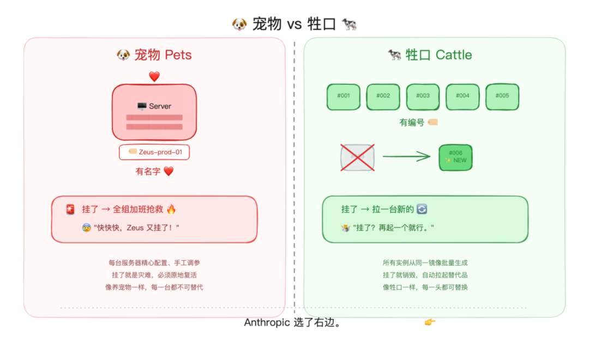宠物 vs 牲口：运维圈的经典比喻
这个比喻是 Randy Bias 在 2012 年提出的，用来解释云计算的本质。十四年过去了，Anthropic 把这套哲学，搬到了 AI Agent 的架构设计上。
02## 当初的宠物

故事得从 Anthropic 最早的 Agent 架构说起。

一开始，所有东西都塞在一个容器里：模型推理、代码执行、会话状态，全部打包在一起跑。

听起来挺简洁的，对吧？

但……问题也来了。

容器挂了，会话就丢了。用户跑到一半的任务，说没就没。

要调试？得进到容器里去看日志，也就意味着可能碰到用户数据。

要连客户的 VPC？得打通网络通道，每接一个客户就多一根管子……
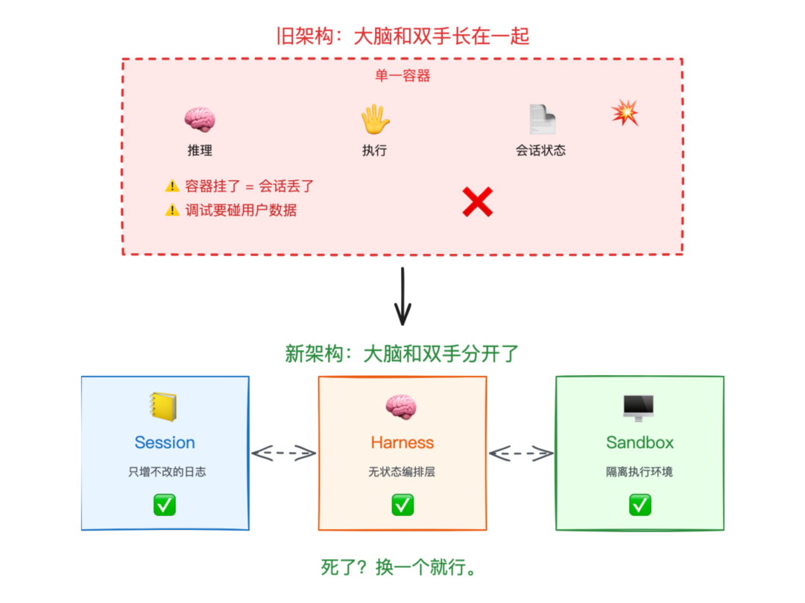旧架构 vs 新架构：大脑和双手分开了
这就是典型的「宠物架构」。每个容器都是独一无二的，精心维护的，不可替代的。

**它挂了，你得心疼。**
03## 脑手分离

痛过之后，Anthropic 的工程团队决定做一次彻底的手术。

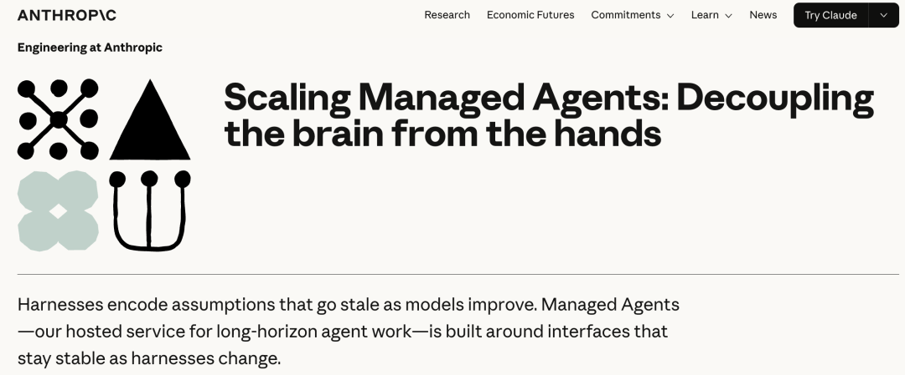

他们给这篇博客起了个副标题：**Decoupling the Brain from the Hands**，把大脑和双手分开。

怎么分呢？拆成三层。

**Session**，会话日志。只增不改的事件流，记录 Agent 做过的每一件事。它不在容器里，而是存在外部数据库（Postgres、SQLite 都行）。容器死了，日志还在。

**Harness**，编排层。负责调用 Claude、路由工具调用、管理上下文。关键词：**无状态**。它自己不记任何东西，所有状态都从 Session 里读。

**Sandbox**，执行环境。代码在这里跑，文件在这里改。它是隔离的，碰不到凭证，碰不到用户的敏感数据。
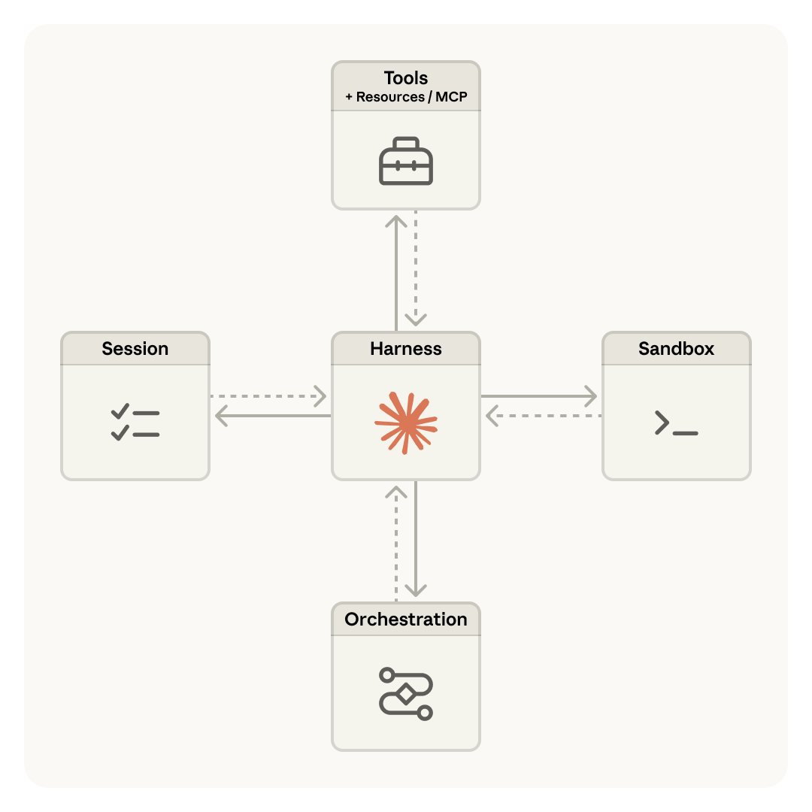Managed Agents 架构：Session、Harness、Sandbox 解耦
这三层之间的关系，用 Anthropic 自己的话说，是「接口抽象」。

每一层只需要满足一组接口约定，具体用什么实现无所谓。Session 可以是 Postgres，也可以是一个内存数组。Sandbox 可以是本地进程，也可以是远程容器。
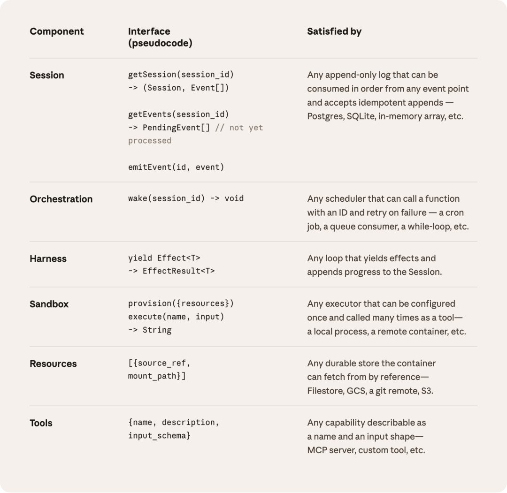组件接口定义：每层只需满足接口约定
这套设计的灵感，其实来自操作系统。

宠物，不能再养了！
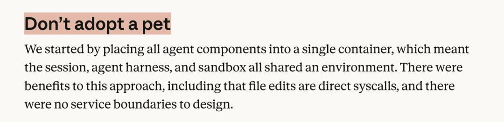
Anthropic 团队在博客里写了这么一句：

> “&nbsp;我们把接口当作比实现更持久的东西来对待，就像操作系统在几十年前就虚拟化了硬件一样。

翻译一下：具体的代码会变，但接口不会。今天的 Harness 可能跟明天的完全不一样，但只要接口稳定，上层不用改。

如果你读过我之前那篇关于 Harness Engineering 的文章《[模型不是关键，Harness 才是](https://mp.weixin.qq.com/s?__biz=MzA4NzgzMjA4MQ==&amp;mid=2453481768&amp;idx=1&amp;sn=72a99eef97bc7f0dcb3eddb99573a0ab&amp;scene=21#wechat_redirect)》，会发现这个思路跟 Philipp Schmid 的「操作系统类比」几乎一模一样。模型是 CPU，Harness 是操作系统内核。
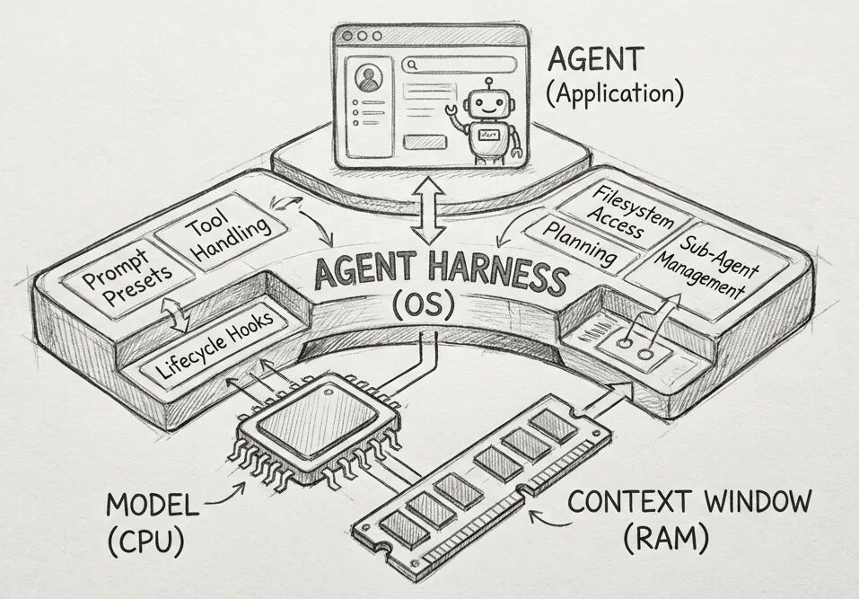Harness 概念示意
只不过 Anthropic 更进一步：他们不只是把 Harness 当操作系统设计，还把它做成了**可以随时杀掉重启的牲口**。
04## 牲口化的收益

把 Harness 变成无状态的牲口之后，发生了什么呢？

**p50 首 Token 延迟（TTFT）下降了约 60%，p95 下降超过 90%。**

为什么？因为以前启动一个 Agent，得先把整个容器配好：装环境、挂载文件、注入凭证，然后才能开始推理。现在呢，推理和容器配置是分开的，Harness 拿到 Session ID 就能直接开始调用 Claude，不用等 Sandbox 准备好。
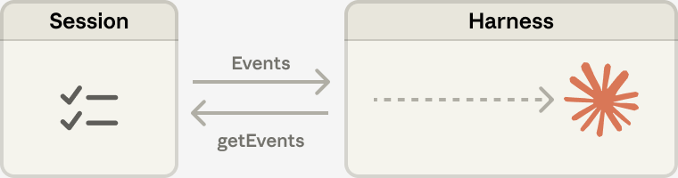Session 与 Harness 的交互：事件驱动，无状态恢复
而且，既然 Harness 是无状态的，那它就可以有很多个。

**多个大脑（Harness），连接不同的手（Sandbox）。**
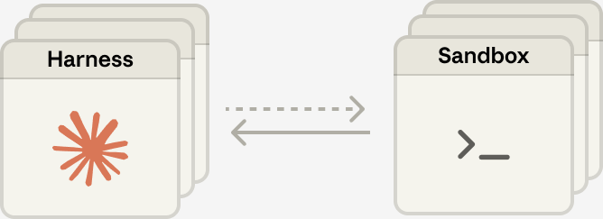多个 Harness 连接多个 Sandbox：many brains, many hands
一个 Harness 挂了？新的 Harness 调用&nbsp;`wake(sessionId)`，从 Session 日志里恢复上下文，接着干。对用户来说，只是某个工具调用失败了一次，Claude 自动重试就行了。

这就是牲口哲学的核心：**没有什么是不可替代的。**
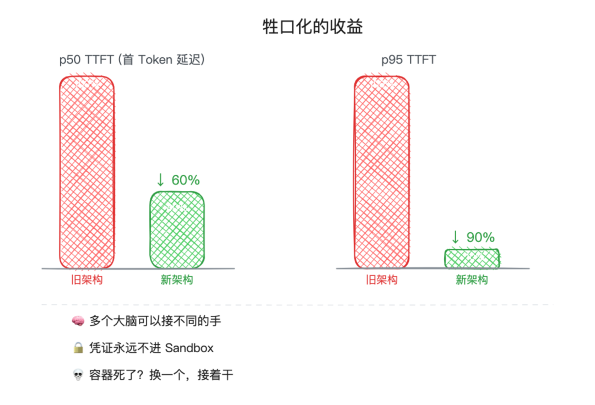牲口化的收益：延迟大幅下降
安全性也跟着提升了。

凭证永远不进 Sandbox。Git token 在初始化时注入，OAuth token 留在外部保险柜里，通过 MCP 代理访问。Sandbox 被攻破了……攻击者拿不到任何凭证。

这倒是解决了一个 Agent 安全领域的老大难问题：**prompt injection 就算成功了，也偷不到钥匙。**
05## 围栏不能少

说到安全，Anthropic 在同一周还发了另一篇博客：《Trustworthy Agents in Practice》。
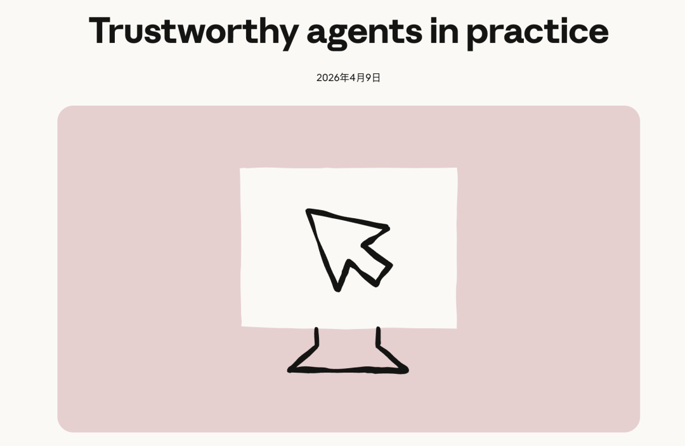
牲口跑得快，围栏得跟上。
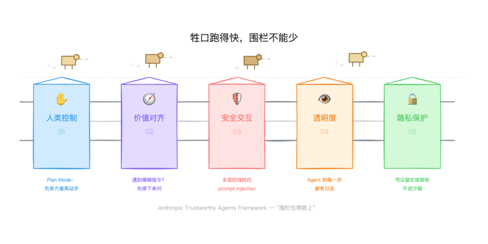牲口跑得快，围栏不能少
这篇文章提出了一个 Agent 信任框架，建立在五个原则之上：人类控制、价值对齐、安全交互、透明度、隐私保护。

其中几个点跟 Managed Agents 的架构设计直接呼应。

**Plan Mode**，也许是最值得关注的一个设计。

传统的 Agent 权限管理是「逐步审批」：Agent 每执行一步，你都得点一下确认。这就像你雇了个人，每打一个字都要请示你，效率可想而知。

Plan Mode 改成了「战略审批」：Agent 先把整个行动计划列出来给你看。你审的是方向，而不是每一步细节。相当于从微观管理变成了目标管理。

**Prompt injection 防御**则是多层设计。

模型训练阶段，就在教 Claude 识别恶意指令。生产环境里，有实时流量监控。外部还有红队持续测试。

这三层加上 Sandbox 的凭证隔离，构成了一个纵深防御体系。攻击者要突破所有层才能造成实质伤害。

我之前提过一个概念叫「护栏悖论」：

**车速越快，护栏越重要。**
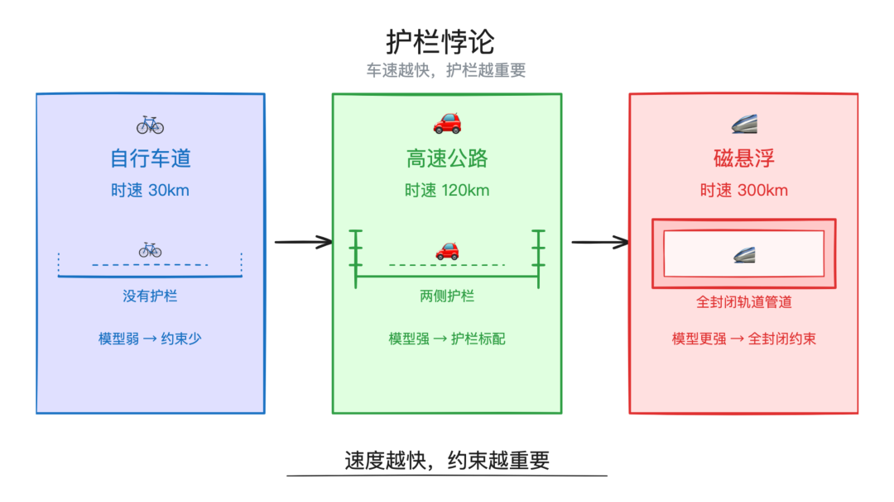护栏悖论：车速越快护栏越重要
Anthropic 这两篇博客合在一起看，恰好是这个悖论的工程实现：Managed Agents 让 Agent 跑得更快，Trustworthy Agents 让围栏更结实。
06## 沉入基础设施

回头来看，可以看出一条清晰的脉络。

OpenAI Codex 团队从零写了 100 万行代码，Stripe 每周合并 1300 个 PR，Cursor 每小时 1000 个 commit。

那些都是「用户侧」的 Harness Engineering，是用 AI 的人在摸索怎么驯服 Agent。

而 Anthropic 这次做的，是**模型厂商侧**的 Harness Engineering。

他们不只是在教别人怎么给 Agent 搭 Harness，而是把 Harness 本身做成了一个托管服务。Session 持久化、Harness 编排、Sandbox 隔离，这些你不用自己搭了，Anthropic 帮你搞定。

**Harness 正在从应用层，沉入基础设施层。**

这跟十几年前云计算的演进路径何其相似。一开始大家自己搭服务器（宠物），后来有了 EC2（自己管的牲口），再后来有了 Lambda（连牲口都不用管了，直接跑函数）。

Agent 的基础设施也在走同一条路。

Anthropic 把 MCP 捐给了 Linux 基金会的 Agentic AI Foundation，思路一脉相承：**当 Agent 变成牲口，接口就得变成标准件。**

**从宠物到牲口，从应用层到基础设施层。**

**这，就是 Anthropic 的牲口哲学：**

**我们需要的是牲口，而非宠物。**

**
**

**不过我想，或许这里有必要给打工牛马**们加一句：如有雷同，实属巧合

◇ ◆ ◇

相关链接：

•&nbsp;&nbsp;Anthropic Trustworthy Agents：https://www.anthropic.com/research/trustworthy-agents&nbsp;

•&nbsp;&nbsp;Anthropic Managed Agents：https://www.anthropic.com/engineering/managed-agents&nbsp;
