> 原文链接：https://mp.weixin.qq.com/s/1GriX3i7nhXLJBIWQ9XLPg

> 公众号：哔哩哔哩技术

# B站系统环境基线管理实践

**本期作者**

B站系统部平台团队

负责全站基础设施管理平台化和自动化、混合云IaC、资源运营CMDB等业务系统研发

**1.背景**

**1.1.基本概念**

系统环境：是指服务器上运行的某个系统版本的系统配置集合，具体的配置项包括内核模块和内核参数配置、网络设置、系统软件或工具、系统服务、安全配置等等。

基线：指的是服务器系统环境配置集合的一个基准。

系统环境基线管理：对一套系统环境配置集合基准的管理。

下文中我们说基线管理，系统环境配置集合管理，简称系统环境管理，是同一个意思。

**1.2.必要性**

系统环境配置直接影响线上操作系统运行环境的稳定、高效与安全，其重要性不言而寓。在基线管理初级阶段主要通过shell脚本的方式管理系统环境，比如服务器新交付、重装等环节通过shell脚本进行一次性的配置。随着公司服务器数量快速增长，系统环境配置需求越来越多样化、复杂化，通过shell脚本配置的方式存在以下问题：

shell脚本编程复杂，难以校验配置结果，维护成本高
shell脚本编写，尤其是系统环境配置，对系统运维人员的要求比较高
检查系统当前配置和目标配置是否一致，需要额外的检查功能开发

多个操作系统和内核主线版本适配难
不同操作系统和内核版本存在诸多差异配置项，需要编写大量的适配代码

难以适应不同业务、不同应用的系统环境多样化需求
公司业务场景复杂，不同业务对系统环境要求不同，需要差异化的基线管理

系统环境基线变化无法发布到存量服务器
系统环境基线变更只对新交付和重装服务器生效
系统环境基线版本的迭代过程中，需要支持基线灰度发布和快速回滚的能力

一次性配置缺少监控与保持能力
不能及时发现和修复系统环境问题，依赖人为发现并干预解决

**&nbsp;1.3.目标**

针对以上问题，确定如下系统环境基线管理目标：

- 
声明式配置：简单的、基于目标状态的系统环境配置

- 
多系统适配：灵活支持多种操作系统和内核版本

- 
分组管理：适配多业务部门的多样化的系统环境需求

- 
灰度发布：在保障稳定性的基础上将新的系统环境基线应用到存量服务器

- 
监控与保持：及时发现系统环境异常，通知相关业务运维人员，并支持自动恢复到基线

**1.4.选型**

经过对多个开源配置管理工具调研，都不能直接满足所有功能目标，需基于开源项目进行二次开发。

**SaltStack
****Ansible
****Puppet
****Chef
**灰度发布不支持需要二次开发原生的top系统在大规模服务器分组管理时难以使用需要结合git版本控制和任务下发自行实现灰度发布回滚功能不支持需要二次开发需要在master端结合git版本控制自行实现灰度发布回滚功能不支持
不支持
声明式配置支持
支持
支持
支持
分组管理
部分支持

需要二次开发

部分支持

需要二次开发

部分支持

需要二次开发

部分支持

需要二次开发
监控与恢复部分支持需要二次开发可以通过schedule和自定义module实现不支持需要二次开发需要结合系统cronjob和自研事件上报模块实现不支持不支持
多系统适配部分支持需要二次开发通过jinja模版实现部分支持需要二次开发通过jinja模版实现部分支持自定义实现难度大部分支持自定义实现难度大

**2.声明式配置**

对于系统环境配置，用户通常不关注具体实现细节过程而更关注结果。比如配置一个文件，用户不关注文件如何上传，文件内容差异怎么比较，更关注系统内的文件路径、内容和权限是否符合预期。

所以我们使用声明式配置，有以下优点：

- 
减少代码重复和错误

- 
更容易阅读和维护，减少了对基线管理人员的要求

为了更友好的用户体验，同时也实现了基线管理前端化。以文件配置为例：

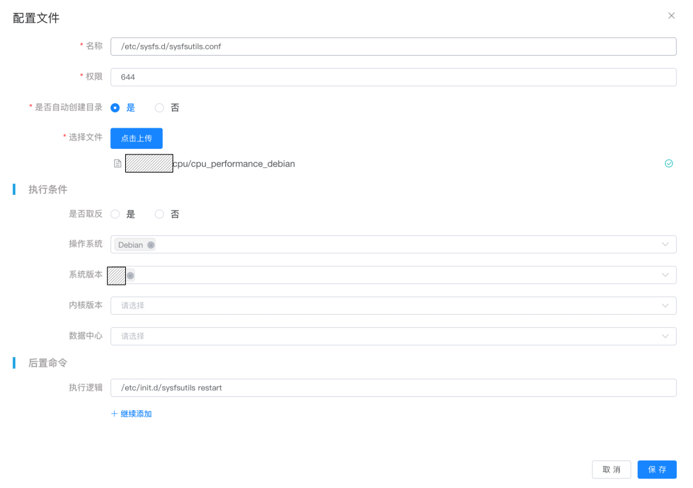

**2.1.配置项**

**2.1.1.文件和目录**

- 
文件上传，文件权限配置

- 
目录新建，目录权限配置

- 
支持文本文件和二进制文件

- 
支持文件版本管理

**配置项字段
****说明
**源文件源文件地址目标文件路径目标文件在系统中绝对路径是否自动创建目录如果文件父目录不存在自动创建文件权限文件权限配置

**2.1.2.系统软件或工具**

- 
支持apt、yum等包管理器，适配Debian、CentOS等操作系统

- 
支持指定版本或默认版本安装

**配置项字段****说明**软件或工具名目标系统需要安装的软件或工具的名称，可以通过apt、yum等包管理器识别的名称软件或工具版本定义软件或工具版本信息

**2.1.3.系统服务**

- 
基于systemd提供系统服务的管理，支持服务启停、开机启动

**配置项字段****说明**服务名称可以通过systemd等服务管理工具管理的服务名开机启动服务是否需要开机启动服务状态服务状态，可以是启动、停止

**2.1.4.内核参数**

- 
系统内核参数的配置，支持配置内核参数项和值

**配置项字段****说明**内核参数名目标系统支持的内核参数名称内核参数值内核参数的值

**2.1.5.内核模块**

- 
根据业务需求，设置并加载内核模块

**配置项字段****说明**内核模块名需要安装加载的内核模块名称内核模块参数内核模块启动参数

**2.2.后置命令**

当检测到配置项与目标基线存在差异时，除设置成基线配置外，可能还需要做一些其他操作，比如：

- 
sshd的config文件发生变更后，需要执行systemctl restart sshd，重启服务生效

只有状态变更时才执行，比如某个文件的内容和基线完全一致，后置命令不执行。

**2.3.执行条件**

为适配不同操作系统和内核版本，满足不同业务、不同应用的系统环境多样化需求，可根据执行条件是否匹配确定是否执行该项配置。

比如Debian和CentOS镜像源的配置如下：

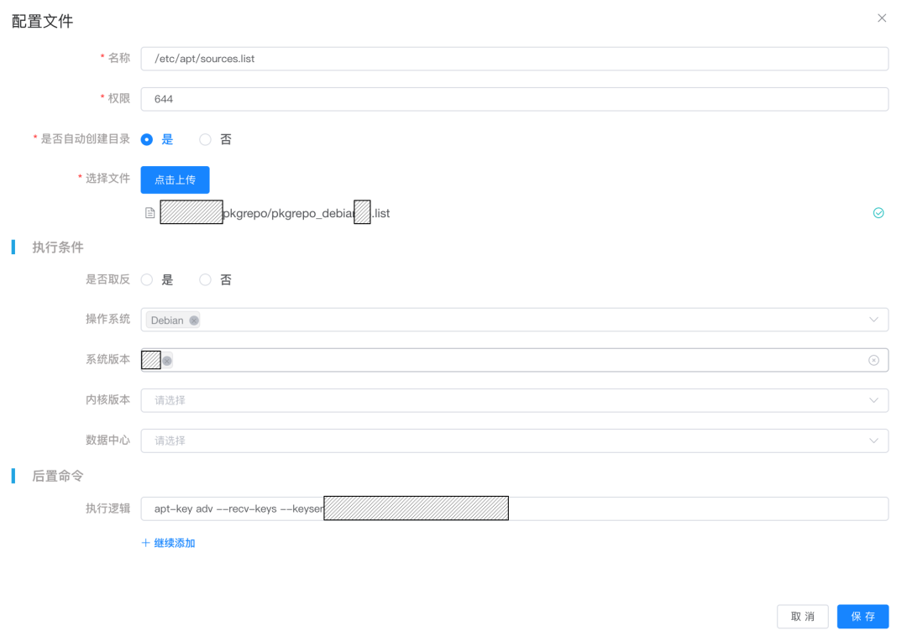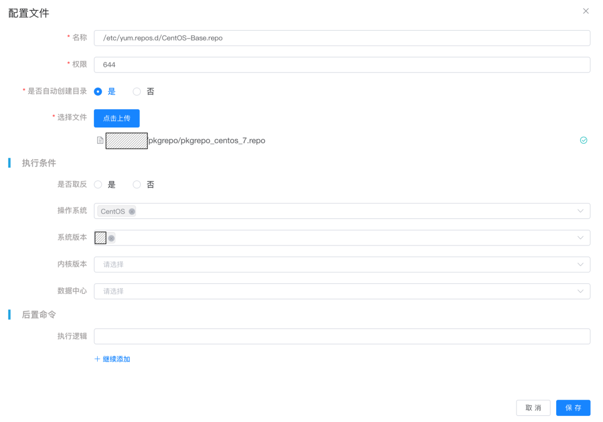

不同数据中心的配置不同，比如不同机房的域名解析服务配置不同：

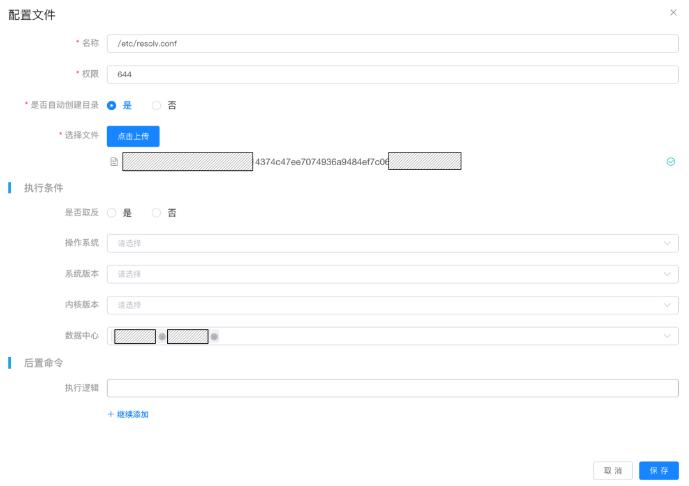

**&nbsp;2.4.配置集合**

配置集合指一组配置项的组合。配置集合的概念如下图，包含以下规则：

- 
一个配置集合由多个配置项组成。比如：配置集合a由5个配置项组成

- 
配置项是有序的。比如：配置集合a中，服务1依赖文件1，必须先确保文件1就绪，服务1才能正常启动，就需要配置项的执行是有序的

- 
配置项条件匹配有序。比如：配置项3执行条件按照顺序匹配到条件2执行，则条件3就不执行

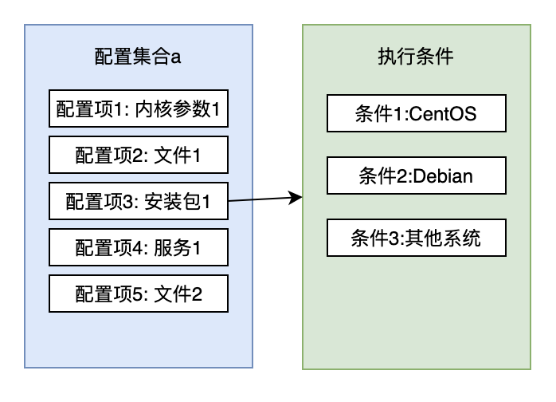

**2.4.1.配置项冲突**

配置项名称和执行条件确定配置项唯一性。比如两个文件配置，绝对路径相同，执行条件也相同，就判定冲突，判定冲突后，会提示用户修改配置，解决冲突。
不同配置项的名称定义如下：

- 
文件与目录：文件或目录的绝对路径

- 
系统软件和工具：软件和工具安装包名

- 
系统服务：系统服务名

- 
内核参数：内核参数名

- 
内核模块：内核模块名

**2.4.2.配置集合复用**

配置集合支持引用，最大化配置项复用。如下图（配置集合a和配置集合b组合生成配置集合c）：

注意，组合只是把用户指定的多个配置集合里的配置项复制到新建配置集合中，复制之后的配置项修改，不影响原配置项。

配置组合时，可能会遇到配置冲突的情况，使用以下方式解决冲突

- 
配置项冲突时，需要业务方指定保留哪些配置项，忽略其他冲突配置项

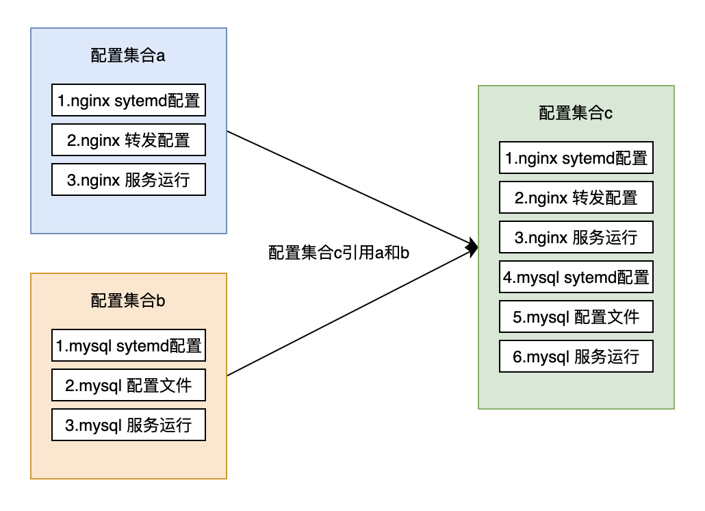

**2.5.配置集合版本**

配置集合支持版本管理，主要解决两个问题

- 
审核，可以查看本次提交版本和上个版本的差异

- 
回滚，基线发布时业务方可以指定配置集合版本发布或者回滚

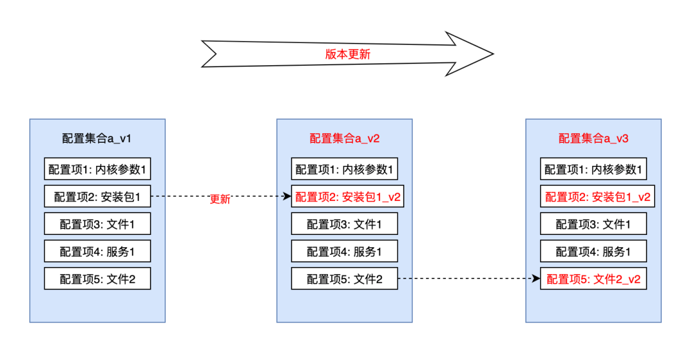

**3.分组管理**

**3.1.分组的概念**

公司服务器按照业务部门划分归属，但按业务部门管理服务器基线粒度太粗。考虑到同一个业务部门可能存在不同业务场景，对应的服务器系统环境需求也有差异，因此提出分组机制，实现同部门下不同业务的服务器系统环境差异化管理。

分组是一组服务器的集合，一个服务器只能归属一个分组。如下图所示：

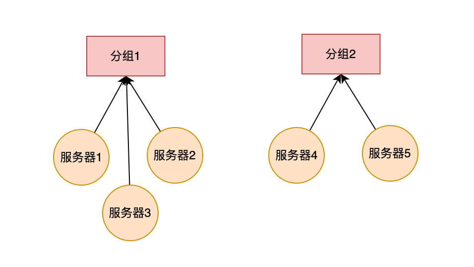

一个分组只能属于一个部门，一个部门可以有多个分组。如下图所示：

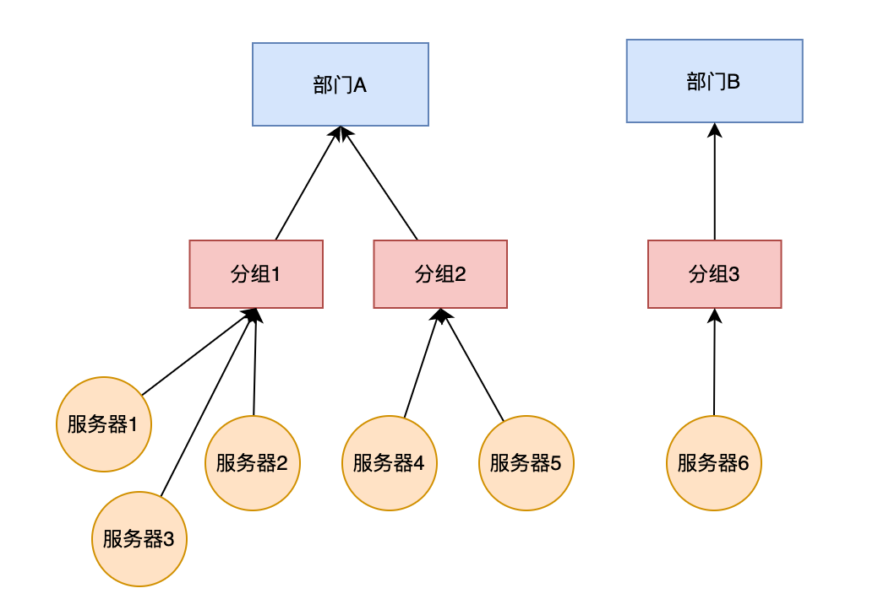

**3.2.分组与配置集合**

**3.2.1.分组应用配置集合**

- 
一个分组只能应用一个配置集合的一个版本，一个配置集合版本可以被多个分组应用。具体关系如下图所示：

- 
配置集合版本迭代新增时，分组应用的配置集合版本不会自动更新，需要业务方通过灰度发布的方式更新

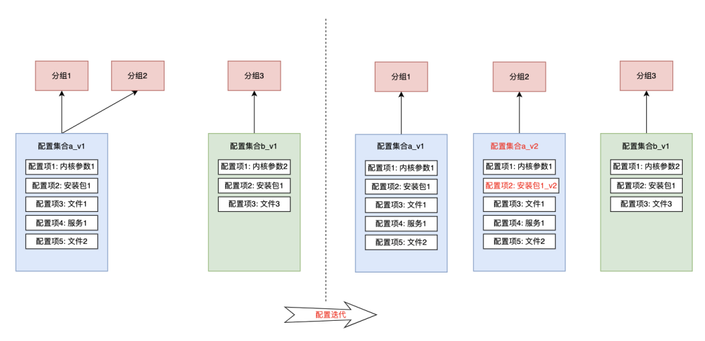

**3.2.2.服务器应用配置集合**

为方便基线灰度发布和回滚，服务器维护了所属分组对应配置集合版本的副本。如下图，服务器元信息保存所属分组已经发布生效的配置集合版本信息，分组的配置集合版本变更时，服务器的配置集合版本和实际基线环境不直接变更。当分组配置集合在该服务器发布完成，服务器的配置集合版本和基线环境才会变更，确保服务器基线环境可控。

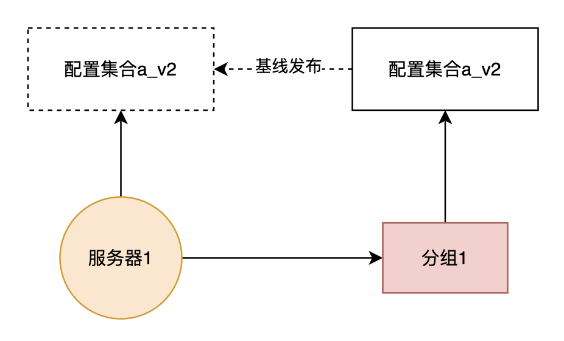

**4.基线变更和保持**

系统环境在服务器生命周期中会不断发生变化，需要一套基线变更规范和流程，来保证基线环境处于正确的状态，关键节点如下：

- 
服务器新交付、服务器变更、服务器重装以及随业务部门流转，需要对服务器系统环境进行基线初始化

- 
服务器基线版本升级或回滚，按照目标基线版本灰度应用到目标服务器

- 
业务方人为更改或其他因素导致基线环境不一致时，系统环境需要恢复到基线版本

**4.1.初始化**

**4.1.1.服务器新交付**

- 
新服务器采购到货，根据相应的业务需求进行基线初始化

**4.1.2.服务器变更**

服务器硬件、系统、机房与网络等环境发生变更时，需要对基线重新初始化

- 
服务器硬件变更，比如新增磁盘并挂载、新增网卡并网络配置

- 
服务器重装系统，需要重新初始化

- 
服务器物理迁移，按照新的物理网络环境初始化

**4.1.3.服务器流转**

服务器所属业务部门变更时或者服务器业务使用场景变更，服务器分组相应变更，其基线一般需要根据新的分组应用的配置集合重新初始化。比如：

- 
服务器从备机池借用，服务器迁移到业务分组，按业务分组的基线初始化

- 
服务器接入PaaS平台，服务器迁移到PaaS平台分组，按PaaS平台分组的基线初始化

**4.2.灰度发布**

基线更新后，需要在目标分组上发布对应基线版本，才能在分组内全量服务器生效。

基线发布需要考虑以下注意事项，避免配置异常导致的故障范围过大，整体的灰度发布逻辑及流程如下：

- 
分机房发布，机房之间串行顺序执行

- 
机房内分批次发布，批次之间串行顺序执行

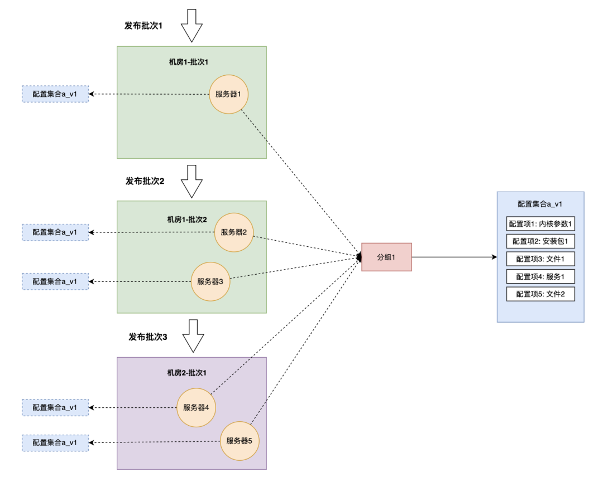

**4.3.监控与保持**

灰度发布时会对比目标基线环境与服务器当前系统环境，若存在差异，则按目标基线进行一次设置。但是，服务器系统运行过程中，由于人为变更或其他因素会导致基线环境不一致，需要基线管理有监控和保持系统环境的能力。整体的逻辑如下：

- 
服务器基线发布后开启基线定期巡检

- 
基线巡检对比基线与当前系统环境，当基线与系统环境不一致时，会根据是否开启保持分别处理

- 
如果没有开启保持，仅将基线异常信息上报，不会自动恢复基线

- 
如果开启保持，会自动恢复基线并将基线恢复信息上报

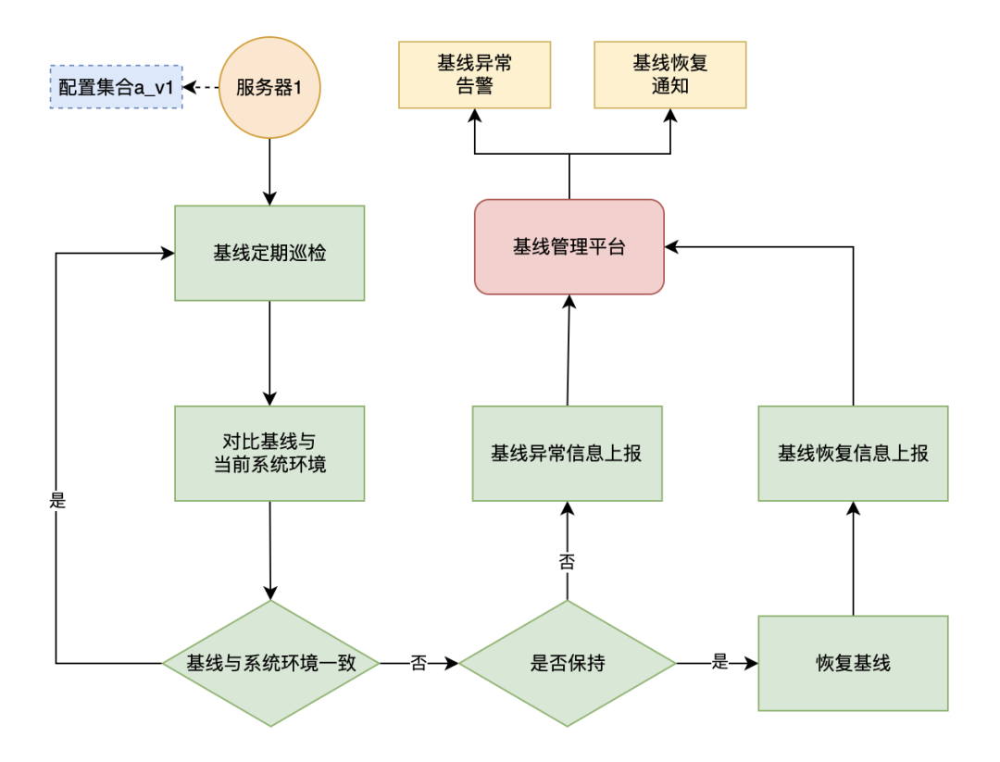

**5.总结和展望**

我们基于以上问题和设计思路建设服务器系统环境基线管理平台，实现服务器系统环境声明式配置、多系统适配、分组管理、灰度发布和监控保持等功能，基线管理能力已经覆盖公司全量服务器。

当前主要在服务器交付、变更、流转等环节应用，同时在部分业务场景下开启基线的监控和保持功能，保障业务系统环境的稳定、高效和安全。

后续将根据业务部门实际使用场景和需求持续优化，完善系统环境基线配置能力，提升基线的发布、监控和保持的效率，并将监控和保持能力应用到公司全量服务器。

**6.参考文献**

- 
Understanding Ansible, Terraform, Puppet, Chef, and Salt：*https://www.redhat.com/en/topics/automation/understanding-ansible-vs-terraform-puppet-chef-and-salt*

- 
Comparison of open-source configuration management software：*https://en.wikipedia.org/wiki/Comparison_of_open-source_configuration_management_software*

- 
Jinja：*https://jinja.palletsprojects.com/en/3.1.x/intro/*

- 
Sysctl：*https://www.kernel.org/doc/Documentation/sysctl/*

- 
Systemd：*https://wiki.archlinux.org/title/Systemd*

- 
Loadable kernel module：*https://en.wikipedia.org/wiki/Loadable_kernel_module*

- 
Package manager：*https://en.wikipedia.org/wiki/Package_manager*

**以上是今天的分享内容，如果你有什么想法或疑问，欢迎大家在留言区与我们互动，如果喜欢本期内容的话，欢迎点个“在看”吧！**

**往期精彩指路**

- 
[全链路压测改造之全链自动化测试实践](http://mp.weixin.qq.com/s?__biz=Mzg3Njc0NTgwMg==&amp;mid=2247487748&amp;idx=1&amp;sn=c9cbcacf3bba25b478abf2a0f5c0e75f&amp;chksm=cf2cd421f85b5d37adce8fc782151942912bf38a24be2ebd42b000505bcae60a4833d9a230cd&amp;scene=21#wechat_redirect)

- 
[哔哩哔哩⼤数据建设之路—实时DQC篇](http://mp.weixin.qq.com/s?__biz=Mzg3Njc0NTgwMg==&amp;mid=2247493174&amp;idx=1&amp;sn=648bf0ffb5e31b1c211d22e636e2c3df&amp;chksm=cf2f2313f858aa0580dad7ee9b8347739122dcaba50071616e444a73ad28f4c3dcaf62c79f33&amp;scene=21#wechat_redirect)

- 
[Apache Kyuubi 在B站大数据场景下的应用实践](http://mp.weixin.qq.com/s?__biz=Mzg3Njc0NTgwMg==&amp;mid=2247491092&amp;idx=1&amp;sn=b09492563c760775ed61f75db1bd5822&amp;chksm=cf2cdb31f85b5227b96a3da04fd89153c40635ce4d9ae20cbe9baadc58dbae9e41060d3cd003&amp;scene=21#wechat_redirect)
