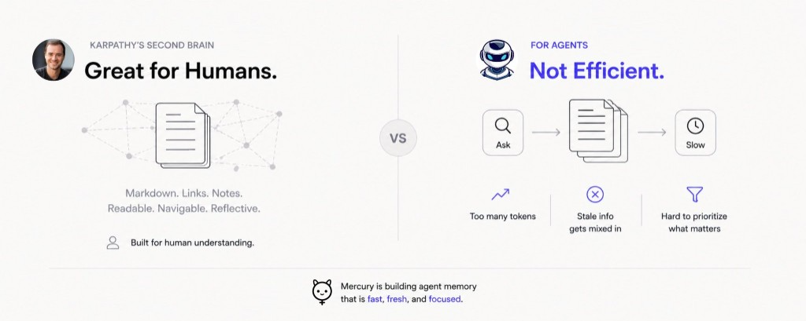
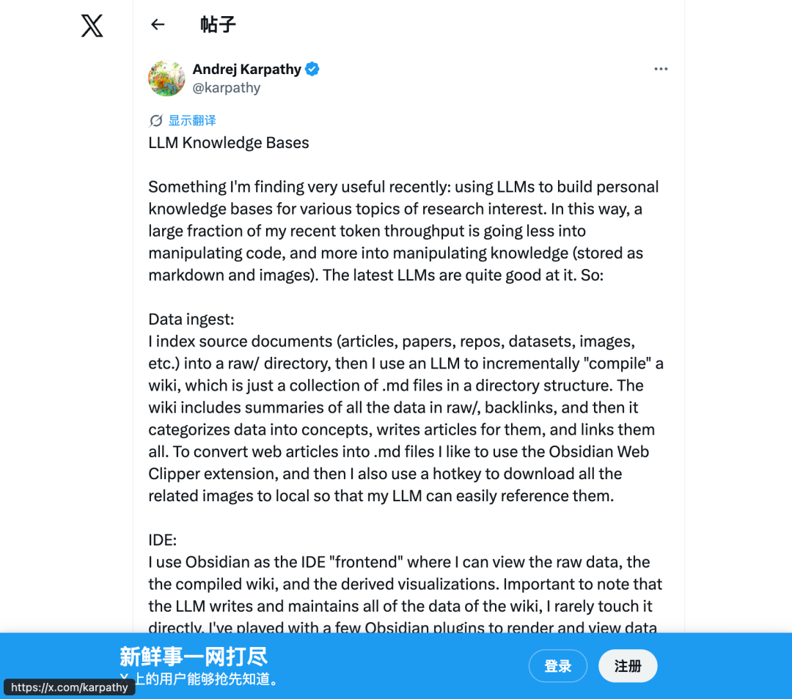
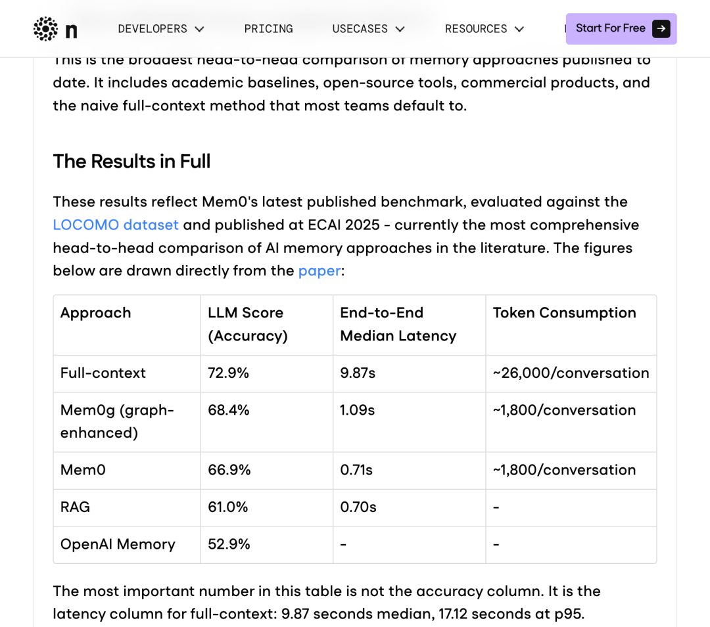
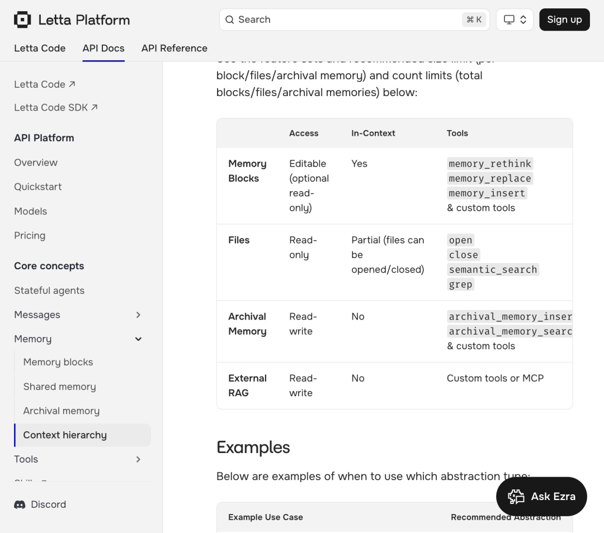
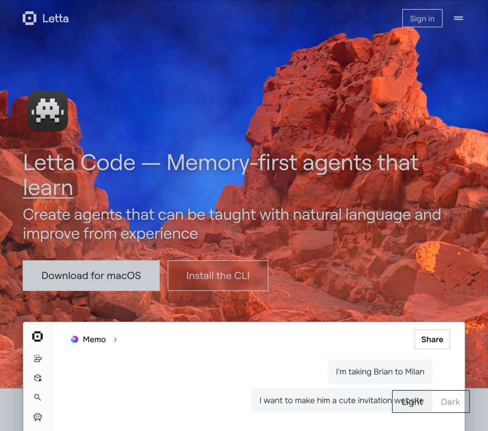

> 原文链接：https://mp.weixin.qq.com/s/XA6OTtbsnfCbEr0Jbn0Uhw

# 三大 Agent 平台独立收敛到同一个 Markdown 方案——这不是最优解，只是最容易走通的路

2026 年 4 月，Andrej Karpathy 在 X 上分享了他的 LLM Wiki 工作流——用 LLM 把原始材料编译成一个持续生长的 Markdown 知识库，在 Obsidian 里浏览和探索。帖子获得了 1600 万次浏览、5000+ Star。但病毒式传播跳过了一个更难的问题：当知识的消费者从人变成全天候运行的自主 agent 时，这套架构还能撑得住吗？
一、Karpathy 做对了什么
Karpathy 的 LLM Wiki 之所以引发共鸣，不是因为它技术复杂——恰恰相反，它的简洁性本身就是一个设计主张。
整个系统只有三层：raw/ 目录存放不可修改的原始材料（论文、文章、截图），wiki/ 目录存放 LLM 生成并维护的结构化 Markdown 文件，一个 CLAUDE.md 或 AGENTS.md 模式文件定义 LLM 的行为规则。没有向量数据库，没有 embedding pipeline，没有外部基础设施——只有本地文件、纯文本和一个能在你不断喂料的过程中把知识编译得越来越完整的模型。
project/├── raw/          ← 原始材料，只读，永不修改├── wiki/         ← LLM 编译产物：概念页、实体页、索引、日志│   ├── index.md  ← 所有文章的目录和摘要│   └── log.md    ← 变更时间线└── outputs/      ← 查询和分析的输出
这个架构解决了 RAG 的一个根本性缺陷。传统 RAG 在每次查询时重新从原始文档检索碎片——文档被切成 chunk，chunk 丢失上下文，LLM 拿到一堆去语境化的片段来拼答案。Karpathy 的做法绕开了 chunking：LLM 在 ingest 阶段就已经读完全文、理解上下文、写出结构化的百科式文章。查询时加载的是已经综合过的知识，不是原始碎片。
他自己的一个研究 wiki 在没有手动写一个字的情况下积累到了约 100 篇文章、40 万字——超过大多数博士论文的篇幅。LLM 负责写作、交叉引用、分类和一致性检查；人类负责投喂高质量源材料和提出好问题。他的原话是："Obsidian 是 IDE，LLM 是程序员，wiki 是 codebase。"
更精妙的是"知识复利"机制。当你向 wiki 提问时，LLM 综合多篇文章给出答案，如果这个答案产生了新的综合洞察，它会被写回 wiki 成为新页面。每一次使用都让知识库更完整。定期的"lint pass"（健康检查）让 LLM 扫描整个 wiki，找出矛盾、补缺失页面、发现有趣连接。这不是 AI 辅助写作——是 AI 作为知识管理员。
这套系统之所以流行，根本原因是 Markdown 的几个特性恰好踩中了当前技术节点：
属性
为什么重要
可移植
不依赖任何平台，纯文本在任何编辑器里打开
可检视
cat
、grep、diff 直接操作，不需要查询语言
可版本化
Git 原生支持，每次变更可追溯
本地优先
数据在你手里，不存在供应商锁定
缓存友好
稳定的文本前缀对 KV cache 命中率极高
最后一点尤其关键。Claude Sonnet 上缓存 token 的成本是 $0.30/百万，未缓存是 $3.00/百万——10 倍的价差。一个结构稳定、追加更新的 Markdown 文件天然优化了缓存命中率，因为每次 API 调用的前缀高度一致。这个经济学优势是所有基于数据库的方案都不具备的——RAG 每次拼装不同的 context 碎片，相当于主动破坏 KV cache。
二、三个平台独立进化出了同一种架构
Karpathy 不是唯一走这条路的人。一个更有说服力的证据来自"趋同进化"：三个完全独立的 AI agent 平台，在互不知晓的情况下，各自收敛到了 Markdown 文件作为 agent 记忆载体的设计。
Manus 用 todo.md 做任务追踪——一个每步自动重写的 checklist。Claude Code 用分层的 CLAUDE.md 文件存储项目规范和工作偏好，附带一个 200 行上限的 MEMORY.md 作为动态记忆索引。OpenClaw 用 MEMORY.md 加日期命名的记忆文件目录。
没有人抄袭谁——Yaohua Chen 把这称为"趋同进化"，暗示这种架构本身在解决一组基础性问题：人类可读、Git 可追踪、工具链零依赖、LLM 原生友好。在所有可能的记忆存储方案中，Markdown 文件是帕累托前沿上最显而易见的点。
但"趋同"并不意味着"最优"。趋同往往只是说明在当前约束条件下，这是最容易走通的路——就像早期网站都用 MySQL 不是因为它最好，而是因为它最容易上手。当约束条件改变——当 agent 从人类的辅助工具变成独立运行的自主系统——这个帕累托前沿可能需要重新画。
三、人的知识和 Agent 的记忆是两个问题
Karpathy 的系统优化的对象是人类研究者的知识工作流。他的设计假设是：消费者是一个坐在 Obsidian 前面的人，浏览速度以分钟计，每天交互几次到几十次，关注的是理解和洞察。
但当消费者变成一个全天候运行的自主 agent 时，工作负载的性质发生了根本变化。这不是程度的差异，是种类的差异。
维度
人类知识系统
Agent 记忆系统
优化目标
可读性、可浏览、可反思
检索速度、token 效率、状态一致性
交互频率
每天几次到几十次
每天数百到数千次
检索粒度
页面级（读一整篇文章）
事实级（需要一个具体答案）
更新节奏
偶尔手动触发
每次任务、对话、工具调用后自动更新
冲突处理
人类发现并判断
需要自动化规则（时间戳、置信度、用户确认）
遗忘机制
自然遗忘或手动清理
需要显式的衰减、归档、过期策略
一致性要求
容忍模糊和矛盾（人脑擅长整合）
矛盾直接导致错误行为
这张表揭示的核心矛盾是：对人优雅的东西，对机器可能是昂贵的。
四、Wiki 模式在 Agent 规模下的五个断裂点4.1 Agent 需要的是事实，不是页面
一个人类可能想读一整篇关于"部署策略"的文章。一个 agent 通常只需要一个答案：当前首选的部署目标是什么？ 如果系统必须加载一整个文档来提取一句话，记忆就变成了浪费。在数千次调用的规模下，这种浪费从边际成本变成了结构性成本。
Karpathy 的 wiki 不支持事实级查询——它的检索单元是页面，不是三元组。当 agent 需要"用户上次明确表示偏好的 Python 版本"时，它得加载一个可能包含 50 个相关但不需要的段落的页面，然后自己从中提取答案。
4.2 Token 预算是硬约束
这不是理论问题，有具体的数字。2026 年的 benchmark 数据显示，full-context 方式（把整个记忆加载进上下文）的准确率最高（LOCOMO 上 72.9%），但每次查询消耗约 26,000 token，中位延迟 9.87 秒，p95 延迟 17.12 秒。这在生产环境中是不可用的——每 20 个用户就有一个要等 17 秒。
选择性记忆方案（如 Mem0）接受 6 个百分点的准确率折损（66.9%），换来 91% 的 p95 延迟降低（1.44 秒 vs 17.12 秒）和 90% 的 token 节省。图增强版本（Mem0g）把准确率差距缩小到 5 个百分点以内，p95 延迟 2.59 秒。
方案
准确率 (LLM Score)
p95 延迟
Token/查询
Full-context
72.9%
17.12s
~26,000
Mem0g (图增强)
68.4%
2.59s
~1,800
Mem0 (向量)
66.9%
1.44s
~1,800
RAG
61.0%
-
-
OpenAI Memory
52.9%
-
-
一个典型的 CLAUDE.md + MEMORY.md 文件约 5-15KB，每次消息消耗 1,500-4,500 token。如果 agent 每天跑 50 次交互，仅记忆文件的月度 token 成本在 Claude Opus 上就达到 $30-100。当文件增长到 20KB 以上时，成本翻三倍。对个人研究者来说这是可接受的；对一个运行着数千个 agent 实例的平台来说，这是基础设施级的问题。
4.3 记忆漂移是可靠性问题
偏好会变，项目会演化，决策会被推翻，旧假设会过期。Markdown wiki 没有内置的时间维度——所有内容平等地存在于同一个命名空间里。如果一个 2 月份的偏好记录和一个 4 月份的修正共存于同一个文档，agent 没有机制判断哪个更新。
Karpathy 的 log.md 提供了时间线，但它是给人看的审计日志，不是给 agent 做时序推理的结构化数据。Zep/Graphiti 的时间知识图谱在 LongMemEval 上比 Mem0 高出 15 个百分点（63.8% vs Mem0 的水平），专门因为它在每个事实上标注了有效时间窗口——不仅记录发生了什么，还记录一个事实在什么时间段内为真。
对人类来说，"记忆漂移"是常态——人脑天然地用最近的印象覆盖旧的。但 agent 没有这种生物学机制。如果过期的笔记继续和最新信息一起被检索，agent 就是在过时的状态上推理。这不是信息杂乱，是可靠性故障。
4.4 排序比存储难
随着记忆增长，真正的挑战从"记住什么"变成"现在什么最重要"。Markdown 文件是平的——它没有置信度、重要性、新鲜度或强化次数这些元数据维度。所有记忆在检索时权重相同。
Mercury 的 Second Brain（一个 SQLite + FTS5 的结构化记忆系统）展示了一种不同的方法：每条记忆携带 10 种类型标签（identity、preference、goal、project、habit、decision、constraint、relationship、episode、reflection），每条附带置信度、重要性和耐久度评分。被强化 3 次以上的记忆自动从短期提升为长期。每 60 分钟运行一次自动合并，综合个人画像摘要并从检测到的模式生成反思记忆。
对比一下：Karpathy 的 wiki 用 index.md 的一行摘要来帮助 LLM 定位相关页面——这在 100 篇文章的规模下工作得很好。但当记忆条目达到数千条、且需要在 900 字符的注入预算内选出最相关的 5 条时，平面文件的"全部平等"模型就力不从心了。
4.5 高频写入改变了一切
人类偶尔更新笔记。Agent 在每次任务完成后、每次对话后、每次工具调用后、每次决策后都可能更新记忆。这种写入频率要求的是结构化写入、确定性更新和可查询的状态管理——不是文本追加。
Claude Code 的 auto-memory 系统已经开始走这条路：它自动将记忆分为 user（角色、专长、目标）、feedback（来自纠正的规则）、project（进行中的工作）和 reference（外部系统指针）四种类型，每种存为带 YAML frontmatter 的独立文件。MEMORY.md 本身只是一个指针索引（上限 200 行/25KB），指向这些主题文件。每次交互后，系统语义排序选出最相关的 5 个主题文件注入上下文。
这实质上是在 Markdown 文件系统的表面下，构建了一个简化版的结构化记忆系统——用文件名当主键，用 frontmatter 当 schema，用目录结构当分区。它正在从"笔记本"进化成"基础设施"，只是还穿着 Markdown 的外衣。
五、Agent 记忆的技术栈正在分层
2026 年的 agent 记忆领域不再是"Markdown vs 数据库"的二选一，而是一个正在清晰化的分层架构。从认知科学借来的三层分类已经成为行业共识。
5.1 三种记忆类型
情景记忆（Episodic） 记录具体发生过的事件——对话日志、工具调用轨迹、任务执行记录。它的特征是带时间锚定，回答"上次我们讨论这个话题时发生了什么"这类问题。
语义记忆（Semantic） 存储累积的知识和事实——用户偏好、项目架构、技术决策。它不关心事实是在哪次对话中产生的，只关心事实本身是否仍然为真。Karpathy 的 wiki 本质上是一个手工维护的语义记忆系统。
程序记忆（Procedural） 存储操作规则和工作流——代码规范、部署流程、审批策略。CLAUDE.md 和 AGENTS.md 就是典型的程序记忆。
这三种记忆的存储需求、检索模式和更新策略完全不同。把它们全部塞进 Markdown 文件，就像把关系数据、时序数据和配置数据都塞进同一张 SQL 表——技术上可行，但在规模上会付出代价。
5.2 四种存储架构
架构
代表方案
强项
弱项
向量记忆
Mem0, Zep
语义相似度检索、低延迟
多跳关系弱、时序推理差
图记忆
Zep/Graphiti, Mem0g
实体关系、时间窗口、"谁认识谁"
延迟更高（1.8x），构建成本高
情景记忆
Letta/MemGPT
长对话连贯性、叙事保持
额外延迟、需要完整运行时
混合系统
2026 主流方案
向量 + 图 + 情景缓冲的组合
集成复杂度高、schema 设计耗时
Letta（原 MemGPT）的架构值得详细展开，因为它代表了"agent 自主管理记忆"这条路线的最远探索。它把记忆分为三层，直接借用操作系统的隐喻：
Core Memory（类 RAM） 是一小块始终在上下文中的内存，存放 persona、用户关键事实和 agent 配置。建议上限 50K 字符、20 个 block。这是每次推理都会消耗 token 的层。
Recall Memory（类 Cache） 是存储在数据库中的完整对话历史，agent 通过语义搜索或时间索引检索相关片段。不消耗固定 token，按需加载。
Archival Memory（类 Disk） 是向量数据库中的长期存储，容量不受限。agent 通过工具调用写入观察、检索历史知识。
关键创新不在分层本身，而在谁来管理：Letta 的 agent 通过 core_memory_append、core_memory_replace、memory_rethink、archival_memory_search 等工具调用自主管理自己的记忆——决定什么值得留在上下文里、什么该移到外部存储、什么该更新。这是"记忆作为操作系统层"的思路，agent 是自己的内存控制器。Letta 已经在生产环境中部署了超过 100 万个有状态 agent。
5.3 2026 Benchmark 的真实图景
不同的 benchmark 回答不同的问题，而厂商有战略性地只公布自己赢的那个。LOCOMO 测试短对话（约 26,000 token），有利于 Mem0 的速度优势。LongMemEval 测试长上下文（最高 150 万 token），有利于 Zep 的时序追踪。MemEval 对 9 个系统的标准化测评显示，不同方案的 token 成本差异达到 12 倍。
最新的 MemMachine 论文（2026 年 4 月）在 LOCOMO 上达到 91.69%，比 Mem0 减少约 80% 的输入 token，核心优化来自四个检索层面的调优：检索深度（+4.2%）、上下文格式化（+2.0%）、搜索 prompt 设计（+1.8%）和查询偏差校正（+1.4%）。这些改进的粒度说明了一个事实：agent 记忆的瓶颈不在存储，在检索。大多数记忆失败是检索遗漏（retrieval miss），不是幻觉。
六、真正的架构是混合的
这不是"Markdown 派"和"数据库派"的站队问题。最实际的方向是两者各做各擅长的事。
给人的层用 Markdown：
Markdown 仍然是笔记、报告、摘要、日志、身份文件（persona、项目规范、行为规则）的最佳载体。它可读、可审计、可 Git 版本化，对 KV cache 友好。CLAUDE.md 和 AGENTS.md 就是这一层——它们本质上是人写给 agent 的"程序记忆"，人需要能直接编辑和审阅。
给 agent 的层用结构化存储：
事实、实体、关系、偏好、任务状态、索引、时间戳、置信度评分——这些需要的是结构化写入、确定性更新和精确查询。不是因为 Markdown 不能表达这些信息，而是因为 Markdown 没有原生的查询能力——你不能对一个 .md 文件执行 SELECT preference WHERE domain='deployment' AND updated_at > '2026-04-01'。
Markdown 作为界面，结构化记忆作为底层。人通过 Markdown 文件审阅和编辑 agent 的知识；agent 通过结构化存储执行高效的选择性检索。Claude Code 的 auto-memory 系统已经在实质上走这条路——MEMORY.md 是给人看的指针索引，底层是一组带 schema 的主题文件。
用一个表格来概括这种分工：
信息类型
载体
原因
项目规范、代码规范、行为规则
CLAUDE.md / AGENTS.md
人需要直接编辑；内容稳定，缓存友好
知识文章、研究摘要、综合分析
wiki/ 目录下的 Markdown
人需要浏览和反思；适合 Obsidian 图谱视图
用户偏好、实体关系、任务状态
结构化存储（SQLite/向量库/图库）
agent 需要精确查询；需要时间戳和置信度
对话历史、工具调用轨迹
数据库 + 语义索引
按需检索，不占固定 token 预算
反思和模式识别
自动生成，存入两层
agent 定期合并，人可审阅
七、这意味着什么对个人研究者
Karpathy 的方法论值得认真实践。在 100 篇文章、40 万字的规模下，纯 Markdown wiki + 大上下文窗口的方案已经被验证有效，不需要任何向量数据库。如果你的知识库预计不会超过几百篇文章（大多数个人研究场景），这是成本最低、控制力最强的选择。关键心智转换：你不再是知识库的维护者，而是提问者和审阅者。LLM 负责写和维护，你负责喂料和质控。
对 Agent 开发者
如果你在构建长时间运行的 agent 系统，纯 Markdown 记忆迟早会撞到天花板。具体的信号是：记忆文件超过 15KB 且继续增长、agent 开始基于过期信息做决策、token 成本超过计算成本的 10%。此时需要引入结构化记忆层——不必替换 Markdown，而是在底下加一层。Letta 的三层模型（Core/Recall/Archival）是一个被生产验证过的参考架构。
对整个行业
2026 年最被低估的技术瓶颈不是模型能力，是记忆基础设施。行业在疯狂加码更大的上下文窗口、更多的工具集成、更快的推理速度——这些都有用，但如果记忆层是弱的，agent 就是强大但不稳定的：它能执行，但不能可靠地积累上下文。10M token 的上下文窗口不解决跨会话的连续性问题，也不解决成本问题。
Karpathy 的真正贡献不是发明了一种工具，而是帮整个社区把注意力从"生成"转向了"积累"。第一代 AI 帮我们生成答案；下一代必须维持上下文。我们正在从"偶尔打开用一下的 AI"走向"持续运行、了解你的工作流、代你行动的软件"。这种软件需要为机器设计的记忆：结构化、选择性、有评分、可检视、token 感知、能改善而不漂移。
Karpathy 开启了这个对话。工程化这个系统，是下一步要做的事。
References
[1] Andrej Karpathy — llm-wiki (GitHub Gist):https://gist.github.com/karpathy/442a6bf555914893e9891c11519de94f
[2]Karpathy's LLM Knowledge Bases: The Post-Code AI Workflow:https://antigravity.codes/blog/karpathy-llm-knowledge-bases
[3]LLMs That Compile Knowledge — From Karpathy's Markdown Wiki to the Democratization of Ontology:https://blog.pebblous.ai/report/karpathy-llm-wiki/en/
[4]The markdown memory ceiling:https://medium.com/@markymark/the-markdown-memory-ceiling-ac831da5e7d0
[5]State of AI Agent Memory 2026:https://mem0.ai/blog/state-of-ai-agent-memory-2026
[6]Mem0: Building Production-Ready AI Agents with Scalable Long-Term Memory:https://arxiv.org/abs/2504.19413
[7]Agent Memory Architectures: Vector vs Graph vs Episodic:https://www.digitalapplied.com/blog/agent-memory-architectures-vector-graph-episodic
[8]Best AI Agent Memory Systems in 2026: 8 Frameworks Compared:https://vectorize.io/articles/best-ai-agent-memory-systems/
[9]MemGPT/Letta: The Secret Behind 1 Million Stateful Agents — Memory as OS:https://blog.smeuse.org/posts/memgpt-letta-stateful-agents
[10]How Claude remembers your project:https://docs.anthropic.com/en/docs/claude-code/memory
[11]Context window math: what MEMORY.md actually costs you:https://dev.to/anajuliabit/context-window-math-what-memorymd-actually-costs-you-26cl
[12]How Prompt Caching Actually Works in Claude Code:https://www.claudecodecamp.com/p/how-prompt-caching-actually-works-in-claude-code
[13]MemMachine: Principled Memory Engineering for LLM Agents:https://arxiv.org/pdf/2604.04853
[14]5 AI Agent Memory Systems Compared:https://dev.to/varun_pratapbhardwaj_b13/5-ai-agent-memory-systems-compared-mem0-zep-letta-supermemory-superlocalmemory-2026-benchmark-59p3
[15]AI Agent Memory Architectures: From Context Windows to Persistent Knowledge: https://zylos.ai/research/2026-04-05-ai-agent-memory-architectures-persistent-knowledge