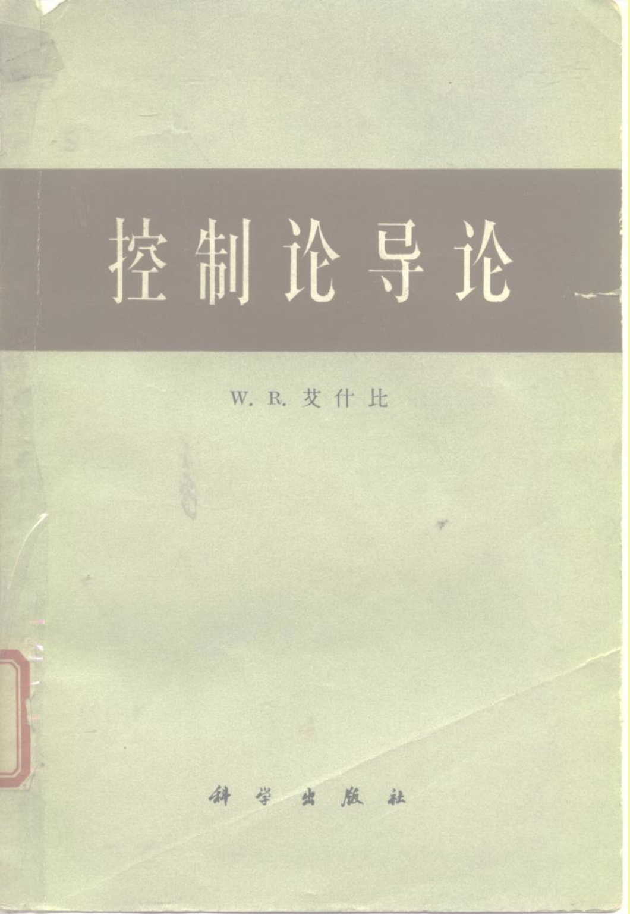

> 原文链接：https://mp.weixin.qq.com/s/7YX7Rdo2P4uSu78x9x4sMQ

# GUI 型 DevOps 平台的天花板，Ashby 在 1956 年就画好了

先把范围圈一下。我说的"DevOps 平台"，特指打开浏览器能看到一堆「项目 / 环境 / 服务 / 部署 / 审批流」的图形化产品。Terraform、Pulumi 这种 code-first 工具不算，GitHub Actions 这种 pipeline-as-config 也不算。商业产品里很多，企业内部平台工程团队搭的 portal 也常是这种形态。
这类产品有一个绕不开的问题：它必须在 UI 里把核心概念预先定义好。一个表单几个字段、一个页面几个 tab、一个向导几步，这些都是产品团队替用户做出的"哪些可变、哪些不可变"的决定。
而这件事，撞在了控制论的一堵墙上。
Ashby 和他那本小书
控制论这个词在工程圈被引用得不少，但很多人不清楚它的来源。
它是 1940 年代由 Wiener 等人提出的一门跨学科领域，研究"系统中的控制与通信"，不区分机器、生物还是组织。这一拨人里，最值得工程师认真读的是 W. Ross Ashby（1903–1972）。
Ashby 的本职是英国的精神科医生。他这辈子在做的事，是把"大脑如何维持稳定"抽象成一般性的系统理论。1956 年他出版了 An Introduction to Cybernetics，中文译作《控制论导论》。
这本书很薄，但有意思的是它没有讲一句电路、生物、电报这些具体技术。它从最朴素的"状态"概念开始，一步步推出适用于任何控制系统的几条定律。读下来会让你换一个理解世界的视角：控制论不是关于机器的学问，是关于"系统在面对扰动时如何维持目标"的数学。
书的第 11 章给出了一条特别反直觉的定律：必要多样性定律（Law of Requisite Variety）。
这条定律说了什么
Ashby 先定义"多样性"（variety）：一个系统的多样性，就是它能呈现的不同状态数。
一个开关 2 种状态，多样性是 2。
一台 8 位寄存器 256。
100 个微服务、每个 healthy / degraded / down，组合起来是 3¹⁰⁰，天文数字。
然后他问：一个控制器要让被控系统稳定在期望状态，自己最少需要多少多样性？
他用一个简单的博弈模型给出了答案：
控制器的多样性，必须不小于扰动的多样性。
用 Ashby 自己的话：Only variety can destroy variety.
直观讲就是，环境可能出现 100 种扰动，你的控制器只有 10 种应对动作，那就最多稳住 10 种局面，剩下 90 种必然失控。算法多聪明、if-else 写多少都没用，物理上就是不行。
最反直觉的地方在这里：这条定律说，一切"以少御多"的尝试都注定失败。要么提升控制器的多样性，要么降低被控对象的多样性，没有第三条路。
这条定律后来在管理学（Stafford Beer 的 VSM 模型）、生态学、神经科学里都有应用。但软件圈对它的引用少得可怜，尤其是 DevOps 这一块。
工程组织的多样性到底有多大
把定律放到 DevOps 平台上。被它"控制"的对象是真实的工程组织和它们的基础设施。这个对象的多样性大不大？
随便列几个维度，每个维度举几种取值：
• 服务命名约定：team-domain-service / service.team.domain / domain/team/svc / 纯 UUID / 根本没约定
• 环境模型：dev/staging/prod 三套 / 按 region 切 / 按账号切 / 按 tenant 切 / 混合
• 部署单元：service / application / deployment group / release train / bounded context
• 变更类别：code change / config change / secret rotation / infra change / feature flag flip / shadow traffic
• 依赖关系来源：代码静态分析 / 运行时 trace / CMDB 手维护 / IaC 推断 / 混合
• 审批与合规：单审 / 双审 / SOX / HIPAA / PCI / 按金额 / 按 blast radius
6 个维度、每个 5 种取值，组合就是 5⁶ = 15,625 种"形状"。而真实世界远不止 6 个维度，每个维度也远不止 5 种取值。
GUI 型平台覆盖这套多样性的方式，是在产品里做模型、做开关、做"插件机制"、做"自定义字段"。但只要这些东西最终落进产品代码——落进工程师写的 if-else、写的 React 组件、写的 schema 定义——控制器的多样性就被产品团队的工程容量锁死了。
产品团队的工程容量有限。被控系统是开放的。
按 Ashby 的讲法，这个差距不是工程问题，是结构性失败。
为什么 IaC 爬出去了，GUI 爬不出去
写到这里要先停一下，回应一个合理的反驳。
发版永远赶不上客户提需求、代码里到处是 if customer == X、销售承诺研发骂街——这些症状任何 platform 产品在初期都会遇到，IaC 早期也一样。Terraform 早年的 provider 里满地是 hack，Pulumi 现在也还有一堆客户特定的 feature flag。
但 IaC 后来爬出去了。它的办法是把多样性的吸收外包出去：cloud API 的多样性外包给 provider，客户组织的多样性外包给 module，部署模式的多样性外包给 user code。Hashicorp 的核心团队不需要理解每个客户的拓扑，因为客户用 HCL 自己表达了。核心代码量几年都不爆炸，是因为多样性住在 user-space。
GUI 型平台爬不出去。因为 GUI 这个介质天生没法外包语义——你没法给用户一张表单、让他在表单里定义新的表单。语义的注入面太窄。
所以同样的症状，在 IaC 那边是早期阵痛，在 GUI 那边停留下来变成慢性病：
• 用了三年的客户，UI 上一堆历史遗留的"模式开关"没人敢删；
• 新客户上来发现平台的概念和自己组织对不上，但又改不了平台；
• 那些 if customer == X，永远只能由产品团队来加，用户没法在自己那一侧补。
不是某个产品没做好。是这条路本身就走不通。
那怎么办
GUI 型平台还有救吗？有。
Ashby 的定律其实没说必要多样性必须由控制器"自己"具备——它只说必须从某处获得。IaC 从用户代码里获得，所以活下来了。GUI 想活，得找到自己版本的"用户表达通道"。
核心是把语义的来源换出去。什么是"服务"、什么是"环境"、什么是"变更"，这些不该写死在产品里，应该作为开放的 schema，让用户在自己的 IaC 代码、配置、注解里去定义。审批、依赖、blast radius，不该做成 UI 向导，应该基于用户的语义去推理出来。
GUI 还会有，但角色变了。它不再是"告诉用户系统长什么样"的地方，而是"把基于用户语义算出来的结论展示给用户"的地方。从语义的来源，退化成推理结果的呈现层。
打个比方。传统 GUI 型 DevOps 平台像菜谱，每道菜的做法都写死了，会做的菜就是菜谱里写过的那些。新一代平台应该像语法书，它不规定你说什么，但保证你说出来的话能被理解、能被推理。
菜谱再厚也写不完世界上所有的菜。语法定义清楚，能表达的句子是无限的。
下一代 DevOps 平台的核心不在 UI 里，在它背后的语义层。
Ashby 五十年前就把话讲清楚了：控制器想活下来，先得承认自己不可能比被控系统更复杂。
好文推荐：
一些持续交付的实践经验
我是如何做软件工程化的
2021年持续交付经验小结
另类的思路CMDB建设思路