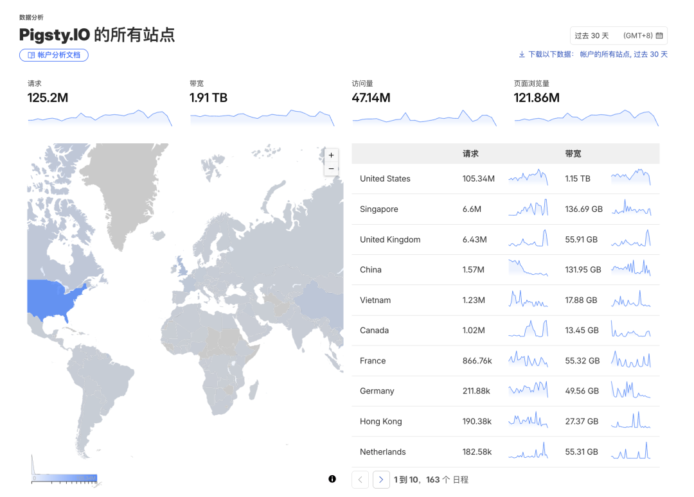
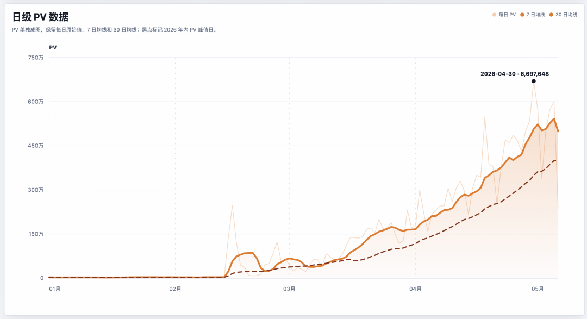
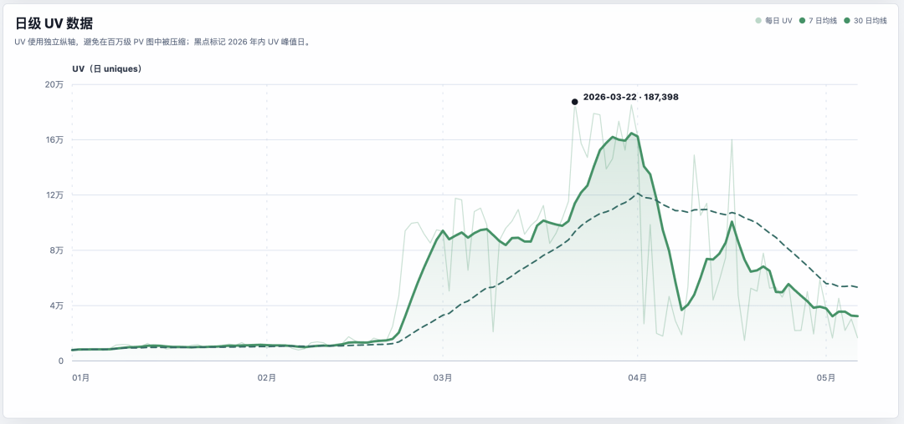
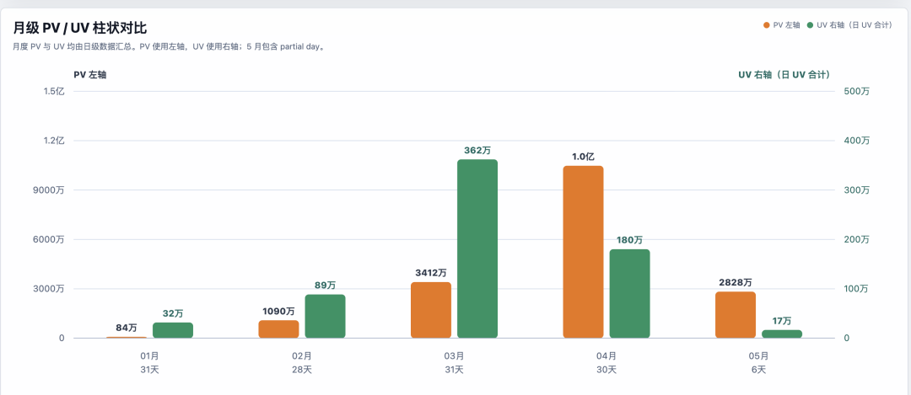
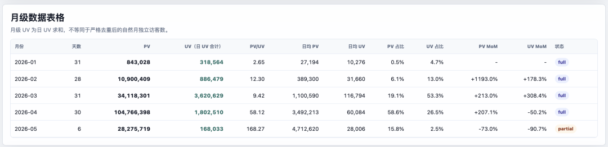
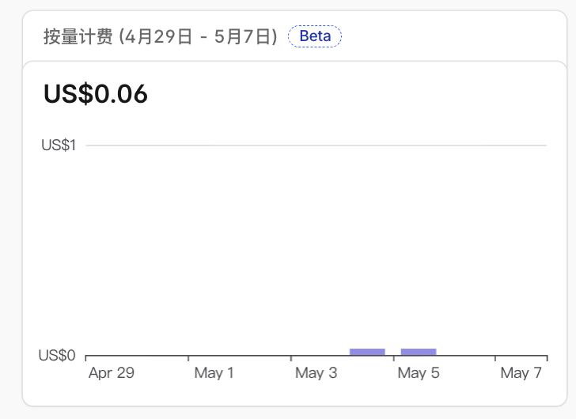

> 原文链接：https://mp.weixin.qq.com/s/1U7gbxLTP7RUF3ZD9e7TVg

# 三个月翻 100 倍：Agent 时代的流量画像

过去三个月，Pigsty.io 的月度 PV 翻了大约 100 倍。
月请求量数据：1月84 万，2月1000万，3月3400万，4月直接过亿。
我每天都忍不住打开 Cloudflare 首页看看，就这么一个年活跃用户几万，日均 PV 两三万的的开源项目文档站，哪里来的这么多请求量？
人类还是 Agent？
当然，Pigsty 有多少活人用户，我心里还是有点数的。从 Google Analytics 上的数据来看，年度活跃用户数量大约在 10 万左右。
当然还有不少用户是从文章博客过来的，这个部分可能会有几百万。比如，3月初的时候，我接盘了 MinIO，还上了几个小时的 HackerNews 头条，这带来了一大波人类独立访客，但热度过了之后，这波突增的人类访客数量就开始下降了。
那么这些流量从哪里来的呢？在之前这篇里我提过一嘴，基本上都是各种 Agent ——  给 DBA Agent 以身体
AI Agent 时代的内容分发
我之前算过一次 Cloudflare 上 pigsty.io 流量构成，机器人占大约 92%。当时就觉得夸张。
现在回头看，92% 还是低估了。
而且不只是传统搜索爬虫。从 UA 和访问路径来看，流量大致可以拆成三类:
第一类是声明明确的 AI 爬虫：GPTBot、ClaudeBot、PerplexityBot、ByteSpider 这些，它们抓内容是为了喂训练数据。
第二类是搜索 / SEO 爬虫:Googlebot、AhrefsBot 这些。这部分历史上一直存在，但量级在涨——因为越来越多的下游系统(包括 AI 系统)依赖它们的索引。
第三类是 Agent 类访问:看起来像浏览器、实际是脚本驱动的请求。一次性 IP 数量暴涨、API endpoint 高频探测——很多是 AI Agent 在执行任务时主动来抓页面、试接口、探数据。
之前在做 Pigsty DBA Agent 的时候，我就在想一个问题：Agent 应该怎么读基础设施？怎么访问文档？ 怎么消费内容？
结果不用我想了—— 它们已经在读了，而且读得比人多得多。
这件事的方向已经清楚：开源基础设施进入了新阶段 —— 主要的内容消费者，从人变成了机器。
这不是坏消息。它意味着内容真的在被使用、被索引、被引用、被学习。但它也意味着传统的用户增长概念需要重新理解。
多亏了慷慨的赛博佛祖
这里还是要夸一下赛博佛祖 Cloudflare，这么多流量都白给不收钱。
为全球用户提供这些软件仓库的基础设施，每月收费多少呢？存储每周 6 美分，折合一年 22 美元；.io 域名一年 50 美元，加一块 72 美元，总共五百块不到。
当然，我也为 pigsty.io 买了个 cloudflare pro 计划（20$/月），所以一年总成本两千块出头，差不多就是一个月的 Codex 订阅钱。倒也没啥新东西，能多看点统计分析指标。不买也不影响用，就当给赛博佛祖上香了。