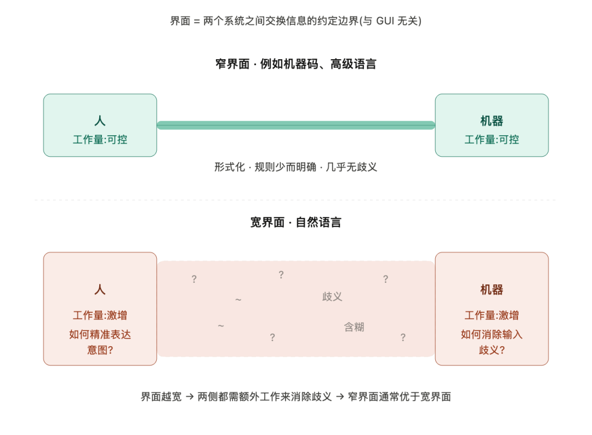

> 原文链接：https://mp.weixin.qq.com/s/lmvR_H4QkgqNb3wvMTHHug

# 自然语言不适合编程——Dijkstra 半个世纪前的判断,今天依然成立

1978 年,Dijkstra 写下 EWD 667,断言"用自然语言编程"是个糟糕的主意。
近半个世纪后,LLM 与 AI Coding Agent 已将"用人话写代码"变成了日常工程实践。
这位计算机科学的奠基者,究竟是被时代证伪,还是我们根本没有读懂他?
01 · 回到 1978 年的那篇短文
那一年,Dijkstra 在一篇仅两页的备忘录中,针对当时一种流行的设想开炮——既然编程如此困难,不如造一台能听懂人类母语的机器,人类便得以解放。
Dijkstra 不认同这种思路。他的反驳可以归纳为三层:
其一,界面的选择不是一道零和题。
📌 这里的"界面"(interface)指两个系统之间传递信息的约定边界——机器码、汇编、高级语言、自然语言都是不同形态的人机界面,与我们今天常说的 GUI 不是一回事。
把工作甩给机器,并不意味着人类这一侧就能减负。跨界面的协作本身会产生额外成本,而一旦界面从"窄"变"宽",界面两侧的工作量往往同时上涨。这也是工程实践中偏好窄接口的根本原因。
其二,数学史早已给出经验教训。
希腊数学受困于口述与图形化表达;阿拉伯代数曾尝试符号化,却又退回修辞式风格并最终式微;而现代科学的真正腾飞,依赖于 Vieta、Descartes、Leibniz、Boole 等人一步步将模糊的自然语言替换为精确的形式符号。
其三,也是最具颠覆性的一点:形式符号不是负担,而是特权。
我们使用母语时所感受到的那种"自然",其本质不过是——
它让我们很容易说出那些表面通顺、实则毫无意义的话。
形式符号之所以让人觉得"难",恰恰是因为它拒绝让你说出这类话。
02 · 那句带着冷笑的预言
文章收尾处,Dijkstra 留下了一句颇具分量的直觉判断:
能够用母语——无论是荷兰语、英语、法语还是斯瓦希里语——来编程的机器,制造起来恐怕和使用起来一样困难。
站在 2026 年回望,这句预言对了一半,但更关键的另一半错了。
• ✅ "制造起来困难"是准确的。 过去十余年,头部实验室为此投入的资金、算力与人才规模,足以让 1978 年的 Dijkstra 本人震惊。
• ❌ "使用起来同样困难"这一点,他似乎低估了人类的适应能力。 我们确实把这类机器用起来了。
那么,结论就是"Dijkstra 被证伪了"吗?
答案并不这么简单。
03 · 魔鬼藏在细节里:我们究竟是怎么"用"的?
观察任何一个成熟的 LLM 工程实践,会发现一个颇具讽刺意味的现象:
所有认真做事的团队,都在想方设法把自然语言"变回"某种形式化的东西。
近几年 Prompt Engineering 与 Agent Harness 领域流行的几项实践:
实践
它实际在做的事
用 XML 标签包裹输入(<context>...</context>)
在自然语言中重建语法边界
要求模型输出 JSON 而非自由文本
在输出端重建形式结构
Spec-driven development(先写规格再由 agent 实现)
在指令端重建形式化契约
Few-shot examples
通过样本压缩指令的歧义空间
Tool use / Function calling
将关键动作从"描述"退回为"调用"
Constitutional AI 与显式规则清单
在价值层补上形式化约束
规律是清晰的:我们并非真的在"用自然语言编程",而是在用一种"伪装成自然语言的、经过人工收窄的准形式语言"编程。
Dijkstra 当年的判断是"自然语言是宽界面,两侧都要付出额外代价"——
今天的 Prompt 工程师、Harness 设计者、模型训练者,正是这句话的活证据。
04 · 真正被 Dijkstra 说中的部分
重读 EWD 667,有三处放在 2026 年几乎具有预言级别的精度:
预言一:"跨界面协作会产生额外工作量,界面越宽,两侧越忙。"
对应今天完整的 Prompt Engineering 产业链。一份复杂任务的 Prompt 动辄数千 token,分段、示例、XML 一应俱全——这并非"用母语与机器对话",而是在设计一种临时性的、私有的形式化语言。
预言二:"母语的自然,本质是容易说出听着正确、实则无意义的话。"
对应今天的 LLM 幻觉问题。模型输出一段语法完美、逻辑自洽、连引用都精确到"某期刊某卷某期"的文字,而那本期刊根本不存在。这不是 Bug——这是自然语言的"自然"所固有的代价,被模型忠实地学会并放大了。
预言三:"新文盲症会使相信自然语言编程的人更加盲目。"
1978 年,这句话是 Dijkstra 对教育滑坡的批评。放到今天,它恰好指向另一群人:以为会打字就等于会写 Prompt、以为"把需求讲清楚"是一件容易事的人。 写过 PRD 的人都清楚:人类连用母语向另一个人类讲清楚一件事都做不到,又凭什么相信自己能够讲清楚给机器听?
05 · 那么 Dijkstra 输了吗?
我的判断是:他在战术上输了,在战略上赢了。
• 战术层面,他认为没人能造出听懂人话的机器。事实上,我们造出来了。
• 战略层面,他预言的"本质难题不会消失,只会换个地方出现"——这一点一字未错。
过去,消除歧义这件事发生在编译器与程序员之间,由 Pascal、C、Haskell 的语法规则兜底。
今天,消除歧义这件事发生在 Prompt 与 Harness 之间,由 Structured Output、Tool Schema、Eval Pipeline、Spec 文档兜底。
难题的总量并未减少,只是完成了迁徙。
它迁徙到了谁身上?迁徙到了那些正在设计 Agent Harness 的人、正在撰写 Cursor Rules 的人、正在调试 System Prompt 的人、正在为模型起草 Constitution 的人。
这些人每天所做的事,本质上与 Dijkstra 当年做的事是同一件:
在自然语言的泥潭中,一点点、审慎地收窄那个界面。
06 · 三条留给今天的启示
其一,不要将 LLM 的"能听懂人话"视作免费午餐。
每一次"它理解了",背后都有人在某处支付了让它理解的成本——训练数据、RLHF、System Prompt、Tool Schema、Eval、Harness。
其二,写好 Prompt 的核心能力不是文采,而是形式化思维。
能够把一件事讲清楚的人,写 Prompt 才具有优势。而"把一件事讲清楚"这项能力,从来都是形式化训练的产物,与母语熟练度无关。
其三,真正稀缺的能力,是在自然语言与形式符号之间自由切换。
单纯的形式化思维(传统程序员)与单纯的自然语言表达(非技术使用者)都已不敷使用。新的稀缺能力是:清楚什么时候应当借助自然语言的表达力,什么时候应当退回到形式符号的精确性。
参考:E.W. Dijkstra, "On the foolishness of 'natural language programming'", EWD 667, 1978.
原文:https://www.cs.utexas.edu/~EWD/transcriptions/EWD06xx/EWD667.html