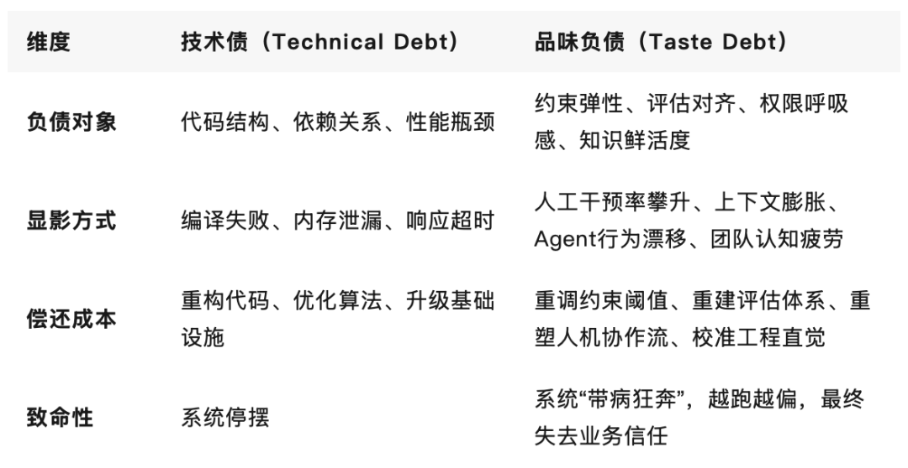
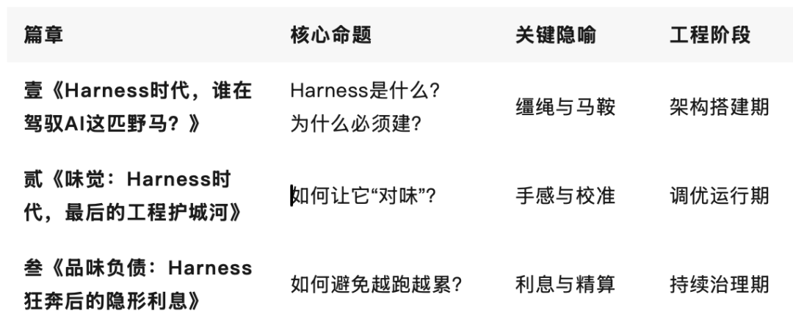

> 原文链接：https://mp.weixin.qq.com/s/kTAbtUBm-ukZ3auEhsrKoA

# 品味负债：Harness狂奔后的隐形利息

——「Harness时代」系列之三。
▼
前篇我们问：Harness时代，谁在驾驭AI这匹野马？ 再前篇我们答：缰绳在手，但真正决定生死的，是握缰绳的味觉。
但工程现场从不浪漫。当Harness从实验室原型狂奔进生产环境，蜜月期往往只有3个月。随后，一种看不见的拖拽感开始蔓延：Agent越来越“累”，干预越来越频繁，迭代越来越重，团队越来越疲惫。
代码没坏，架构没崩，基准测试依然漂亮。但系统就是“不对味”了。
这不是技术债。这是品味负债（Taste Debt）。
在Harness时代，品味负债正在成为AI团队最昂贵、最隐蔽、也最致命的复利成本。今天，我们拆解它的病灶、利息与清算指南。
01什么是“品味负债”？技术债的孪生兄弟，更致命的隐形成本
技术债，是工程师为了快速上线，在代码质量、架构设计上做的妥协。它看得见、测得出、还得上。
品味负债，是团队在Harness搭建初期，为了“先跑起来”，在约束设计、评估标准、权限策略、知识治理上做的隐性妥协。 它不报编译错误，不触发崩溃日志，只在真实业务摩擦中慢慢显影。
两者的本质差异：
Gartner 2026 Q1 AI Agent部署报告显示：67%的企业Harness系统存在中度以上品味负债。初期为赶窗口期而“差不多就行”的约束配置、指标取舍、权限放行，在6-12个月后演变为维护黑洞。平均修复成本是初期设计的4.3倍，且随业务复杂度呈指数级放大。
品味负债的残酷在于：它不阻止你出发，但会悄悄改变你的目的地。
02负债的四大病灶：Harness为什么开始“欠债”？
品味负债不是玄学，它有清晰的病理切片。一线工程现场普遍观测到四大核心病灶。
病灶一：约束僵化（Constraint Rigidity）
症状：初期为防Agent“脱缰”，设下过密的规则墙。Agent变成提线木偶，稍遇边界外场景就卡死或触发人工接管。 负债本质：用静态规则应对动态业务。约束不是护栏，是牢笼。 典型场景：某电商Agent Harness初期设定了127条硬规则（禁止修改价格字段、禁止跨品类推荐、禁止生成未审核话术等）。上线首月稳定，Q2促销策略调整后，Agent因规则冲突频繁fallback，人工审核工单暴涨300%。团队不得不逐条拆解规则，重配动态置信度阈值。
病灶二：评估失真（Evaluation Mismatch）
症状：Harness的评估器仍停留在“任务完成率”“代码通过率”“响应延迟”等显性指标。真实场景中的“摩擦系数”“维护成本”“团队适配度”被系统性忽略。 负债本质：优化了错误的目标。模型在刷分，工程在挨打。 典型场景：某金融Agent在Terminal Bench上得分Top 5，但生产环境首次可合并率仅28%。复盘发现，评估器只校验“逻辑正确性”，未纳入“合规可解释性”“下游系统兼容度”“审计追溯成本”。评估失真直接导致Harness方向性偏差。
病灶三：权限摩擦（Permission Friction）
症状：权限体系采用“一刀切”审批流。低风险操作走重流程，高风险操作靠运气拦截。Agent在等待中消耗上下文，人类在审批中消耗耐心。 负债本质：权限不是开关，是信任曲线。缺乏动态置信度管理，必然导致摩擦复利。 典型场景：某运维Agent每次调用生产数据库均需双人审批。初期安全合规过关，3个月后上下文窗口因等待审批频繁压缩，Agent记忆断裂率升至41%。团队被迫引入“置信度分级+异步审计+事后追责”机制，才将摩擦成本压回可控区间。
病灶四：知识腐败（Knowledge Decay）
症状：Harness的Knowledge模块初期塞满文档，但缺乏版本管理、时效标记、冲突消解机制。Agent基于过时架构指南生成代码，基于废弃API调用接口，基于已下线业务逻辑做决策。 负债本质：知识不是仓库，是活水。静态堆砌必然导致上下文污染。 典型场景：某SaaS团队Harness内置800页产品文档。6个月后，32%的引用指向已下线功能。Agent产出代码的“历史债务携带率”高达57%。引入“知识生命周期管理+自动失效标记+冲突预警”后，上下文污染率下降78%。
四大病灶的共同点：都不是“不会做”，而是“没品好”。初期为了快，牺牲了弹性、对齐、呼吸感与鲜活度。债，就此埋下。
03利息的复利效应：为什么你的Agent越跑越“累”？
品味负债最可怕的不是本金，是利息。它不一次性爆发，而是以复利方式啃噬工程效能。
1. 干预率攀升：人机协作流断裂
初期Harness设计若缺乏“摩擦感知”，Agent会频繁触发人工接管。一线数据表明：人工干预率每上升10%，开发者认知负荷增加23%，上下文切换成本上升31%。Harness本为提效，却因品味负债变成“人工 babysitter”。
2. 上下文膨胀：记忆系统过载
为弥补约束不足或评估失真，团队倾向于往Context里塞更多提示、更多示例、更多兜底规则。上下文窗口从128K撑到512K，但有效信号占比从68%跌至29%。模型在噪音中迷路，Harness在膨胀中失速。
3. 迭代阻力：重构成本指数级放大
品味负债具有强路径依赖。初期约束设错方向，中期评估跑偏指标，后期权限卡死流程。到想调整时，牵一发而动全身。某头部团队测算：Harness品味负债的修复成本，随部署时长呈1.8^n指数增长。第6个月还债是重构，第12个月还债是重造。
4. 团队倦怠：工程直觉被系统性磨损
最隐形的利息，是人的消耗。当工程师每天花60%时间处理Harness的“不对味”产出，当架构师被迫在“快上线”和“建对系统”之间反复撕裂，工程品味会被系统性磨损。团队从“驾驭者”退化为“救火员”，创新力归零。
利息的终局，不是系统崩溃，是信任破产。 业务方不再相信AI能交付，管理层不再愿意投入工程基建，团队陷入“越赶越债、越债越赶”的死亡螺旋。
04清算指南：从“还债”到“免债”的工程精算术
品味负债可清算，但不能用还技术债的方式。它需要一套“精算体系”。
1. 定期品味审计（Taste Audit）
不要等利息滚雪球。每季度执行一次Harness品味审计，聚焦四个维度：
约束弹性指数：规则墙是否过密？动态阈值是否生效？边界外场景的fallback率？评估对齐度：显性指标与隐性摩擦的权重比？生产环境首次可合并率与基准得分的偏离度？权限呼吸感：人工干预平均等待时长？置信度分级覆盖率？异步审计闭环率？知识鲜活度：文档时效标记覆盖率？冲突引用率？自动失效机制触发频次？
审计不打分，只出“品味负债热力图”。标红区域，优先重构。
2. 动态约束调优（Dynamic Constraint Tuning）
约束不是刻在石头上的。引入“约束弹性引擎”：
场景分级：探索型任务放宽约束，生产型任务收紧边界置信度路由：高置信度直放，中置信度异步记录，低置信度拦截+人工校准反事实测试：定期注入边界外请求，测试Harness的弹性恢复能力
约束的价值不在“防错”，而在“容错”。
3. 摩擦感知评估（Friction-Aware Evaluation）
重构评估器，从“完成率导向”转向“韧性导向”：
引入人工摩擦系数（干预次数/任务数）引入上下文健康度（有效token占比/压缩失败率）引入长期稳定性指标（30日无降级运行率）建立品味对齐看板：业务方、工程师、AI Agent三方评分加权
评估不是验收，是校准。校准的不是模型，是Harness与真实世界的接口。
4. 人在回路的品味校准（Human-in-the-Loop Calibration）
品味无法全自动。必须保留“人的味觉”在回路中：
周级品味复盘：工程师与产品经理共同Review Agent产出，标注“对味/不对味”样本约束众包：将隐性判断转化为显式规则，由一线开发者投票权重品味资产库：沉淀“好Harness设计模式”“典型品味负债案例”“弹性约束模板”
品味不是天赋，是可沉淀的工程资产。
05品味不是玄学，是可计算的工程资产
我们必须正视一个趋势：随着Harness工程化程度加深，品味负债正在从“隐性成本”显性化为“核心KPI”。
头部团队已开始设立“Harness品味精算师（Taste Actuary）”角色。他们的职责不是写代码，而是：
计算约束的弹性边界校准评估的摩擦权重审计权限的信任曲线治理知识的生命周期沉淀品味的可复用模式
这不是岗位通胀，是工程范式的升维。
当AI能自动生成代码、自动测试、自动部署，甚至自动优化Harness架构时，唯一无法自动化的，是对“什么是对味”的判断。模型可以穷举方案，但无法决定哪种方案“值得活下来”；Harness可以执行约束，但无法感知哪种约束“留有呼吸感”；评估器可以打分，但无法理解哪种摩擦“必须保留”。
品味，是 Harness 时代最后的非对称优势。
它不写在论文里，不跑在benchmark上，不藏在权重中。它刻在每一次约束调优的克制里，藏在每一次评估权重的取舍里，留在每一次权限放行的手感里，融在每一次知识治理的清醒里。
野马不需要知道草原的尽头在哪，但骑手必须知道风的方向。Harness不需要完美无缺，但驾驭者必须清楚欠了多少利息。
系列结语：从缰绳，到味觉，到精算
「Harness时代」三部曲，至此闭环。
三篇合一，才是Harness时代的完整工程图谱： 建对系统 → 校准品味 → 清算负债 → 持续精算。
💬 互动话题 
你的Harness系统，目前处于“蜜月期”还是“付息期”？欢迎在评论区留下你的负债排查清单。
👇 点个「在看」，把工程清醒传递给更多人