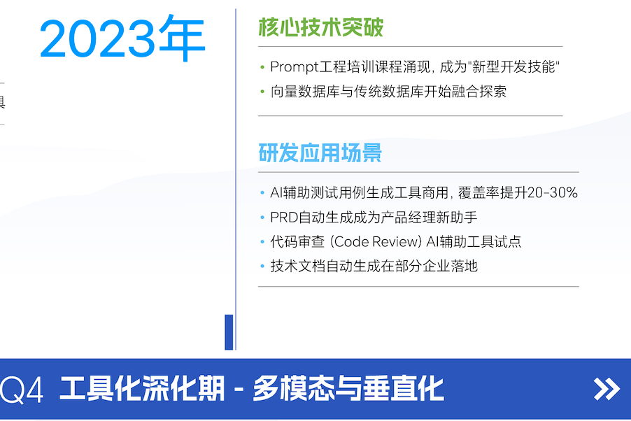
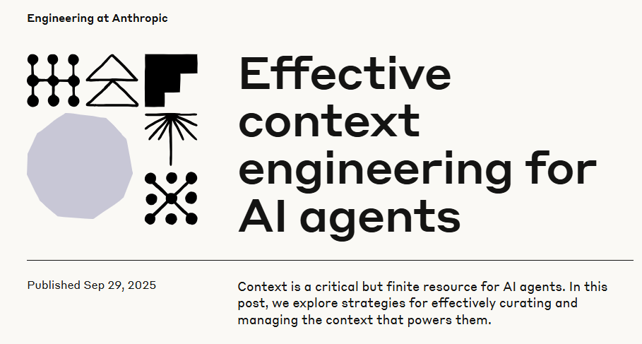
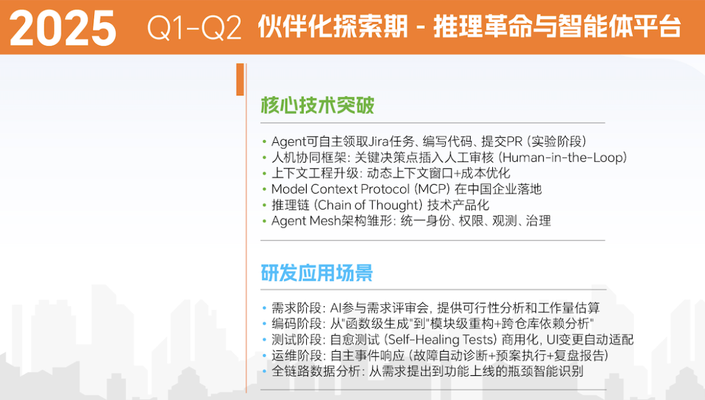
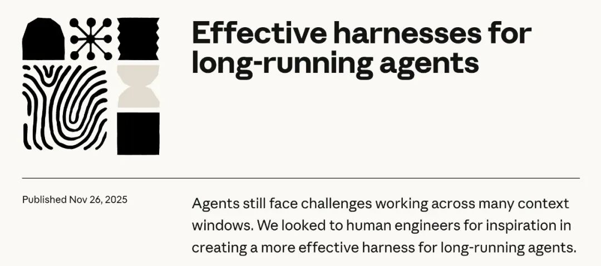

> 原文链接：https://mp.weixin.qq.com/s/yN3kHBXNQANppeDHoGTHGg

# Harness时代，谁在驾驭AI这匹野马？

Harness：一套很"踏马"的工程哲学。
▼
当大模型的推理能力跨越临界点，一个尖锐的问题被摆上桌面：我们拥有了历史上最聪明的大脑，但谁来为它套上缰绳？
这不是一个文学比喻。在硅谷的顶尖实验室与一线研发团队里，AI早已被视为一匹力量惊人的“野马”。它的上下文窗口可以装下整个技术栈，它的代码生成能力能碾压初级工程师，它的多模态理解让交互近乎直觉。但如果你直接跨上马背，结果往往不是驰骋，而是被狠狠甩下。提示词工程（Prompt）曾是我们试探性的缰绳，上下文工程（Context）是进阶的马鞍，而今天，真正让这匹野马从“实验室奇观”变成“生产力引擎”的，是一整套被称为 Harness 的系统工程。
模型决定下限，Harness决定上限。
那么，Harness时代，谁在驾驭AI这匹野马？
马的力量是原始的、澎湃的，而Harness的底层逻辑，从来不是压制野性，而是将其转化为可预期、可协作、可规模化的工程秩序，把这股力量转化为文明前进动力的那套系统。
今天，这匹野马叫大模型。当智能狂奔越过临界点，整个行业正在做同一件事：不再盲目追逐参数狂飙，而是俯下身，为它锻造一副真正趁手的缰绳。
01三次「工程」革命：从说话，到选信息，再到造环境
过去三年，AI圈先后流行了三个带「Engineering」的词：Prompt Engineering、Context Engineering、Harness Engineering。
每一个新词出来的时候，上一个词就显得不够用了。
这不是术语的内卷，而是认知边界的被迫扩张。顺着这条线捋一遍，你会发现一条清晰的进化脉络：
2022-2024：Prompt Engineering——「学说话」的时代
AiDD-AI+研发进化图谱
2023年，ChatGPT刚火的时候，大家遇到的第一个问题特别朴素：不会跟AI说话。
你随便问它一个问题，它给你一个回答，质量忽高忽低。后来有人发现，你在提示词末尾加一句let's think step by step，模型的推理能力就能明显提升。给几个示例（few-shot），输出格式就能稳定下来。
那个阶段的隐含假设很简单：模型够聪明，你不会问而已。
在简单任务上，这个假设完全成立。你问一个问题，模型答一个问题，一轮结束。Prompt写得好就好，写得差就差。
但你让模型写一个完整的项目，这套逻辑就开始松了。模型需要知道项目结构、依赖关系、技术栈偏好、现有代码长什么样。这些东西，塞不进一句提示词里。
提示词的天花板，是单轮交互的天花板。
2025：Context Engineering——「学选信息」的时代
2025年9月，Anthropic发了一篇工程博客，标题叫「Effective context engineering for AI agents」。
开头有一句话说得挺直接：构建AI应用，越来越不在于找到正确的措辞，越来越在于回答一个更大的问题：什么样的上下文配置，最可能让模型产生你想要的行为？
这就是从Prompt到Context的换挡。
AiDD-AI+研发进化图谱
Prompt Engineering关注的是怎么写指令。Context Engineering关注的是怎么管理模型在推理时能看到的全部信息：系统指令、工具定义、外部数据、对话历史、MCP接入的各种服务。
模型能力在涨。上下文窗口从4K到128K再到百万token。RAG来了，工具调用来了，MCP来了。模型能接收的信息量大了好几个数量级。
相应的，你能塞给它的东西也多了好几个数量级。
但你会说话了，不代表你会喂饭。
给多了它消化不动，给少了它缺信息，给错了更糟糕。
给错了是最要命的。模型会非常认真地基于错误的上下文，产出一个看起来很对、实际上离谱的结果。它不会告诉你「你给我的信息有问题」，它只会老老实实地用错误的前提推出一个自洽的结论。
Anthropic在那篇博客里说，context是一种有限资源，每一个token都有成本。Context Engineering就是在这个有限窗口里，塞进信号最强的那部分，同时把噪音挡在外面。
这个阶段的瓶颈很明确：人不知道该给什么信息。
2026：Harness Engineering——「造环境」的时代
2025年11月，还是Anthropic，又发了一篇博客，叫「Effective harnesses for long-running agents」。
这篇文章记录了一个有点扎心的发现：即使用他们最好的模型Opus 4.5，配上了上下文管理能力（compaction），让Agent在多个上下文窗口里跑长任务，结果还是会出问题。
模型要么试图一次性做完所有事，要么跑到一半就觉得「差不多了」提前收工。
信息给对了，还是不行。
2026年2月，OpenAI发了一组博客讲Harness Engineering。他们在内部做了个实验：一个小团队完全不手写代码，靠Codex Agent交付了一个大约一百万行代码的产品。
工程师干的活，从写代码，变成了别的东西。
一开始他们用一个超长的AGENTS.md文件，把所有规则都写进去告诉Agent。很快就发现不行。上下文窗口有限，一个大文件把任务本身的空间都挤没了。当所有规则都「重要」的时候，Agent对哪条规则都不上心。
文件很快过时，没人维护，Agent开始被一堆不再成立的规则误导。
后来改了。AGENTS.md缩到100行，只当一个目录。架构文档、设计决策、技术规范，全部拆成独立文件，Agent需要什么就加载什么。
但最有意思的变化是思路上的。
OpenAI给Agent的代码库设了极其严格的分层依赖规则。业务代码只能单向调用，越界就被系统切断，合并都合并不进去。Anthropic在Harness里设了三个角色：规划师拆需求，生成器写代码，评估器做验收。评估器直接打开产品去点击测试，发现不对直接打回。
这些约束有一个共同的特点：人没有告诉Agent应该怎么做，人只告诉它哪里不能做。
想想看，这个转变其实挺微妙的。从「你应该这样写代码」到「你随便写，但这条线不能碰」。从主动指导变成被动约束。
原因说白了就是，人也不知道Agent具体每一步应该怎么做，人只知道边界在哪。
Harness Engineering，本质上是一场「约束设计」的革命。
02数据不会说谎：同一模型，换壳如换脑
如果说观点是旗帜，那数据就是弹药。
让我们看几组硬核数据，它们直接指向一个颠覆性的结论：在当下这个节点，优化模型外面的「壳」，回报率可能比等待下一代模型更高。
实验一：编程成功率翻倍
最具说服力的实验来自开发者Nate B Jones。
同一个模型，只换Harness，编程成功率从42%跳到78%。
变量只有一个：壳。
实验二：榜单排名跃迁
LangChain团队在固定模型不变（GPT-5.2-Codex）的前提下，仅通过调整Harness，就将coding agent在Terminal Bench 2.0上的得分从52.8%提升至66.5%，排名从Top 30附近跃升至Top 5。
他们的改进方法很「工程」：借助trace在大规模运行中识别失败模式，再针对性回写到Harness中。
这意味着Harness Engineering将「调试模型」转化为了「调整系统」，并通过可观测性与闭环迭代持续放大了模型已有的能力。
实验三：成本与效果的倒挂
Anthropic发布了一组工程实验数据：同一个模型、同一句提示词，用简单方式跑20分钟花9美元，核心功能完全无效；而用完整的Harness跑6小时，花200美元，交付了一个真正可用的游戏，核心交互全部跑通。
模型没变，变的是驾驭它的线束。
实验四：百万行代码零手写
OpenAI的内部实践更具冲击力：3-5名工程师，5个月内交付超100万行生产级代码，零手写，效率是传统模式的10倍。
核心不是模型更强，而是他们搭建了一套完整的Harness流水线：自动测试、代码审查、部署与监控全链路自动化，AI只负责生成，系统负责兜底。
这些数据背后，是一个行业共识正在形成：模型能力的提升曲线正在放缓。单纯增加参数和数据，已经越来越难带来显著的性能突破，边际效益在急剧递减。
就像一百年前的汽车工业。当所有厂商都在比拼发动机马力时，福特意识到一件不同的事：关键不在马力，而在于如何让马力为普通人所用。
于是，他发明了流水线、标准化零件，发明了让汽车从贵族玩具变成大众工具的整套系统。
本质上，那就是工业时代的Harness。
今天的AI行业，站在同样的拐点上。
03Harness解剖学：五个模块，三层架构，一套新范式
既然Harness如此关键，那它到底长什么样？
结合业界实践，我们可以给出一个相对标准的「解剖图」。
核心公式：Agent = Model + Harness
LangChain提出了一个被广泛接受的公式。
模型是「大脑」，负责思考与生成；Harness是「操作系统」，提供环境、工具、约束、记忆与纠错能力。
单独的大模型不是Agent，它只是一个有能力的「大脑」。没有Harness，再强的模型也只是「野马」，无法稳定落地。
只有当Model被放入一个设计好的Harness中——有工具可用、有上下文可参考、有边界可遵循——它才能真正成为能完成任务的Agent。
五个核心模块
一个完整的Harness由五个核心模块构成：
1. Tools（工具）
包括文件读写、Shell执行、网络请求、数据库操作等，每个工具都做到原子化、可组合、可描述。工具不是越多越好，而是越「可被模型理解」越好。
2. Knowledge（知识）
包括产品文档、API规范、架构设计、代码风格指南等，按需加载而非一次性塞给模型。知识管理的关键是「结构化」和「可检索」。
3. Observation（观察）
包括Git变更、错误日志、浏览器状态、环境信息等，让模型能清晰感知当前的任务状态。可观测性是Agent自我修正的前提。
4. Action Interfaces（执行接口）
统一模型的动作输出格式，包括CLI命令、API调用、UI交互等。接口越标准，集成成本越低。
5. Permissions（权限体系）
包括沙箱隔离、危险操作拦截、人工审批流程，是安全的核心。权限不是限制，而是让模型敢于放手的护栏。
三层架构
从工程实现角度看，Harness分为三个层次：
第一层：基础驾驭层——解决「让Agent能跑起来」的问题
核心是一个极简的循环：模型输出指令→执行指令→把结果喂回模型→循环直到任务完成。这个循环是所有Agent的心脏。
第二层：约束安全层——解决「让Agent不闯祸」的问题
包括子Agent机制（把大任务拆解成小任务，每个子任务有独立上下文）、技能库（把高频能力封装成可调用的技能）、上下文压缩（自动清理无效信息）等。
第三层：生产质量层——解决「让Agent能稳定上线」的问题
包括后台任务机制、多Agent团队协作、工作树隔离等，让Agent的输出达到生产级质量标准。
文档即环境，而非说明书
这里有一个反直觉的实践发现，值得所有从业者记下来：
给Agent看的文档，不再是「说明书」，而是「运行环境的一部分」。
OpenAI团队发现，给Agent一本「1000页的说明书」，效果反而更差。巨大的指令文件挤占了上下文窗口，导致模型错过关键的任务信息。
他们的解决方案是「地图模式」：AGENTS.md只保留约100行，充当内容目录，指向结构化的docs目录。具体的架构文档、设计文档、编码规范分散在docs目录中，Agent按需获取。
这意味着：文档的质量直接决定了Agent产出的质量。
你写的不是给人看的文档，你写的是给机器执行的「环境配置」。
04四个行业洞察：约束、安全、评估与人的角色
基于大量实践，行业正在形成四个关键洞察。它们不仅是技术判断，更是战略信号。
💡洞察一：模型能力的天花板，不在模型里面，而在模型外面
最具颠覆性的发现：同一模型，仅改变Harness，性能可以产生数量级的差异。
这直接挑战了一个行业惯性思维：要让AI更强，就得训练更好的模型。
事实上，在当下这个节点，优化模型外面的「壳」，回报率可能比等待下一代模型更高。
这不是说模型不重要，而是说在模型能力达到一定阈值后，工程系统的优化空间更大、见效更快、成本更低。
💡洞察二：约束不是对智能的压制，而是对智能的引导
Cursor团队在大规模Agent实验中，发现一个反直觉的现象：当模型可以生成任何东西时，反而浪费大量token探索死胡同；但当Harness定义了清晰的边界，Agent反而更快收敛到正确答案。
约束解空间，反而提高了Agent的生产力。
这背后是一个深刻的工程哲学：智能不是无边界的发散，而是在约束条件下的最优求解。
💡洞察三：Harness让大模型更安全
一个没有Harness的大模型，就像一个没有操作规程的实习生，能力不差，但你不知道他下一步会做什么。
Harness通过权限边界、沙箱隔离、操作审计和人工审批节点，将模型的行动空间限定在可控范围内。
多数Harness都明确规定：哪些系统可以访问、哪些操作需要二次确认、哪些数据绝对不能触碰。
这不是对AI能力的削弱，而是让AI真正进入企业生产环境的前提。AI要让人放心，只有用得放心，才能用得起，才能真正用得上。
💡洞察四：AI无法可靠地评价自己
Anthropic的工程师发现，当Agent评估自己刚完成的工作时，它会自信地表示「做得很好」，即便在人类看来质量明显不行。
他们的描述是：「开箱即用的Claude是一个很差的QA Agent。」
这意味着，仅靠模型自身无法形成有效的质量闭环，必须在模型外部建立独立的评估机制，这正是Harness的核心职责之一。
评估权，必须掌握在人手里。
05驾驶员的觉醒：AI越强大，对人的要求越高
在发动机-线束-驾驶员的三角关系中，驾驶员是最容易被忽视的角色。
过去三年的叙事主角是模型，2026年的新宠是Harness，但真正决定最终产出质量的，始终是坐在驾驶座上的人。
这里有一个深刻的命题：AI越强大，对人的要求不是降低了，而是提高了。
想想自动驾驶。表面上，自动驾驶是为了让人不用开车。但一个能够安全监督自动驾驶系统的人，需要比普通驾驶员更深刻地理解驾驶本身。
他需要理解系统边界，知道什么时候该信任机器、什么时候该接管控制，需要在突发情况下做出比机器更好的判断。
自动驾驶的驾驶员不是一个更轻松的角色，而是一个更高阶的角色。
AI也是如此。
对AI的驾驭，需要同时理解人类工程实践和AI的思维方式，需要对系统行为的深刻洞察，需要将错误模式抽象为规则的能力，更需要在人类智慧和机器智能之间搭建桥梁的品味。
品味。这个词越来越被频繁提及。
它不是审美偏好，而是一种更深层的东西：判断什么是好的、什么是对的、什么是值得做的能力。同样的发动机，同样的Harness，不同的驾驶员产出的东西可以有天壤之别。
对于大多数人来说，Harness时代是一个更乐观的未来。
回看汽车的隐喻。今天的汽车行业存在两个看似矛盾的趋势：一方面，F1赛车手这些顶尖驾驶者的技能价值从未如此之高；另一方面，自动驾驶正在让普通人的出行变得前所未有的安全和便利。
这两个趋势不矛盾，它们是同一枚硬币的两面。
AI正在创造一个双层结构。在上层，顶尖的驾驶员，那些真正理解发动机、善于设计线束的人，将产出最优秀的作品。他们的竞争壁垒不是执行力，而是品味、判断力和创造性。
在下层，大多数人不需要成为高阶驾驶者，也能享受AI带来的能力提升。
这就是AI Harness的普惠性。你不需要理解发动机的每一个零件，不需要亲手设计线束的每一根导线，就能享受AI带来的生产力工具。
AI Harness正在将智能变成一种基础设施，让Intelligence as a Service（智能即服务）
06终局之问：当模型自己长出手脚，驾驶员去哪？
但这个双层结构未必是终局。
我们必须看到一个正在发生的趋势：随着模型能力的持续增强，上下文窗口越来越大，记忆能力不断提升，推理链条越来越长，模型正在自己长出手脚。
今天需要外部搭建的工具调用、上下文管理、反馈循环、记忆系统，模型正在一项一项地内化。
外面的这套脚手架正在变薄。
极端地说，当模型足够强大时，Harness可能被模型完全吸收。就像早期汽车需要复杂的外部操作机构来转化发动机动力，而现代电动车的发动机和传动系统已经高度一体化，线束越来越简单，因为发动机自己就「懂」了。
OpenClaw是第一只「爬上岸」的龙虾，也许明天还会出现螃蟹、海螺、皮皮虾——这些不同形态、不同侧重的Harness框架，会持续涌现和迭代。
但这些都是表象，更重要的是：让大模型长出手脚、真正干活，已经是一个不可逆的趋势。框架可以换，范式不会回头。
当这一天到来，驾驶员的角色将从「操作者」升级为「委托人」，不再告诉AI怎么跑，而是告诉它要去哪里，然后它自己找路。
但即便模型吸收了所有的工具和流程，有一件事它永远无法自己生成：目的地。
去哪里，为什么去，到了之后怎么判断值不值，这些关于方向、意义和价值的问题，永远是人的责任。
模型越强，这个责任越重。
因为当机器什么都能干的时候，「干什么」变成了唯一重要的问题。
这恰恰印证了一个朴素的道理：AI的价值不在于它有多强大，而在于我们能在多大程度上驾驭这种力量，让它服务于真实的场景、真实的人、真实的需求。
07结语：驯服野马，需要的不是更长的鞭子
数千年前，人类在欧亚草原上第一次给马匹套上缰绳。
那一刻，人类文明获得了前所未有的机动性：农耕范围扩大了，贸易距离延伸了，思想传播加速了。
改变世界的不是马的力量，而是人类发明的那套驾驭系统。
今天，我们站在一个相似的节点。
大模型是这个时代的野马，力量惊人。Harness是我们发明的缰绳，它将这股原始力量转化为可控的、可预期的、可协作的能力。
而驾驶员，你、我及每一个与AI共处的人，是决定这股力量驶向何方的主体。
人工智能正式进入Harness时代。
真正稀缺的能力，不在模型里面，在模型外面。
驯服一匹野马，需要的不是更长的鞭子，而是一副趁手的缰绳，和一个知道目的地的骑手。
在这个充满不确定的时代，我们需要继续锚定技术创新、开放协作、专注价值，让AI真正成为用得上、用得起、用得放心的普惠生产力工具。
毕竟，伟大的不是马，是驾驭马的人。
本文部分数据与案例来源于腾讯、OpenAI、Anthropic、LangChain等机构公开技术报告与工程实践。
🔖 延伸阅读
汤道生：《AI落地不只是算法题，Harness工程能力是关键变量》Anthropic: Effective harnesses for long-running agentsOpenAI: Harness Engineering: Leveraging Codex in an Agent-First WorldLangChain: Deep Agents Terminal Bench 2.0 Report
💬 互动话题 
你认为你的团队，现在处于Prompt、Context还是Harness阶段？欢迎在评论区聊聊。
👇 点个「在看」，把思考传递给更多人