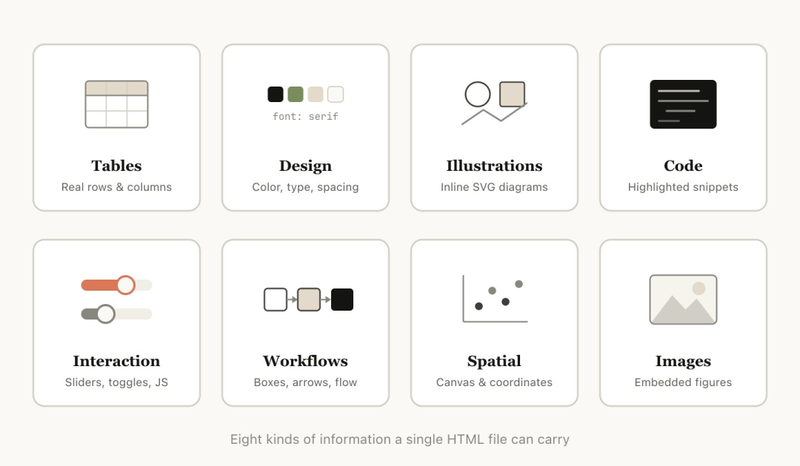
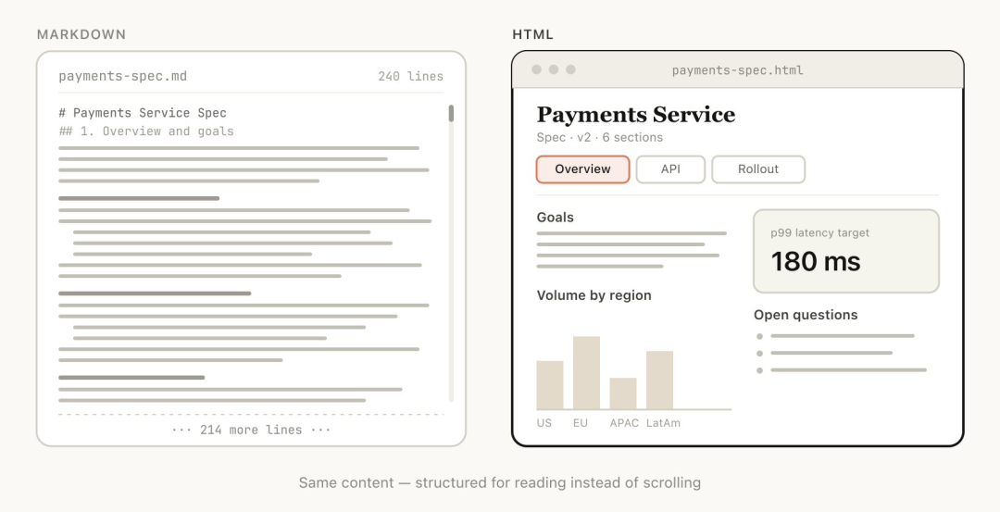
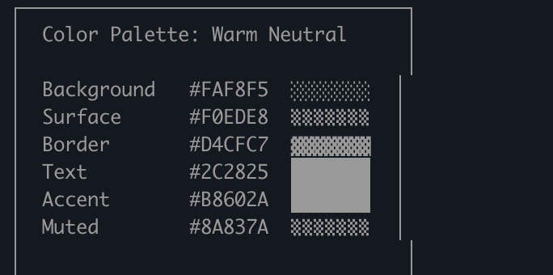
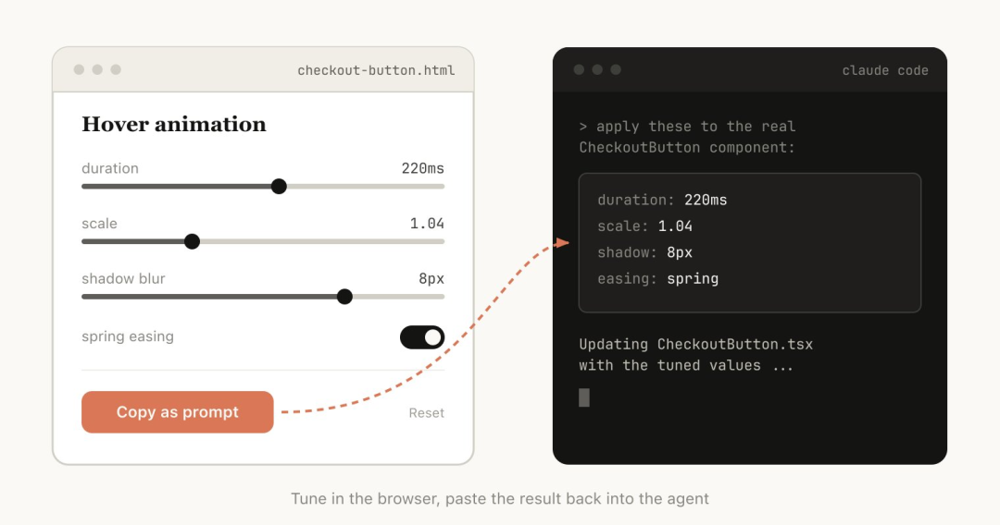
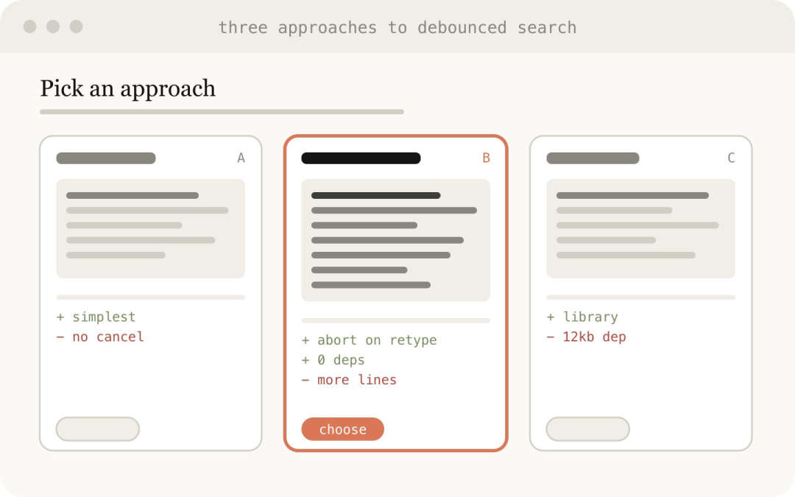

> 原文链接：https://mp.weixin.qq.com/s/ABob0iOml6HiWbyTEcyLtg

# Markdown 统治 AI 输出三年，终于要被自己人推翻：Agent 产出物进入 HTML 时代












起因：2026 年 5 月 8 日，Anthropic Claude Code 团队工程师 Thariq Shihipar 发表长文《Using Claude Code: The Unreasonable Effectiveness of HTML》，并公开了一组配套 demo（thariqs.github.io/html-effectiveness[1]，涵盖 9 类、20 个具体场景），核心主张就是：agent 给人的产出物，应该从 Markdown 切到 HTML。
表面是格式偏好，底下是"agent 跟人交付什么"这个问题。过去两年大家默认 agent 写 Markdown 给人看，原因不复杂：模型写得熟、人读得懂、git 存得下。但 agent 现在一次能吐几千 token 的 spec，要表达 diff、时间轴、颜色、动效这类空间信息，产出还会被人回编辑再喂回去——Markdown 这个"最小公倍数"撑不住了。Thariq 原文里最刺眼的一句话不是"HTML 更美"：他说以前担心自己不仔细读 plan 就会把决策拱手让给 Claude，换成 HTML 以后反而比任何时候都更 in control。载体换一下，控制权就回来了。
下面把原文论点、社区反应（Simon Willison 的 copy.fail 实验、Claude Code 新 /insights 命令直出 HTML 报告）、反向运动（Cloudflare markdown.new）和它对 agent 产品未来的影响串一遍。
一、Markdown 是怎么变成 agent 默认输出的
要看清 Markdown 为什么现在被怀疑，得先回到它当初凭什么赢。Markdown 原本是 John Gruber 给博客作者设计的轻量标记语言，进入 LLM 时代以后阴差阳错击败了 JSON、HTML 和纯文本，坐稳 agent 通信的默认格式。四条原因跟 agent 早期形态深度耦合。
训练分布是最直接的一条。GitHub README、Stack Overflow、技术博客、维基百科导出几乎全是 Markdown 或类 Markdown，模型见得最多写得最熟。给一个新模型 zero-shot 让它输出"结构化报告"，它默认就吐 Markdown。
双向可读是第二条。# 标题、- 列表 这种语法在纯文本里就能看懂，渲染之后又能在 GitHub、Notion、IDE preview 里出格式。同一份产出既能塞回模型上下文（纯文本无损），又能给人读（渲染后体面），HTML 和 JSON 都没这个性质。
早期 agent 的产出本来就线性。Claude/ChatGPT 第一年最常见的输出是"解释一段代码"、"写一份 README"、"列出 5 个建议"，天然是顺序段落加列表。Markdown 的表达力刚好够用，没人觉得不够。
文件系统友好是最后一条。plan.md、notes.md、CLAUDE.md 可以直接 cat 到 prompt 里，可以 git diff，可以终端 grep。Thariq 自己 9 月还在反复强调"Your Agent should use a File System"，那时这个文件系统里装的几乎全是 Markdown。
四条凑在一起，Markdown 成了 agent 圈的"普通话"：Claude Code 的 CLAUDE.md、Cursor 的 rules、OpenAI 的 AGENTS.md、各家 skills 描述、subagent 定义文件全是 Markdown。到 2025 年底，"agent 输出 = Markdown"几乎成了不用论证的前提。
二、Thariq 到底在抱怨什么
Thariq 的 demo 站点列了 9 类、20 个具体场景，挑战的不是 Markdown 本身，而是"用 Markdown 当 agent 唯一输出格式"这个习惯。把他散在 demo 描述和原帖里的论点收拢，核心抱怨可以归到四条物理性的限制上。
2.1 信息密度：空间信息被压成了一维流
Markdown 是一维顺序流，内容只能上下排列。但 agent 现在要产的东西很多是空间信息：diff 有左右两栏、模块依赖是图、设计稿要并排比对、动画要曲线和时间轴。Thariq 在 "Exploration & Planning" 那一类里点得很直白：让 agent 给你三个方案，三栏并排对比和三段顺序排列的 wall of text 是完全不同的认知体验。前者扫一眼就能指着说"我要中间这个"，后者需要在脑子里同时持有三个方案才能比较，工作记忆很快就崩。
同样的问题在 code review 上尤其明显。一个 PR 的核心信息是"哪几行变了、为什么变、影响了哪些调用方"，这是带空间结构的：左右对照的 diff、margin 上的批注、跳到调用点的 jump link。Markdown 只能写成 ```diff 代码块加散文解释，agent 表达力被腰斩，reviewer 的体验也降一档。
2.2 视觉语言缺失：颜色、图、SVG 都得绕道
Markdown 没有原生颜色，没有原生图形。逼出来的画面近乎荒诞：Claude 会用 Unicode 半角块字符画"颜色色板"，用不同灰度的 ■▩▤ 凑出模糊的暗橙和亮橙。Thariq 把这张截图放在文章最显眼的位置，讽刺这种用法是"一个能写 1M token 的模型在用算盘做加法"。换到 HTML，色板就是 <div style="background:#f59e0b">，依赖图就是 SVG <path>，agent 不再需要曲线救国。
这点对设计类 agent 尤其致命。Demo 里的 "Living design system" 把仓库里的 design tokens 拉出来渲染成可点击复制的 swatch 表，"Component variants" 把一个组件的所有 size/state/intent 平铺在一张 sheet 上。这两件事在 Markdown 里物理上做不到，agent 只能写"主色 #f59e0b（暖橙），见 figma 链接"，但人不会真的点进去。
2.3 分发性：Markdown 不能直接打开
这是 Thariq 在原帖里反复强调但容易被忽视的一点。Markdown 不是浏览器原生格式：把 plan.md 发给同事，对方要么在 IDE 里打开，要么扔进 GitHub gist 渲染，要么自己装个 viewer。多一步摩擦就意味着这份文档不会被读完。HTML 不一样，丢到 S3 或 Vercel，一个链接发出去，手机上点开就是响应式布局、目录跳转、可折叠章节。
这个差异在组织内部决策传播时被放大。载体决定了消费深度：HTML plan 人会从头看到尾，Markdown plan 只扫一遍标题，这才是原文"in control"那句话的地基。
2.4 单向消费：Markdown 不能反向写回
最有想象力的一类 demo 是 "Custom Editing Interfaces"：agent 临时给你做一个 ticket triage 看板（拖三十张卡片到 Now/Next/Later/Cut 四列）、一个 feature flag 编辑器（开关、依赖检查、复制 diff）、一个 prompt tuner（左边模板右边样例实时渲染）。这些都是一次性 UI：agent 产出，你用一两次解决一个具体问题，最后点 export 把状态拷回 agent 继续后面的步骤。
Markdown 在这个回路里是断裂的。agent 能写 MD，但用户没法在 MD 上"操作"，更没法把操作结果结构化地拷回去。HTML 加一点 JS 直接闭环。这把 agent 的 affordance 从"读写文档"扩到了"生成可操作的临时软件"，是这场格式之争里最有杠杆的一条。
三、Markdown vs HTML 的真问题：输入还是输出？
把 Thariq 的论点放在更大的 context 里看，会发现这个领域同时存在两股方向相反的力，理清楚了才不会混淆。
一边是 Cloudflare 在 2026 年 2 月推的 markdown.new[2]：在任何 URL 前加 markdown.new/ 就把页面 HTML 转成 Markdown 喂给 LLM。这不是实验性 demo——Cloudflare 的后台已经在 Pro/Business 级被作为商用能力上线，Claude Code 和 OpenCode 官方客户端目前就会在请求头里带 Accept: text/markdown。官方实测数据比较残酷：
页面
HTML token
Markdown token
节省
Cloudflare 官方博客一篇
16,180
3,150
80%
Reddit 帖子
~47,000
~3,400
93%
技术博客文章
~187,000
~4,900
97%
简单的 ## About Us
12–15
3
75–80%
另一边就是 Thariq：让 agent 把 HTML 作为给人看的产出物。
表面上这两件事矛盾，实际上是同一件事的两个侧面。两者都在反对"Markdown 包打天下"这个偷懒假设，区分的是数据流向：
方向
主语
受众
优胜格式
核心诉求
Web → LLM
网页内容
模型上下文
Markdown
token 效率、语义保留、去除装饰噪声
LLM → Human
Agent 产出
人类决策者
HTML
视觉密度、可分发、可交互
LLM → LLM
Subagent 输出
父 agent
Markdown / JSON
可被再次塞进 prompt、易解析
Human → LLM
用户输入
模型上下文
Markdown / 纯文本
写起来快、便携
之前的"all Markdown"其实是把四种链路混在一起用同一个格式凑合。系统成熟之后，每条链路开始挑自己最优的格式：HTML 在 LLM→Human 这条链路上的崛起，是 agent 产品从"模型为中心"向"人机协作为中心"转的一个副产品。
四、为什么是现在切？三个底层条件成熟了
Markdown 用了快三年没出问题，HTML 也不是新东西，为什么 2026 年初这个迁移才开始发生？三个前提条件最近才同时凑齐。
模型生成 HTML 的能力跨过了实用线。一年前让 Claude 生成一个能直接打开的复杂 HTML 页面，大概率是 broken layout、缺 CSS、JS 报错。Sonnet 3.5/4 之后，agent 一次性产出几百行能跑的 HTML+Tailwind+vanilla JS 已经是基本盘。Thariq demo 站里那些组件是 Claude 直接吐出来的，不是手写的，这个产能本身就是 2025 年下半年才稳定的能力。
Artifacts 和 Canvas 把 HTML 渲染从 hack 带入了产品形态。Claude Artifacts 在 2026 年 4 月加了 Live Artifacts（可以连 MCP 实时刷数据）和 Embed 按钮，ChatGPT Canvas 也支持 React/HTML 实时预览。用户不再需要"agent 给我一个 HTML 文件 → 我自己存盘 → 我用浏览器打开"，直接在对话窗口里渲染、点击、调试。HTML 从"产出物"变成了"对话原语"，门槛塌了。
Token 价格和上下文窗口让 HTML 的"贵 2-4 倍"不再致命。Thariq 自己承认 HTML 比 Markdown 慢 2-4 倍、token 多。但 Sonnet 4 价格比一年前的 Opus 3 便宜了一个数量级，1M 上下文也成了标配，生成一份 HTML plan 多花的几千 token 不再是 deal-breaker。这是经济侧的允许条件。
这三个条件同时满足，"用 HTML 当默认产出"才从单点尝试变成可普及的实践。Thariq 的 demo 站之所以现在能引爆讨论，是因为他展示的不是一个孤立技巧，而是这三个前提交汇之后立刻能用的一组成熟模式。
4.4 内部现场证据：Claude Code 团队的群体偏移
如果只看 Thariq 单人的长文，容易把这当成单个业务线工程师的心得体会。但三条旁证凑在一起看，会发现这已经是 Claude Code 团队的群体偏移，而且在向产品层渗透。
第一条是 Thariq 自己的原话。他在文章里写得很直接——我也越来越多地看到 Claude Code 团队里其他人也在这么做——而且产品层跟着买单了。Anthropic 在 11 月发的 frontend-design plugin 是一个令 Claude 产出高质量 HTML 的官方 skill；Claude Code 近期的 /insights 内置命令直接生成交互式 HTML 报告，分析过去 30 天的会话历史后产出带图表、可点击的活动报告。一句礼貌性引用作不了这种二阶改动。
第二条是 Simon Willison 的当晚实验。他把最近披露的 Linux copy.fail 漏洞的混淆 Python PoC 抓下来，直接跑一句提示词：
curl https://copy.fail/exp | llm -m gpt-5.5 -s 'Explain this code in detail. \  Reformat it, expand out any confusing bits and go deep into what it does and how it works. \  Output HTML, neatly styled and using capabilities of HTML and CSS and JavaScript \  to make the explanation rich and interactive and as clear as possible'
他得到的是一份暗色主题技术文档，带颜色编码的严重等级、并排比对表、警告区块。他的评价是："自 GPT-4 时代起我一直默认要 Markdown，这篇文章让我重新考虑这件事——尤其是输出端。"这是业内核心意见领袖公开改口。
第三条是数据的 feedback loop。Thariq 自己文章里的配图就是他让 Claude Code 扫本地仓库、把自己之前生成的所有 HTML 文件按类别统计后产出的：他自己电脑里已经囤积了足够多到能分类统计的 HTML 产出物，这是一个已经用了几个月的工作流回看，不是试手。
HTML 在 Anthropic 内部已经走完了"个人尝试→团队常规→产品默认"的三步迁徙；外部的 LLM CLI 生态（Simon Willison 的 llm 工具）也在直接验证它对非 Claude 模型依然成立。这不是单个公司的审美偏好，是正在发生的行业偏移。
五、不是所有场景都该切：Markdown 仍然赢的地方
把 Thariq 的论点过度推广就会犯第二种错误：agent 产出全改 HTML。至少有三种场景 Markdown 在短期内仍然占优。
第一种是 agent 之间的通信。subagent 把研究结果给父 agent，关键在于这份结果要被再次塞回 prompt 继续推理。HTML 的 <div class="..."> 全是无意义噪声，模型解析出来还得再 strip 一遍。Markdown 的标题、列表、代码块对模型来说就是直接可用的语义信号。Anthropic 自己的 Deep Research demo 里 researcher subagent 写的就是 research_notes/*.md，不是 HTML。
第二种是配置和指令文件。CLAUDE.md、AGENTS.md、skills 的 SKILL.md、subagent 定义文件——这些是给模型读的"程序"，要的是写起来快、diff 干净、人能 review。HTML 在这里没任何收益，只有 verbose 的代价。Thariq 自己也没提过要把 CLAUDE.md 改成 HTML。
第三种是版本控制和 long-form 文档。一份会被反复编辑的技术 RFC、一个长期维护的 wiki，Markdown 在 git diff 里读得很顺，HTML 的 diff 几乎没法 review。Thariq 也明确承认 HTML 在版本控制里 diff 很复杂。文档生命周期超过一周、需要多人迭代时，Markdown 仍然占优。
一个简单的判断方法：这份产出物接下来会被喂回模型，还是给人做一次性决策？前者继续 Markdown，后者考虑 HTML。
六、对未来 agent 产品的五个具体影响
格式只是表象，背后是 agent 产品形态的转向。可以直接推的二阶影响有五条。
6.1 "产出物"会从文档变成临时软件
最深远的变化是 agent 输出物的计算性在抬升。一份 plan 不再是"读完决定"，而是"和它互动得到决定"：slider 调动画时长、checkbox 选模块、按钮 export diff。Thariq 的 prompt tuner、feature flag editor、ticket triage board 是这条路径上最早的样本。
这把 agent 产品和 SaaS 的边界搅浑了。以前你要 Linear 管 ticket，现在 agent 可以临时给你生成一个专门处理这次 sprint planning 的一次性看板。vertical SaaS 的一部分护城河——"我们提供专属 UI"——会被 agent 即时产出的 throwaway UI 蚕食。受冲击最大的是那些功能少、UI 重的 PM 和协作类工具。
6.2 Artifacts 通道会成为 agent 产品的核心战场
HTML 如果成为新的输出格式，那么在哪里渲染、怎么和文件系统/MCP 联动、能不能被嵌回 prompt 就是产品差异化的关键。Claude Artifacts 已经接 MCP 实时刷数据，ChatGPT Canvas 支持双向编辑，这两家都会继续往"artifact 是 first-class object"的方向砸资源。
对 Cursor、Cline、OpenCode 这种代码 agent，问题更尖锐：它们目前几乎没有非代码的产出渲染通道。一份 PR review 报告生成出来还是塞在 chat 里以 Markdown 渲染。假如 Claude Code 的 PR review HTML 直接 publish 到一个分享链接，竞品的体验落差会在 review、plan、status 这些非编码场景里被迅速感知。agent 不只写代码，它还得交付决策载体——这是 IDE 派 agent 接下来要补的一课。
6.3 文件系统的内容结构会异质化
Thariq 9 月还在说 "agent 应该用文件系统"，那时大家假设的是 notes/*.md 和 plans/*.md。HTML 转向之后，文件系统会变成异构产物的容器：plans/2026-q2.html、reviews/PR-1234.html、tools/triage-board.html，和传统的 memory/*.md、journal/*.md 并排存在。
这给 agent harness 提了新需求：何时写 MD、何时写 HTML 要有规则；怎么 index 一份 HTML 产物好让未来的 agent 还能找到，也需要设计。Cloudflare 的 toMarkdown() 反向链路在这里浮现出价值——要把一份历史 HTML plan 喂回模型 context，就得原地转一份 Markdown 摘要。产出 HTML、消费 Markdown 会成为成熟 agent 系统的双链路标配。
6.4 Skills / Plugin 生态会出现 "frontend skill" 类目
Anthropic 在 11 月发的 frontend-design plugin 是个先声——它本质上是一组让 Claude 输出更好看 HTML 的 skill。可以预期接下来一年会出现一批专门面向"HTML 产出"的 skill：design-system 渲染器、PR review HTML 模板、status report 模板、incident timeline 模板。
这些 skill 的价值不在代码量，而在于约束 agent 用一致的视觉语言。一家公司接入自己的 PR review HTML skill 之后，所有 agent 产出的 review 长一个样、有相同的章节结构和色卡——这是 Markdown 时代很难做到的品牌一致性。skill 市场会从今天的"提示词集合"演化成"产出物模板集合"。
6.5 评测和数据集要重新设计
绝大多数 agent benchmark（SWE-bench、Terminal-Bench、各种 coding eval）评的都是"代码或 Markdown 文本是否正确"。agent 产出物变成 HTML 临时软件之后，评测对象变成了这个 UI 能不能用、是否承载了正确信息、是否帮用户更快做决策。评测方法从字符串匹配切到端到端可用性测试，这是一道现成工具都对不上的裂口。
短期的 hack 是 LLM-as-judge 直接看 HTML 截图打分；中期可能需要类似 web testing 框架的 agent 输出测试器。这是当前评测体系的盲区，谁先把评测做出来，谁就握住了下一代 agent 产品的优化方向盘。
七、总结
把这次 Markdown 到 HTML 的迁移放在更长的时间尺度上看，它不是格式层的优化，而是 agent 产品形态的一次转弯：从对话框里的写作助手，转向能交付任意计算性载体的协作者。Markdown 是上一个时代的产物，那时 agent 的主要工作就是把模型脑子里的内容线性吐出来给人读。HTML 是下一个时代的入场券，agent 开始具备生成一次性软件的产能，人机交互不再被对话窗口的形态束住。
有两个常见的误读要避开。一是以为要 all-in HTML，实际上 agent 之间的通信、配置文件、long-form 文档依然是 Markdown 的主场，这次迁移是分裂式的，不是全替代。二是以为 HTML 自己赢了，真正赢的是"按数据流向选格式"这个方法论，HTML 只是这个方法论在 agent → 人这段链路上的当前最优解；Cloudflare 在 web → agent 那段把 HTML 反向打回 Markdown 用的是同一套原理。
对产品方的具体动作也因此变得清晰：把 agent 的产出通道拆成喂模型的和给人看的两路，前者继续 Markdown 优化 token 经济，后者认真做 HTML artifact 的渲染、分发和回流。这不是补课，而是新地基。能把这个分层做对的产品，会在 2026 下半年到 2027 年的 agent 体验竞争里占明显优势。
参考资料
•Thariq Shihipar，Using Claude Code: The Unreasonable Effectiveness of HTML（原推，2026-05-08）：https://x.com/trq212/status/2052809885763747935•Thariq Shihipar，The unreasonable effectiveness of HTML — examples（demo 站，9 类 20 个实例）：https://thariqs.github.io/html-effectiveness/•宝玉翻译版中文全文（带原图）：https://baoyu.io/translations/2026-05-08/trq212-status-2052809885763747935•Simon Willison，Using Claude Code: The Unreasonable Effectiveness of HTML（link blog + copy.fail 实验）：https://simonwillison.net/2026/May/8/unreasonable-effectiveness-of-html/•虎嗅 · 硅星 GenAI，Claude Code 工程师：HTML 是新的 Markdown：https://www.huxiu.com/article/4856923.html•鏈新聞 ABMedia，Anthropic 工程師：HTML 才是 Claude Code 最佳輸出格式：https://abmedia.io/anthropic-engineer-html-claude-code-output-format-may-2026•Cloudflare，Introducing Markdown for Agents（反向链路：HTML → Markdown，含官方 token 压缩数据）：https://blog.cloudflare.com/markdown-for-agents/•Cloudflare Docs，Markdown for Agents 配置规范：https://developers.cloudflare.com/fundamentals/reference/markdown-for-agents/•markdown.new 转换站点（用于任意 URL）：https://markdown.new/•BlockSimplified 实测：Stop Feeding HTML to LLMs - markdown.new：https://blocksimplified.com/blog/stop-feeding-html-to-llms-markdown-new•Claude /insights 命令说明与迷你报告：https://angelo-lima.fr/en/claude-code-insights-command/•Claude /insights 实测（Medium）：https://medium.com/@joe.njenga/i-tested-claude-code-insights-it-roasted-my-coding-habits-e38c642e1642•Claude Live Artifacts 状态与交互指南（2026）：https://www.eigent.ai/blog/claude-live-artifacts-guide•ChatGPT Canvas HTML/React 渲染更新：https://the-decoder.com/openais-chatgpt-gets-a-major-canvas-upgrade-with-html-and-react-code-rendering/•Anthropic frontend-design plugin（HTML 产出 skill 先声）：https://github.com/anthropics/claude-code-plugins•Thariq Your Agent should use a File System（2025-09，前 HTML 阶段的文件系统主张）：https://threadreaderapp.com/user/trq212