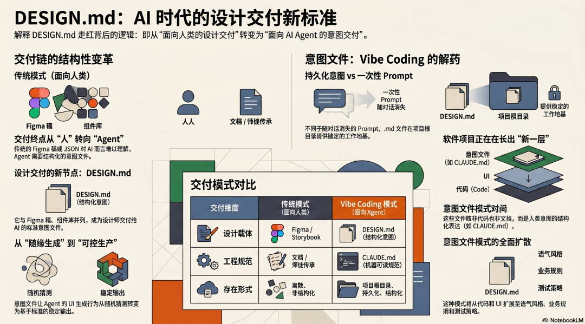

> 原文链接：https://mp.weixin.qq.com/s/lOBRx_KgOBo_kqD05c5Jsw

# Vibe Coding 时代，每个项目都需要「意图文件」

VoltAgent 把 55 个品牌的设计风格整理成 DESIGN.md 文件，发了一个开源库。三天，star 数过万，现在七万多，还在涨。
这个数字本身就是一个信号，不是因为这个库做了什么特别复杂的事，相反，它做的事极其简单——把已有的设计系统翻译成 Markdown 文件，仅此而已。它爆火，说明大量开发者正在用 AI 写 UI，且都卡在同一个地方：没有一个标准的方式，把设计意图传给 Agent。
这个缺口，比想象中更普遍，也更重要。
1. 一个新的交付物正在出现
设计师的工作产出，过去二十年基本没变：出设计稿（Figma），写组件文档（Storybook），导出设计 Token（JSON）。这套流程的终点是人类工程师——他们读 Figma、读文档、照着实现。
现在终点变了，越来越多的 UI 是由 AI Coding Agent 直接生成的，而 Agent 读不好 Figma，对 JSON Token 只知其值不知其意，文档又太长太散。
DESIGN.md 的出现填上了这个空缺，也意味着设计交付链上正在长出一个新节点：一份专门写给 Agent 看的意图文件，和 Figma 稿、组件库并列，成为设计师的标准产出之一。
这不是工具升级，是工作流在结构性地变化。谁来写这个文件、怎么版本管理、设计改了怎么同步——这一套问题现在还没有标准答案，但已经在每个用 Vibe Coding 搭产品的团队里真实地发生了。
2. DESIGN.md 不是孤例
往后退一步，会发现 DESIGN.md 不是个案，而是一个更大模式的局部。
你的项目根目录里，可能已经有一个 CLAUDE.md。它告诉 Claude Code 这个代码库的规范：用什么语言、遵循什么架构约定、哪些文件不要动、提交信息怎么写。每次 Agent 开始工作前，先读这个文件，行为就会稳定、符合预期。
DESIGN.md 做的是同一件事，只不过管的是 UI 风格而不是代码行为。
两个文件，同一个逻辑：把人类的意图，编码进一个持久化文件，让 Agent 每次工作前都能读到。
这个模式正在扩散，代码规范有 CLAUDE.md，UI 风格有 DESIGN.md，往后很可能还会有更多：产品语气和文案风格（VOICE.md）、数据模型和业务规则（DOMAIN.md）、测试策略和质量标准……凡是"人类知道但 Agent 不知道"的东西，都需要一个对应的文件来传递。
这类文件有一个共同的特征：它们不是代码，不是配置，不是文档——它们是给 Agent 的工作上下文，是人类意图的结构化表达，是软件项目里正在长出来的新一层。
3. 意图文件，是 Vibe Coding 混乱的真正解药
为什么让 AI 写的页面每次风格都不一样？
表面答案是"没有设计规范"，但更根本的原因是：Vibe Coding 的工作流里，人类的意图没有一个稳定的存放地点。
每次对话都是新的开始，上一次你告诉 Agent 的风格偏好、设计判断、边界约定，下一次全部消失。你把意图放在 prompt 里，但 prompt 是一次性的，上下文窗口关了就没了。
意图文件解决的正是这个问题。它是持久的，不随对话消亡；它是结构化的，Agent 能高效读取；它是人类维护的，所以它传递的是真正的意图，而不是 Agent 的猜测。
DESIGN.md 让设计意图持久化，CLAUDE.md 让工程意图持久化。这两个文件放在项目根目录里，构成了 Agent 工作的稳定地基——不是靠更聪明的模型，而是靠更好的上下文设计。
这是 Vibe Coding 从「随缘出活」走向「可控生产」的关键一步。
Vibe Coding 带来的设计混乱，不是 AI 能力的问题，是人和 Agent 之间的协作语言还没建立。DESIGN.md 是这套语言在 UI 领域的第一个标准化答案，但它只是开始。