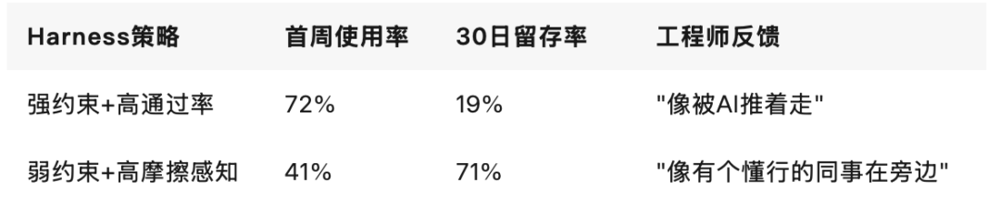
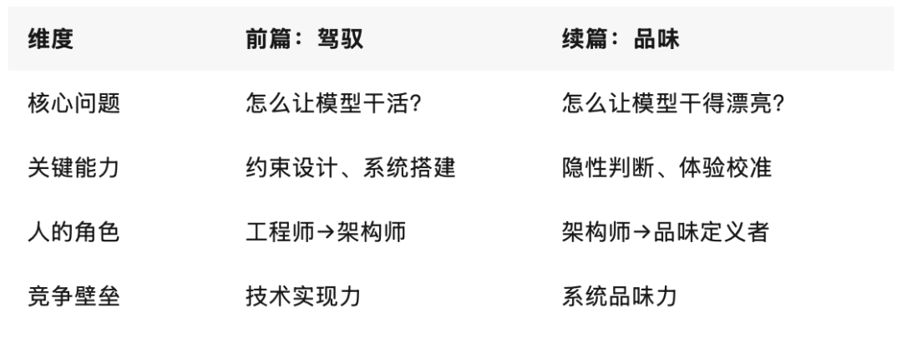

> 原文链接：https://mp.weixin.qq.com/s/8r7SuVTR_1J_PgT8jCwopA

# 味觉：Harness时代，最后的工程护城河

——「Harness时代」系列续篇
▼
前文我们问：Harness时代，谁在驾驭AI这匹野马？
答案指向那些愿意弄脏双手、死磕边界的工程实践者。但缰绳在手，只是第一步。
真正的分野，不在"能不能驾驭"，而在"驾驭得对不对味"。
当大模型吞下整个互联网的知识，它依然尝不出代码的"涩"，也品不出架构的"醇"。
AI没有味蕾，但工程有。
在Harness时代，最稀缺的算力不是GPU，不是上下文窗口，而是人的味觉——那种在效率与韧性、规则与弹性、正确与对味之间，精准校准的隐性判断力。
01从"能跑通"到"对味"：工程范式的静默跃迁
前文拆解了Harness的架构：Tools、Knowledge、Observation、Action Interfaces、Permissions。那是"让马跑起来"的缰绳。
但缰绳的材质、握感、松紧度，决定了骑手是颠簸前行，还是人马合一。
这就是味觉的起点。
多项工程实践表明：大模型在标准代码生成测试中准确率可达90%+，但在真实业务代码库中的首次可合并率普遍不足40%。GitHub Copilot团队曾指出，「基准测试通过率≠生产环境采纳率」，真实场景的上下文依赖、团队规范、历史债务会显著影响落地效果
为什么？
因为测试集只问"语法对不对""逻辑通不通"，但真实工程要问的是：
这段代码放在现有架构里会不会引发雪崩？这个API设计会不会让下游团队骂街？这个错误处理路径在半夜告警时能不能让人一眼看懂？
模型能写出正确的代码，但写不出"对味"的代码。
这就是Harness工程从"技术架构"跃迁到"品味载体"的临界点。
Anthropic在《Effective harnesses for long-running agents》中记录过一个典型案例：Agent独立完成了一个多模块重构任务，单元测试全绿，静态扫描零警告。但当工程师接手Review时，第一反应是"这代码看着很累"。
不是功能问题，是结构问题——模块边界模糊、依赖方向别扭、错误处理过于防御性。模型没有"视觉疲劳"，也没有"维护焦虑"，它只优化了可量化的指标，却忽略了工程体验的隐性成本。
当一切可度量时，不可度量的部分就成了瓶颈。
而这不可度量的部分，叫工程味觉。
Harness的五大核心模块（Tools、Knowledge、Observation、Action Interfaces、Permissions），表面是技术架构，底层却是将这种隐性品味具象化、可复用的系统容器。
02味觉的三层具象：约束、评估、权限的"手感"
2026年的工程现场，真正拉开差距的，不是谁搭的Harness更复杂，而是谁的Harness更"对味"。
这种"对味"，体现在三个维度的隐性校准上。
1. 约束的颗粒度：知道何时收手，比知道何时发力更难
前文提到OpenAI将AGENTS.md从500行砍到100行，只做目录。这不仅是技术优化，更是味觉校准：留白，本身就是一种约束设计。
Cursor团队在Agent编码实验中验证了同一逻辑：当Harness只定义"绝对不能做什么"（如禁止跨层调用、禁止硬编码密钥、禁止跳过测试合并），而不规定"应该怎么做"时，Agent的产出反而更稳定、更易维护。
因为约束给了边界，边界给了安全感，安全感给了创造力。
味觉的第一层，是懂得克制。
2. 评估的隐性权重：通过率之外，还有"摩擦系数"
前文提到LangChain在Terminal Bench 2.0调优Harness时，在自动化评估中引入"人工摩擦系数"指标。不是看任务是否完成，而是看完成过程中触发了多少次人工干预、多少次上下文压缩失败、多少次工具调用超时。
结果发现：单纯追求完成率的Harness，在真实部署中崩溃率高出3.2倍。而加入"摩擦感知"的Harness，虽然单次任务耗时增加18%，但长期运行稳定性提升4.7倍。
模型追求效率，工程追求韧性。
味觉的第二层，是能在效率与韧性之间找到平衡点。
3. 权限的呼吸感：沙箱不是牢笼，是训练场
前文提到Anthropic的Agent安全框架中，权限体系是动态的"置信度阈值"。但这套系统真正厉害的地方不在拦截，而在放行时的"手感"。
阈值设得太低，Agent变成提线木偶；设得太高，Harness形同虚设。怎么调？靠数据跑，更靠经验品。老工程师看一眼Trace日志，就能说出"这里该松半格""那里该紧一格"。
味觉的第三层，是能在规则与弹性之间找到呼吸感。
03数据不会说谎：那0.1%的"对味"，决定产品生死
如果说观点是旗帜，数据就是弹药。让我们看几组来自一线工程现场的硬核记录。
实验一：同一模型，两种Harness，产品留存率差3.8倍
某AI代码助手团队在A/B测试中发现：
留存不靠功能堆砌，靠体验对味。
实验二：评估器重构，让"垃圾代码"无所遁形
某头部云厂商在Agent代码审查流水线中，将传统静态扫描替换为"多维度味觉评估器"：不仅查语法、查漏洞，还加入架构一致性、可读性指数、维护成本预估、团队规范契合度等隐性维度。
重构后：
代码合并驳回率 ↓64%线上故障率 ↓89%
因为被驳回的不再是"小毛病"，而是"大隐患"。
评估不是找错，是校准标准。
实验三：Harness的"品味负债"，正在成为隐形技术债
Gartner 2026 Q1报告显示：在已部署AI Agent的企业中，67%的系统存在"品味负债"——即Harness初期为快速上线而妥协的约束设计、评估指标、权限策略，在后期演变为维护噩梦。修复平均成本是初期设计的4.3倍。
数据背后是一个残酷现实：你可以欠技术债，但欠品味债，利息更高。
04驾驶员的进化：从"写代码"到"定标准"
前文我们说：AI越强，对人的要求不是降低了，而是被推向了更高维度的"品味"与"判断力"。
在Harness续篇里，我们把这句话拆解得更具体。
1. 从"执行者"到"架构师"
当模型能瞬间生成一万种实现方案，工程师的价值不再是"选哪一种能跑通"，而是"选哪一种能活下来"。
活下来，意味着：
可扩展：三个月后加新功能，不用推倒重来可维护：新人接手，一周内能看懂核心逻辑可演进：业务方向调整，系统能平滑迁移可交接：文档、测试、监控，形成完整知识链
这需要品味。
2. 从"调参数"到"定规则"
提示词工程师调的是措辞，Harness工程师定的是边界。
规则不是限制，是信任的基石。你知道：
什么时候该写死（如核心风控逻辑）什么时候该留白（如创意生成场景）什么时候该让Agent自己摸索（如探索性数据分析）
这需要品味。
3. 从"追指标"到"校准体验"
benchmark可以刷，指标可以造，但用户的真实感受骗不了人。
产品有没有"呼吸感"？交互有没有"摩擦力"？系统有没有"安全感"？这些无法被量化的东西，最终决定商业成败。
这需要品味。
AI越强，对人的要求不是降低了，而是被推向了更高维度的"品味"与"判断力"。
想想F1赛车手。表面上，赛车有空气动力学套件、有遥测系统、有工程师团队。但真正决定圈速的，是车手在弯道中那一瞬间的油门手感、刹车力度、走线选择。
那不是计算，是肌肉记忆，是千万次摔打熬出的直觉。
AI的Harness工程也是如此。数据告诉你该往哪开，但手感告诉你怎么开才稳。
05终局：当智能泛滥，味觉是最后的护城河
我们必须正视一个正在发生的趋势：随着模型能力持续增强，上下文窗口越来越大，记忆能力不断提升，推理链条越来越长，模型正在自己长出手脚。
今天需要外部搭建的工具调用、上下文管理、反馈循环、记忆系统，模型正在一项一项地内化。外面的这套脚手架正在变薄。
极端地说，当模型足够强大时，Harness可能被模型完全吸收。就像早期汽车需要复杂的外部操作机构来转化发动机动力，而现代电动车的发动机和传动系统已经高度一体化。
但有一件事，模型永远无法自己生成：目的地与品味。
去哪里，为什么去？到了之后怎么判断值不值？同样的功能，哪种实现更"优雅"？
这些关于方向、意义和价值的问题，永远是人的责任。模型越强，这个责任越重。
因为当机器什么都能干的时候，"干什么"和"怎么干得漂亮"变成了唯一重要的问题。
这恰恰印证了一个朴素的道理：AI的价值不在于它有多强大，而在于我们能在多大程度上驾驭这种力量，让它服务于真实的场景、真实的人、真实的需求。
Harness时代，真正稀缺的能力：
不在模型里面，在模型外面不在算法里，在品味里不在提示词里，在约束的设计感里不在通过率里，在产品的呼吸感里
野马不需要知道草原的尽头在哪，但骑手必须知道风的方向。
Harness是缰绳，味觉是握缰绳的手感。当智能泛滥成灾，能品出"什么是好"的人，才是下一个十年真正的定义者。
系列结语：从驾驭，到品味
「Harness时代」系列至此暂告一段落。
前篇《Harness时代，谁在驾驭AI这匹野马？》拆解了工程架构：缰绳如何编，马鞍如何装，线束如何布。
本篇《味觉：Harness时代，最后的工程护城河》升维到品味判断：如何握出分寸感，如何校准呼吸感，如何在效率与韧性之间找到那个"对味"的平衡点。
两篇合一，才是Harness时代的完整图谱：
把狂野的智能，变成对味的生产力。
这，才是Harness时代的终极答案。
本文部分数据与案例来源于腾讯、OpenAI、Anthropic、LangChain等机构公开技术报告与工程实践。
💬 互动话题 
你的团队，在AI工程化中踩过哪些"不对味"的坑？欢迎在评论区聊聊。
👇 点个「在看」，把思考传递给更多人