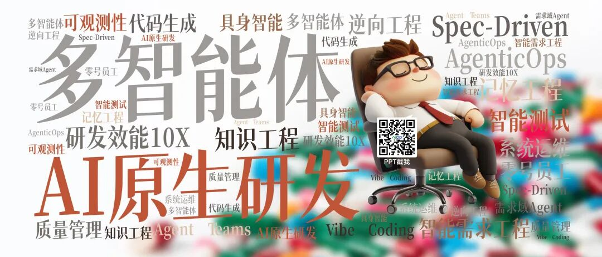
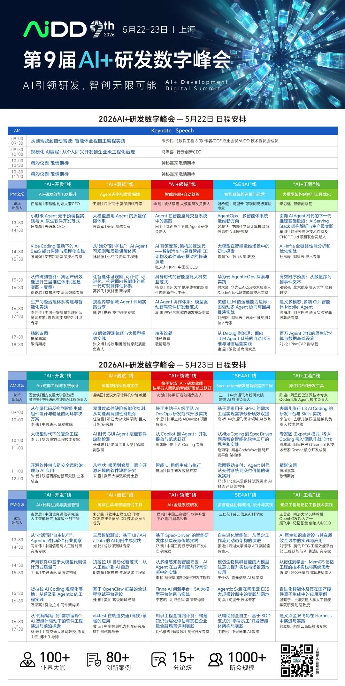

> 原文链接：https://mp.weixin.qq.com/s/h966EM6t5JB5B5nYiSfkOg

# 资深软件工程师可以被“蒸馏”出来吗？

▼
最近科技圈流行一个让人后背发凉的词：“职场蒸馏”。
在AI 领域，“模型蒸馏”是指把千亿参数大模型（如GPT-4）的推理能力，提取并压缩到一个极小、极便宜的小模型里。而现在，这套逻辑被搬到了职场——管理层或野心勃勃的新人，试图收集资深员工的聊天记录、文档和周报，将其打包成一个“AI 技能（Skill）”或“专属智能体（Agent）”。
在软件研发行业，这个充满诱惑力的资本梦想被具象化为：我们能不能把年薪百万的资深架构师（Senior/Staff Engineer）的脑子提取出来，变成一个月租20 美元的超级Copilot？
如果结合最近在OpenClaw、OpenCode 这种能“全程自主生成与验证代码”的智能体上的突破来看，这个梦想似乎近在咫尺。但在狂欢之下，软件工程的真实前线正在上演一场荒诞的拉锯战。
01白天：菜鸟与AI 的“代码库投毒”狂欢
在《这届打工人》的报告中，员工通过向AI 喂垃圾数据来“投毒”对抗企业。而在研发团队里，方向恰恰相反：是缺乏经验的开发者，正拿着AI 生成的垃圾，向公司的核心代码库“投毒”。
不可否认，AI让初级程序员拥有了“幻觉般”的10 倍生产力。只需敲下几行注释，Copilot 就能瞬间吐出上百行看起来极其优雅的模板代码。年轻人兴奋地提交了Pull Request（PR），按时下班。
但这些代码往往是致命的。它们缺乏对历史遗留系统（Legacy Code）的敬畏，没有考虑极端的并发边界条件，甚至悄悄引入了已经被弃用的不安全第三方库。
灾难没有爆发，是因为有人在负重前行。
那个被迫在深夜逐行Review 这些“AI 排泄物”的人，正是资深工程师。他们从过去“指导菜鸟写代码”的导师，沦为了“AI 幻觉代码的专职清洁工”。这是一种巨大的心智折磨：阅读并理解一段由机器生成的、看似合理实则荒谬的逻辑，比自己重头写一遍还要痛苦十倍。
02晚上：试图“蒸馏”架构师的暗网行动
看着资深工程师深陷Code Review 的泥潭成为团队的瓶颈，管理层抛出了那个终极杀器：既然智能体（Agent）已经能自主写代码、看报错、跑测试（如OpenCode 的闭环实践），那我们把资深工程师“蒸馏”成一个Code Reviewer Agent 不就行了？
行动开始了。资深工程师过去五年写过的架构设计文档（RFC）、合并过的5000 个PR 记录、在Slack 里每一次排查线上P0 级故障的聊天日志，统统被喂进了大模型的上下文窗口，试图炼化出一个拥有他“技术心智”的数字克隆体。
在简单的业务逻辑和代码规范检查上，这个“被蒸馏的架构师”表现得异常出色。它能在一秒内指出变量命名不规范，能发现潜在的空指针异常，甚至能自动跑通单元测试。
管理层狂喜：我们是不是不再需要昂贵的资深工程师了？
03无法被蒸馏的“暗物质”：上下文与伤疤
答案是残酷的：你能蒸馏一个人的语法记忆和手速，但你永远无法蒸馏他的“伤疤”。
一个资深软件工程师之所以“资深”，其核心价值根本不在于“写代码”（这恰恰是AI 最擅长的部分），而在于那些无法被文本化的“职场暗物质”：
1.拒绝的艺术（Context Engineering 的最高境界）AI 拥有致命的“讨好型人格”。如果你让AI 去实现一个极其愚蠢、与现有架构完全冲突的产品需求，它会极其努力地为你写出5000 行复杂的代码来实现它。 但资深工程师看到这个需求的第一反应是走向产品经理的工位：“这个需求是伪需求，现有的模块稍微改改就能满足用户，不用重写。” AI 创造代码，而资深工程师消灭代码。这种跨越技术与业务的“系统级上下文”判断，无法被蒸馏。
2.隐性知识（Tacit Knowledge）的直觉凌晨三点，数据库出现诡异的死锁。监控日志一片混乱。资深工程师扫了一眼，直觉告诉他：“这是因为四年前前任CTO 坚持用的一种奇葩事务隔离级别，在流量峰值时遇到了目前的缓存击穿。” 这种直觉，是真金白银的线上事故喂出来的，它存在于代码之外，存在于对团队历史、对甚至“某某前同事写代码的糟糕习惯”的深刻理解中。
3. “恰到好处”的上下文投喂者正如我们在《上下文工程的第一性原理》中所探讨的，多智能体（Multi-Agent）系统要正常运转，必须有人为它们提供“恰到好处”的上下文。而在这个架构中，资深工程师就是那个至关重要的“上下文路由器”。他们负责切分任务、界定边界、梳理模块间的契约，然后把纯净的、高信噪比的信息喂给AI，防止AI 在庞大的系统里迷失。
04终局：从代码机器，到“驾驭工程”的执剑人
资深工程师会被“蒸馏”吗？
不，他们只会被“提纯”。
当OpenClaw 等工具彻底打通了“代码生成-> 执行-> 报错-> 修改”的微观闭环后，初中级程序员那种仅仅依靠“把业务逻辑翻译成机器语言”的技能，确实会被无情地蒸馏掉。
但这反而解放了真正的资深工程师。他们将彻底告别增删改查（CRUD）和繁琐的语法纠错，他们的职位或许会从Software Engineer 变成 Agent Architect（智能体架构师）。
在未来的研发流水线中，他们的日常不再是敲击键盘，而是坐在“驾驭工程（Harness Engineering）”的指挥中心：左手维护着企业级的长期业务上下文图谱，右手监控着数十个自动编程智能体的工作流。
如果说，这届打工人在用投毒和蒸馏进行着一场注定无效的零和博弈；那么真正的资深技术人早已明白——在AI时代，你的价值不再取决于你能以多快的速度输出代码，而取决于你对这个复杂世界，拥有多深度的“上下文掌控力”。
下一站
能力可以靠算法迭代，治理必须靠人来填补。这正是AiDD峰会连续多年坚持的底层逻辑：不追逐短期技术幻觉，只聚焦数智化人才的系统性培育与AI+研发创新的范式重构。面对能力与治理的结构性错位，我们需要从“工具管控”转向“能力建构”，从“单点采购”转向“价值设计”，从“技术崇拜”转向“组织进化”。
欢迎来 AiDD ，一起成为这场范式重构的参与者与制定者，一起定义 AI 时代的技术领导力。
👇 点个「在看」，把工程清醒传递给更多同行人