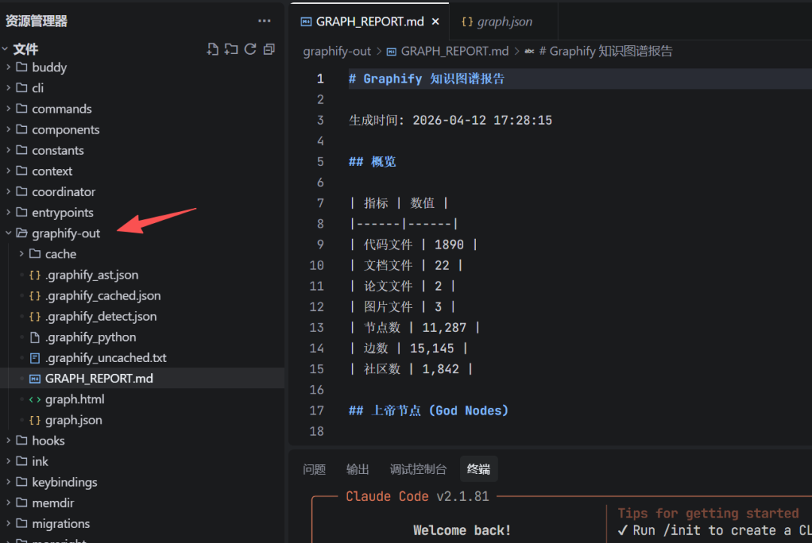
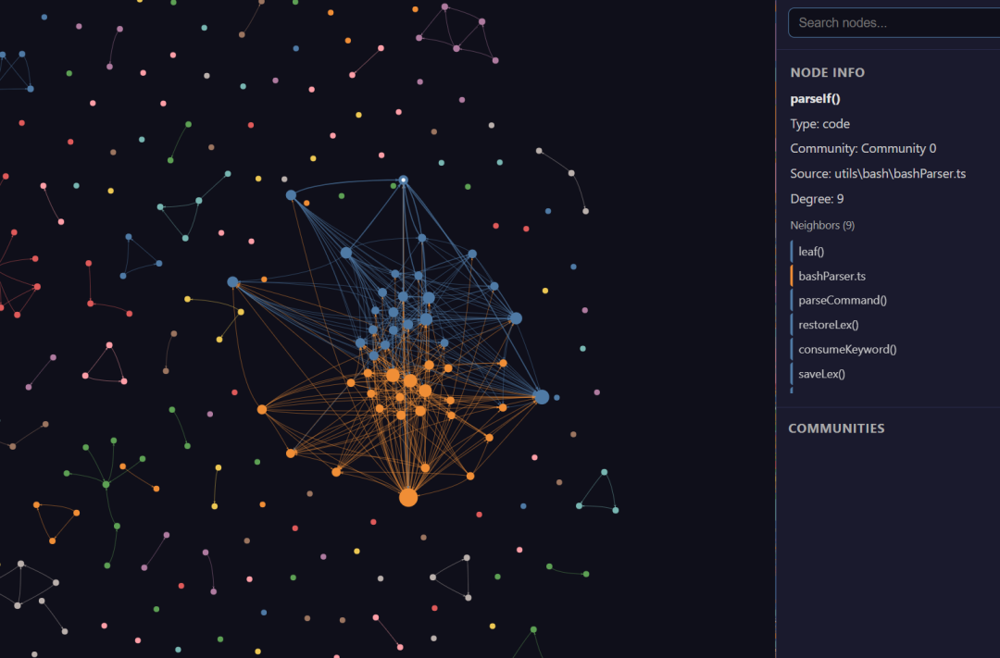
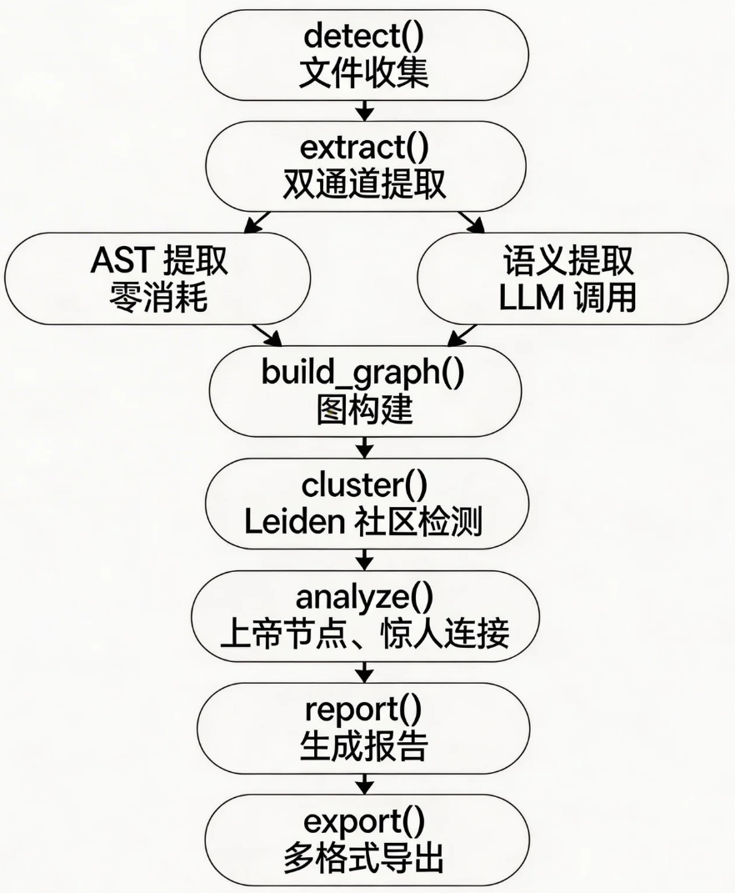
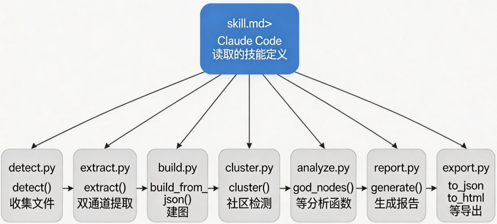
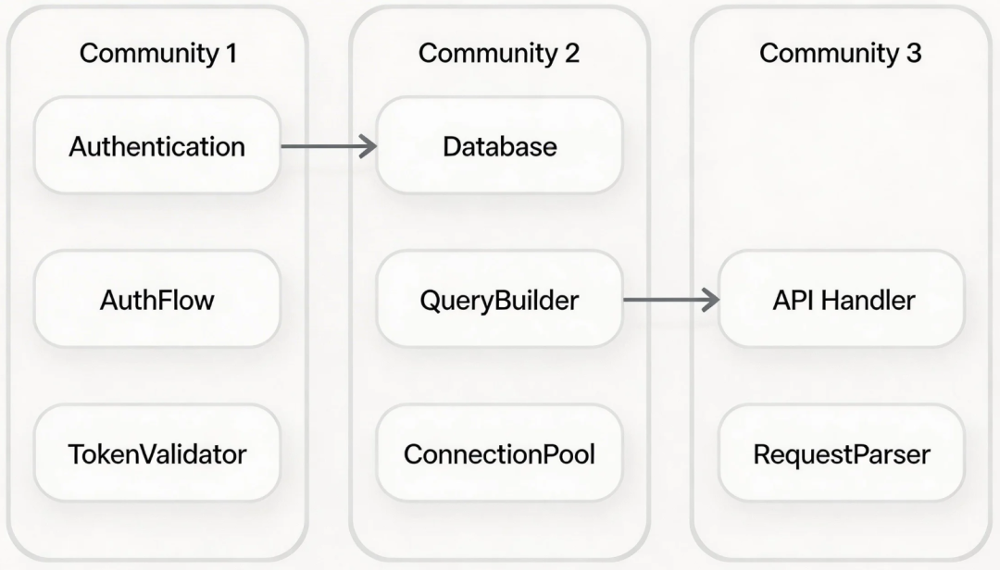

> 原文链接：https://mp.weixin.qq.com/s/loeB5ocZhq715jbjU_VLTA

# Graphify-让AI读懂你的代码，并且迭代优化，形成复利

大家好，我是小松鼠。
一名AI时代的学习者，专注探索个体在新时代的生存模式。
这是我的 第 70 篇 AIGC 文章。
你有没有遇到过这种情况：
😀
接手一个老项目，不理解它的结构，不知从何看起。
那有没有一种方式，让 AI 只需要读一次，就能掌握整个项目的结构，然后你随时问它问题它都能快速回答？
今天要讲的这个工具 Graphify，就是来解决这个问题的。
一、痛点：AI 怎么理解你的代码？
Karpathy 认为，与其把各种素材堆在一起，不如先把它们之间的关系抽出来，让 AI 能够高效理解和查询。
有一个经典的 /raw 文件夹工作流问题——你有一个塞满各种素材的文件夹（论文、推文截图、代码片段、笔记），里面的关联全在你脑子里，AI 想理解就必须全读一遍。
想象一下，你有一个文件夹，大概长这样：
raw/
├── architecture.md      # 架构设计文档
├── attention_notes.md  # 注意力机制的笔记
├── api.py              # API 实现
├── processor.py        # 数据处理
├── storage.py          # 存储模块
└── validator.py        # 参数校验
里面有几篇文档，有一段代码，还有你各个开发者写的笔记。
现在你想问 AI："我这个项目的数据处理流程是怎么走的？"
AI 的做法是：把这六个文件全部读一遍，然后给你回答。
问题在哪？
1.每次问都要全部读一遍，浪费时间。
2.文档和代码之间的关联，AI 自己要去建立，但是它没有"记"住这个关联。
3.当你的文件夹变成 60 个文件、600 个文件的时候，AI 的上下文根本塞不下。
二、解决思路：什么是知识图谱？
我们今天的主角该出场了——知识图谱。
知识图谱 = 节点 + 边
节点 = 任何一个概念（一个类、一个函数、一篇文档、一个名词）
边 = 两个节点之间的关系（"A 调用了 B"、"A 继承了 B"、"A 和 B 讨论的是同一件事"）
就好比一张地铁图：
节点 = 各个地铁站
边 = 两条站之间的线路
你想从 A 站到 B 站，不需要把整张图全部记在脑子里，只需要查一下哪条线路直接相通就行。
知识图谱对于 AI 理解代码来说，就是这个作用——把"哪些东西有关联"提前抽出来存好，每次问答直接查，不用重新读。
三、5 分钟上手 Graphify
好，说完了背景，来看看 Graphify 是怎么工作的。
先让你跑起来，再讲原理。
安装
pip install graphifyy
graphify claude install
第一行是安装 Graphify 本体，第二行是把 Graphify 作为一个技能插件安装到 Claude Code 里。
Graphify 就是这样工作的——它本质上是一个 skill.md 配置文件，Claude Code 通过读取这个文件来理解如何执行图谱构建和查询操作。
构建图谱
/graphify .
在你当前目录下执行，它会：
1️⃣ 检测文件
找出所有代码、文档、图片
↓
2️⃣ 提取关系
代码用 AST 分析（零 LLM 消耗）
文档图片用大模型分析
↓
3️⃣ 构建图谱
建立节点和边
↓
4️⃣ 社区检测
用 Leiden 算法找出哪些节点应该抱团
↓
5️⃣ 生成报告
产出 graph.html、GRAPH_REPORT.md、graph.json
查询图谱
构建完之后，你就可以开始问问题了：
# 宽泛问题 - BFS 遍历
/graphify query "我的数据处理流程是怎样的？"
/graphify query "..." --dfs
# 查两个概念之间的最短路径
/graphify path "Processor" "Storage"
# 解释某个节点
/graphify explain "Attention"
产出文件
graphify-out/
├── graph.html        # 交互式可视化图谱，点开就能看
├── GRAPH_REPORT.md   # 审计报告，包含上帝节点、惊人连接
├── graph.json        # 原始图数据
└── cache/            # 增量更新用的缓存
跑起来大概就这个感觉。
去拿Claude Code的源码来当例子。
四、核心机制：双通道提取
我们来拆解下源码，看看 Graphify 是怎么工作的。
Graphify 的提取分为两个完全独立的通道，可以同时跑、互不干扰。
通道 A：AST 确定性提取
这个通道处理所有代码文件（.py、.ts、.go 等等）。
用的是 tree-sitter 这个工具做静态分析。
tree-sitter 是一个代码解析器，它能把代码解析成一棵树的结构（AST，抽象语法树）。举个例子：
def hello():
print("world")
解析成 AST 之后大概是这个样子：
function
├── name: hello
└── body: call(print, "world")
Graphify 就是通过调用 tree-sitter 这个第三方解析器，把代码文本转成 AST 树，然后遍历这棵树来提取信息。
它没有去执行代码的运行时逻辑，只是做静态分析。
这个通道会提取：
类定义、函数定义
导入关系（import、from ... import）
调用关系（A 调用了 B）
继承关系（class A(B)）
Rationale（# WHY:、# NOTE:、# HACK: 这类设计决策注释）
提取出来的关系全部标记为 EXTRACTED，置信度 1.0。
意思是：这是直接从代码里找到的，没有猜测。准确度很高。
通道 B：语义提取
这个通道处理文档（.md、.txt）、论文（.pdf）和图片（.png、.jpg）。
这一步需要调用大模型，会产生 token 消耗。
Graphify 会把文件分块，然后并行调度 LLM 子代理来处理每个块。
每个子代理收到的提示词里会明确告诉它：
关系分为三种：
- EXTRACTED：源码里直接有的（置信度 1.0）
- INFERRED：合理推断的（置信度 0.6-0.9）
- AMBIGUOUS：不确定的，标记出来留待人工审查
为什么要分三级？
这是 Graphify 最核心的设计哲学——对自己"找到了什么"和"猜测了什么"保持诚实。
很多工具把大模型推断出来的东西包装成确定性答案，
Graphify 偏不。它明确告诉你：这个是直接从源码找到的，那个是我猜的你不确定可以去看看。
两个通道怎么合并？
AST 提取结果 + 语义提取结果，合并去重之后一起送进图构建阶段。
而且，AST 通道和语义通道是完全独立的，可以并行跑。Graphify 的管线设计就是让它们同时进行，节省时间。
五、源码管线拆解
来具体看看 Graphify 的源码是怎么组织起来的。
项目结构
graphify/
├── skill.md          # 技能插件定义（Claude Code 读取的就是这个）
├── extract.py        # 双通道提取（AST + 语义）
├── build.py          # 图构建 + 节点去重
├── cluster.py        # Leiden 社区检测
├── analyze.py        # 上帝节点分析、惊人连接
├── report.py         # GRAPH_REPORT 生成
└── export.py         # 多格式导出（HTML、JSON、Obsidian）
核心管线流程
每个阶段是一个独立模块里的单一函数，模块之间通过 Python 字典和 NetworkX 图来通信，没有共享状态，没有副作用。
Graphify 的所有输出都只往 graphify-out/ 目录写，这就是为什么它是天然无副作用的——任何一次运行都不会污染你的源代码目录。
模块调用关系
skill.md 就像一个总指挥，它定义了一套标准流程，Claude Code 读取它之后就按顺序执行每一步。
AST 提取的关键逻辑
说实话，AST 提取的逻辑不复杂，核心就三步：
1️⃣ 解析文件
用对应语言的 tree-sitter 解析器解析源码
↓
2️⃣ 遍历 AST 树
找到所有 class_definition、function_definition、import_statement
↓
3️⃣ 生成节点和边
类名/函数名 → 节点
继承/调用/导入 → 边
伪代码大概长这样：
function extract(file):
tree = parse(file)           # 解析成 AST
nodes = []
edges = []
for node in walk(tree):      # 遍历树
if node.type == "class_definition":
name = get_name(node)
nodes.append(node(name))
edges.append(edge(file, name, "contains"))
if node.type == "import_statement":
module = get_module(node)
edges.append(edge(file, module, "imports"))
return nodes, edges
每种语言的 AST 结构不太一样，所以 extract.py 里有大量语言-specific 的处理逻辑。
举个例子，同样是"函数定义"这个概念：
Python 的 AST 里叫 function_definition
Go 的 AST 里叫 function_declaration
Rust 里叫 function_item
同样"导入模块"：
Python 是 import from "os"
Go 是 import "fmt"
Java 是 import java.util.*;
Graphify 得针对每种语言的 AST 节点类型写专门的处理代码，不能一套逻辑通吃。
大模型子代理的提示词结构
语义提取这一块，Claude Code 并不是自己在那里读文件，它是并行调度子代理来处理每个文件块的。
每个子代理收到的提示词结构大概是这样的：
你是 graphify 的提取子代理。
读取以下文件，提取知识图谱片段。
只输出 JSON，不要其他内容。
关系分类：
- EXTRACTED：直接能从源码看到的
- INFERRED：合理推断的
- AMBIGUOUS：不确定的，标出来
图片要描述内容：
- UI 截图：布局、设计决策、关键元素
- 图表：指标、趋势、数据来源
- 架构图：组件和连接关系
子代理读完文件之后，按这个格式返回 JSON，Graphify 把它合并进最终的图里。
这就是大模型介入的地方——不是直接在主流程里读文件，而是通过子代理并行处理，最后汇总。
社区检测：Leiden 算法
图建好之后，需要找出哪些节点应该"抱团"，也就是社区检测。
Graphify 用的是 Leiden 算法（基于 graspologic 库）。
不需要任何嵌入向量，不需要向量数据库，完全基于图的拓扑结构。
Leiden 会自动发现：这几个节点之间的边密度很高，它们应该是一伙的。
分析阶段：上帝节点与惊人连接
社区检测完了之后，analyze.py 会生成如下的几个关键内容：
- 上帝节点：在一个社区内连接数最多的节点，通常是核心抽象
- 惊人连接：跨社区的边，往往揭示了一些不明显的关联
- 建议问题：根据图谱结构自动生成一些值得探索的问题
拿真实项目举个例子，在一个 1800+ 代码文件的项目里跑完图谱后，上帝节点是这样的：
上帝节点示例：
- Node：92 条边（最核心的概念，所有东西都和它连）
- Cursor：57 条边
- YogaLayoutNode：51 条边
- mk()：47 条边
- Ink：46 条边
惊人连接是这样的：
惊人连接示例：
- onChangeVerbose() → saveGlobalConfig()（跨目录连接）
- _resetPolicyLimitsForTesting() → stopBackgroundPolling()（跨服务连接）
- getPrompt() → shouldInjectAgentListInMessages()（跨工具连接）
什么叫跨目录/跨服务/跨工具？
Graphify 发现这两个函数明明在不同目录、不同模块里，但它们之间有一条边——也就是说某段代码同时调用了这两个东西。Graphify 会把这个标出来，让你自己判断这是不是一个意外耦合。
六、设计思路总结
说几个我觉得最有价值的设计决策。
诚实的三级置信度
😀
Graphify 最大的特点就是它不装。
大模型推断出来的东西，它明确标出来是 INFERRED 还是 AMBIGUOUS，不包装成确定性答案。
这个设计决策的背后是：图谱是一个长期积累的东西，你会在上面做很多次查询和探索，
如果一开始就把"猜的"当成"确定的"，后面所有查询结果都会跑偏。
无副作用的模块化设计
每个阶段只做一件事，阶段之间通过字典传递数据，没有全局状态。
这个设计有一个实际好处：你不需要每次都跑完整流程。
举个例子，改了代码之后想重新跑图谱，直接加一个 --cluster-only 参数就行，它会从已有的 graph.json 读取数据，只跑社区检测这一步，省时间。
反馈回路
每次 /graphify query 的问答结果会自动保存到 graphify-out/memory/，下一次 --update 的时候，这些 Q&A 会被当作图谱的节点提取出来。
换句话说：
😀
你用得越多，图谱就越"聪明"，因为你每次问答都在帮它校准理解。
尾声
Graphify 的思路其实不局限在代码理解上。
你想：
读完了 200 篇论文，能不能用类似的方式建一个"文献知识图谱"？
看完了一堆产品需求文档，能不能抽出一个"产品概念图谱"？
梳理完了技术债务，能不能用同样的框架建一个"技术债务图谱"？
核心逻辑是一样的：
😀
先抽取关系，再建图，然后基于图做查询，而不是每次都重新读所有内容。
AI 时代，信息不是不够，是太够了，要学会利用AI工具来思考，把散乱的信息，变成有用的知识。
看到这里了，如果觉得不错：
✓ 点个「赞」，让我知道你在看
✓ 点个「在看」，分享给更多朋友
✓ 点个「转发」，帮助更多人
✓ 加个「星标⭐」，第一时间收到推送
也可以加我的个人微信围观学习：archerqc
小松鼠爱你们！