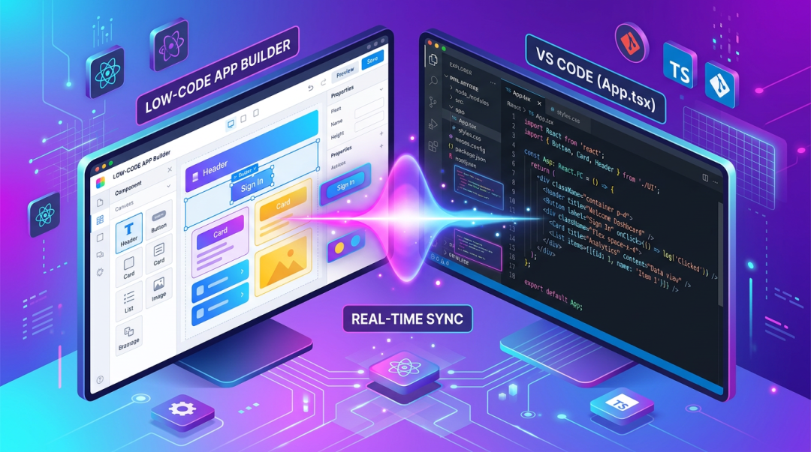
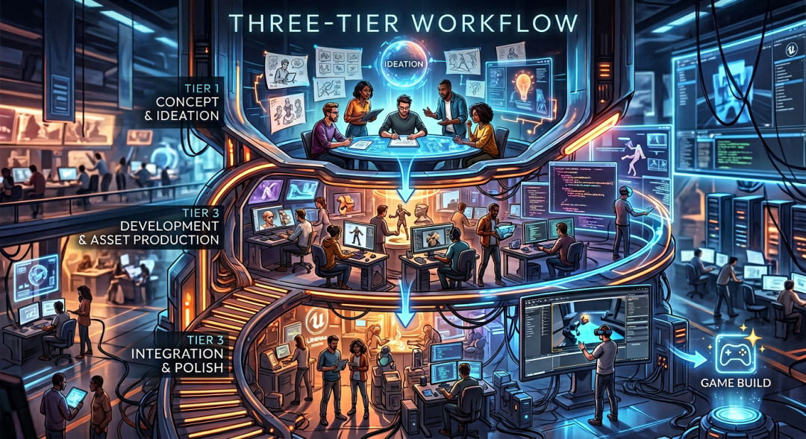

> 原文链接：https://mp.weixin.qq.com/s/nHbSRHbvj9xonQOQMCNFQw

# Superblocks 2.0：治理 Vibe 乱象

如果你最近在 X (原 Twitter) 或 Reddit 的程序员社区潜水，你一定被“Vibe Coding”这个词刷屏了。安德烈·卡帕斯 (Andrej Karpathy) 提出的这个概念，描述了一种只靠“意图”和自然语言就能让 AI 自动生成代码的开发新范式。
然而，当我们在 Replit Agent、v0 或 Claude Code 中沉浸于这种高效的“氛围感开发”时，一个巨大的隐忧正在企业界蔓延。那种“代码写了但我看不懂”的“理解债 (Comprehension Debt)”
正在让架构师们彻夜难眠。这就是我们今天要聊的主角：Superblocks 2.0。它不只是另一个 AI 助手，它是专门为解决企业级 Vibe Coding 治理难题而生的“重型武器”。
消失的“S”与 Vibe Coding 墙
在安全圈有一个流传甚广的冷笑话：“Vibe Coding 里的 S 代表 Security。” 讽刺的是，Vibe Coding 拼写里根本没有 S。这不仅仅是一个文字游戏，而是道出了当前 AI 开发的热潮下，企业安全治理的真实真空状态。
随着业务团队绕过 IT，利用 AI 自主构建内部工具，这种“影子 IT”带来了前所未有的安全漏洞。我们在 Reddit 的 r/cybersecurity 版块看到了无数哀嚎：非技术背景的业务人员利用 AI 生成了一个精美的客户管理系统，却直接在前端代码里硬编码了 API Key；或者完全忘记了 Supabase 的行级安全 (RLS) 配置，导致任何能访问页面的用户都能通过浏览器控制台拉取全量数据库。
更可怕的是所谓的“Vibe Coding 墙”。当你用自然语言构建一个简单的仪表盘时，速度快得惊人；但随着业务逻辑变得复杂，状态管理、多表关联、条件路由和第三方集成交织在一起，AI 的“上下文连贯性”开始断崖式下跌。
正如上图所示，传统的通用 LLM 在应对复杂企业应用时，往往会陷入“修好一个 Bug 引入两个回归 (Regression)”的泥潭。这正是因为 AI 缺乏深层的“程序理论 (Theory of the Program)”。当一个开发者“感觉 (Vibe)”代码是对的，但实际上并不理解背后的异步流转和数据状态时，这个应用从诞生的那一刻起就变成了无法维护的遗产。
深度解析 Clark AI：懂“规矩”的智能体
Superblocks 2.0 的核心突破在于 Clark AI。不同于 GPT-4 或 Claude 3.5 这种通用大模型，Clark AI 是一个专为企业级应用设计的智能代理。
传统的 LLM 在生成代码时，往往会为了实现功能而采取最简单的路径，比如直接使用内联样式、忽略错误处理、或者使用不安全的库。而 Clark AI 在生成代码的每一步，都会受到 Superblocks 平台内置的“治理引擎”约束。
当我尝试让 Clark AI 构建一个涉及敏感财务数据的报表时，它会自动应用预设的权限检查逻辑。如果我没有在 Prompt 中显式要求安全校验，它甚至会主动提醒：“检测到生产数据访问，已自动添加 RBAC 鉴权中间件。
” 这种从“生成原始代码”到“生成受控架构”的转变，是 Vibe Coding 进入企业的入场券。
三层工作流：把控制权交还给工程师
Superblocks 2.0 提出的三层开发流 (Three-Tier Workflow)，是我认为目前解决“AI 幻觉”和“技术债”最务实的方案。这种方案承认了 AI 的局限性，并为人类专家留出了精确介入的接口。
1. 生成 (Generate)：AI 处理 90% 的繁琐工作
在这个阶段，你只需要告诉 Clark AI：“我需要一个连接到 Snowflake 的实时库存监控系统，并集成 Slack 通知。” AI 会迅速拉起 UI 组件、配置 API 端点并处理基础的数据映射。
2. 精简 (Refine)：可视化编辑器下的“人在回路”
生成后的应用会自动导入可视化编辑器。在这里，你可以看到每一个组件绑定的数据源。即使你不是专业的 React 开发者，也能通过拖拽发现逻辑上的低级错误。例如，如果 AI 错误地将“用户邮箱”显示在了公共列表里，你可以在 UI 层直接点击删除，这种“人在回路 (Human-in-the-Loop)”的机制在代码“硬化”之前提供了一个完美的缓冲区。
3. 扩展 (Extend)：与 VS Code 同步的硬核调试
这是 Superblocks 最令专业开发者兴奋的地方。它通过一个轻量级的代理支持与本地 IDE（如 VS Code 或 Cursor）实时同步。
想象一下这个场景：AI 生成了一个复杂的异步审批流，但在某些极端并发情况下会产生死锁。传统的低代码平台此时往往会让你束手无策，但 Superblocks 允许你直接在 VS Code 中打开这个应用的源码。你可以编写原生的 TypeScript 代码来重构这部分逻辑，添加复杂的错误重试机制或事务控制。最神奇的是，当你在本地保存代码时，Superblocks 的可视化界面会自动更新
，这种“双向同步”彻底打破了低代码与高代码之间的围墙。
影子 IT 的“黄金路径”与 VPC 治理
传统的 IT 部门往往倾向于“封杀”不合规的工具。据说某财富 500 强企业最近关停了 2500 个 Replit 账号，原因就是担心源代码泄露和数据非法外流。然而，封杀永远跑不过用户追求效率的心。
Superblocks 2.0 提供的方案是为企业建立一条安全的“黄金路径”。它的管理控制平面 (MCP) 就像是一个数字雷达，IT 和安全团队可以实时审计每一个应用的权限、每一行访问生产数据的操作。
更重要的是，Superblocks 完美支持 VPC 部署 和 气隙环境 (Air-gapped)。这意味着你的生产数据、API 密钥和 AI 生成的应用逻辑，全部运行在你自己的受控基础设施中。数据不会被用于模型训练，也不会泄露到公网。这种“主权级”的 AI 开发能力，正是 Instacart、SoFi 等金融和科技巨头敢于在生产环境大规模使用它的底层原因。
避坑指南：如何优雅地“Vibe”而不翻车
作为一名在技术领域摸爬滚打多年的老兵，我对于 Vibe Coding 的建议是：拥抱它，但不要迷信它。
警惕“理解债”： 如果一个应用 100% 由 AI 生成且没有人 review 过代码，那么这个应用就是企业的定时炸弹。在 Superblocks 中，确保每一个关键节点都有工程师在“Extend”层进行过逻辑审计。强制执行 RBAC： 不要相信 AI 生成的“逻辑鉴权”。你应该在 Superblocks 平台层强制开启基于角色的访问控制 (RBAC)，让安全变成基础设施的一部分，而不是代码片段的一部分。从小到大，渐进式应用： 先从不敏感的内部行政工具开始尝试 Clark AI，等团队建立了成熟的“AI + 人工同步”审计流程后，再扩展到核心业务后台。
正如 Superblocks 创始人所言：“Vibe Coding 的精灵已经从瓶子里放出来了，我们要做的不是把它关回去，而是给它套上企业级的盔甲。”
你是否也在尝试用 AI 构建内部工具？在评论区分享你遇到过最离谱的“AI 幻觉”或者最惊艳的“Vibe 瞬间”，我们一起交流。作为一个老码农，我非常好奇你是如何在这个 AI 狂飙的时代保持平衡的。
参考资料：
Superblocks 官方文档：Clark AI 与三层流架构[1]Andrej Karpathy：Vibe Coding 带来的软件开发范式转移[2]Checkmarx 2026 报告：AI 生成代码中的新型攻击向量[3]Hacker News 热议：理解债——AI 开发下被忽视的成本[4]
引用链接
[1]Superblocks 官方文档：Clark AI 与三层流架构: https://www.superblocks.com
[2]Andrej Karpathy：Vibe Coding 带来的软件开发范式转移: https://twitter.com/karpathy
[3]Checkmarx 2026 报告：AI 生成代码中的新型攻击向量: https://www.checkmarx.com
[4]Hacker News 热议：理解债——AI 开发下被忽视的成本: https://news.ycombinator.com