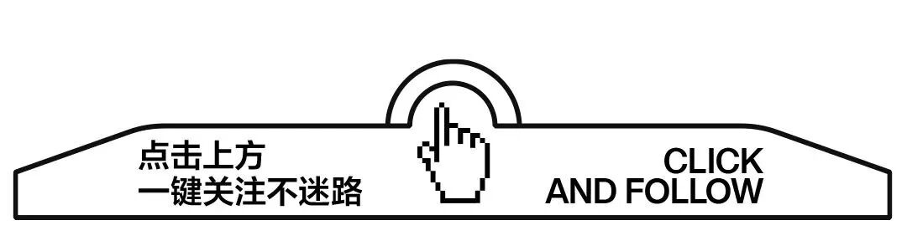
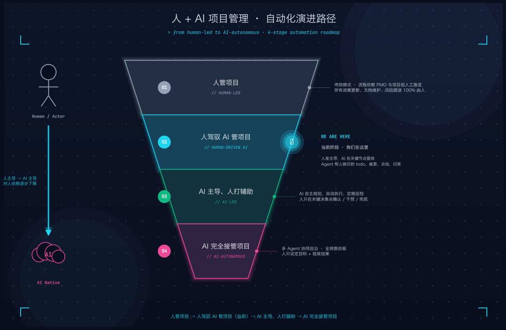
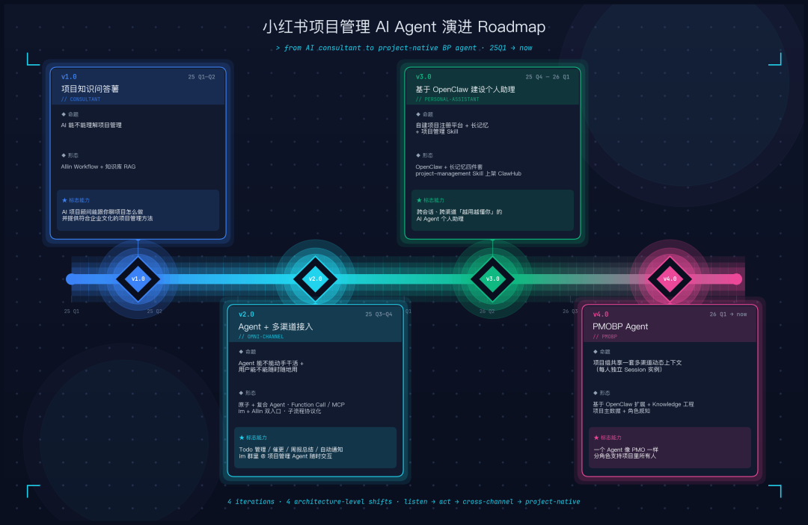
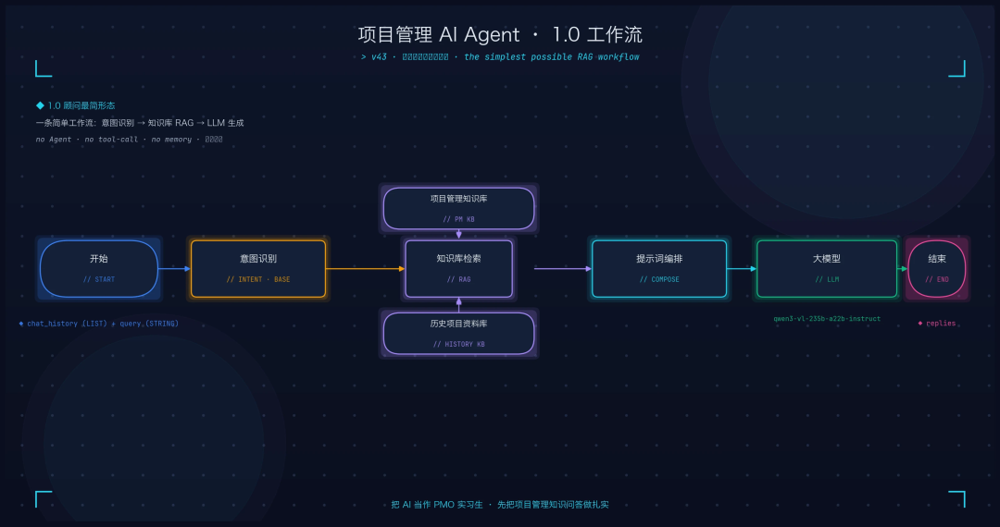
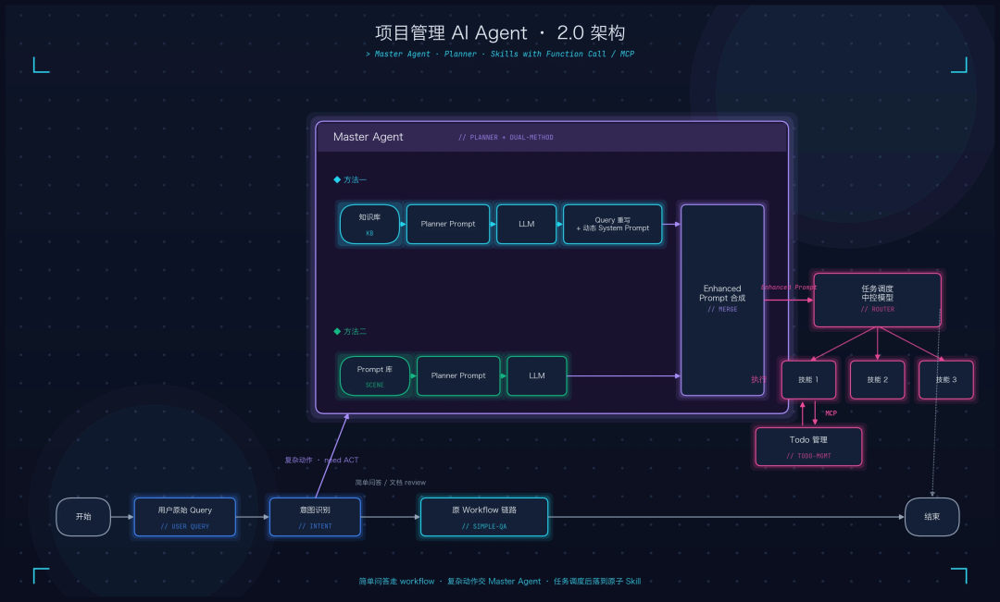
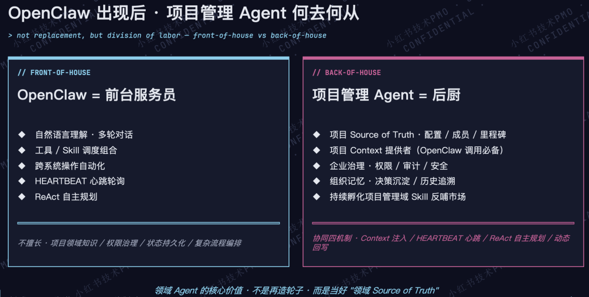
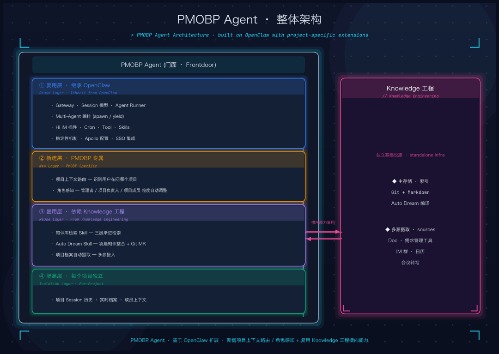
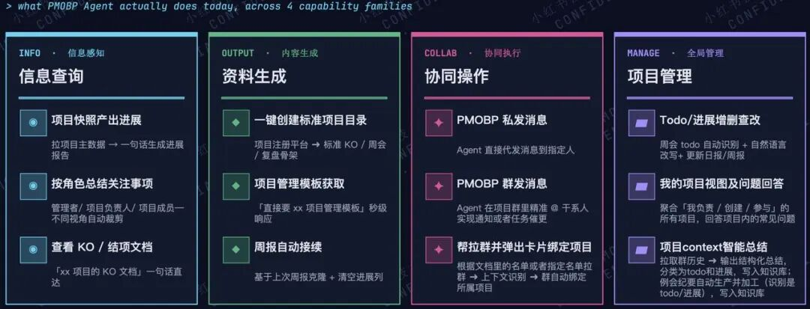

> 原文链接：https://mp.weixin.qq.com/s/b2ljTH5m4We8amA4hGWLOg

# 打造AI时代项目管理新范式 - 小红书PMO团队的Agentic探索之路

过去一年，小红书 PMO 团队对项目管理 AI Agent 进行了 4 次迭代：1.0 阶段把 AI 当作项目管理顾问，先把项目管理知识问答做扎实；2.0 阶段提出「Agent规划 + Sub Agent 执行」的设计原则，让 Agent 不只是“嘴皮子工程师”，接入到内部办公IM实现即时交互，“动”起来-执行项目管理动作；3.0 阶段「打造聪明的个人项目管理助手」，通过自建项目注册平台 + 长记忆等四件套，把项目管理能力蒸馏成 Skill并接入OpenClaw框架，实现「养龙虾，得助理」模式；4.0 阶段把 Session模型从「1 人 × 1 Session」升级到「1 项目 × N 人 × M Session」，为每个项目组提供一套共享的多渠道动态上下文。
过去企业落地项目管理通常会经历三个阶段——人治（依赖 PMO 人工盯细节）→ 机制化（流程机制落地、建立项目管理体系）→ 工具化（以项目管理平台为核心）。而在AI 时代，软件研发范式发生了根本性变化，项目管理也必然要演进到下一阶段：AI 化。但如何AI化是一个需要深入探索的命题，过去1年小红书 PMO 团队做了多轮的探索和实验，这里分享下我们的成果和思考。
首先我们有两个关键判断：
AI 是一种新的生产力：应该用它把 routine 的工作（拉群、催更、总结进展、识别 todo、写纪要等）真正接管掉，把人的精力留给真正需要决策的地方——目标、阵型、资源。
AI 会越来越聪明执行各种任务：随着大模型和 Agent 工程的发展，未来项目管理必将经历「人管项目 → 人驾驭 AI 管项目 → AI 主导、人打辅助 → AI 完全接管项目」四个阶段，而当前我们正处在「人驾驭 AI 管项目」的阶段。
说明：本文所指的「项目」均为大型跨多部门协作的复杂项目，而非单人带几个 Agent 即可完成的任务。
带着这两个判断，从 2025 年初至今，我们从 0-1 构建并完成了 4 轮项目管理 Agent 的升级迭代 - 这 4 轮迭代其实跟 AI 技术的发展紧密相关。
[图 1：人 + AI 项目管理 · 自动化演进路径]
版本
时间
核心命题
标志能力
1.0 项目知识问答薯
25 Q1—Q2
AI 能不能理解项目管理
AI 项目顾问能与你探讨项目管理方法，并提供符合企业文化的框架与建议
2.0 Agent + 多渠道接入
25 Q3—Q4
Agent 能不能动手干活
Todo 管理 / 催更 / 周报总结 / 自动通知；在 IM 群里 @ Agent 随时交互
3.0 基于 OpenClaw 的个人助理
25 Q4—26 Q1
Agent 能不能更智能的执行任务（特别是容错能力）
具备跨会话、跨渠道且「越用越懂你」的 AI Agent 个人助理
4.0 PMOBP Agent
26 Q1 至今
Agent 能不能支持项目组所有人干活
一个 Agent 像专属 PMO 一样，按角色支持项目里的所有成员
[图 2：项目管理 AI Agent 演进 Roadmap]
从0到1的冷启阶段我们对AI的定位很窄：只把它当一个项目管理顾问，能稳定回答项目管理领域的基本问题即可。
具体打法：
把 PMO 团队多年沉淀的材料（KO 模板、周会模板、复盘模板、干系人识别 SOP 等）整理成知识库；
在使用频率高的实践上，先落成最佳实践 SOP，再推动产品工具化；
对工具化后的高频场景，再叠加 AI 能力来总结输出。
之所以选择以项目管理知识问答为切入点，主要是技术实现简单直接，一个工作流即可落地：意图识别 → 知识库 RAG → 大模型生成。
[图 3：项目管理知识问答小助手 Workflow]
阶段产出是 1 个生产可用的 AI 项目顾问。在跑了 10+ 类代表性 Case 的评测集之后我们发现，评测集本身才是 1.0 阶段最有价值的产出，远比知识库本身重要——它就是 Agent 的「单元测试」，帮助我们客观衡量 Agent 的真实能力边界。
这一阶段最大的认知收获是：快速启动起来比想全后再做更重要。
Agent 不能只是"嘴皮子工程师"。把「知识问答」做到极致，对真实项目的提效也只有 30%——因为剩下的 70% 是执行动作：管理 todo、催进展、发通知、总结周报，这些才是项目管理日常工作的大头。
在 Agent 建设过程中我们也走过一些弯路，最终总结得到了三条设计原则：
原子 Agent 必须自我闭环：执行期间不依赖 master Agent 再次介入，要么成功返回结果，要么明确失败返回原因。
复合 Agent 通过原子组合解决复杂任务：例如「项目周报总结」是复合任务，背后由「读周报 + 读需求状态 + 汇总输出」几个原子组成。
复合 Agent 不能互相嵌套：嵌套容易产生死循环，严重消耗算力，这条原则我们从 2.0 坚持到了今天。
[图 4：项目管理 AI Agent 2.0 架构]
同期，我们发现用户访问 Agent 必须通过工作流平台的 Bot 窗口，易用性不够。因此做了进一步优化——把 Agent 推进到用户已经在的地方，也就是公司内部 IM。技术上做了两件事：
统一通知能力剥离主流程：子 Agent 不再各自单独发消息，统一通过消息发送接口通信；
建立 Master Agent 和子 Agent 之间的协议：所有子 Agent 返回标准 JSON 结构体，Master Agent 根据字段内容自主决策处理。
这样更容易扩展子 Agent 来处理单独场景，多渠道扩展只需修改入口解析。最终实现了 6 个场景能力上线（项目文档审阅、知识问答、Todo 管理、周报总结、文档催更、需求定容管理），并在多个项目里真实跑了起来。
随着运行一段时间，我们发现 Agent 虽然能干活，但还不够「聪明」，比如文档格式一变，待办就可能识别不出来，以及常常忘记对话内容；更根本的问题是：长记忆在 Workflow 模式下无法实现——Agent 每次对话都是「失忆」状态，无法积累对用户和项目的理解。因此，我们开始了 3.0 的探索。
3.0 阶段做了三件大事，每一件都从根本上改进 Agent 智能化能力。
第一件：通过 Skill 把 OpenClaw 做成个人助理
公司开始落地 OpenClaw 之后，「原来 Agent 还要不要继续建设？」成为 PMO 团队面临的关键问题。春节前我们自行安装并体验了 OpenClaw，我们震惊了——OpenClaw 在智能化和自主性上，明显优于我们原有的主/子 Agent 架构。随之而来的问题是：继续在原有架构上迭代还是要切换到  OpenClaw？切换的话，过去一年的努力是否白费了？哪些能力能留下，哪些必须放弃？
最终我们决定把项目管理能力打包成 Skill，上架到公司内部 Skill Hub，让所有员工都能用自己的Claw助理调用项目管理能力；同时我们也在积极地探索基于 OpenClaw 为每位 PMO 创建「项目管理个人分身」的能力，并将其引入项目群帮助 PMO 干活；并基于开源 Agent 框架搭建 PMO Team Claw，探索集体喂养「团队助理」的模式。
第二件：长记忆四件套
实现跨会话、跨渠道「越用越懂你」的能力。长记忆是必选项，借鉴 OpenClaw 框架，我们实现了完整的四件套：
UserProfile：用户画像 4 维（偏好 / 行为 / 常问问题 / 关联项目）
SessionMessage：对话历史三级缓存（DB → 应用层 → Agent 层）
KnowledgeItem：知识库 5 类，支持全文 + 标签搜索
ContextBuilder：动态拼装上下文，自动压缩
第三件：自建项目注册平台
在 OpenClaw 之外，我们全栈 Vibe coding 了项目注册平台（前、后端一气呵成），作为 Agent 上下文的唯一数据锚点，承载项目名 / 成员 / 文档空间 / 周会文档 / IM 群 / 需求工具空间等核心主数据；并将 PMO 沉淀的能力打包成可复用的项目管理 Skill，反哺给整个公司。「项目主数据是 Agent 冷启的关键」，没有主数据锚点，再多场景都是信息孤岛。
3.0 阶段最直观的产出是：同一个 Agent 个人助理打通三个平台运行——工作流平台、自建项目注册平台、IM  机器人，打通 7 个核心功能：寒暄 & 自我介绍 / 项目知识问答 / 文档催更 / 周报总结 / 待办管理 / 需求查询 / 需求创建。三个平台打通后，用户数在一个月内从十几人暴增到几千人。
在用户数暴增的兴奋之余，用户也反馈了更多的诉求：「我养的 claw 助理能不能直接拉到项目群里帮我干活？」这个需求非常自然——助理本来就是要在工作场景里出现的。但我们也必须考虑边界：不能让公司 IM  变成一个像 Moltbook 那样的无序AI竞技场。因此，我们开始了 4.0 的探索。
（一）关键思考：OpenClaw 时代，领域 Agent 应该如何定位？
OpenClaw 落地后，「领域 Agent 还要不要建？」这个问题经过深入探讨和实验，我们得到的结论是：要建——两者不是替代，是分工协同。领域 Agent 的核心价值不是再造轮子，而是当好「领域 Source of Truth」。
[图 5：OpenClaw 时代领域 Agent 的发展定位]
（二）从个人私有助手到「项目专属 BP」
3.0 把 Agent 做成了面向个人的私有 AI 助手，但当我们试图在具体项目里落地时，发现了一个新问题：不同角色对同一个问题，需要的答案完全不同
当管理者问「项目进展怎样」→想了解目标达成度，有没有卡点
项目负责人问「项目进展怎样」→ 可能想了解全局有哪些核心进展和风险
当项目成员问「项目进展怎样」→ 可能想知道自己依赖模块的进展如何，会不会影响自己的进度
技术层面的难题是：3.0版本实现的是「1 人 × 1 Session」，每个人和 AI 各自孤立对话，同一个项目下不同角色无法共享同一份项目上下文，无法实现有效跨角色协调。
而项目专属BP则需要将架构升级为：为每个项目组提供一套共享的多渠道动态项目上下文，每人独立的 Session 实例都从这套上下文里获取信息。这样项目里所有人都能问到有据可查的进展、风险和结论。
核心新认知：PMOBP Agent 首先是信息中枢，其次才是任务执行者。
[图 6：PMOBP Agent · 4.0 整体架构]
PMOBP Agent 最终是基于 OpenClaw 构建——复用OpenClaw 的 Gateway、Session 模型、Multi-Agent 编排、IM 插件、Skill 体系、稳定性机制等基础能力，并接入 Knowledge 工程提供的三层渐进检索、定时知识整合、项目档案多源摄取等横向能力。在此之上，针对项目管理场景新增两层 PMOBP 专属能力：项目上下文路由（识别用户在问哪个项目）和角色感知（按管理者、项目负责人、项目成员自动调整回答粒度）。
（三）4.0 阶段产出：12 项已落地能力 + 主数据底座
类别
能力
信息查询
项目快照产出进展、按角色总结关注事项、查看 KO/结项文档
资料生成
一键创建标准项目目录、项目管理各种模板获取、例会文档自动接续
协同操作
PMOBP 私发消息、PMOBP 群发消息（通知及催更）、机器人帮拉群并自动弹卡片绑定项目
项目管理
Todo/进展增删查改、我的项目视图及项目常见问题解答、项目群消息&项目例会智能总结并写入知识库形成项目 context 
主数据底座方面：项目主数据平台当前已承载数百个项目的核心数据（项目名、成员、文档空间、周会文档、IM 群、需求工具等），并持续扩展中。「先做主数据扩展，再做场景扩展」 是我们在这一阶段最重要的优先级判断。
[图7：4.0阶段已落地的能力矩阵，还在持续迭代]
（一）实践后总结的 7 条经验
不要等各种设施齐了才开始：每个阶段都用当时最快能落地的平台，架构跟着场景走，不要反过来。
评测集是 Agent 的「单元测试」：1.0 阶段最有价值的产出不是知识库，是那 10+ 类代表性 Case——评测集帮助你在每次迭代后客观判断 Agent 到底变好了还是变坏了。
原子 Agent 必须能自我闭环：这条原则从 2.0 坚持到现在，依然有效。
记忆结构化是更智能的底座：UserProfile + SessionMessage + KnowledgeItem + ContextBuilder，缺一不可，不能用简单的「存聊天记录」代替。
领域 Agent = 领域 Source of Truth：OpenClaw 时代，领域 Agent 的核心价值不是再造轮子，而是成为领域内可信的唯一信息来源。
项目主数据先于场景扩展：主数据越完整，Agent 的上下文越充足，智能化效果就越明显；没有主数据锚点，再多场景都是数据孤岛。
AI 时代，人人都可以是 Builder：AI 时代下，PMO 能做的远超过固有认知，因此每个 PMO 应该是 Builder + PMO，构建 AI Native 产品而不只是守护流程。
（二）后续展望
项目管理 Agent 不只是一个产品，它是对「AI 时代项目管理新范式」的持续探索——AI 时代的项目管理该是什么样，还没有最终答案，但最终走向 AI 全面接管项目管理是我们的愿景。
我们的下一站是让 PMOBP Agent 走进每一个项目组，让「Agentic 项目管理」真实发生在项目的每一个角落——从「人驾驭 AI 管项目」开始走向「AI 主导、人打辅助」的阶段。
我们是小红书技术 PMO 团队，我们的愿景是打造 Agentic 项目管理新范式，引领项目管理行业持续创新。本文主要作者包括白也、聂风、广见、唐泽、若臻、浩宇等同学，欢迎关注小红书技术 REDtech 公众号，共同探讨 Agentic 项目管理新范式的更多可能性。