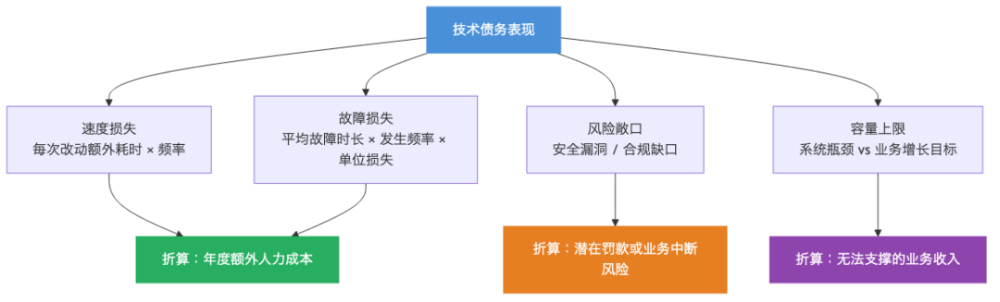
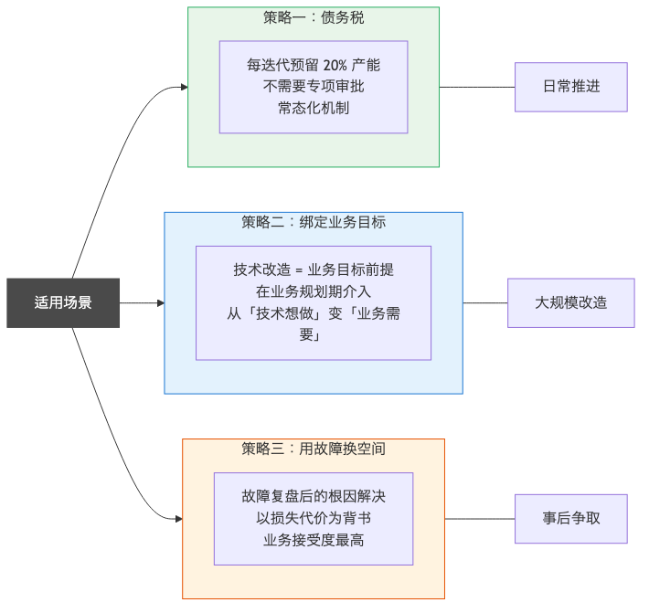

> 原文链接：https://mp.weixin.qq.com/s/vUgUcccuCfG_yAU3mt_EGg

# 技术债，为什么永远排不上？

核心价值
拆解技术债务管理的核心困境，给技术负责人一套向业务讲清楚"还债必要性"的框架和谈判策略。
正文
有一个会议，几乎每个技术团队都开过：
技术负责人说：「我们需要一个月，专门做技术优化，不加新需求。」
业务负责人说：「现在竞争这么激烈，一个月什么需求都不交付？这不现实。」
技术负责人说：「如果不优化，以后开发速度会越来越慢。」
业务负责人说：「那是以后的事。现在这几个需求必须做，先把这个季度撑过去。」
会议结束，技术优化继续推迟，需求继续堆进来，系统继续变慢。
这个死局，不是因为业务不讲理，也不是因为技术团队不努力。
而是因为技术债务是一种隐形的税——它每天都在产生利息，但账单没有人能直接看到。
你加一个功能，今天省了两天工期，但给系统留了一个设计缺陷。这两天省回来了，但未来每次动这块代码，都要多花三倍的时间绕过这个缺陷。这就是利息。
问题在于：利息是分散的，无声的，没有人会在某一天突然收到一张账单说「你欠了多少」。所以它永远不紧急，永远可以推迟，永远输给了下一个有 deadline 的业务需求。
债务积累是一个飞轮
技术债务的危险，不在于某一笔债，而在于它的飞轮效应：
债务越多 → 开发速度越慢 → 业务压力越大 → 越来越顾不上还债 → 债务越来越多。
飞轮一旦转起来，靠单次加班是打不破的。
这个飞轮最终会以三种方式爆发：
第一种：速度断崖。
团队会发现，同样的功能，两年前需要一周，现在需要三周。没有人能说清楚为什么变慢了，但就是变慢了。原因是债务积累到了一定程度，每个功能都要绕过一堆历史遗留问题才能落地。
这种变慢是渐进的，所以很难被感知。等业务明显察觉的时候，往往已经是无解的状态。
第二种：故障频发。
债务积累会让系统的容错空间越来越小。平时没问题，一旦流量增加、配置变化，或者某个上游系统升级，就会触发一连串意料之外的故障。
这类故障的特征是：你修好了一个，过几天另一个地方又出了。根源是系统脆弱，而不是某一个具体的 bug。
第三种：好工程师留不住。
这一条最隐蔽，也最致命。
优秀的工程师是有选择权的。他们不会忍受在一个烂代码仓库里长期工作——不是因为他们娇气，而是因为在烂代码里工作意味着每天都在和历史遗留问题搏斗，没有成就感，也很难成长。
债务高的团队，留下来的往往是对外部机会不敏感的人；走掉的，往往是最有能力带队改变现状的人。这个选择效应，会让债务问题越来越难以解决。
让债务可见：量化它
债务永远排不上，核心原因是它不可见。
业务能看到需求上线了、功能交付了；但看不到「代码又多了三处补丁」「这个模块已经没人敢动了」「下次大促可能撑不住」。
让债务可见，需要把它量化成业务能理解的语言：
债务表现
技术语言
业务语言
核心模块代码混乱
圈复杂度超过 20，单测覆盖率不足 30%
每次改动该模块，需要额外 2 天排查风险，全年因此多花约 XX 人天
没有监控告警
缺乏链路追踪和指标采集
故障平均发现时间 45 分钟，对比行业标准 5 分钟，每次故障多损失约 XX
架构无法水平扩展
单体架构，数据库有全局锁
当前系统上限约 500 并发，无法支撑下半年 XX 业务计划的流量需求
依赖库版本严重滞后
多个核心依赖停止维护
已出现 2 个安全漏洞未修复，合规风险敞口
这张表格的作用，是把「技术团队觉得很严重」的问题，翻译成「业务看得懂的损失」。
有了这个翻译，债务才有可能进入优先级讨论，而不是永远被挤在待办清单的最底部。
三种谈法，三种场景
量化之后，还需要谈判策略。不同场景下，有效的谈法不同。
策略一：债务税（适合日常推进）
不要一次性争取「一个月技术优化期」，这太难批准了。
换一种说法：在每个迭代里，预留 20% 的产能给技术优化，这部分不接新需求。
20% 看起来不多，但一年下来，等于 2.5 个月的专项投入。更重要的是，它把债务管理变成了一个常态机制，而不是每次都要打一场审批战。
跟业务谈这件事的时候，可以这样说：「我们承诺 80% 的产能全力支持业务需求，剩下 20% 用于保证这 80% 的可持续性。如果不留这 20%，一年内交付速度会下降到现在的 60%。」
策略二：绑定业务目标（适合大规模改造）
单独立项的技术优化很难被批准，但如果技术改造是某个业务目标的前提条件，优先级就完全不同了。
讲法：「下半年你们计划推进 XX 业务扩张，当前系统架构在超过 500 并发时会崩，我们需要先完成这个改造，XX 业务才能启动。」
这把技术工作从「技术想做」变成了「业务需要」，谈判地位完全不同。
这个策略的关键，是提前把技术约束和业务规划对齐——在业务制定计划的时候就介入，而不是等业务拍板了再来说「技术上做不到」。
策略三：用故障换空间（适合事后争取）
每次生产故障，都是一个还债窗口。
故障复盘之后，改进项里有一类叫「根因解决」——指的不是修复这次的 bug，而是消除导致这类问题反复出现的系统性缺陷。这类工作，用故障的代价来背书，业务接受度最高。
讲法：「这次故障的根本原因是 XX 模块的历史债务，我们估算了一下，修复这个根因需要 3 周，但它能防止同类故障每年造成的约 XX 万损失再次发生。」
一个容易犯的错误
很多技术负责人谈技术债务，会说：「我们的代码很乱，需要重构。」
这句话有两个问题：
第一，「代码乱」不是业务语言，业务听不懂也不关心。
第二，「需要重构」听起来是技术自娱自乐，和业务目标没有关系。
更有效的表达方式，是始终从损失和风险出发：
「当前 XX 模块的技术状态，让我们每次修改它都需要额外两天的风险评估。过去半年，我们在这个模块上总共花了约 XX 人天在这件事上。如果完成这次专项改造，这个成本会降到接近零。」
技术债务的谈判，本质上是在谈一笔投资——投入 N 周，换取未来持续节省的成本。只要算数成立，业务没有理由拒绝。
还债的本质
说到底，技术债务管理不是技术问题，是治理问题。
它的核心矛盾是：短期激励和长期健康之间的张力。每次「先把需求做了，技术债以后再说」，都是用未来的效率换今天的速度。
这个选择本身没有对错，但它必须是显性的、有意识的选择，而不是每次都被默默推迟。
技术负责人的责任，是把这个隐性的代价变成显性的：让业务知道，每次推迟还债，是在做一个什么样的决策，会带来什么样的后果。
当业务真正理解了这笔账，他们会做出更合理的判断。
而你要做的，不是争取一个「技术季度」，而是让还债比继续欠债更合算。
这个系列聊了六个话题：
管理会发难→ 接住，不被情绪带走。
基本功三层→ 可见性、稳定性、交付质量。
故障复盘→ 追真根因，改进项要可执行。
需求管理→ 分级、透明、产能承诺。
价值叙事→ 翻译机制，讲给对的人听。
技术债务→ 让还债比欠债更合算。
如果你在技术债务管理上有自己的经验或教训，欢迎在评论区聊聊。