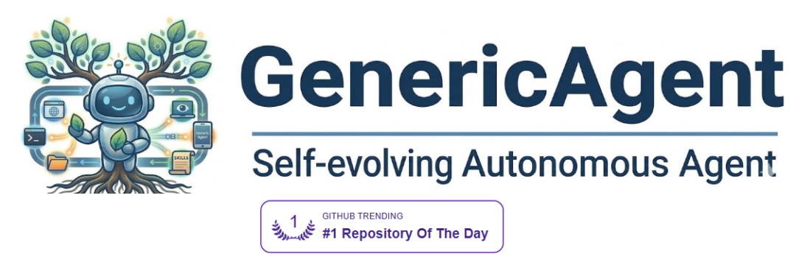

> 原文链接：https://mp.weixin.qq.com/s/57KhEUGdZtiV69rPUSm9ug

# 技术预测：从智能体的 Harness（驾驭） 工程到 Evolver（进化） 工程

从2024年以来，经典的 Harness 工程包括：
系统提示词设计
常驻 Agent Tools set 设计
分层 Skill 设计
Plan Mode/Ralph Loop 模式
多智能体模式
Agent 记忆系统
以上这些技术，大都为了解决用户“单次任务”执行。但是随着用户频繁使用 Claude Code/Codex/OpenCode/Pi-mono 这些工具，产生了大量的Agent Session，另外一些问题随之而来：
在今后的使用中，如何避免犯重复的错误？
我的 SKILL/提示词 文档写的足够好吗，有没有改善空间？
如何降低今后的 LLM Token 成本，越用越便宜？
我的这些对话记录，可否提炼出特别适合我的 SKILL / SOP ?
基础模型更新了，我的提示词/SKILL/Memory 如何改进？
总之，如何实现越来越好用的智能体？
回答这些问题，我们必须引入所谓“Evolver（进化） 工程”的概念，即关注离线“能力增长”的问题。4月份大热的Hermas Agent，就是进化工程的典型，Evomap 和 Hermas 的技术论战也是佐证，说明大家越来越重视进化工程，我认为这仅仅是开始。
如何在不触及基础模型前提下，实现所谓 Self-Evelution 自进化，大家一个普遍的共识就是 "压缩” 、“量化”和“成本“。
缩小技能元素，SKILL本质是一个分层按需加载的文档机制，但没有规范何为“技能”，一个标准可复用的技能的大小和规模是开放的。因此 GENE的方法是，构建规约化（即所谓GEP）小技能（即GENE）， 小技能甚至不考虑阅读性，只考虑简洁、可靠。
另外一个方法就是，量化上下文要素对完成任务的贡献，给每个SKILL/Memory进行打分，通过要素的量化，删减那些负能力的要素，实现能力提升。
关注成本，所有 “进化工程“ 都把成本当做重要的优化目标，GenericAgent 就是节省 Toeken 作为基本出发点。
在我们自己创业项目“智能体路由器”中，面向物理环境，不管是驾驭工程还是进化工程，都有其独特的研究和工程问题。我们会在开源 VT-Claw 的基础上，进行合适的进化工程实践探索。