> 原文链接：https://mp.weixin.qq.com/s/J9MhLDpATavgSmZ_1WrtxA

# QCon 北京 2026 | 把自动化测试当 AI Coding 来做：小红书 GUI Agent 实战回顾

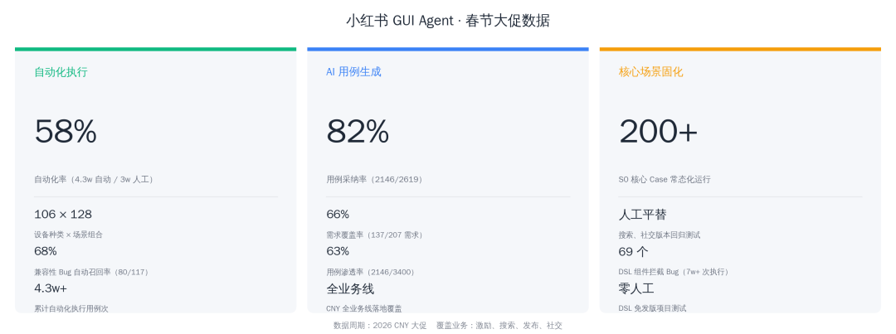

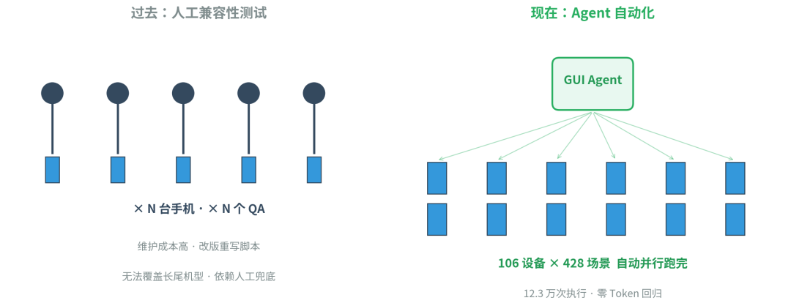

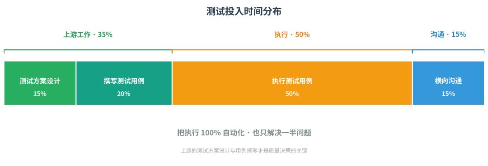

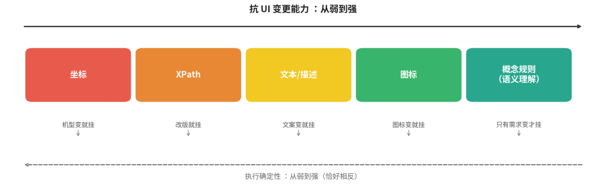

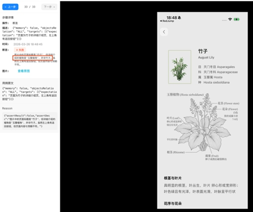

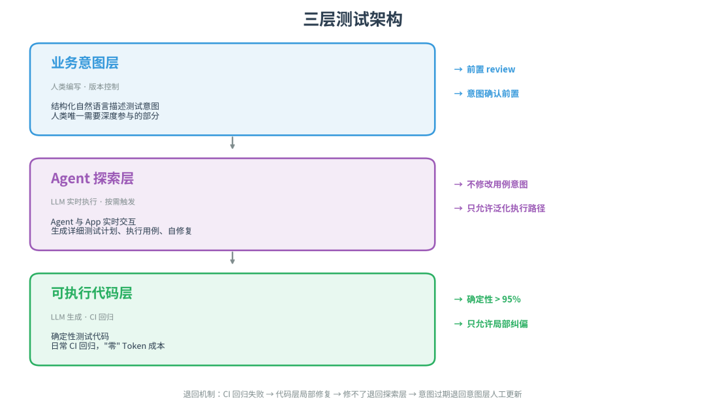

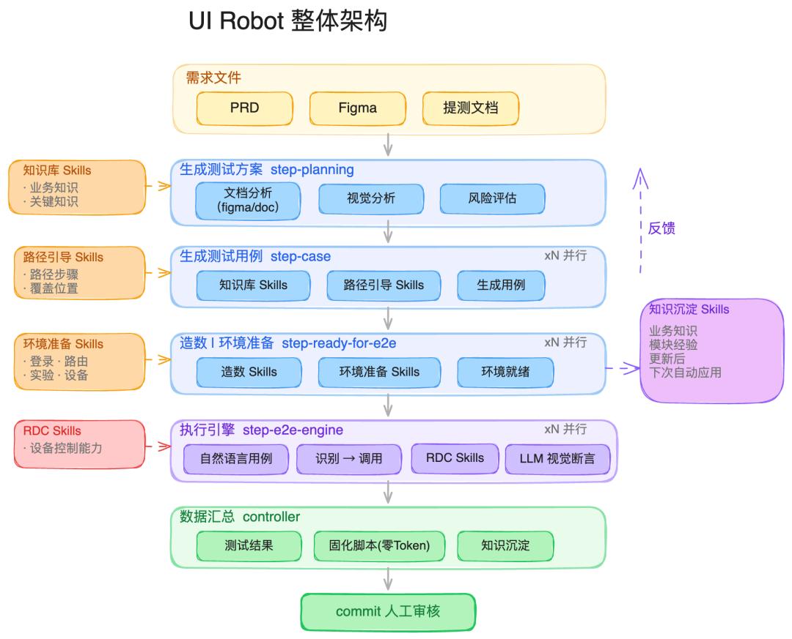

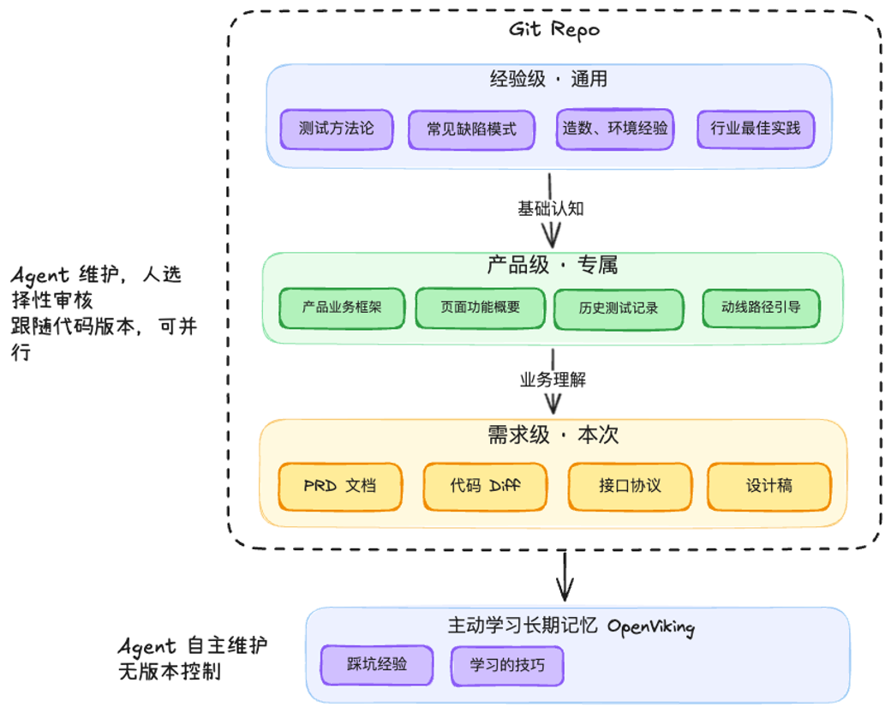

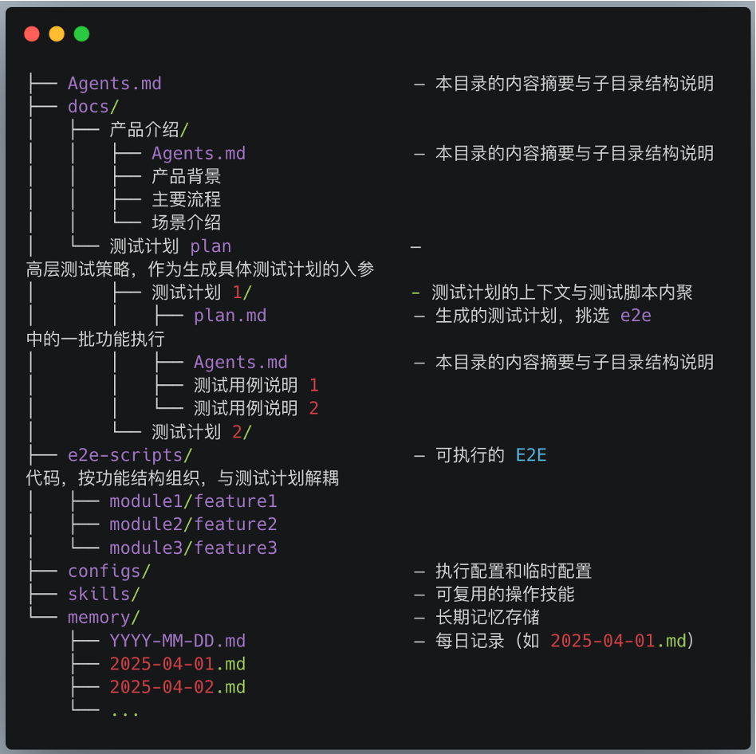

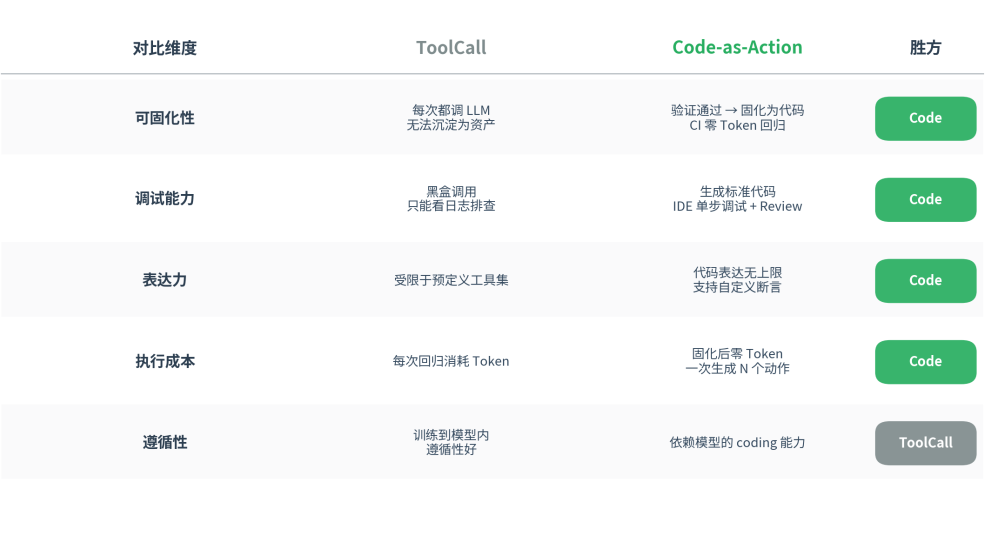

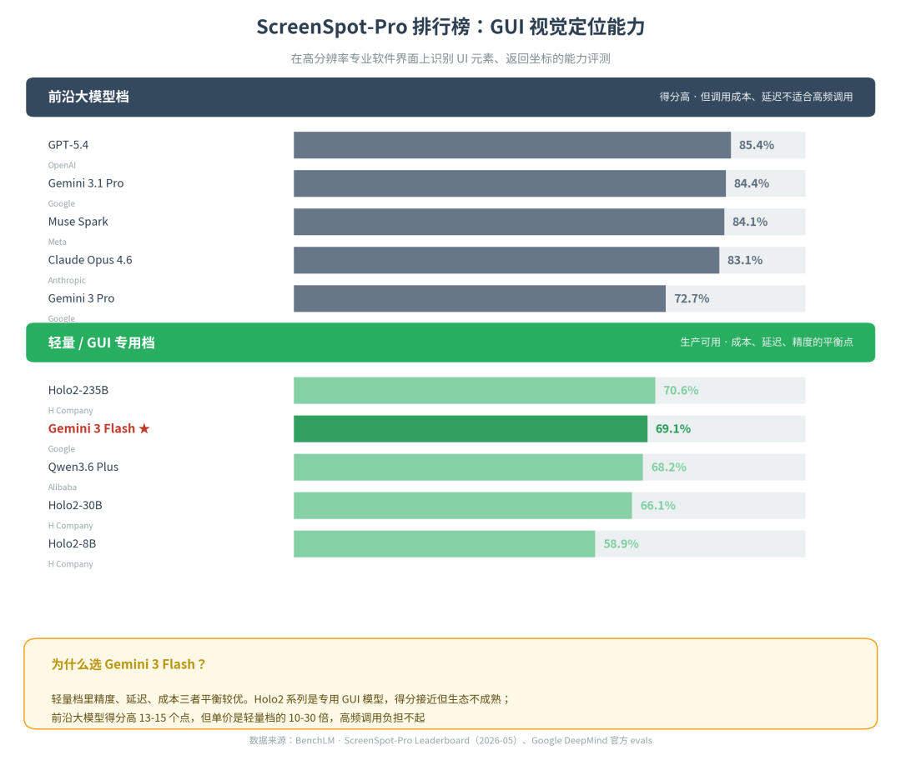

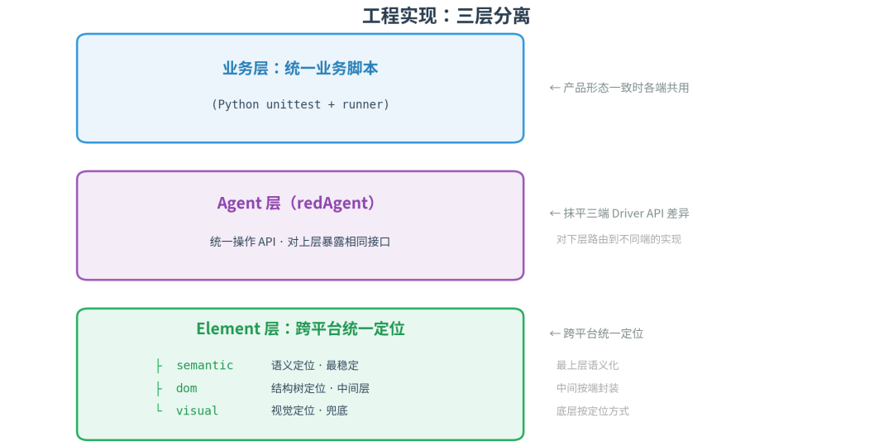

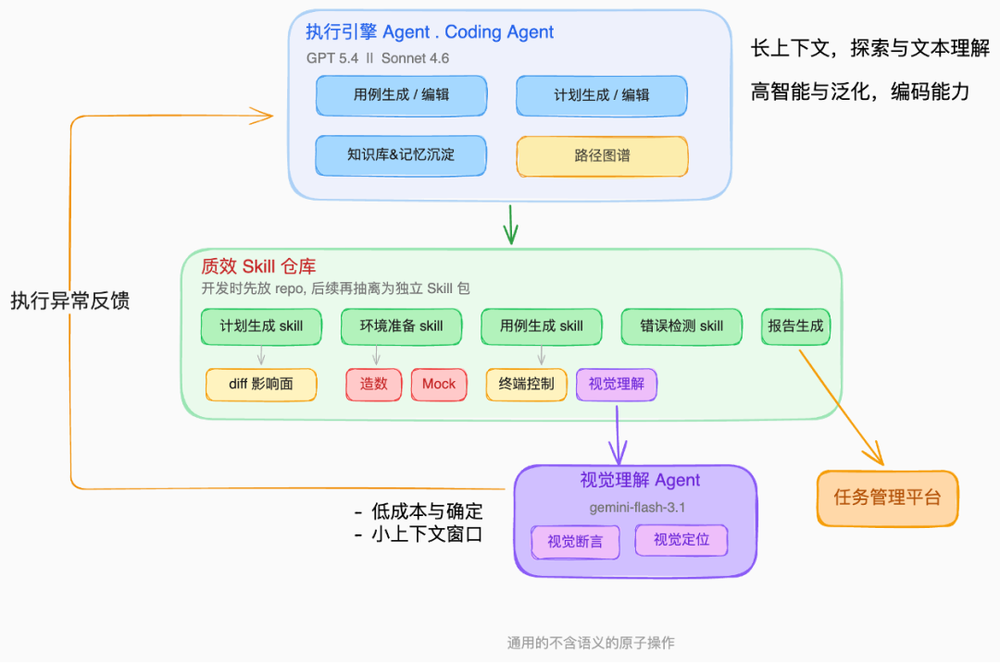

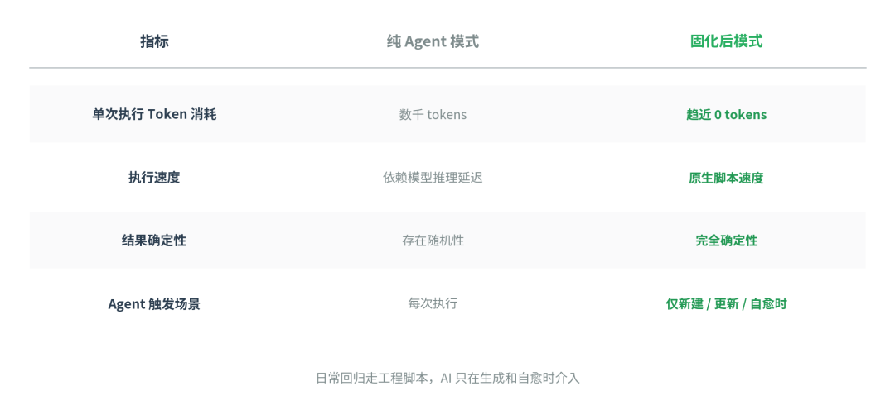

本文整理自小红书质效研发部在 QCon 北京 2026 的主题分享《小红书 GUI Agent 在智能化测试中的工程落地实践》。
分享聚焦小红书 GUI Agent 智能化测试方向的工程实践—— 从架构选型到生产落地，我们如何把 Agent 接进端到端测试，并在 2026 春节大促期间跑出 4.3w+ 次自动执行，用例生成人工覆盖率 80% 的成绩单。
春节大促期间，小红书主端在两周的窗口里完成了 4 条业务线（激励、搜索、发布、社交）3次发版。过去这种节奏下，兼容性测试的主力是人工——QA 工程师拿着不同机型一台一台地点。
今年这一轮我们换了打法：106 种设备 × 128 个测试场景，全部交给 Agent 自动跑。最终的成绩单是这样的：
指标
数据
口径
累计自动化执行
4.3 万+ 次
含 CI 回归 + Agent 探索
自动化率
58%
自动化用例数 / 总用例数
AI 用例生成采纳率
82%
人工 review 后保留的用例 / AI 生成总数
兼容性 Bug 自动召回率
68%
自动化召回 Bug 数 / 同口径兼容性 Bug 总数
用例执行稳定性
98%
连续多次执行通过率，已剔除环境/网络异常
单用例执行成本
$1
含模型 token + 设备占用 + 平台资源
固化脚本回归 Token 消耗
趋近 0
CI 回归不再调用主 Agent，视觉子 Agent 按需
用一张图把过去和现在的差别画出来：
一个具体的 case ——给 Agent 一句话：
“启动小红书 APP，搜索香辣鸡腿的美食攻略，找到点赞数超过 1 万的笔记，点赞并评论‘真好吃！’”
Agent 自主完成：启动应用 → 点击搜索框 → 输入关键词 → 滚动查找符合条件的笔记 → 自动处理弹窗 → 点赞 → 评论。执行通过后，整段交互被自动固化为可反复回归的测试脚本——以后每次回归跑的是固化代码，零 Token 消耗。
这套系统的核心思路一句话：把 UI 自动化当 AI Coding 来做——人定义意图，Agent 去探索、执行、演进。
很多团队的真实情况是：覆盖率上去了，但维护成本、适配成本、紧急场景下新用例的人肉兜底并没有真正下降。我们走过三年的路，迭代路径跟行业主流一致：从 YAML 脚本路线（代表产品如 Maestro），到 LLM 驱动的 UI 自动化执行框架（代表产品如 Midscene - Vision-Driven UI Automation），再到今天的 Agent 自主探索。我们在每个阶段都参考了这些公开方案的设计样板，但落到生产上走的是同态的自研能力。
复盘下来，所有问题归到两个根因：
1. 用例稳定性问题。 小红书每周发版，UI 改动是常态。XPath 脚本改一次 UI 就挂一片，文本定位文案变了就找不到。这不是写法优化能解决的，是定位方式本身的稳定性差。
2. 业务理解问题。 测试经验大量沉淀在人脑里：哪些边界 case 容易出问题、测某个功能前要调哪个配置、要造什么数据、去哪几个内部平台准备环境。这些经验散落在仓库 md、内部文档、用例平台、QA 私人笔记里。人尚且要花时间问、要找老同事带，让 Agent 直接做更难。
补充一组团队内部的工时统计：
测试方案与用例撰写占 25%，执行占 60%，横向沟通占 15%（社区质量团队 4 月对 30 名 QA 工时分布的内部统计）。
就算把执行 100% 自动化，也只解决一半问题。业务理解、测试规划、知识积累这些上游工作不解决，自动化只是把同一台戏台扛在更累的肩膀上。
围绕第一个问题，我们把常见的定位方式按"抗 UI 变更能力"从弱到强排了一下：
但反过来，执行确定性恰好相反：坐标点击最稳定可复现，语义理解最容易点错。定位方式越不怕 UI 变更，执行确定性反而越低。
整套架构要回答的第一个矛盾就在这里。
确认“语义理解”是稳定性的方向后，最朴素的思路是：把 PRD、设计稿、截图全喂给一个大模型，让它自己去测。
我们试过。三个技术约束很快把这条路堵死：
1. 视觉推理模型太贵太慢。 每一步操作都要让视觉模型看一次截图、判断一次状态、决定下一步——一个 10 步的用例就是 10 次视觉推理。按 Opus 这个量级模型当前的 Token 单价（输入 $15 / 输出 $75 per M token），哪怕只构造一个 5 步左右的用例就要 $5（包含多轮截图输入、状态判断、动作生成的综合口径），长期跑不起。
2. 上下文窗口完全不够用。 小红书 App 一个完整业务流程涉及的 PRD、设计稿、历史用例、相关代码、平台文档，全塞进一个 Agent 的上下文里根本装不下；强行塞下，模型也会被信息淹没，专注度急剧下降。
3. 视觉模型在复杂场景下专注度差，还会自作主张。 我们交过学费——评论、评论列表的 Case，纯视觉方案在上下文一多就开始走偏：页面同时出现多个相似按钮，模型选错；图片右下角是“点赞”还是“收藏”，模型按预训练数据的先验猜了个错的。
更刁钻的是断言场景。看一个真实 case，断言意图就是“页面上要出现‘竹子’两个字”：
“竹子”明明白白印在标题位置，但 AI 给的失败理由是："页面识别结果是‘竹子’，但您提供的'玉簪植物'并非竹子，属内不能等同于种"——它根本没去比对页面上有没有“竹子”二字，而是把页面里的中文名和学名同时看进去，自动升级成了一次植物学本体推理，发现“竹子”和“Hosta sieboldiana”属种对不上，直接判失败。
这就是纯视觉方案的另一个天坑：人写断言时默认的语义边界是“字面”，但 LLM 默认的边界是“它能想到的最深一层”。模型越强，越倾向于做超出预期的推理，断言通过率被一种你没法预测的方式不停往下拉。
直接喂模型的本质：把贵的事重复做 N 遍，且做不准。
既然单个大模型解决不了，核心思路就两条：
按上下文分层：把不同抽象层级的信息切开，每一层只处理它该处理的内容。
按模型分工：哪些用 Coding Agent + Skill，哪些用自研小 Agent + ToolCall。
这两条原则贯穿整套系统。
我们按上下文和确定性把测试流程切成三层，意图模糊性尽量在早期解决：
业务意图层——结构化自然语言描述“测什么”。人类唯一需要深度参与的部分，前置 review，意图确认前置，版本控制。Grounding 在这一层锚定，不允许 Agent 修改。
Agent 探索层——Agent 与 App 实时交互，负责“怎么走通”。LLM 按需触发，核心约束是不修改用例意图，只允许泛化执行路径。意外弹窗、页面变更，在不改变原始目标的前提下自主处理。
可执行代码层——确定性测试代码，负责“跑起来不花钱”。日常 CI 回归零 Token，确定性 > 95%，只允许局部纠偏。
三层之间有明确的退回机制：CI 回归失败 → 代码层局部修复 → 修不了退回探索层重新探索 → 意图过期退回意图层人工更新。
放到端到端流水线上看，需求文档、PRD、设计稿进入系统 → 生成测试方案 → 生成测试用例 → 造数与环境准备 → 执行引擎 → 数据汇总与人工审核。每一步都挂载对应的 Skills，最终把验证通过的执行过程沉淀为低成本的回归脚本。每一层都有自己独立的上下文和 skill，保持 Agent 自身的专注力和可测性，每一层 Agent 将上下文压缩为下一层 Agent 的上下文，从而消费掉庞大的 context。
贯穿全文的一条判断：
Coding Agent + Skill 用在需要沉淀为资产的地方（意图理解、执行代码生成、知识管理）； 自研小 Agent + ToolCall 用在不需要固化的原子感知操作上（视觉定位、终端控制、断言判断）。
意图理解这一层我们走的是 Coding Agent + Skill 路线。原因很直接——意图是要沉淀为资产的：要被版本控制、被 review、被复用、被持续迭代。这种性质天然适合用代码仓库来管。额外的好处是：意图、路径、Skill 一旦沉淀在代码仓库里，它们本身就变成了研发上下文。未来要往 TDD 方向延伸——把测试意图反向喂给 Coding Agent 驱动开发——能力和上下文已经原地就绪。
具体做法三条：
1. 结构化自然语言 + 版本控制。 用例不是写"启动 App、点一下、滑两下"，而是写"启动小红书 APP，搜索香辣鸡腿的美食攻略，找到点赞数超过 1 万的笔记，点赞并评论'真好吃！'"。这种结构化的自然语言被存在 git 仓库里，跟代码一起 review，跟代码一起演进。
2. Grounding 锚定，Agent 不允许修改意图。 Agent 探索层在执行过程中可以泛化路径——弹窗自己关、页面变了自己绕——但不能改变测试目标本身。这是一条硬边界，避免 Agent 越权"自我合理化"，把跑不通的用例擅自改成能跑通的别的用例。
3. 文件仓库 + 外置知识库的组合。 高频协作的核心 skill、用例模板、操作图谱跟代码放一起，享受 git 的版本管理；体量大、更新频繁的业务文档、历史 bug 库放外置知识库（基于字节火山引擎 Viking 团队开源的 OpenViking 框架搭的内部实例），按需检索。
知识库分三层：
经验级（通用）：测试方法论、常见缺陷模式、造数环境经验、行业最佳实践。跨产品通用，迁移到任何 App 都能用。
产品级（专属）：小红书自己的业务框架、页面功能概要、历史测试记录、动线路径引导。只服务一个 App。
需求级（本次）：本次需求的 PRD、代码 Diff、接口协议、设计稿。跟着代码版本走，每个需求一个文件夹。
可固化、需 review 的知识以文件形式跟代码并排存在仓库里（体量大、更新快的走上述外置知识库，按需召回）：docs/ 放业务文档和测试计划，e2e-scripts/ 放可执行测试代码，skills/ 放可复用的操作技能，memory/ 按日期记录长期记忆。Agent 通过 Agents.md 知道这个项目怎么做，通过 skills/ 调用具体能力，通过 memory/ 保持跨会话状态。
为什么没用向量数据库？ 三个原因。一是想要最容易让人参与和审核的方式——RAG 系统调试黑盒、维护成本高，而文件目录结构 Agent 也能看懂、人也能看懂、git 也能管。二是 Coding Agent（Claude Code 这一类）本来就特别擅长在结构化目录里 grep / glob / 按路径跳转，相当于天然就有了一套高质量检索能力，再上一层向量索引反而是负优化。三是体量上根本不需要——面向一个具体产品，所有 PRD、设计稿、历史用例、页面图谱加起来也就几 GB 量级，一个 repo 装得下。向量数据库更适合跨产品、跨部门、规模更大的语料检索，面向单一产品是杀鸡用牛刀。
知识库的生命周期是人机协作：早期靠人填充；使用过程中 Agent 自动沉淀，每个任务完成后自动总结入库；人随时可以把想法和经验告诉 Agent。很多团队不维护知识库，本质是因为维护成本太高——Agent 大幅降低了这个门槛。
意图理解解决了“测什么”，路径规划解决“怎么走过去”。
小红书 App 的交互复杂度很高，Agent 走到一个弹窗里就可能开始深度遍历回不来。“个人页”和“评论历史”两个入口长得很像，模型容易点错。这类问题不是模型不够聪明，是它不知道这个 App 的固定动线长什么样。
我们的解法是构建操作图谱——一个 App 页面之间的有向图，每个节点包含触发路线、deeplink、布局结构、核心动线。支持上传 PRD、设计稿或连续截图自动生成。
路径引导的核心价值不是帮模型找路更快，而是把 GUI Agent 从“看图猜操作”变成“按已知路径验证”——同时压制三类高频幻觉：
错页操作：Agent 自以为在 A 页其实在 B 页。
错点控件：多个相似控件选错。
误报缺陷：把正常的页面跳转判断成异常。
图谱区分三种情况：确定有的路径优先走；AI 推导的路径打 ⚠️ 标记；图谱空白的路径自动反馈给维护同学。
为什么没上向量数据库？ 同样的理由（见上一章），路径图谱也用文件形式内置到仓库里。我们围绕图谱直接提供路径分析、路径召回、页面概要召回等 skills，主 Agent 通过 skill 调用；这些文件本身就在仓库里，Coding Agent 也能直接 grep 索引到。
Deeplink 在这套体系里还扮演了一个连接角色——它把代码、造数、配置平台关联起来，Agent 不需要从首页一步步点进去，可以直接跳转到目标页面。
实测效果：存量路径召回 100%，增量路径召回 75%，高置信度路径占比 90%。换成业务语言：每 10 条新增需求带来的页面跳转，AI 能直接给出 7-8 条可信路径，剩下 2-3 条由人工 review 后入库。
精确执行是这套架构里唯一一个反直觉的选择——前面意图层、规划层都用 Coding Agent + Skill，到了执行层我们反而拆出来一个用 ToolCall 的视觉子 Agent。
为什么？ 因为执行层的工作本质是一次性的原子感知操作：给一张截图，找出"点赞按钮"在哪儿，返回坐标。这种操作没有沉淀价值（每次截图都不一样）、没有调试价值（看坐标对不对就行）、也不需要表达力（输入输出就两个字段）。Code-as-Action 在这种场景下是过度工程，ToolCall 反而更合适——一次调用，结果立返。
回到那条贯穿原则：Code-as-Action 用在需要固化的业务流程上，ToolCall 用在不需要固化的原子感知操作上。
6.1 业务流程怎么固化：Code-as-Action
很多 GUI Agent 走 ToolCall 路线，每步操作一次 LLM 调用。我们一开始也这么做，踩了一个大坑：成本爆炸 + 无法沉淀。每做一个行为就是一次模型请求，10 步用例 = 10 次 LLM 调用，执行到第 8 步失败了往往要从头重新生成。
转向 Code-as-Action 后：让 LLM 直接生成可执行测试代码，引导模型一次性生成多个步骤，验证通过后固化为代码，CI 零 Token 回归。
维度
ToolCall
Code-as-Action
可固化性
每次都调 LLM，
无法沉淀
验证通过 → 固化为代码，CI 零 Token
调试能力
黑盒调用，
只能看日志
标准代码，IDE 单步调试 + Review
表达力
受限于预定义工具集
代码表达无上限，支持自定义断言
执行成本
每次回归消耗 Token
固化后零 Token，一次生成 N 个动作
遵循性
训练到模型内，
遵循性好
依赖模型的 coding 能力
可固化、调试、表达、成本四个维度都倒向 Code-as-Action，遵循性的短板我们用自然语言 SDK 补上：封装一套语义粒度的操作函数，向上保可读性，向下保泛化能力。不是让模型写 driver.click(314, 54)，而是提供 tap_element(“点赞按钮”) 这种语义级 API。
6.2 原子感知怎么做：视觉子 Agent 的三层 Fallback
视觉子 Agent 我们选的是 Gemini 3 Flash。这里要说清楚选型逻辑——不是因为它是 GUI 视觉定位能力最强的模型，而是因为它在我们能负担得起的成本区间里，定位能力足够好。
打开 ScreenSpot-Pro 这个在业内较为权威的 GUI 视觉定位评测集（考验模型能不能根据自然语言指令，在高分辨率专业软件界面上准确定位到具体 UI 元素的坐标），排名大致是这样：
几个关键判断：
前沿大模型档（GPT-5.4 / Gemini 3.1 Pro / Claude Opus 4.6 / Muse Spark）得分 83-85%，明显领先，但单价是轻量档的 10–30 倍。我们这套架构下视觉子 Agent 是高频调用的原子能力，这个价位撑不起。
轻量 / GUI 专用档里，Holo2-235B 得分最高（70.6%），但它是专用 GUI 模型，生态成熟度、调用可用性、后续迭代节奏都不占优。Gemini 3 Flash 以 69.1% 在轻量档中仅次于 Holo2-235B，背后是 Google 的生态、推理基础设施和联调能力。
选 Gemini 3 Flash 还有一个“反向”原因：它自身有两个在别的场景会要命的短板——长上下文下注意力会发散，coding agentic 能力也很一般。但这两点恰好不是视觉子 Agent 关心的：它的工作只有一件——给截图和指令，返回坐标。上下文短、不多步推理、不写代码，完美绕开它的弱项。
反过来说，正因为这些短板，它不能承担主 Agent 的角色——业务理解、计划生成、代码合成必须交给主 Agent（GPT / Sonnet 量级）。这也是 6.3 双 Agent 架构的根因：用最贵的模型去思，用最便宜且足够准的模型去看。
更关键的一点：单看裸模型分，Flash 比 Pro 低 15 个点（69.1% vs 84.4%）；但落到我们生产线上，单步执行成功率被工程化手段抬到 ~90%（这里只统计元素定位 / 点击这一类原子动作，不等同于整条用例稳定性），跟直接用 Pro 量级的模型几乎打平。这 15 个点的差距，是被语义 + DOM + 视觉三层 fallback、路径固化、知识库引导这一整套配套工程吃掉的——视觉模型只在前两层都失败时才被调用，且每次都带着精确到 ROI 的截图和明确指令。换句话说，架构在替模型做题。这才是这个选型真正划算的地方：单价砍到 1/10 到 1/30，单步成功率不掉点。
回到原子感知本身，元素定位走三层 fallback：
层级
方式
适用场景
语义理解
根据自然语言描述理解元素含义
跨版本、跨端，最稳定
DOM 结构
解析控件树，结构化定位
元素有明确 ID 或层级关系
视觉识别
截图 + 视觉模型定位
语义和 DOM 
都失败时兜底
三层叠加，抹平端差异。
工程上落到代码，整个执行引擎做了同样思路的三层分离：
业务层（Python unittest + runner）：产品形态一致时各端共用脚本。
Agent 层（团队自研的统一 Driver 抽象）：抹平 Android / iOS / 鸿蒙三端 Driver API 差异，对上层暴露相同接口。
Element 层：跨平台统一定位，落地 semantic / dom / visual 三种策略。
业务层写一次，Agent 层抹平差异，Element 层提供三种定位策略的 fallback。三端跑同一套业务测试脚本，不需要三套代码。
6.3 为什么必须双 Agent 协作
执行引擎拆成主 Agent + 视觉子 Agent，本质是成本和精度的矛盾：
主 Agent（GPT / Sonnet 量级）：负责代码理解、PRD 理解、测试计划生成、大上下文处理。做"想"的事情。
视觉子 Agent（轻量视觉模型）：低成本、高成功率的精确元素定位。做"看"的事情。
中间挂着一个质效 Skill 仓库——计划生成、环境准备、用例生成、错误检测、报告生成。Skill 承上启下：上层 Agent 不需要直接接触底层细节，下层视觉模型也不用关心业务语义。每个 Skill 都是一个明确的输入输出契约。
如果全用主 Agent，成本扛不住；如果全用视觉模型，业务理解不行。各司其职。
视觉模型的真实天花板，我们也是交了学费才看清：
业务不理解：基模不知道在小红书语境里"右下角图标"是收藏不是点赞。
断言上的语义溢出：模型容易把字面比对自动升级成本体推理（第二章 #3 那个"竹子" case 就是典型）。
复杂 Case 专注度差：纯视觉方案在长上下文下，专注度反而下降。
应对方式：在 prompt 中注入业务知识引导（如“结算页包含地址模块、商品信息、支付方式”），用主 Agent 生成详细的计划和上下文，视觉子 Agent 只需要按明确指令去看和点。
6.4 回归成本：朝零 Token 的方向逼近
执行通过后，整段交互被自动固化为可反复回归的测试脚本。以后每次回归跑的是固化代码——不再调用主 Agent 生成动作，速度回到原生脚本水平，主路径接近原生脚本的确定性。
关于成本，要说实话：“零 Token”是方向，不是当前已经稳定达成的状态。固化代码本身不再消耗主 Agent 的 token，但视觉子 Agent 在元素定位时仍会按需调用，自愈、新建、更新场景下也会回到 Agent 路径。我们目前的回归成本已经压到很低，单用例 $1 这条数据就是这么来的；要做到字面意义的零 Token 回归，还要看后续执行引擎的缓存策略和定位结果固化怎么演进。
日常回归走工程脚本，AI 只在生成和自愈时介入。整体是一套方案，不是两套系统。
技术方案每家都能讲，踩坑可能对大家更有参考价值。这里只讲两个我们才上手时没预料到、现在看反而有点反直觉的点。
1. 评测集不是迭代的正确姿势。
入场很容易被误导去刷公开 bench——ScreenSpot-Pro、AndroidWorld、Mobile-Agent-v3、A3 Arena。你会发现为了把这些集上的分数往上抬，很多报错被你“针对性”修复进了代码里，本质是为评测集过拟合。
我们现在的姿势是：评测集只作为能力基线和能力牵引，不作为优化目标。真正的迭代燃料是这 12.3 万+ 次生产执行里跑出来的 bad case——按业务场景分类沉淀为用例集，持续攻克。提示词、上下文、路径这些能力，只有在真实业务场景里才能长出来。
为什么反直觉：因为 benchmark 指标是最好汇报的东西，业务压力一大就会不自觉地过去抠两个点。但生产执行成功率跟 bench 成绩之间根本不是线性关系。
2. 纯探索路线行不通：必须务实回退。
我们一开始想做长期路线——完全智能的探索性测试。很快发现行不通：基于 UI 图像的方式无法召回所有问题；Agent 纯探索不能理解业务，容易跑偏绕远再回来；人工介入时需要明确的测试边界。
纯探索阶段我们的执行成功率只有 50%，切换到自然语言指令驱动 + 知识库引导后提升到 78%。现在很多场景已经并入 Coding 工作流：Testing 和 Coding 共享同一套上下文。
但务实回退不等于永远退回到这：如果未来视觉模型的准确率足够高、成本足够低，路径引导的覆盖面可以显著收窄，让人工标注的投入主要压在长尾动线上。当下这个模块不可或缺，但我们从第一天起就清楚——它是阶段性的工程补偿，不是终局形态。
春节大促场景验证通过后，同一套架构正在向搜索、IM、广告铺开——一套方法论，驱动全 App 质量体系。
更远的目标是质量动作前置：Agent 介入需求评审阶段，从读懂 PRD 到生成用例，Testing 和 Coding 共享一套上下文。测试不再是研发末端的补丁，而是融入到完整的研发过程中去。
每次执行都是学习机会——故障复盘、对话记录自动入库，知识图谱持续生长，系统越跑越聪明。
最底层的判断只有一句：
“测试”作为一个工种在收敛，“测试”作为一种能力在扩散。
过去因为人力、预算、优先级被牺牲掉的那部分质量，正在被重新放回每一个软件项目里。AI 不是在缩减测试，是在让测试真正发生。
小红书质效研发部，肩负着以 AI 重构公司级下一代研发体系的使命。我们希望基于 AI 技术，打造全新版本的研发工具，结合 LLM 辅助、LLM 原生能力，串联从需求理解到发布部署的全流程，为小红书的技术团队提供业界顶尖的“武器装备”；同时希望通过这些“武器装备”，让每一位小红书的研发人，都有机会成为 AI Native 时代下的“超级个体”。
AI Coding 团队，专注于 AI Coding 与 GUI 智能化方向的技术攻坚与规模化落地。核心方向有：
●GUI Agent 执行引擎与 Coding Agent 架构
●分层知识库与路径引导系统
●AI Coding  harness 与解决方案
我们正在寻找对 AI Agent、智能化测试、GUI 自动化方向有热情的同学。如果你做过 Agent 工程化、LLM 基础设施，或者想把 LLM 真正落地到具体业务，来聊聊。
📮 内推简历投递：
wangruiwen1@xiaohongshu.com，Agent 研发/产品/算法岗位，社招、实习生均可投递。