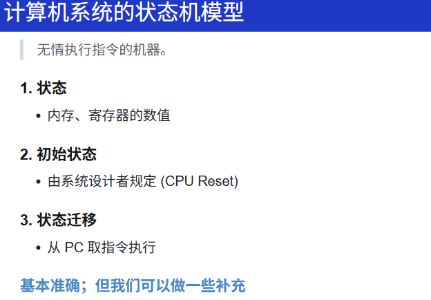
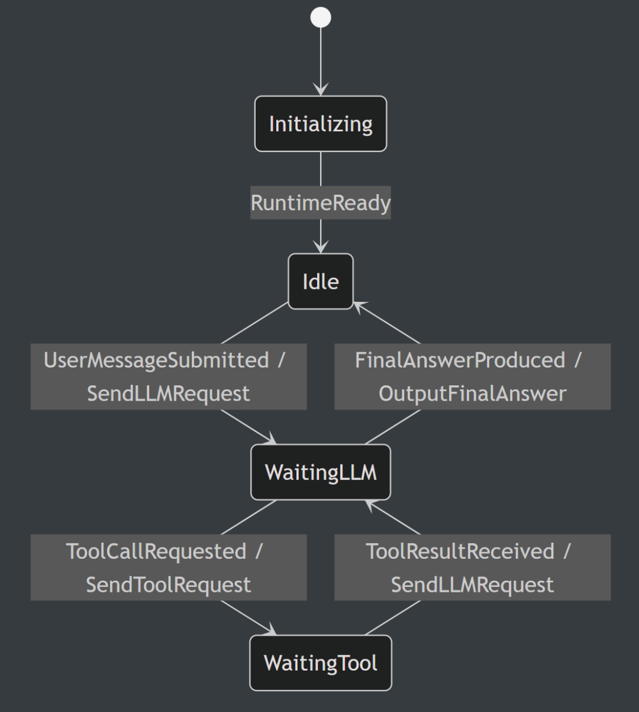

> 原文链接：https://mp.weixin.qq.com/s/ylAI6ceodDPa6pvrDFBmDw

# 状态机视角下的 Agent Runtime

字数 1837，阅读大约需 10 分钟
状态机视角下的 Agent Runtime
LLM 是能力本体，inference 让它跑起来，serving 让它服务化，Agent 让它围绕用户目标行动起来。本文将只涉及 Agent 层面。
我们平时说 Agent，容易把注意力放在 LLM 本身：模型会不会推理、会不会调用工具、回答质量怎么样。
但在 Codex、Claude Code、OpenCode 这类系统里，LLM 只是其中一部分。真正把用户输入、模型调用、工具执行、权限确认、最终输出串起来的，是外层的 harness，也就是 Agent runtime。
本文想讨论的不是模型能力，而是这个 harness 的控制流：它如何判断当前是在等用户输入、发起模型请求、等待工具结果，还是输出最终答案并回到等待下一轮输入的状态。
从工程上看，Agent 不只是模型能力本身，而是一段围绕 LLM、工具、用户消息运转的 runtime。
这个 runtime 做的事情可以很朴素：
• 接收用户输入
• 发起 LLM 请求
• 根据 LLM 的输出决定是否调用工具
• 把工具结果放回上下文
• 再次发起 LLM 请求
• 直到输出最终答案
所以，Agent runtime 的本质不是包装一次 LLM 调用，而是不断接收事件、更新状态、决定下一步动作。
这就是状态机适合描述 Agent 的原因。
什么是状态机
第一次接触这个概念，是在蒋炎岩老师的操作系统课上面（或许之前数电课也有讲过，但我没有什么印象了）
以下为蒋老师的课程 ppt 中的图片，大概的意思就是，当前状态 + PC 指向的指令 -> 执行 -> 下一状态。
状态机 state machine
• 状态 state：runtime 当前处在哪个阶段
• 事件 event：外部或内部发生了什么
• 状态转移 transition：事件触发后，runtime 切到哪个状态
• 行动 action：切换过程中要执行什么副作用，比如发起 LLM 请求、执行工具、输出答案
状态机不是为了把事情讲复杂，而是为了把“什么时候该做什么”讲清楚。
Agent 状态机
注：这里讨论的不是 Agent 的全部内部状态，而是 Agent runtime 的高层控制状态。完整状态还包括对话上下文、工具结果、外部环境等，这些更像是扩展状态，不放进下面这个最小控制状态机里。
如果你要实现一个 Agent runtime，你不能只关心 prompt 怎么写。你必须知道当前系统处在哪个阶段：是在等用户输入、等模型返回、等待工具结果，还是已经输出最终答案并回到等待下一轮输入的状态。
下面是一个最小状态机：
• Initializing：加载配置、模型、工具、上下文
• Idle：等待用户输入
• WaitingLLM：LLM 请求已经发出，runtime 正在等待模型返回
• WaitingTool：工具请求已经发出，runtime 正在等待工具结果
下面展示了不同状态之间的流转：
• 在命令行输入 codex/opencode/claude 后，Agent 进入到 Idle 状态，此时，Agent 在等待用户提交 message
• 用户提交 message 后，runtime 先发起 LLM 请求，再进入 WaitingLLM 状态，等待模型返回下一步
• 如果模型请求调用工具，则发起工具请求，进入 WaitingTool 状态，等工具结果回来后，重新发起 LLM 请求，并回到 WaitingLLM 状态
• 如果不调用工具，则输出最后的答案，回到 Idle 状态，等待下一轮输入
这个状态机里最重要的循环是：
WaitingLLM -> WaitingTool -> WaitingLLM
这正是 tool-calling Agent 的核心控制流。LLM 不直接改变外部世界，它先提出 tool call；runtime 观察到这个事件，发起工具请求并进入 WaitingTool；工具结果回来后，runtime 再把结果交给 LLM，让模型继续决定下一步。
所以 Agent 不是单次 LLM 调用，而是一个循环：
user message -> llm -> tool -> llm -> tool -> ... -> final answer真实 runtime 还会增加哪些状态
上面的状态机只描述主流程。真实 Agent runtime 里，还会遇到一些其他控制问题。它们不一定都应该建成 state，需要看 runtime 是否真的会停在那里等待下一类事件。
比较适合建成 state 的有：
• WaitingApproval：高风险工具调用需要用户确认，runtime 暂停推进，等待 ApprovalGranted 或 ApprovalDenied
• Paused：runtime 主动暂停，等待用户继续或外部资源恢复
有些更像 event 或 action，不一定要建成 state：
• 流式输出：通常是 WaitingLLM 内部不断处理 LLMChunkReceived 事件；只有需要单独支持中断或 UI 状态时，才建成 StreamingAnswer
• 取消任务：CancelRequested 是 event；Cancelling 可以是短暂状态；取消完成后通常直接回到 Idle
• 请求失败：LLMRequestFailed 或 ToolFailed 是 event；如果只是输出错误再回到 Idle，不需要单独的 Failed 状态
• 上下文压缩：如果压缩是一个耗时过程，可以建成 CompactingContext；如果只是发起下一次模型请求前的一步处理，就不需要
最小状态机解释主流程，扩展状态解释真实系统里的控制问题。
例如，当模型请求执行 rm -rf 这类高风险命令时，runtime 不能直接发起工具请求，而应该先进入 WaitingApproval。只有用户确认后，状态才会转移到 WaitingTool。
再比如用户按下 Ctrl-C，这不是 LLM 内部的事情，而是 runtime 收到了 CancelRequested 事件。此时系统可以短暂进入 Cancelling，清理完成后回到 Idle。
这些控制问题用状态机描述会更清楚。
这个视角有什么用
状态机视角的价值在于，它把 Agent 从一个模糊的概念，变成了可以实现、调试和扩展的控制流。
• 第一，更容易实现。每个状态只处理自己关心的事件。Initializing 只需要处理初始化完成，Idle 只需要处理用户输入，WaitingLLM 只需要处理模型响应，WaitingTool 只需要处理工具结果。
• 第二，更容易调试。当 Agent 出错时，我们可以问：它卡在哪个状态？收到了什么事件？为什么转移到了这个状态？这比一句“Agent 出错了”更可定位。
• 第三，更容易加功能。权限确认、中断、重试、上下文压缩，都可以作为新的状态或事件加入，而不是散落在一堆 if else 里。
从状态机视角看，Agent 不再是一个模糊的“智能体”，而是一段可以实现、调试和扩展的 runtime 控制流。LLM 提供能力，工具连接外部世界，而状态机决定这些能力什么时候被调用、调用之后系统走向哪里。
参考资料
• baby-agent：后端工程师的 Agent 入门项目[1]
• 计算机系统的状态机模型——蒋炎岩南京大学[2]
引用链接
[1] baby-agent：后端工程师的 Agent 入门项目: https://github.com/baby-llm/baby-agent
[2] 计算机系统的状态机模型——蒋炎岩南京大学: https://jyywiki.cn/OS/2026/lect3.md