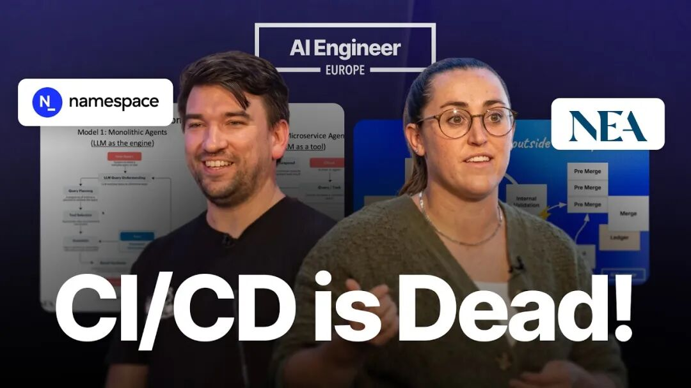
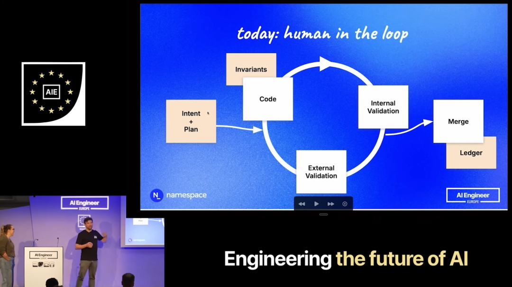
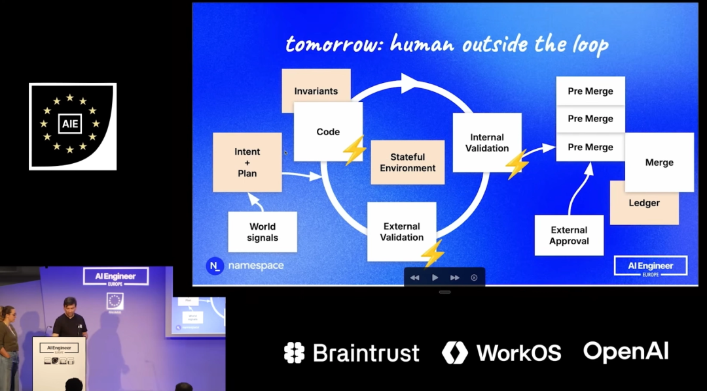

> 原文链接：https://mp.weixin.qq.com/s/52bCkS6VQMWuLCJ_6nmODA

# CI/CD 又被杀死了？

Hugo Santos 统计过自家 Namespace 团队最近的变更量,按过去 Pull Request 的口径算,是原来的 4 倍。人类不可能再评审得完每一个 PR。这不是一家公司的特例,GitHub 上过去几个月的 Commit 曲线也几乎是垂直拉起的。
这是 Madison Faulkner 和 Hugo Santos 在 AI Engineer 大会上那场 18 分钟联合演讲的起点。他们提了一个偏激的论断,CI/CD 已死,「Continuous Compute(持续计算)」才是接替者。Madison 是 NEA 的合伙人,主投数据基础设施和开发者工具,此前在 Facebook、Greycroft、Thrasio 都带过数据与机器学习团队。Hugo 是 Namespace Labs 的 CEO 和联合创始人,此前在 Google 参与打造 Google 内部开发平台 Boq,这套平台支撑着 Search、YouTube、Workspace 等主力产品。Namespace 今年 3 月宣布累计融资 2300 万美元,由 NEA 领投。所以这对搭档同台,本身也是领投方合伙人和被投公司 CEO 的联合发声。
他们要回答一个很具体的问题。当 Agent 可以并发打开成百上千个 PR,这一套为人类节奏设计的 CI/CD 会在哪里掉链子?Hugo 的答案是 Pull Request、Merge Queue、Human Review 三样都会一起失灵,其中 Merge Queue 的失灵方式,活像高性能数据库里的串行化问题。
Madison 先把问题铺开。人类开发者一周提交一两个 diff,同事评审,GitHub Actions 跑 build、test、deploy,修复失败用例再迭代。节奏慢,但本地缓存是热的,整条链条可预测。换成 Agent 就变了样。同一套系统,N 个 PR、N 个 Repo 同时跑,成千上万条短生命周期的分支把同一代码库往不同方向拽。到某个点之后,把所有版本合回主干变得基本不可能。这是第一块断掉的地方。
Madison 引了一段 Mitchell Hashimoto(HashiCorp 前创始人)的判断。如果让他修今天的 GitHub,第一件事是把 Copilot 关掉,让 GitHub 先完成云化,再大规模支持推理。Madison 自己的推论更直白,必须把 AI 和 Agent 当一等公民服务,否则就会被淘汰。她给出的加速方向有四个动作。入口层做 Ingress Shaping(入口流量整形)加限流;Cache 层上升为编排层;再往上引入 Agentic Identity(给 Agent 一份类似服务账号的身份);最后处理大规模 Retries。这一层是硬件和软件协同设计的事,再加几台 Runner 解决不了。
Merge 越来越像数据库锁库问题
接下来 Hugo 把视角从加速切到工作单元。到目前为止,作为人类的你就是那个 Agent。你脑子里装着一个目标,然后一路穿过所有阶段。提 PR,团队说格式不对回去重做。测试挂了回去改代码。评审说 API 用错了再改。要 Merge 的时候 Merge Queue 告诉你同事抢先一步,你得 rebase 回来再跑一遍。四层循环套在一个主循环里,每一层都把人送回起点。
人类节奏下,这种合入窗口之间的间隔可以很长,因为同一时刻待合入的变更本来就不多。节奏一加快,合入窗口就变成瓶颈。Hugo 在这里给了一个心智模型。Merging 越来越像高性能数据库里的 Serialization(串行化)问题,你有一条单一明细,也就是 Git 仓库,每一次 Commit 都要进入这条明细,为了写入你得先锁库。人类处理时锁的时间长,机器处理时锁的时间短,所以 Time-to-Merge 变成整条流水线的瓶颈。
PR 本来就是为人类评审设计的工作单元。默认反馈是延迟的,默认交接是异步的。CI 的原子职责包括校验有没有引入 Regression(回归问题)、代码是否从一个已知良好的源码状态编译、有没有冲突变更、这次改动是否被授权,这些职责都在围绕 PR 这个工作单元转。一旦 PR 被 Agent 规模塞爆,围绕它设计的所有东西都会一起卡住。
新架构里没有 PR,只有 Intent 和 Plan
Hugo 说他团队今天已经这么工作了,走在前面的客户也都在这么走。新架构没有 PR。起点是「Intent + Plan」,把目标写下来,这就是 Spec。写在 Linear 工单里、Slack 消息里、任何纯文本都行。
Spec 进入一个循环,循环本身是一个「Agent Harness(Agent 的运行框架)」。可能是 Claude Code,可能是 Cursor,可能是 Factory,Hugo 团队日常用的是 Amp。Agent 在循环里 checkout 一个 well-known Commit,这是工程 Invariant(不变量)的第一层保留;然后用 Repo 里已有的资产做「Internal Validation(内部校验)」,也就是 build 加跑测试。做完回头问人类一句看起来行吗还要改什么,人类回 yes 或者 continue。Hugo 在这里的观察是 continue 大概是他们团队现在最常敲的。
Agent 沿着 Plan 继续走,最终完成进入 Merge Queue,再写进明细。这种模式已经很快了,但 Hugo 的判断是还不够快,因为「External Validation(外部校验)」里还需要人来参与。
外部校验交给另一个 Agent
再往前推一步,几周到几个月的时间尺度上,Hugo 描述的是这样一个状态。代码生成更快,本来就快,Inference 只会继续提速。Internal Validation 必须极快,你不能再花 15 分钟、45 分钟甚至任何以分钟计的时间去跑测试,那会把整个循环拖慢。External Validation 不再有人参与。取而代之的是其他 Agent 在评估变更,比如一个专注 Security 的 LLM 看漏洞,一个做 API Conformance 校验的 LLM 看一致性。它们在循环内给反馈,主 Harness 把反馈吸收回代码里。
要让这一切真的变快,Agent 必须跑在有状态的环境里。Memory 很重要,State 很重要。每次从零开始 checkout 仓库、冷启动 Docker、重建 Cache,循环会被进一步拖死。与此同时,外部世界会不断喂信号进来,Plan 变了、别人刚合进去一个变更,Harness 要相应地调整 Intent 和 Plan,开启一个新的循环。
完成之后,由于并行变更太多、团队作为人还没有正式接受这些变更,Agent 会先进入一个前置队列,再写进 Git。Hugo 和他的团队管这个队列叫「Pre-Merge Queue(前置合并队列)」。一堆已经跑完的变更在这里排队,并行变更在这里被调和,保证 Serializability(可串行化),一条接一条回到明细。
这个前置队列才是人类应该介入的地方。人看的是 Intent 和 Result 的对照。这是原来的意图,这是执行出的结果。Result 可能是一段功能跑起来的录屏,也可能是 Security LLM 对这次变更的评估输出。Result 还不必对应一个 Commit 或一个 PR,它可能对应多个 Commit,因为会有多个 Agent 各自独立完成不同 Feature,统统进入 Pre-Merge 被按语义归并成人能消化的颗粒度。Hugo 自家团队目前看到的体量已经是过去 PR 口径的 4 倍,这是他给出的唯一一个硬数字,也是人类评审崩不住这个论断的本质原因。
再往前走一步,Hugo 引入了「多元宇宙(Multiverse)」这个词。如果整套流程足够快,Intent 和 Plan 的起点可能不再是明细末尾的最新 Commit,因为最新 Commit 自己在动,有多个候选。Agent 会同时在多个 Commit 上并行推进同一个 Plan。要让这种状态跑起来,内循环必须极快,资源占用也会爆炸式增长,因为在同时探索那么多候选分支。
CI 没死,位置变了
讲到这里 Hugo 把一开始那句 CI/CD 已死收了回来一半。CI 其实没消失,只是位置变了。CI 原本承担的所有职责都会被拆进循环。代码能不能跑不再是独立阶段,每一次迭代都会走一次校验。Invariant 继续强制,但强制方式改成持续地、每一次迭代都做。比如出于 Compliance 考虑,仍然要保证每次 checkout 都是从已知良好的状态起步,公司里不能有人偷偷塞进未经审核的代码让 Agent 从那里开跑,这些约束一条都不能松。Coordination(变更协调)从 CI 里移出去了,CI 不再引导多个变更、不再确认测试都过才允许 Commit,这份工作变成整个循环的一部分。Governance(治理)也上移到 Harness 里,由 Harness 负责把每一次变更约束到团队编码化的流程上。
所以 CI/CD 这组词眼下面临两种压力。一种是围绕 Pull Request 和 Merge Queue 的那层脚手架正在被 Agent 节奏拉垮,Namespace 这类做加速层的公司尝试先把它撑一段时间。另一种是它的原子职责会全部被吸进 Agent Harness,未来不再有一个独立叫「CI」的阶段,每一次循环都在做校验。Hugo 和 Madison 真正想推的是第二种,他们也承认第一种压力还会持续一阵。
这个判断对正在被 build/test/deploy 时间折磨的团队有直接参考意义。加 Runner 不是答案,根源是那套流水线为人类节奏设计,扛不住 Agent 节奏。如果 Agent 已经在你的 Repo 里每天并发开几十个 PR,测试跑分钟级别就是下一个要命的事,Agent 环境要有状态要持久化,Merge Queue 的调度策略要能容忍同一代码库上的并行变更。人类评审的颗粒度也得上移,Intent 和 Result 的对照取代逐行审 diff。Hugo 在现场给的最后一句话是「It's a crazy world and we need to be ready for it」,用在这里其实就够了。
内容来源,AI Engineer 频道「CI/CD Is Dead, Agents Need Continuous Compute and Computers — Hugo Santos and Madison Faulkner」,YouTube 链接 https://youtu.be/VktrqzQgytY