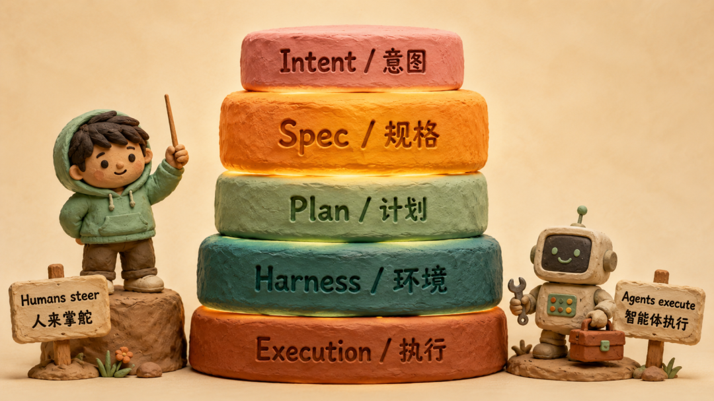
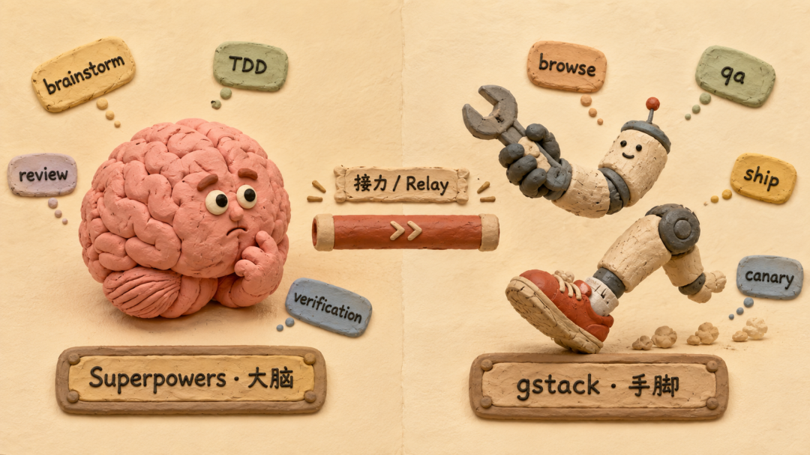
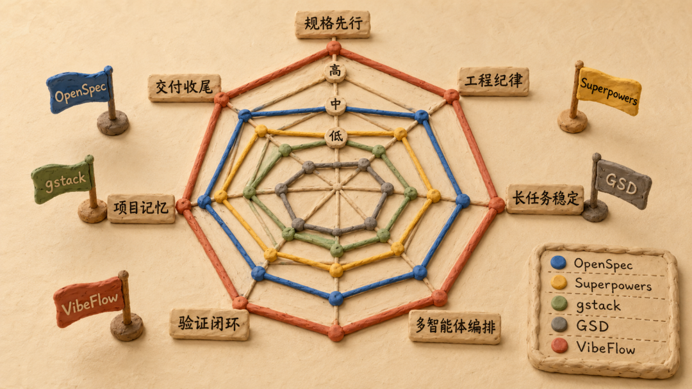
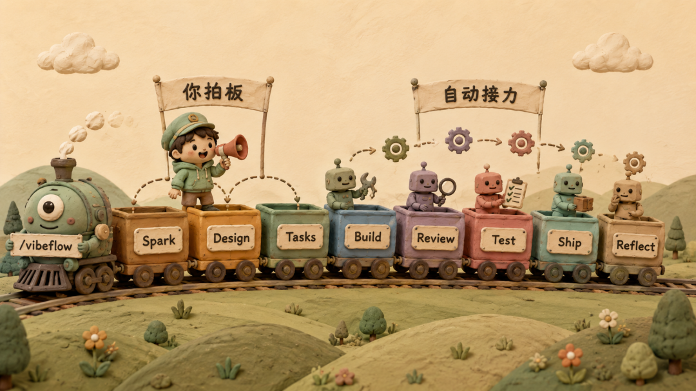
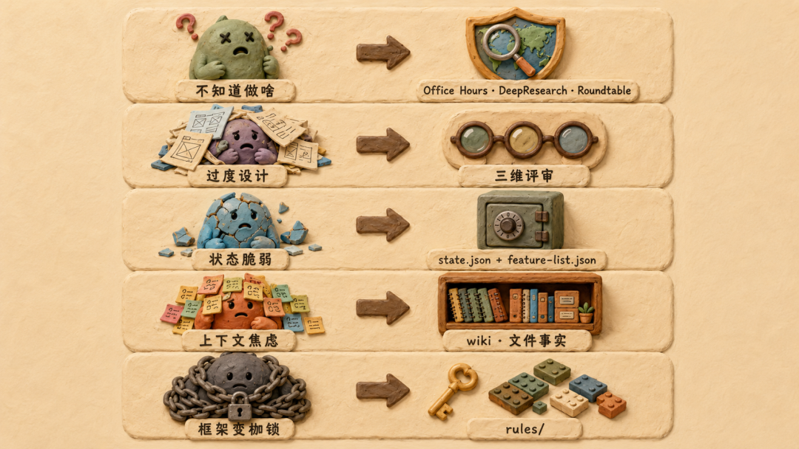

> 原文链接：https://mp.weixin.qq.com/s/ppB5ElgXwOKCfxGQd7hI-Q

# 用了两个月 Superpowers + gstack 之后，我自己造了一个 VibeFlow

最近这两个月，跟同事聊 AI 编程的话题在悄悄变。
前半年大家在比谁的模型更聪明，不会流口水，谁的 Claude Code 写得更快，谁接的 skill 更花。
但这两个月，话题不在生成上了。
讨论的几乎都是另一类问题——
「这个 feature 让 Claude 跑了一晚上，跑完发现需求理解错了。」
「会话窗口被噪音塞满之后 AI 开始反复犯同一个错。」
「测试都过了，QA 一跑直接挂，AI 根本没真的打开浏览器看。」
「明明上一次会话已经讨论清楚了边界，新会话进来又得从头讲一遍。」
很多失败不是模型不会，是开始得太早。
AI 编程接下来真正值得关注的，已经不是模型生成能力，而是工程系统能力。
我自己也踩了同样的坑
我装上了社区里口碑最好的两个 Claude Code 插件——Superpowers + gstack。
一个管思考，一个管执行，配合得很优雅。
但用了一阵之后，我发现一件事——
这两个插件各自能力都很强，但用起来对人的要求并不低。
你得先对 SDD、Harness、TDD、code review 这些工程概念有基础认知，不然根本不知道自己缺什么。
然后用的时候，你还得熟练地记住——
▸ 这个阶段该调哪个 skill▸ 上一步出来之后下一步该接到哪里▸ 什么时候该手动触发独立 reviewer 通道▸ 什么时候该开 /qa
每一步都要自己手动衔接。
skill 强是真的强，但 ——
没有一根线把它们串起来。
我开始想：能不能有一个东西，把这条线编排好，让人只管拍板，剩下的让系统自己接力？
然后撞上了第二个陷阱
差不多在同一时间，我在用大模型聊设计方案的时候撞上了另一个坑。
大模型是个可以陪你聊方案聊到天荒地老的百科全书。
你抛一个想法，它给你十种实现路径。你说我喜欢第三种，它再帮你拆出十种变体。
每一轮看起来都在前进，每一轮看起来都更完整。
但聊到第二天你回头看，会发现——
▸ 项目的边界在被一点点撑开▸ 护城河在变成「我们什么都能做」▸ 设计规范在每一轮叠加里慢慢失焦
这不是模型的问题。是它太愿意配合了。
人的工作量没有减少，反而被倒逼着要做更深度的思考。你必须自己知道这个 feature 的最小边界在哪、护城河到底是什么、什么是非做不可的、什么是看起来很美但应该砍掉的。
否则你会聊出一个无比完整、却完全跑不动的方案。
把这两件事放一起，我意识到一个问题——
AI 编程下一阶段缺的不是更强的 skill，是一个能强制让你想清楚、并且帮你按节奏推进的编排层。
这就是我后来动手做 VibeFlow 的起点。
今天这篇文章按三步走——
第一步：把 SDD 和 Harness 这两个底层方法论讲清楚第二步：聊 Superpowers + gstack 走到了哪一步、还差什么第三步：用 5 个真实痛点，把 VibeFlow 怎么解的每一条都拆开讲
一、SDD 和 Harness：这一轮转向的底层逻辑SDD ＝ 先对齐，再动手
SDD，Spec-Driven Development，规格驱动开发。
它的核心主张特别短——先对齐，再动手。
最早把这件事讲明白的是 Kiro ——
「Tame complexity with spec-driven development, advanced steering, and custom agents」
OpenSpec 那边更直接 ——
「Agree before you build」
翻译成工程一点的话——
别让 agent 在一个模糊输入上高速运行。
这个判断看似不复杂，但能戳穿当前一大半的 AI 编程灾难现场。
需求模糊、决策没沉淀、结果不可验证——这是 Vibe Coding 时代留给生产环境的三件遗产。
Harness ＝ 让 agent 能稳定干活的全套环境
Harness，字面是马具、缰绳，引申过来就是「让 agent 能稳定干活的全套环境」。
OpenAI 那篇《Harness Engineering》里把这件事的定义写得很清楚——
「Humans steer. Agents execute.」
「the team's primary job is no longer to write code, but to design environments, specify intent, and build feedback loops that allow Codex agents to do reliable work.」
三个动作覆盖了一整层之前几乎没人系统讨论过的问题——
▸ design environments ─ 设计环境▸ specify intent ─ 明确意图▸ build feedback loops ─ 构建反馈闭环
我特别喜欢这篇里的另一句话——
「From the agent's point of view, anything it can't access in-context while running effectively doesn't exist.」
翻译过来——
从 agent 视角看，凡是它运行时拿不到的东西，都等于不存在。
一个项目即使 README 写得再漂亮，只要 agent 进来时不会自动读到，就等于没写。
五层模型：差距出现在哪一层
有博主把这一系列观察组织起来，画出过一个非常清晰的五层模型——
Intent layer    —— 用户真正想解决什么
Spec layer      —— 把意图变成可执行规格
Plan layer      —— 把规格变成任务序列
Harness layer   —— 让 agent 可持续工作的环境
Execution layer —— 写代码、跑测试、提交
最底下的 Execution layer 是大家最熟悉的。
但真正在 2026 年开始拉开差距的，是 Spec layer 和 Harness layer。
有博主用一句话点破了这件事——
discipline 越来越多地落在代码之外的结构上。
这就是接下来所有产品都在卷的方向。
二、业界目前一种优雅的实践：Superpowers + gstack
把 Spec layer 和 Harness layer 落到 Claude Code 日常使用上，有博主总结过一个非常贴切的说法——
Superpowers 当大脑，gstack 当手脚。
Superpowers 做了什么
Superpowers 是 Jesse Vincent 团队的一套 Markdown skill 集合，整套系统几乎没有一行可执行代码。
但它做了一件非常关键的事——
把高质量软件工程的工作流，编码成 agent 能严格遵守的 skill。
它内部有十四个 skill，分成三组——
▸ 计划与思考▸ 编码与调试▸ 审查与验证
但 Superpowers 真正值钱的不是它有多少 skill，是其中两个反直觉的设计。
设计一：独立 reviewer 通道
Claude 写完代码不能立刻自我审查，必须新开一个 reviewer 上下文。
原因很简单——同一个上下文里，Claude 已经「代入」了作者视角，自己审自己只会找到自己愿意找的问题。
设计二：verification-before-completion
没有证据的「完成」等于没完成。
测试有没有过、浏览器有没有真的打开看过、QA 报告里有没有红色警告。
这条强制把「AI 说我做完了」变成「AI 给你看它怎么做完的」。
gstack 做了什么
如果说 Superpowers 是方法论，gstack 就是工具箱。
它解决的是 Superpowers 完全不碰的问题——怎么和真实世界打交道。
四块能力 ——
类别能力浏览器与 QA/browse/qa/qa-only发布流水线/ship/land-and-deploy/setup-deploy上线监控/canary/benchmark安全护栏/careful/freeze/guard
这两个插件搭配的精髓一句话——
没有功能重叠，没有 skill 抢匹配。
但用一阵之后，我开始看见它们覆盖不到的地方
我前面说过，开发 VibeFlow 的起点之一，是用 Superpowers + gstack 时遇到的两件事。
把它们拆开来看，其实是 5 个边界——
边界一｜使用门槛很高
你得先理解 SDD、Harness、TDD、独立 reviewer 这些概念，否则不知道自己缺什么。
然后用的时候，你还得熟练记住每一步该接到哪里。每一步都要自己手动衔接。
skill 强是真的强，但没有一根线把它们串起来。
边界二｜Spark 阶段太薄
Superpowers 里「想清楚问题」几乎只靠 brainstorming 一个 skill。
但「想清楚问题」在真实工程里远不止聊一聊那么简单。它至少包含四个动作——
▸ 把模糊需求逼到一个可验收的边界 → 问题框定▸ 在动手前先看市场上别人怎么解的 → 竞品挖掘▸ 在投入资源前先评估值不值得做 → 价值审查▸ 在团队级方向上让多个角色独立形成共识 → 对齐机制
brainstorming 一个 skill 同时承担这四件事，做不深。
边界三｜项目级状态没有归宿
会话关掉，今天做到哪靠记忆。
换一台机器接班，agent 进来等于新员工第一天。
同时跑两到三个 feature——谁也不知道哪个在等 review、哪个卡在测试、哪个该 ship。
边界四｜棕地项目缺记忆
新项目用 Superpowers + gstack 没什么问题。
但接手已有代码库的时候，每次会话进来 agent 都要重新摸一遍架构。
docs 目录写得再漂亮，agent 不会自动读它。
边界五｜质量门禁规模化等于零
覆盖率门禁、变异测试、规格审查这些东西，目前要靠 CLAUDE.md 自己拼。
一个团队里 A 同学写得严，B 同学写得松，复制粘贴是唯一的同步机制。
把这五件事放一起，结论很清楚——
双插件解决的是「AI 写得不像工程师」的问题，但它没解决「团队怎么把 AI 当工程师用」的问题。
需要一层东西，把这五件事统一到一个项目级的控制面里。
三、把生态位放清楚：一张表
社区里这两年出现了不少 Harness 路线的尝试，常见的有这几种——
▸ OpenSpec ─ 规范层，先把要做什么写清楚▸ Superpowers ─ 方法论与技能层▸ gstack ─ 执行与外部世界层▸ GSD（Get Shit Done）─ 上下文工程层
这几个框架每个都在补一层，但——
没有一个同时把 Spec layer 的「前置挖掘」和 Harness layer 的「全链路状态」都做满。
下面这张表标注的是「这件事是不是该框架的主轴」，不代表绝对优劣——
框架规格先行工程纪律长任务稳定多智能体编排验证闭环项目记忆交付收尾OpenSpec高低中低低中低Superpowers中高中中中低低gstack低中中低中低高GSD中中高中中中中VibeFlow高高高中高中高中高
VibeFlow 出现的意义是——
把「前置规格 + 工程纪律 + 长任务稳定 + 验证闭环」这四件事同时做高。
四、VibeFlow 解的 5 个真实痛点
VibeFlow 项目地址 ── https://github.com/ttttstc/vibeflow
想边读边对照源码或安装试用，可以直接打开仓库。
VibeFlow 的用户面 phase 非常紧凑——
Spark → Design → Tasks → Build → Review → Test → Ship → Reflect
进项目敲一句 /vibeflow，它会按当前仓库状态自动路由到对应 phase。
前半程你拍板，一旦进入 Build 系统默认自动接力跑完后续，遇到阻塞才会停下来问你。
但与其按 phase 平铺直叙，不如直接拆我自己开发过程里反复撞上的 5 个痛点，看 VibeFlow 是怎么一个一个把它们拆掉的。
痛点一：不知道自己该做成什么样
症状：你以为你知道。但跟大模型聊一会儿你就发现——你以为的边界其实是模糊的，你以为的护城河其实是想象的，你以为的 narrowest wedge 其实是「先把所有功能列一遍」。
VibeFlow 的 Spark 阶段，专门为这一条设计了四件事。
1. vibeflow-office-hours ─ 把「想清楚」做成 YC 风格的硬门槛
Spark 一进来，默认走 Office Hours。
它扮演的角色是 YC office hours partner，那种合伙人风格的提问者。
skill 头部写着一条 hard gate ——
「Do NOT invoke any implementation skill, write any code, scaffold any project, or take any implementation action. Your only output is a design document.」
不允许写代码，不允许 scaffold。唯一的输出是一份 design document。
它的 Startup mode 会问 6 个 forcing questions ——
demand realitystatus quodesperate specificitynarrowest wedgeobservationfuture-fit
每次提问还有一个固定结构 ——
▸ Re-ground ─ 把当前问题重述一遍避免对话漂移▸ Simplify ─ 用一个聪明的 16 岁少年能听懂的话讲清楚▸ Recommend ─ 必须给出推荐项和 Completeness 评分▸ Options ─ A/B/C 多选项
它的 Completeness Principle 里有一条铁律——boil the lake，能完整解决的事就不要走捷径。
跟 Superpowers 的 brainstorming 对比，差异在哪？
brainstorming 是引导，让你聊出来。
Office Hours 是逼问，让你回答自己最不想答的问题。
这正好解了前面那个百科全书陷阱——大模型愿意陪你聊到天荒地老，但 Office Hours 不让它陪。
它强迫你回答 narrowest wedge 是什么、最小可独立验证的版本是什么。
很多 feature 在你回答不上来这两个问题的时候，其实根本不该开始。
2. vibeflow-deepresearch ─ 4 个 agent 并行做 GitHub 高星竞品挖掘
Office Hours 收敛之后，Spark 阶段会做一次复杂度扫描。
如果是陌生领域或者新方向，它会推荐进入 DeepResearch。
这个 skill 做的事一句话——
别在不知道别人做了什么的情况下创新。
执行流程是 4 个 agent 协作 ——
Agent 1: 竞品发现（先行）
↓ 输出 Top 5-10 竞品
Agent 2: 技术栈分析  ┐
Agent 3: 能力矩阵    ├ 并行
Agent 4: 护城河调研  ┘
↓
聚合输出：竞品报告 + 护城河矩阵 + 差异化机会矩阵
整个跑下来大概 10 到 15 分钟。
DeepResearch 的核心价值不是发现「我们能做」，是发现「已经有 X、Y、Z 做了类似的事，差异化机会在 Z 没覆盖的边缘」。
跑完你手里多了一份 competitor-analysis.md。
3. vibeflow-roundtable ─ 5 角色独立形成观点再对齐
如果是团队级方向，Spark 阶段还有一个可选 skill 叫 roundtable。
角色核心问题产品经理解决的核心用户痛点是什么？架构师技术上是否可行？扩展性如何？用户代表实际使用中会遇到什么问题？体验代表用户使用的感受是什么？竞争力代表与竞品对比，差异化优势在哪？
执行规则里有一条很有意思——
阶段 1 每个角色独立形成观点，不看到其他角色的输出。
对应的是认知科学里的现象，群体讨论时第一个发言的人会锚定后面所有人。
让 5 个角色独立思考再聚合，能最大化保留每个视角的原始判断。
每个角色还要给出「什么会改变我的看法」——一个明确的可证伪条件。
Spark 跑完之后，你手上多了什么
docs/changes/<change-id>/ 目录下沉淀出三份资产 ——
▸ brief.md ─ Office Hours 收敛后的目标、范围、验收边界▸ competitor-analysis.md ─ 竞品矩阵和差异化机会▸ roundtable.md ─ 5 角色聚合后的共识与分歧
这些不是聊天记录，是结构化、可版本化、可团队共享的工程资产。
痛点一被解掉的核心机制：把「想清楚问题」从一个软性的对话过程，变成一个由 4 个互相支撑的 skill 组成的硬性流程，每一步都有强制输出，每一步都不让你跳过。
痛点二：设计完了，但不知道是不是合理的
症状：大模型会无限赞美你的方案，把每一个想法都包装成「这个思路非常好」。如果你只听它的，你会带着一份看起来无懈可击但其实经不起推敲的设计冲进 Build 阶段。
VibeFlow 的解法是——三个维度的强制评审。
vibeflow-plan-value-review ─ CEO 视角的价值审查
slogan ——
「Fail-fast，不值得做的事尽早终止，不浪费工程资源。」
四种审查模式对应不同情境 ——
模式适用场景核心问题EXPANSION（建大教堂）全新产品方向怎样 10x 更好且只多 2x 工作量？SELECTIVE EXPANSION功能迭代以当前范围为基准做扎实HOLD SCOPEbug 修复、重构让范围无懈可击SCOPE REDUCTION（外科医生）过度设计找最小可用版本，其他全切
核心是第一性原则三问 ——
▸ (1) 这是正确的问题吗？▸ (2) 实际的用户/业务结果是什么？▸ (3) 如果什么都不做会怎样？
把「值不值得做」做成强制门禁，而不是事后回顾。
vibeflow-plan-eng-review ─ 工程师视角的方案审查
架构合不合理、数据流通不通、边界 case 想没想到、性能有没有隐患、测试策略覆不覆盖。
这一层和 Superpowers 的 code review 不同 ——
▸ code review 看的是代码▸ eng review 看的是方案设计本身
vibeflow-plan-design-review ─ 设计师视角的体验审查
信息架构合不合理、交互状态全不全、AI slop 风险有没有、响应式和无障碍考虑了没。
三个 review 跑完，你手里的设计文档已经被三个完全不同的视角各自挑过一遍。
百科全书式的赞美机器人在这里没有用武之地。
三个 reviewer 的视角天然冲突，必然会暴露出方案里被你和聊天伙伴一起忽略的洞。
痛点三：脆弱的状态机
症状：你跑了一段，会话被打断了。你换了一台机器，agent 不知道接班从哪开始。你同时跑三个 feature——谁也不记得每个跑到了哪。
Superpowers 的 executing-plans 会按计划推进，但计划本身是 Markdown 文档。Claude 每次进来还得自己翻译成可执行步骤——多次会话之间，翻译结果可能不一致。
VibeFlow 的解法是——用状态文件把当前状态锁住。
核心是两份文件 ——
文件作用.vibeflow/state.json工作流真相：模式、阶段、工作包、checkpoint、恢复提示feature-list.jsonBuild 阶段的功能清单和执行真相
feature-list.json 是这条链路的「事实之书」。
每个 feature 是一个结构化条目，记录依赖关系、状态（pending/in-progress/passing/failing）、执行证据路径、verification 结果。
vibeflow-tasks 阶段产出的 tasks.md 也是 execution-grade 的——每个 task 块必须包含 ——
task_idfeature_idgoalexact_file_pathschange_typedepends_onstepsverification_stepsrollback_noteexpected_duration_min
这份 tasks.md 不是给人读的，是给 Build 阶段直接消费的合同。
多 feature 并行时，依赖感知调度自动排顺序。能并行的并行，不能并行的安全回退到串行。
状态机不再是 Claude 脑子里的隐性记忆，而是仓库里的显性事实。
痛点四：上下文焦虑
症状：会话窗口被噪音塞满，模型开始反复犯同一个错。换一个新会话，前面讨论的边界、决策、约束又得从头讲一遍。每次新会话都像是在重启项目。
VibeFlow 的解法分两层——文件事实 + 状态文件。
文件事实层：vibeflow-wiki
它维护 docs/overview/ 下的三份核心文档 ——
▸ PROJECT.md ─ 项目背景、范围和长期上下文▸ ARCHITECTURE.md ─ 项目级架构说明▸ CURRENT-STATE.md ─ 当前现状快照
这三份不是给人写的 README，是给 agent 读的项目记忆。
VibeFlow 的 Spark 和 Design 阶段会自动把这些上下文挂载进去。
它还有局部刷新和 freshness 检查机制——只更新过期的部分，不会每次都全量重写。
回到前面那句话——
凡是 agent 运行时拿不到的东西，都等于不存在。
Wiki 做的事就是把这件事从「等于不存在」变成「等于存在」。
状态文件层：会话中断可以随时恢复
会话被关掉、第二天重开、换一台机器接班，你只需要再敲一句 /vibeflow。
agent 会读 .vibeflow/state.json 和 feature-list.json，告诉你 ——
当前在 Build 阶段第 3 个 feature卡在 quality gate 的变异测试下一步建议是补充测试用例覆盖 X 模块建议查看的文件是 feature-list.json 和上次的 verification 报告
不是凭印象，不是从头讲一遍——是从文件里读出当前状态。
模型的工作内存不再是会话记忆，而是仓库里的文件。
痛点五：可扩展性，不能让框架自己变成枷锁
症状：任何强约束的框架，最终都会撞上同一个问题——框架的默认规则不一定适合每个项目。
A 项目用 Python，单元测试覆盖率门禁可以严格到 90%。
B 项目是个早期原型，门禁太严会卡住所有探索。
C 项目是个 SDK，需要的不是 UI QA 而是 API 兼容性矩阵。
如果框架只能按一套默认规则跑，它早晚会被绕过去。
VibeFlow 的解法是 rules/ 目录。
项目根的 rules/ 是一个目录，里面可以放任意数量的 Markdown 规则文件。
每个 skill 在执行时会自动读取 rules，优先级高于 CLAUDE.md 和 AGENT.md。
意味着每个项目可以有自己的——
▸ 测试覆盖率阈值▸ 代码风格规范▸ 架构边界约束▸ 命名规则▸ 提交信息格式▸ 安全审查清单▸ 团队特定的 review 标准
而且这些 rules 是 ——
可以版本化、可以 review、可以分项目独立的。
CLAUDE.md 那种全局污染的问题在这里被彻底解掉。
更重要的是，rules 不是配置项，是 ——
约束注入点。
它让 VibeFlow 从一个「框架」变成一个「框架 + 项目自定义层」的组合。
五、一个开放思考：编排层和约束层的边界
写到这里，我自己其实还在琢磨一个问题——
当 Agent 层和 Harness 层越来越强，编排层和约束层应该如何界定自己的能力范围和边界？
这不是一个有明确答案的问题。
往一个方向走 ── 编排层做厚
把所有最佳实践都内置成默认 skill，把每一个 phase 都做成强制门禁，把每一份产物都做成结构化合同。
好处：用户负担最小，跑一次就能拿到一份完整的工程资产。
坏处：项目特异性会被压缩，框架开始向一个方向倾斜。
往另一个方向走 ── 编排层做薄
只提供一根串联线，每个 skill 都可拔可插，每个门禁都可关可开，每份产物都可自定义。
好处：灵活性最大。
坏处：又回到了 Superpowers + gstack 那种「能力都强但需要熟练手动衔接」的状态。
我目前的倾向是 ——
编排层做厚默认值、做薄强制项。
什么意思？
默认走完整流程（Spark 4 件事、三维评审、质量三门禁、规格审查、系统测试），但每一步都允许通过 rules 覆盖、跳过、或替换。
Quick Mode 是这个思路的体现——小改动可以压缩流程，大改动默认走全链路。
但这个边界还在动。我不觉得现在已经找到了最优解。
可以确定的一点是 ——
编排层的价值不在它做了多少事，而在它替你拍了多少决策。
每多一个默认动作，用户就少一个需要记住和手动衔接的负担。
六、最佳实践：今天就能上手的几条
讲了这么多机制，落到日常开发上，有几条可以直接抄。
(1) 不确定一律选 Full Mode。
Quick Mode 适合改文案、调样式那种小改动。但凡涉及多文件、跨模块、有外部依赖，Full Mode 跑下来的资产价值远超那一点点时间成本。
(2) 棕地项目第一件事跑 /vibeflow-wiki。
Agent 进来时拿不到的东西就等于不存在。先把项目记忆喂给它，后面所有 skill 的输出质量都会上一个台阶。
(3) Spark 阶段必跑 Office Hours，别偷懒。
6 个 forcing questions 里答不上来的，就是这个 feature 真正的风险点。
多花 10 分钟在这里，能省后面 5 小时的返工。
(4) 陌生领域开 DeepResearch。
10 分钟的并行竞品扫描，比闭门造车一周强。
它不是打击你的创新欲望，是给你的差异化判断一个真实的坐标系。
(5) 写 design 前必跑 value-review。
三个第一性原则问题（是正确的问题吗？实际结果是什么？什么都不做会怎样？）的杀伤力，往往是在你「觉得想好了」的时候才最强。
(6) 团队级方向上别跳过 roundtable。
单人改 bug 跑 5 角色圆桌是浪费，但跨部门拍新方向时它能拦下「会上点头会后翻车」的问题。
(7) 团队约束写 rules/，不写 CLAUDE.md。
rules 可版本化、可 review、可分项目独立配置。CLAUDE.md 的全局污染问题在团队规模化的时候会变成噩梦。
(8) 动核心代码前 /vibeflow-guard。
careful 拦截危险命令，freeze 限定可编辑目录，guard 是组合拳。
坦诚一句，第一次跑 VibeFlow 你会觉得比手动慢。
这是真的。Office Hours 要回答 6 个问题，DeepResearch 要等 10 分钟，三维评审还要被三个视角各自挑一遍。
你裸跑一句「帮我写个登录 feature」5 秒就开始了。
但跑完一次之后 ——
▸ 你手上多了一份 brief、design、tasks、feature-list、verification 的完整资产链▸ 第二次进项目的 agent 能直接接班▸ 第三次开始，你再去看裸跑的 Vibe Coding，会觉得那是在抽卡
七、写在最后
回到前面那句很重要的话——
discipline 越来越多地落在代码之外的结构上。
我想再往前推一步——
框架不在多，在闭环。
VibeFlow 这件事归根到底就是把传统软件工程里那两件被反复讲过的常识 ——
先想清楚，再有节奏地做完。
——在 AI 参与开发之后，重新捡回来。
只不过这次用的是 agent 能稳定执行的结构化形式 ——
▸ 是 skill▸ 是状态机▸ 是合同化的 tasks▸ 是机器可读的 wiki
而不是工程师脑子里的隐性知识。
这一轮转向最终的样子，可能不是更强的模型，而是更工程化的交付链。
▸ SDD 回答规格层的问题▸ Harness 回答环境层的问题▸ VibeFlow 试图把这两层缝起来做成一条能跑完的交付链
如果你也在被 AI 编程的「写得快但兜不住」折磨，欢迎来试一次。
下一个 feature 启动的时候，敲一句 /vibeflow，跟着 Spark 走一遍。
前半程你拍板，后半程系统推进。
跑完那一次，剩下的话不用我说。
VibeFlow 项目地址
https://github.com/ttttstc/vibeflow
欢迎 Star、Issue、PR。也欢迎在评论区聊聊你用 AI 编程时撞过的真实墙。
以上，既然看到这里了，如果觉得不错，随手点个赞、在看、转发三连吧，如果想第一时间收到推送，也可以给我个星标～
谢谢你看我的文章，我们，下次再见。