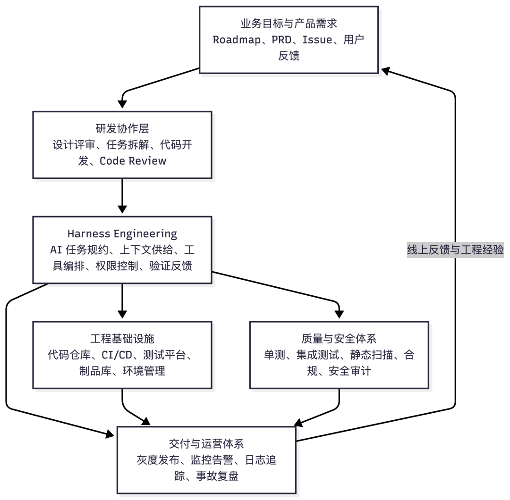
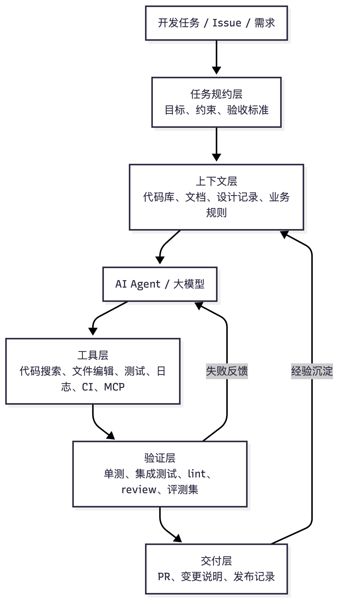
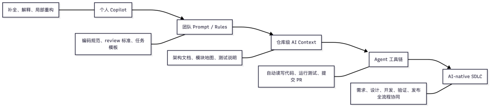
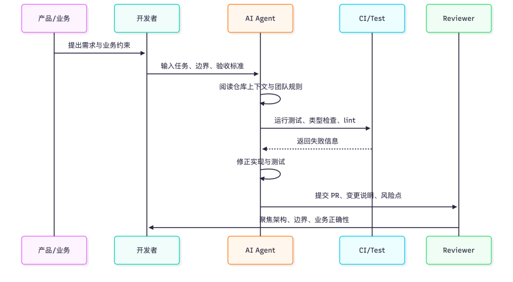
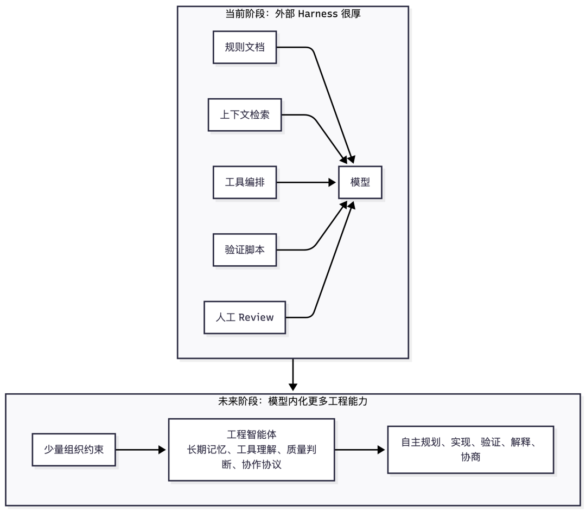
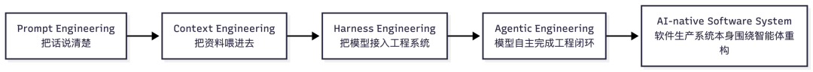
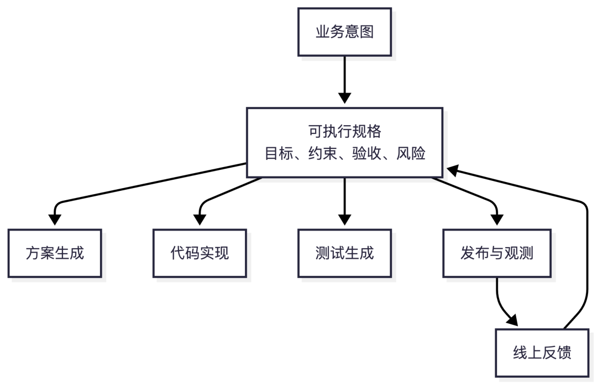

> 原文链接：https://mp.weixin.qq.com/s/gwFqOnPEDC8-3yKwpQfO8g

# 为什么我在团队大力推进 Harness Engineering 的同时，却不认为它就是未来

为什么我在团队大力推进 Harness Engineering 的同时，却不认为它就是未来
我们需要认真建设 Harness Engineering，因为它是今天让 AI 真正进入软件工程生产系统的最佳实践之一。
但我们也要保持清醒：它不是终局，只是大模型能力尚未完全内化工程上下文、工具调用、质量判断与组织协作之前，一个非常重要的中间层。
过去几年，软件工程里的 AI 话题经历了几个阶段：从代码补全，到聊天式问答，再到 Agent 自动修改代码、运行测试、提交 PR。表面上看，变化发生在模型能力上；但在真实团队里，真正决定 AI 能否进入生产链路的，往往不是“模型会不会写代码”，而是团队有没有给它提供足够稳定的工程支架。
这就是我理解的 Harness Engineering。
我在团队里大力推进它，并不是因为我认为它代表软件工程的未来，而是因为在当下，它是把 AI 从“个人效率工具”推进到“团队生产力系统”的关键路径。
1. 什么是软件工程里的 Harness Engineering
Harness 这个词原本有“马具、装备、约束系统”的意思。在工程语境里，它也常出现在 test harness 里，指为了让某段程序可以被稳定运行、观察、验证而搭建的一套外部支撑。
放到 AI 软件工程里，我会把 Harness Engineering 定义为：
围绕大模型构建的一套工程化支架，使模型能够在明确上下文、受控权限、标准流程、可验证结果和团队知识约束下，稳定参与软件开发活动。
它不是单个工具，也不是某一个 prompt 模板。它更像是一个围绕 AI Agent 的工程运行环境，包含：
•任务描述规范：需求、约束、验收标准、边界条件如何被表达。•上下文供给机制：代码库、文档、架构约定、业务规则、历史决策如何被模型读取。•工具调用接口：搜索代码、运行测试、访问日志、读写文件、查文档、调用内部平台。•工作流编排：从 issue 到设计、编码、测试、review、发布的协作路径。•质量验证体系：单测、集成测试、lint、类型检查、静态扫描、回归用例、评测集。•权限与安全边界：哪些操作可自动执行，哪些必须人工批准，敏感信息如何隔离。•组织知识沉淀：团队风格、模块边界、常见坑、最佳实践如何被持续更新。
如果把整个研发工程体系摊开来看，Harness Engineering 并不替代需求管理、代码仓库、CI/CD、测试平台或发布系统。它更像是一层 AI 协作中枢，位于“人类研发活动”和“底层工程基础设施”之间，把大模型接入已有的软件生产链路。
一个简化的 Harness Engineering 架构可以这样理解：
它的核心不是“让 AI 更聪明”，而是“让 AI 在一个更适合工作的系统里工作”。
如果没有 Harness，开发者通常会这样使用 AI：打开聊天窗口，贴一段代码，问怎么改，复制回答，再手工验证。这适合个人探索，但很难进入团队流程。
有了 Harness，AI 的工作方式会更接近真实工程协作：它能读到完整上下文，理解团队约束，修改代码，运行验证，输出可 review 的变更，并把失败信息反馈给下一轮行动。
2. Harness Engineering 的基本落地方式与价值
落地 Harness Engineering，不应该从“买哪个 AI 工具”开始，而应该从“团队希望 AI 参与哪些工程动作”开始。
常见的落地路径可以分为五层。
第一层是个人工具。开发者使用 Copilot、Cursor、Claude Code、Codex 或其他 AI 编码助手，解决局部问题。这一层收益明显，但高度依赖个人能力。
第二层是团队规则。团队开始维护统一的 AI 使用规范，例如代码风格、commit 约定、review checklist、测试要求、禁止修改的目录、常见问题处理方式。这一步把个人经验变成团队资产。
第三层是仓库上下文。团队为代码库准备 Agent 可读的文档：系统架构、模块边界、本地启动方式、测试命令、关键业务概念、目录说明、依赖关系。很多时候，AI 做错不是因为能力差，而是因为它不知道团队默认知道的东西。
第四层是工具链接入。Agent 不再只是回答问题，而是可以调用工具：搜索代码、编辑文件、运行测试、查询接口文档、读取日志、触发 CI。MCP 这类协议的流行，本质上就是在解决“模型如何标准化连接外部工具和数据源”的问题。
第五层是 AI-native SDLC。AI 开始参与需求澄清、方案设计、代码实现、测试补齐、review 辅助、发布说明、事故复盘等完整软件生命周期。此时 Harness 不再是一个局部辅助设施，而是团队工程系统的一部分。
它的价值主要体现在四个方面。
第一，降低上下文切换成本。开发者不必反复解释项目背景、目录结构、测试命令、业务规则，AI 可以通过稳定上下文获取这些信息。
第二，提升交付一致性。团队可以把“我们希望代码怎么写、测试怎么补、PR 怎么描述”固化到规则和验证链路里，而不是靠每个开发者临场发挥。
第三，扩大自动化边界。传统自动化擅长确定性任务，比如构建、测试、发布；AI 擅长半结构化任务，比如理解需求、修改代码、补充文档。Harness 把两者接起来，让更多工程活动进入可自动执行、可观察、可回滚的范围。
第四，形成团队级学习系统。每一次失败的 AI 任务，都可以沉淀为更好的文档、更明确的规则、更完整的测试、更安全的权限边界。团队不是只在“使用 AI”，而是在训练自己的工程系统更适合 AI 协作。
3. 为什么它是当前软件工程 AI 化的最佳实践之一
今天的 AI 编码能力已经足够强，但还没有强到可以无视工程环境。
一个模型可以写出漂亮的函数，却可能不知道这个仓库里某个字段不能改；可以生成合理的测试，却可能不知道团队的测试夹具怎么启动；可以完成一个局部重构，却可能破坏隐含的跨模块约定。
这就是当前 AI 工程化的核心矛盾：
模型能力在快速增强，但软件工程的真实约束仍然分散在代码、文档、CI、人的经验、组织流程和历史包袱里。
Harness Engineering 的价值，正是把这些分散约束组织成模型可以使用的工作环境。
对团队而言，它带来的改变不是“大家写代码更快”这么简单，而是开发模式的重构。
团队会从“人写代码，AI 补几行”逐渐转向“人定义问题和边界，AI 执行一部分工程闭环，人负责判断和承担责任”。
这种变化会带来几个非常实际的结果。
新成员上手更快。因为团队必须把隐性知识显性化，AI 能读，新人也能读。
低价值重复劳动减少。样板代码、测试补齐、简单迁移、文档更新、机械重构，可以逐渐交给 Agent 完成。
工程规范更容易落地。过去规范写在文档里，靠 review 兜底；现在规范可以进入 Agent 规则、CI 校验和自动修复流程。
资深工程师的时间被重新分配。他们会减少一部分机械实现时间，更多投入到架构判断、任务拆解、复杂问题定位、质量标准制定和系统演进上。
这也是为什么我认为，在 2026 年这个时间点，Harness Engineering 是软件工程 AI 化最值得投入的实践之一。它能把 AI 的不稳定性包进一个相对稳定的工程系统里，把个人效率提升变成团队生产力提升。
4. 为什么它不是未来，而只是中间过渡阶段
但是，越是认真推进 Harness Engineering，越不能把它误认为终局。
它很重要，但它的重要性来自一个前提：当前大模型还需要外部支架。
今天我们需要写 rules，是因为模型还不能稳定理解团队偏好。我们需要手工维护上下文，是因为模型无法天然拥有一个组织的完整工程记忆。我们需要复杂的工具编排，是因为模型还不能原生、安全、可靠地完成所有工程动作。我们需要大量验证链路，是因为模型的输出仍然可能在局部正确、系统错误之间摇摆。
换句话说，Harness Engineering 解决的是“当前模型能力与真实工程复杂度之间的落差”。
只要这个落差存在，Harness 就有价值；但如果未来模型本身越来越能吸收这些能力，Harness 的形态就一定会被压缩。
很多今天看起来像“工程平台能力”的东西，未来可能会变成模型的基础能力或标准能力。
例如，今天我们需要告诉 AI “这个仓库怎么跑测试”；未来 Agent 可能能自己识别项目结构、推断测试入口、构造隔离环境，并在失败时理解失败原因。
今天我们需要写大量 prompt 规范；未来模型可能通过组织记忆和持续反馈，自动学习团队偏好。
今天我们需要在工具之间手工搭桥；未来模型和工具之间可能通过更统一的协议、权限模型和运行时环境直接协作。
今天我们需要把任务拆成很细的步骤；未来更强的工程 Agent 可能能自己完成任务分解、风险识别、并行执行和结果合并。
所以，Harness Engineering 不是未来本身。它更像是从“人类主导的软件工程”走向“AI 深度参与的软件工程”之间的一座脚手架。
脚手架很重要。没有脚手架，高楼建不起来。但如果有一天高楼稳定成型，脚手架本身不会成为建筑的主体。
5. 为什么大模型会吞噬这一块内容
大模型吞噬 Harness Engineering，不是说所有工程平台都会消失，也不是说团队不再需要流程、权限和验证。恰恰相反，未来的软件工程系统仍然需要约束，只是很多约束的表达方式会从“外部配置”变成“模型原生能力的一部分”。
吞噬会发生在三个方向。
第一，模型会吞噬上下文工程。
今天我们围绕模型做大量 context engineering：切分文档、写检索逻辑、维护规则文件、设计 prompt 模板。未来模型的上下文窗口、长期记忆、代码理解能力、多模态理解能力都会继续增强。更多项目知识会被模型以更自然的方式吸收、更新和调用。
第二，模型会吞噬工具编排。
今天我们需要明确告诉 Agent 调什么工具、按什么顺序、失败如何处理。未来的 Agent 会更像一个工程操作系统上的智能进程：它知道什么时候读代码，什么时候查文档，什么时候跑测试，什么时候请求权限，什么时候停止并询问人类。
第三，模型会吞噬初级质量判断。
今天很多验证依赖外部脚本和人工 checklist。未来模型会更擅长识别代码异味、接口破坏、测试不足、迁移风险、性能隐患和安全问题。CI 不会消失，但会从“唯一判断者”变成“模型自我验证体系的一部分”。
可以把这个演进理解成：
每一层都不是简单替代上一层，而是把上一层的显性工作逐渐内化。
Prompt 不会消失，但不会再是主要门槛。上下文不会消失，但不一定需要人手工拼接。Harness 不会消失，但它会越来越像底层基础设施，而不是每个团队都要手工维护的一堆规则和脚本。
6. 软件工程未来的几种猜想
如果 Harness Engineering 只是过渡阶段，那么未来会是什么？
我不认为未来是“程序员消失”。更可能发生的是：软件工程的核心对象会改变。
过去，软件工程师主要操作代码。未来，软件工程师会更多操作意图、约束、系统边界和智能体协作网络。
我有几个猜想。
第一，需求会变成可执行对象。
未来的需求文档不再只是人读的自然语言，而是同时面向人和 Agent 的规格系统。它包含业务目标、边界条件、验收测试、风险等级、合规要求、观测指标。需求一旦形成，Agent 可以直接据此生成方案、代码、测试和发布计划。
第二，代码库会变成会自我解释的系统。
今天的代码库主要被人维护，文档常常落后。未来的代码库会持续生成自己的模块地图、依赖关系、风险区域、变更影响分析和演进建议。开发者打开的不是一堆文件，而是一个可以对话、可以解释、可以协商变更路径的系统。
第三，开发团队会从“人组成的团队”变成“人和智能体组成的团队”。
一个团队里可能有测试 Agent、迁移 Agent、文档 Agent、review Agent、性能 Agent、依赖治理 Agent。人类工程师的职责不是逐行指挥它们，而是定义目标、分配权限、设计反馈机制，并对最终结果负责。
第四，架构能力会重新升值。
当写代码的边际成本下降，真正稀缺的会是判断：什么不该做，边界放在哪里，系统复杂度如何控制，哪些约束必须长期稳定，哪些可以快速试错。AI 会降低实现成本，但不会自动给组织带来清晰的战略和架构取舍。
第五，软件交付会更接近连续演化。
未来的软件可能不再以大版本为主要节奏，而是围绕目标指标持续生成、验证、发布和回滚。开发从“项目制”进一步转向“演化制”：系统不断观察自己、提出改进、生成变更、接受审查、进入生产。
7. 软件开发从业人员应该做哪些准备
如果我们承认 Harness Engineering 很重要，但又不是终局，那么个人和团队的准备方向就会更清晰。
第一，学会把隐性知识显性化。
未来最有价值的工程师，不只是会写代码的人，而是能把复杂系统解释清楚的人。你需要能写清楚模块边界、业务规则、约束条件、失败模式、测试策略。因为这些东西不仅给人看，也给 AI 看。
第二，提升任务定义能力。
AI 时代，模糊任务会制造更大的混乱。优秀工程师要能把“做一个功能”拆成目标、非目标、输入输出、验收标准、风险点和回滚方案。任务定义越清楚，Agent 的执行质量越高。
第三，掌握验证思维。
不要只问“AI 能不能写出来”，要问“我如何知道它写对了”。测试、类型系统、静态分析、可观测性、灰度、回滚、评测集，会成为 AI 时代工程师的核心武器。
第四，理解工具和协议。
MCP、Agent Runtime、CI/CD、权限系统、代码搜索、知识库、日志平台，这些会成为 AI 进入工程系统的接口。你不一定要成为每个领域的专家，但要理解它们如何连接成一个可靠的工作环境。
第五，保留架构判断和产品判断。
当模型越来越会写代码，工程师的差异会更多体现在判断力上：识别真正的问题，拒绝错误的需求，控制复杂度，设计可演化的系统，理解业务目标和用户价值。
第六，训练与 AI 协作的工作习惯。
不要把 AI 当搜索引擎，也不要把它当实习生。更好的方式是把它当一个高吞吐、可并行、需要约束、需要验证的工程协作者。你给它上下文、目标和边界，它给你方案、实现和反馈；你负责判断、整合和承担后果。
第七，主动参与团队 Harness 建设。
如果你所在团队还没有 AI rules、仓库上下文、Agent 工作流、自动验证体系，现在就可以开始。不要等模型变得完美。真正的红利属于那些在模型还不完美时，就已经学会重构工程系统的团队。
结语：推进它，但不要迷信它
我推进 Harness Engineering，是因为它让 AI 进入真实软件工程的方式变得具体、可控、可复制。
它能让团队从零散的 AI 使用，走向系统性的 AI 协作；从个人提效，走向组织提效；从“模型写几行代码”，走向“模型参与工程闭环”。
但我不认为它就是未来。
未来不会停在 Harness 上。未来会发生在大模型、工具、上下文、验证、权限和组织协作逐渐融合之后。到那时，今天很多需要我们手工搭建的支架，会被模型能力、标准协议和 AI-native 工程平台吞噬。
所以更准确的态度是：
今天认真建设 Harness Engineering，明天准备亲手拆掉它的一部分。
这不是矛盾，而是工程演进的常态。真正值得追求的不是某个中间形态，而是让团队持续靠近更高质量、更高速度、更低摩擦的软件创造方式。