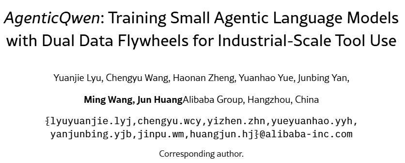

> 原文链接：https://mp.weixin.qq.com/s/U5cYZFByZc0iWFgkD51X6A

# 阿里AgenticQwen炸场！8B小模型干翻235B大模型，双数据飞轮让智能体成本降90%

https://arxiv.org/pdf/2604.21590v1
2026 年 4 月 23 日，阿里发布 AgenticQwen 系列小模型，用独创的 "双数据飞轮" 训练方法，让 8B/30B 小模型在工具使用能力上逼近 235B 大模型，推理成本降低 90% 以上。这篇论文彻底打破了 "只有大模型才能做智能体" 的行业迷思，为工业级智能体的大规模落地指明了方向。
一、行业最大痛点：智能体很好，但用不起
现在所有公司都在做 AI 智能体，但所有人都面临同一个无解的难题：太贵了。
论文一开头就直击要害：
工业界部署的智能体系统，几乎都依赖 GPT-5、Claude 等闭源大模型，API 成本高得吓人
即使是开源的 Qwen3-235B，推理成本对于百万级用户的应用来说依然不可承受
但对于 90% 的高频标准化任务（订机票、查数据、写报告），用 235B 大模型完全是 "杀鸡用牛刀"
理论上，小模型应该能搞定这些简单任务。但现实很残酷：
主流大模型厂商几乎从不发布具备强智能体能力的小模型，导致行业出现了巨大的空白。
更麻烦的是，传统的训练方法遇到了天花板：
单纯靠增加合成数据量，很快就会遇到性能饱和
数据同质化严重，模型学来学去都是那几套固定流程
真实世界的复杂决策和异常情况，根本无法通过静态数据集覆盖
这就是 AgenticQwen 要解决的核心问题：如何用最少的算力，训练出能在工业界大规模使用的小型智能体模型？
二、阿里的破局之路：双 RL + 双数据飞轮
阿里的解决方案非常清晰：不堆参数，堆训练方法。
他们没有去做更大的模型，而是设计了一套全新的训练框架，核心是 "双 RL 训练 + 双数据飞轮"：
1. 双 RL 训练：先练推理，再练智能体
传统的智能体训练是一锅烩，阿里把它拆成了两个独立的阶段：
训练类型
目标
训练数据
奖励机制
推理 RL
提升多步逻辑推理能力
数学题、多跳问答、搜索任务
最终答案正确得 1 分，错误得 0 分
智能体 RL
提升真实场景工具使用能力
模拟用户交互、工具环境
按子目标完成度给 0-1 分
先让模型学会 "怎么思考"，再让它学会 "怎么做事"。这种分阶段训练的方法，比端到端训练效率高得多。
2. 双数据飞轮：让模型自己给自己出难题
这是整篇论文最核心的创新，也是 AgenticQwen 能超越同类模型的关键。
阿里发现，RL 训练之所以会遇到天花板，根本原因是数据不会自己进化。于是他们设计了两个闭环数据飞轮，让训练数据的难度随着模型能力的提升而自动提升。
三、两大创新飞轮详解：这才是真正的 "自进化"1. 推理数据飞轮：从错误中学习，越错越强
推理飞轮的逻辑很简单：模型哪里错了，就专门练哪里。
具体流程是：
训练一轮模型，收集所有答错的问题
用大模型把这些错题改写成更难的版本：
调整关键数值，增加约束条件
把代数题改成物理题、化学题
注入不同的角色和场景
用多模型一致性过滤，确保新生成的题目有唯一正确答案
用这些新题目继续训练模型
重复以上步骤，直到模型不再犯错
这个飞轮完美解决了数据同质化的问题。模型每进步一点，就会遇到更难的挑战，永远有新的东西可以学。
2. 智能体数据飞轮：从线性流程到多分支行为树
这才是真正的神来之笔，也是这篇论文最大的贡献。
传统的智能体训练数据，都是线性的 "happy path"：
用户订票 → 查询余票 → 确认订单 → 支付完成
但真实世界根本不是这样的。真实场景中充满了各种意外：
票卖完了怎么办？
航班延误了怎么办？
用户要改签怎么办？
用户不符合退票条件怎么办？
阿里的解决方案是：把线性工作流扩展成多分支行为树。
具体步骤：
初始化：用简单的线性任务训练模型
行为树扩展：每训练一轮，就用大模型分析模型的执行轨迹，给工作流增加新的条件分支
原来的 "查询→订票" 变成了 "查询→有票就订票 / 没票就查高铁 / 高铁也没票就查附近机场"
分支转任务：把每个分支都变成一个独立的训练任务
要训练 "没票查高铁" 这个分支，就生成一个 "所有航班都卖完了，用户必须今晚赶到北京" 的任务
对抗性用户：加入故意误导模型的模拟用户
比如用户明明是普通会员，却要求只有金卡会员才能享受的现金赔偿
这个飞轮的厉害之处在于，它能自动生成无限多的真实场景。训练的轮次越多，行为树就越复杂，模型处理异常情况的能力就越强。
论文里有一个非常形象的比喻：
传统方法是给模型看 1000 张不同的猫的图片，让它学会认猫。而我们是给模型一只猫，让它自己去观察猫在不同光线、不同姿势、不同环境下的样子。
四、实验结果：8B 小模型，干翻 235B 大模型
我们直接看最震撼的数据：
1. 公开基准测试结果
模型
平均得分
相对原版提升
与 235B 大模型差距
Qwen3-235B
52.0
-
基准
Qwen3-30B
36.2
-
-15.8
Qwen3-8B
23.8
-
-28.2
AgenticQwen-30B
50.2
+14.0
-1.8
AgenticQwen-8B
47.4
+23.6
-4.6
8B 模型的性能直接翻了一倍，30B 模型几乎和 235B 大模型打平！
更夸张的是，AgenticQwen-30B 在 BFCL-Base 基准上得分 60.0，超过了 Qwen3-235B 的 58.5。
2. 工业部署效果
在阿里内部的生产级智能体系统中，AgenticQwen 表现同样出色：
在 WebWalker 搜索基准上，AgenticQwen-30B 得分 52.5，接近 235B 的 59.5
在 XBench 基准上，AgenticQwen-30B 得分 47.0，几乎和 235B 的 48.0 持平
平均推理时间 344.1 秒，比 235B 的 449.5 秒快了 23%
这意味着，在绝大多数工业场景中，你可以用 30B 模型完全替代 235B 模型，成本降低 90% 以上，速度还更快。
五、这篇论文的真正价值：智能体的工业化时代来了
AgenticQwen 的意义，绝不仅仅是又一个新模型。它彻底改变了我们对智能体的认知：
1. 打破了 "参数迷信"
之前所有人都认为，智能体能力和模型参数正相关。但 AgenticQwen 证明了：
好的训练方法，比堆参数重要 100 倍。
8B 小模型经过正确的训练，完全可以达到接近大模型的智能体能力。
2. 解决了智能体的落地成本问题
之前一个智能体服务，每天 10 万次调用就要花几十万 API 费用。现在用 AgenticQwen，你可以在自己的服务器上部署，成本几乎可以忽略不计。
这才是智能体能够大规模落地的前提。
3. 提供了一套可复制的训练范式
阿里把所有东西都开源了：
模型权重：https://huggingface.co/collections/alibaba-pai/agenticqwen
训练代码：https://github.com/haruhi-sudo/data_synth_and_rl
数据合成工具：集成到了 EasyDistill 中
任何人都可以用这套方法，训练自己的垂直领域小智能体。
六、给研究者和从业者的启示
这篇论文给我们指明了未来一年智能体研究的方向：
对于研究者
不要再盲目追求更大的模型了，小模型的训练方法还有巨大的提升空间
数据飞轮是未来的核心，如何让数据自动进化、自动变难，是最重要的研究课题
行为树扩展是一个非常有潜力的方向，可以应用到所有需要决策的任务中
对于工业界从业者
现在就可以开始用 AgenticQwen 替代大模型处理标准化任务
对于垂直领域，你可以用自己的业务数据，基于 AgenticQwen 做微调，效果会比通用大模型好得多
未来的智能体架构一定是 "大模型做复杂决策 + 小模型做标准化任务" 的混合架构
写在最后：智能体的下半场，拼的是效率
过去三年，我们见证了大模型的爆发。所有人都在比谁的模型更大，谁的参数更多。
但现在，潮水开始退去了。当 AI 真正要走向工业落地的时候，我们发现，成本和效率，才是真正的护城河。
AgenticQwen 的出现，标志着智能体的下半场正式开始。下半场不再是比谁烧钱多，而是比谁能用最少的资源，解决最多的问题。
阿里用这篇论文告诉我们：
AI 的未来，不是靠堆硬件堆出来的，而是靠技术创新，让每一分算力都物尽其用。
这才是真正的技术进步。
💬 互动留言
你怎么看小模型智能体的未来？
你会尝试用 AgenticQwen 替代大模型吗？
你觉得智能体大规模落地还需要解决哪些问题？
欢迎在评论区说说你的看法，我们一起交流讨论。