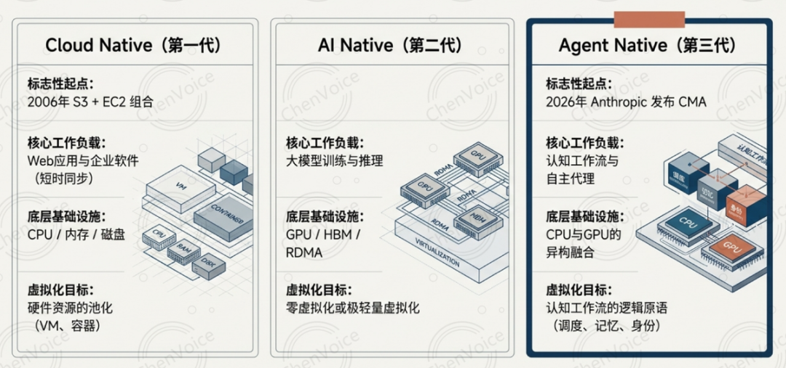
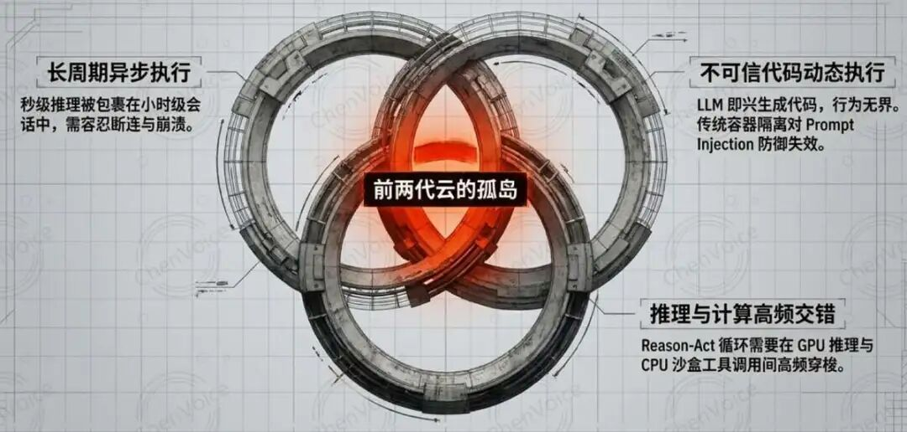
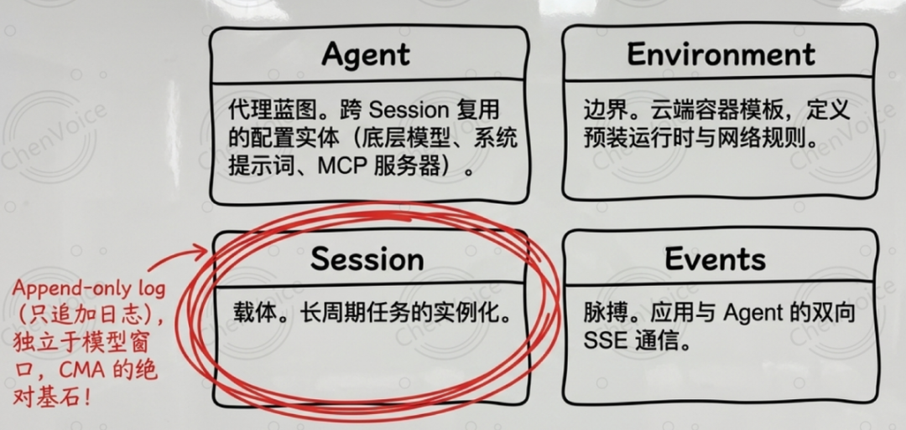
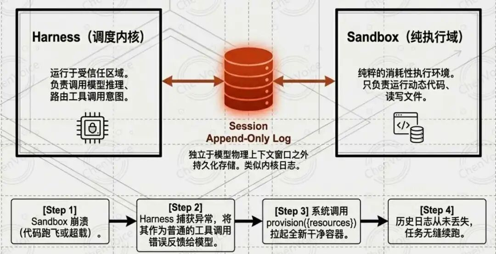
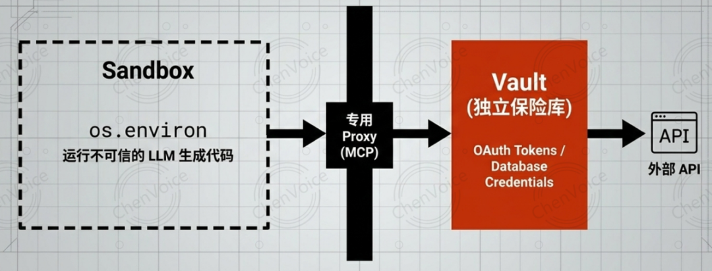
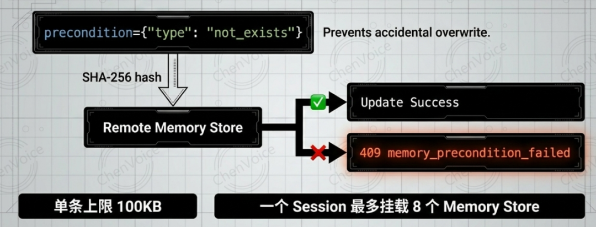
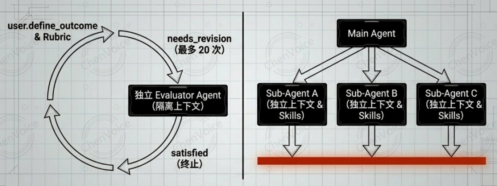
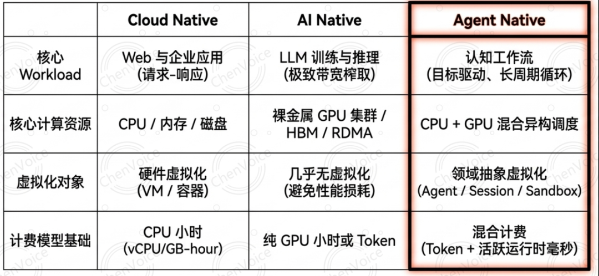
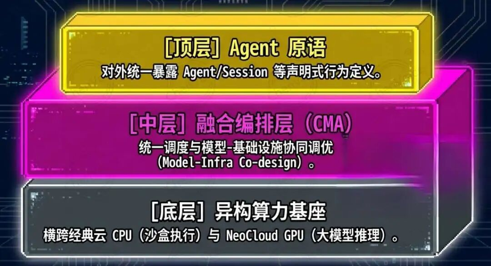
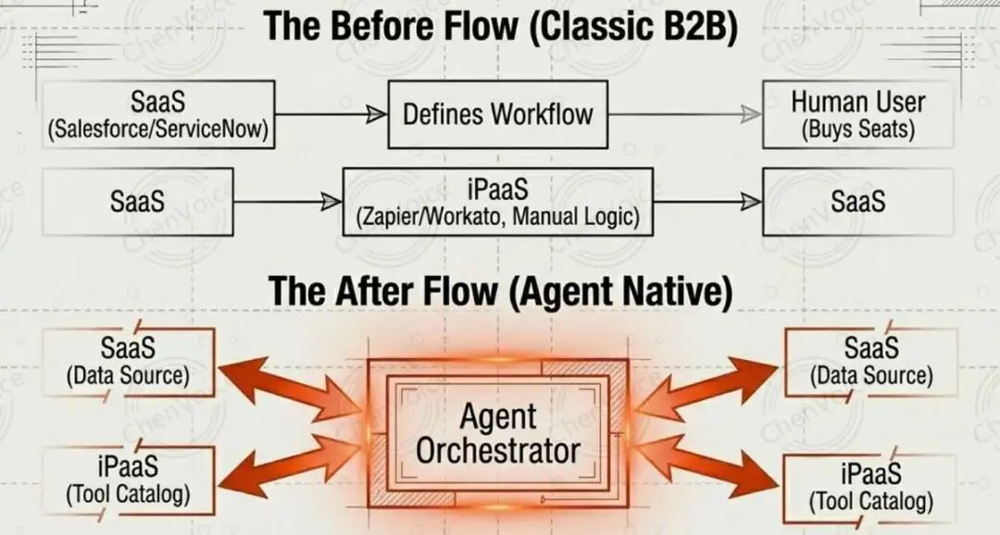

> 原文链接：https://mp.weixin.qq.com/s/cMgOmPiGdxGUmWf1R5PKYA

# Agent Native云服务的雏形：从Claude Managed Agents看云计算的第三次原生化

没有时间阅读文字的同学，可以收听下面的播客版本，上班路上不无聊。

觉得不错的话，帮忙右下角 点赞

+ 分享 +推荐💗

TL; DR

**Workload 决定云服务形态，Agent workload独有特点需要新形态的云服务支撑**：Agent workload 同时具备LLM 即兴生成不可信代码、长周期异步执行、GPU 推理与 CPU 工具调用高频交错三大特征。经典云计算与 NeoCloud 都会被迫在自身盲区重新造轮子，新的需求催生新的云服务形态。

**Claude Managed Agents 是 NeoCloud 之后云计算的第三次原生化跃迁雏形：**它不是新模型也不是新 API endpoint，而是打包了 Agent 循环、工具执行、沙盒容器、状态持久化的托管运行时，继以CPU算力(VM/容器)为核心的Cloud Native、以GPU算力为核心的AI Native之后，开启Agent Native的第三代云计算形态。

**Agent Native的虚拟化对象，从硬件跃迁到了业务工作流逻辑：**Session 虚拟化"经验"、Harness 虚拟化"调度"、Sandbox 虚拟化"执行"、Vault 虚拟化"身份"、Memory Store 虚拟化"记忆"——这套面向 Agent 工作流的领域抽象，是Claude Managed Agents区别于任何一代 PaaS 的本质核心。

2006 年 3 月 14 日，AWS 把一个叫 S3 的对象存储服务推上公网，云计算的 20 年序幕由此拉开。那一年没人把它当作"范式转移"，直到 5 年后，S3 + EC2 + RDS 的组合事实上重写了整个互联网应用的部署方式。

20 年过去，云计算形态已经分化出两代鲜明的原生化：以CPU算力为核心、VM/容器为底座、服务 Web 与企业应用的 **Cloud Native；**以及以GPU算力为核心、裸金属/容器为底座、服务大模型训练与推理的 **AI(LLM) Native**（或业内俗称的 NeoCloud）。

2026 年 4 月 8 日，Anthropic 推出了 Claude Managed Agents（后简称CMA）——这是一项托管式 API 服务，使开发者能够在 Anthropic 的云基础设施上部署 AI 代理，而无需自行构建沙盒环境、状态管理或错误恢复机制。从技术叙事的角度，它看起来只是"Messages API 之上的托管运行时"；但若从云形态演进的视角拉远看，这可能是云服务在 S3 之后的第三次原生化跃迁的雏形——**Agent Native 云服务**。

本文试图完成三件事：
- 第一，从workload特征出发，论证为什么前两代云都无法原生承载 Agent Workload；
- 第二，以 CMA 为样本，拆解其产品定义与底层技术架构；
- 第三，推演 Agent Native 云服务对经典云厂商、NeoCloud、SaaS、iPaaS 的价值链重分配。

为什么经典云与 NeoCloud 都无法原生承载 Agent Workload

云服务形态的演进逻辑本质上只有一条：**Workload形态决定云服务形态**。Web 应用是请求-响应、状态集中于数据库、计算同步短时的，于是经典云把 CPU/内存/磁盘虚拟化为 VM 和容器。

LLM 训练与推理是对 HBM 带宽、张量并行、NVLink 低延迟的极致榨取，GPU 近乎不做虚拟化是因为虚拟化开销会直接吃掉性能红利，于是 NeoCloud 把裸金属 GPU 集群和 RDMA 网络作为卖点。

Agent workload 则同时带来了三个在过去任何一种云应用中都**未曾在同一工作负载内共存**的特征：

第一，**不可信代码的动态生成与执行**。这是 Agent 负载最刺眼的一个特征。过去云上跑的代码都是开发者人肉写的，有 code review、有 CI/CD；而 Agent 由 LLM 即兴生成代码，这些代码的行为空间理论上无界。如果让这类代码和数据库凭证、云 API key 共处一个容器，就等同于给一个黑盒交付了整个组织的访问权。经典云的容器隔离是为"可信但可能有 bug 的代码"设计的，对"可能被 Prompt Injection 诱导写出恶意代码的模型"并不够用。

第二，**长周期异步执行**。一次 deep research、一次大型代码重构、一次财报建模任务，动辄数十分钟到数小时。Web 应用以毫秒到秒计，LLM 推理以秒到分钟计，但 Agent 是把"秒级推理"包裹在"小时级会话"里反复循环的——这意味着整条调用链必须容忍网络断连、容器崩溃、上下文溢出，并能从任意中间状态续跑。

第三，**LLM 推理与通用计算的高频交错**。Reason-Act 循环的每一轮都要在 GPU 侧做一次推理、在 CPU 侧执行一次工具调用（bash、文件读写、HTTP 请求），再回到 GPU 继续推理。经典云缺乏对 LLM 推理的原生抽象，NeoCloud 缺乏安全沙盒与通用编排能力。二者任何一方单独接手 Agent workload，都会被迫在自己的盲区重新造轮子。

三个特征叠加，让 Agent workload 成了"前两代云的孤岛"。

补位需求由此而生。

CMA 的产品定位与四件套抽象

在 Anthropic 的定义里，CMA 为通过 Claude 模型实现的自主Agent运行提供了所需的调度框架和基础设施。开发者无需自行构建代理循环、工具执行机制和运行时环境，而是可以获得一个完全托管的环境，在其中 Claude 能够安全地读取文件、运行命令、浏览网页并执行代码。换句话说，CMA 既不是一个新模型，也不是一个新 API endpoint，而是一套**打包了 Agent 循环 + 工具执行 + 沙盒容器 + 状态持久化**的托管运行时。

它与原有 Messages API 的边界清晰：Messages API 是完全无状态的直接模型访问接口，每次请求都要携带全部对话历史，开发者要自己写循环、管上下文、拼工具；CMA 则是有状态的托管基础设施，全托管的代理基础设施。在具备持久事件历史记录的有状态会话中部署和管理自主代理。 会话、事件流、沙盒执行、工具授权、凭证管理都由平台托底。

真正值得深挖的，是 CMA 的四件套领域抽象：

**Agent**：一个可复用的、版本化的配置实体，包含底层模型（Claude Opus 4.7/Sonnet 4.6 等）、系统提示词、工具集、MCP 服务器、Skills。它不是一个进程，而是一个"Agent 蓝图"，创建一次、跨 Session 引用。

**Environment**：一个云端容器模板，定义了 Agent 运行的虚拟边界——预装的运行时（Python/Node.js/Go）、网络访问规则、挂载的文件系统。

**Session**：Agent 在某个 Environment 内的一次实例化执行。Session 是带持久化状态的长周期载体，Claude把 Agent 的各个组成部分进行了虚拟化：其中 Session 就是一份只追加（append-only）的日志，完整记录了所发生的一切。——这一点后面会反复出现，它是整个 CMA 架构的基石。

**Events**：应用与 Agent 之间双向通信的脉搏，包括用户指令、工具执行结果、状态更新，通过 SSE 长连接推送。

这四件套看似平平无奇，但它们第一次把"Agent 工作流"的核心语义抽象成了**可被云平台托管的一等公民**——而不是像过去那样散落在开发者自己的 Python 脚本里。

CMA 的底层技术：虚拟化哲学的继承与重构

操作系统用 50 年证明了一件事：只要把硬件虚拟化为足够通用的抽象——通用到能够承载当时尚不存在的程序——上层软件就可以跨越硬件变迁而不必重写。
进程与文件就是这样的抽象：read() 并不关心底下是 1970 年代的磁盘还是今天的 SSD，而这些抽象设计的寿命，最终超越了它们所封装的硬件本身。

构建 Managed Agents，本质上是在解决相同的问题：如何为"尚未被设想出来的程序"设计一套系统。

CMA 把操作系统这一套哲学搬到了 Agent 层。

它做的第一件事，也是最关键的一件事，是**把 Harness 与 Sandbox 彻底解耦**。在早期 DIY Agent 架构里，控制循环（Harness）、沙盒（Sandbox）、上下文状态往往绑定在同一个物理进程或容器里。代码跑飞了，整个 Agent 的记忆、进度、工具栈全部湮灭。CMA 的做法是：
- **Session 被定义为只追加（append-only）的事件日志，类似内核日志，独立于模型物理上下文窗口之外持久化存储；**
- **Harness 是调度内核，负责调模型推理、路由工具调用意图；**
- **Sandbox 是纯执行域，只负责跑代码、读写文件、执行计算。**

简单讲，就像把 CPU、内存、磁盘分离成可独立替换的部件。Sandbox 崩了，Harness 捕获为一次普通的"工具调用错误"反馈给 Claude；模型若决定重试，系统调一次 `provision({resources})` 起一个干净容器，Session 日志从未丢失，任务可以无缝续跑。

**第二件关键的事，是凭证的物理隔离**。这是 Agent 负载最不安全的一个环节。如果把 OAuth 令牌、数据库凭证直接塞进沙箱的环境变量，一次提示注入就能让模型写一行 os.environ 把令牌吐出来。CMA 的解法是把凭证放在沙箱之外的独立保险库（Vault）里，通过一个更高隔离等级的代理来转发工具调用——对于自定义工具，CMA支持 MCP，并将 OAuth 令牌存放在安全的保险库中。Claude 通过一个专用代理来调用 MCP 工具；该代理接收一个与当前会话绑定的令牌，再凭此令牌从保险库中取出对应的凭证，去调用外部服务。执行环境（harness）自始至终对任何凭证一无所知。在整个调用链中，沙箱与真实凭证之间没有物理连通路径。

**第三件是 Memory Store 的乐观并发控制**。Agent Memory 处于 research preview，可以在工作区级别创建存储库，Session 挂载后通过内置的 `memory_read` / `memory_write` 等工具自动读写。但关键在于其并发控制机制：创建时要求 `precondition={"type": "not_exists"}` 防误覆盖，编辑时要求传入基于原内容的 SHA-256 哈希值，只有远端哈希与本地一致时更新才生效，否则直接抛 `409 memory_precondition_failed`。单条上限 100KB，一个 Session 最多挂 8 个 Memory Store。这套做法本质上是把数据库界的 OCC 范式搬到了"模型的长期记忆"上——很分布式系统工程师风格的处理 🤔。

**第四件是 Outcomes 的目标导向闭环**。这是 CMA 比较有野心的一步：让 Session 从"对话"升级为"目标驱动的工作单元"。用户通过 `user.define_outcome` 事件声明最终交付形态与评分 Rubric，系统会在后台起一个**独立上下文窗口内运行的评估器**，对产物做客观审查。结果 `satisfied` 即闲置，`needs_revision` 把差距反馈给主 Agent 自主迭代，`max_iterations_reached`（默认 3 次、上限 20 次）强制终止。评估器与主 Agent 的上下文隔离，是为了避免评估器被主 Agent 的实现路径偏好污染——这是把"评审"与"执行"在架构上分开的典型做法。

**第五件是多智能体的单层委派控制**。多智能体 Session 也在 research preview 下，所有子 Agent 共享底层文件系统，但每个子线程拥有独立的上下文历史、系统提示词、MCP 组合与 Skills。为了防止多级调用链路雪崩和递归死循环，CMA 采取了**声明式的单层委派**：主 Agent 的 `callable_agents` 数组里明确列出哪些子 Agent 被授权，且这些子 Agent**无权继续向下裂变**。这是一种在架构层面就把"Agent 爆炸风险"关住的设计选择。

以上五件事背后，是一个清晰的共识：**Agent Native 云的虚拟化对象不再是硬件，而是认知工作流的逻辑原语**。Session 虚拟化"经验"，Harness 虚拟化"调度"，Sandbox 虚拟化"执行"，Vault 虚拟化"身份"，Memory Store 虚拟化"记忆"。从"硬件虚拟化"到"认知工作流虚拟化"的这一跨越，是 CMA 区别于任何一代 PaaS 的核心。

为什么 CMA 是 Agent Native 的雏形而非又一个 PaaS

一个可以预见的反驳是："这不就是一个为 Agent 定制的 Serverless / PaaS 吗？"从严格的 infra 定义看，这个质疑有一定合理性——CMA 确实跑在经典云的 CPU 和 NeoCloud 的 GPU 之上，它自己并没有一块独占的新芯片。但从三个维度看，它已经具备了"新原生化"的几个关键特征。

**1、虚拟化粒度的跨越**

经典云虚拟化 CPU/内存/磁盘，交付 VM/容器；NeoCloud 以裸金属 GPU 为核心交付形态，虚拟化程度远低于经典云（如 CoreWeave 仍用 K8s 编排 GPU 集群，但不做 GPU 虚拟化）。

CMA 交付的则是 Agent/Environment/Session/Events 这样的领域抽象——它已经包含了一套完整的编程模型。开发者不再管理底层资源生命周期，而是声明式地定义 Agent 行为。这是在更高层次上实施的"for programs as yet unthought of"式的架构设计。

必须承认，AWS Step Functions + Lambda + Bedrock 的组合在 API 表面上已经可以逼近类似的抽象层次，阿里云的百炼、Azure 的 Foundry 也在往同一方向演进。CMA 的优势是抽象的内聚度而非抽象的存在性——它把原本要开发者在五个服务之间拼接的东西做成了一个原语。这是一个工程完成度的差异，不是本体论差异。

**2、计费模型的混合形态**

Managed Agents 按用量计费，适用标准的 Claude 平台 Token 费率，另加每会话小时 0.08 美元的活跃运行时费用。官方定价页面写明：运行时"精确计量到毫秒，且仅在会话状态为运行中时才会累计"。这意味着每小时 0.08 美元的费率只在会话实际执行工作时才会累加。

经典云是纯 CPU 小时，NeoCloud 是纯 GPU 小时或 Token，而 CMA 是第一个在同一个计费单元（Session）里同时调度 CPU 侧沙箱与 GPU 侧推理的云形态。

这在今天是新的，但它能否长期保持独特，取决于 AWS AgentCore、Google Vertex AI Agent Builder 等竞品的跟进速度——从 2025 年下半年开始，这些平台的计费维度已经在快速向同形态收敛。可以预期，"混合计费"会在 12-18 个月内成为行业默认，而不再是 CMA 的独家特征。

**3、Model-Infra Co-design 的反馈闭环**

这是 CMA 与任何水平 PaaS 最深的差异化来源，也是三点中唯一无法被工程努力抹平的。Anthropic 同时掌握基础模型与运行基础设施，使它能对 Claude 的内部工作机理做**针对性联合调优**。

一个典型例子是"上下文焦虑"（context anxiety）：Claude Sonnet 4.5 在感知到接近上下文上限时会过早草率收尾，Anthropic 在 harness 里加入上下文重置机制做缓解；而把同一套 harness 套到 Opus 4.5 上时，发现这种行为已在模型层消失——于是 harness 的补丁可以下线。

这种"模型一动、基础设施跟着动、基础设施一变、模型训练数据又被反哺调整"的双向闭环，是水平 PaaS 层在结构上无法复制的。AWS 不拥有 Claude 的 RLHF 流程，Azure 不拥有 Claude 的 tokenizer 细节，它们即使做出功能对等的 AgentCore，也只能被动适配而无法前馈设计。

这三点放在一起看，更精确的定位或许是：**CMA 是建立在经典云CPU 算力与 NeoCloud GPU 算力之上的"融合编排层"（Convergence Orchestration Layer）**。它向下消费两代云的异构算力，向上统一暴露 Agent 原语。它不取代前两代云，而是成为坐在它们之上、面向 Agent workload 的新一代抽象。

当然也要看到 CMA 不成熟的一面。目前Managed Agents 数据主权、私有化部署、多模型支持都不完善，——这也正是它仍是"雏形"而非"定型"的原因。

产业冲击：价值链的一次重分配

**如果 Agent Native云的方向确立，它对现有云服务与软件行业的冲击会是系统性的。**

**************    Agent Native云厂商（OpenAI/Google）**

OpenAI（Assistants API → Responses API → Agents SDK）

OpenAI 在 2024 年推出 Assistants API，2025 年将其演进为 Responses API + Agents SDK 的组合。从产品形态看，它与 CMA 是同一物种：有状态会话、内置工具、托管沙箱。

差异在抽象的整洁度——OpenAI 的方案在 API 表面留下了较多"Assistants 时代"的遗留概念，Agents SDK 与 Responses API 之间的职责划分不像 CMA 的四件套那样清爽。但 OpenAI 的优势是生态先发：ChatGPT 的 Custom GPT 与 GPT Store 已经培养了数百万开发者的心智，Agents SDK 直接承接这批存量。如果单看"Model-Infra Co-design"这条护城河，OpenAI 与 Anthropic 实力相当；单看"开发者心智占有率"，OpenAI 领先。

Google（Vertex AI Agent Builder + Gemini）

Google 握有最完整的垂直整合栈——自研 TPU、自研模型、自有云平台，理论上 Co-design 的深度应该最深。但 Vertex AI Agent Builder 的产品化节奏明显慢于前两家，企业侧的工作流编排生态薄弱，目前更像"把各种组件放在一起让客户自己拼"的 SDK 合集，而不是像 CMA 那样有清晰的领域原语。整体而言，Google 的结构优势最深，但兑现最慢。

把3家放在一起看，"Anthropic 握有先手"这个判断需要被精修：Anthropic 在抽象的内聚度与产品的完整度上领先约 6-12 个月，但在开发者生态上落后于 OpenAI，在底层硬件整合上落后于 Google。

先手是事实，但不是决定性的——真正决定格局的是未来 24 个月里，谁能把 Model-Infra Co-design 这条护城河挖得最深。

**模型中立云厂商（AWS/Azure）**

**模型中立云厂商（AWS/Azure）** 处于最微妙的位置。

AWS 对此的防御是 Bedrock AgentCore，走的是水平路线——不绑定特定模型，让客户在 Claude、Llama、Mistral 之间切换。并把底层原语拆散来卖的路子——Amazon Bedrock AgentCore 的定价更为细粒度，也更具 AWS 风格。模型推理单独计费，运行时则按基础设施式定价收费：每 vCPU 小时 0.0895 美元、每 GB 小时 0.00945 美元；Gateway、Memory 等其他服务则按实际使用量单独计费。

这是 AWS 的经典打法（参见 RDS 之于各家数据库），但也意味着它放弃了 Model-Infra Co-design 这条最深的护城河。AgentCore 的赌注是"大多数企业需要模型可替换性，不需要极致协同调优"——这个假设在通用工作流上可能成立，在对延迟、成本、可靠性极敏感的 Agent 长任务上未必。

Azure 则是两线下注：一方面通过与 OpenAI 的绑定做顶层 Agent 平台（Copilot Studio / Foundry），另一方面通过 M365 守住传统席位。问题是 Copilot 越强，M365 席位价值越被稀释——这是一种"主动自噬以防被它噬"的赌注。

不过Azure也属于左右互搏，是全力投入Agent Native，放弃当前丰厚的Office订阅收入；还是适当坚守当前SaaS护城河，避免Agent Native的变革过于激烈影响公司短期财报? 考验决策者智慧的时刻。

从架构逻辑推演，模型中立云厂商共同的长期风险是：**Agent Native 云的规模效应利好垂直整合玩家（Anthropic、OpenAI）而非水平平台型玩家**，因为核心竞争力从"硬件复用"转向了"模型-基础设施协同调优"。这意味着未来五到十年很可能会发生"**模型厂商向下延伸做云 vs 云厂商向上延伸做 Agent 平台**"的正面碰撞，而 CMA 的设计哲学显示前者握有先手。

**NeoCloud**

**NeoCloud** 处境更尴尬。它们的商业模式是卖 GPU-hour 不卖工作流，但 Agent 负载的 GPU 利用率是脉冲式、低占空比的——大量时间花在 CPU 侧的沙盒执行、文件 IO、工具调用、等待外部 API 响应。高密度 GPU 集群在这种负载下利用率会出现明显下滑，而它们又缺乏混合 CPU/GPU 资源池的调度能力。

分化已经在发生：CoreWeave 这类头部玩家在被迫向上延伸做推理服务和 Agent 基础设施，CoreWeave（这家从加密货币创业公司转型而来、已成为 NeoCloud 主要玩家、并与 AI 芯片巨头英伟达保持紧密关系的公司）——已开始把业务重心转向 AI 领域增长最快的方向之一：推理。 或者与模型厂商深度绑定成为其独家算力后端；中小 NeoCloud 则面临退化为 GPU 现货市场的压力。

**SaaS **

SaaS 行业面对的是席位模式的系统性挑战，但冲击的节奏因数据资产类型而异。简化做一个三分：

第一类：浅层工作流 SaaS（Asana、Trello、Notion 的协作型产品、一般工单系统）。它们的核心价值是"把流程搬上网",数据本身没有稀缺性，工作流模板可被 Agent 在几分钟内动态重建。这一档在 18-24 个月内会受到最直接的替代压力，生存策略是往下游的执行层下沉或被集成吞并。

第二类：深层数据 SaaS（Salesforce CRM、Workday HRIS、Epic 病历系统）。它们积累了多年的领域本体（taxonomy）、客户专有数据、监管准入资质。Agent 可以绕过它们的 UI，但绕不过它们的数据。这一档的合理转型是"从席位订阅费转为 API 授权费"——但关键是 API 定价必须重估，传统 REST API 的费率是给人类开发者设计的，Agent 的调用频次会高 1-2 个数量级，按次计价的模型会把 SaaS 厂商的定价权重新激活。Salesforce 的 Data Cloud、Workday 的 AI Agent 战略已经在做这个转型。

第三类：合规/监管型 SaaS（税务、合规审计、医疗认证类）。监管准入本身就是护城河，Agent 再强也不能替客户签监管文件。这一档几乎不受冲击，甚至可能因为 Agent 带来的自动化降低了"合规门槛的可达性"而扩大市场。

真正需要担心的是第一类，第二类有转型窗口但需要在 12 个月内启动，第三类反而会受益。

iPaaS

iPaaS 厂商（Zapier/Workato/MuleSoft） 是冲击最直接的一档，但也存在清晰的转型路径。它们的商业逻辑建立在"SaaS 之间集成困难，所以人类用拖拽配置连接器"之上。Agent 作为"万能集成器"会在 2-3 年内系统性挤压这个价值点——但 iPaaS 厂商手里还握着一个不容易被 Agent 本身替代的资产：数千个已经认证过的 SaaS 连接器，以及对应的 OAuth 授权关系。

从这个视角看，iPaaS 的转型不是"继续做人类友好的拖拽工作流"，而是转型为 Agent 时代的"工具目录与授权中心"——把连接器重新包装为 MCP Server，把 OAuth 授权关系重新包装为 Agent 可调用的凭证管理服务。这条路径与 CMA 的 Vault/Proxy 架构是天然契合的。窗口期大约 12-18 个月，过了这个窗口，各家模型厂商会自建一级 MCP Server 生态，iPaaS 厂商的连接器资产会被快速商品化。

结语：三元并存的未来格局

把上面的推演压缩成一句判断：**Agent Native 云的出现，把云计算的主战场从"谁能更便宜地提供算力"上移到"谁能更优雅地编排智能体工作流"**。这场战役的终局不会是一家通吃。

一个合理的演化路径是三元并存：
- **全球商业 Agent Cloud**（Anthropic CMA、OpenAI 类似产品、2~3个中国厂商）主导商业应用的顶层编排，攫取最高溢价；
- **主权 Agent Cloud**（欧盟、中国、印度等经济体基于产业政策与数据主权需求推动的本土替代）占据合规敏感的半壁；
- **开源私有部署**（LangGraph、Multica、Cabinet 等开源框架 + 企业自有算力）作为对冲防线，承接那些对"可私有化部署、数据主权可控"有刚性要求的场景。

这个格局和今天的公有云/私有云/混合云并存有几分相似，但战场从"算力分发"上移到了"智能体编排"。对从业者而言，真正值得关注的不再是"选哪家云跑 EC2"，而是两个更底层的问题：

第一，**你要让自己的应用长在哪一层抽象上**——是直接拥抱 CMA/AgentCore 这类托管运行时，还是保留 LangGraph 式的开源编排权？

第二，**你所在行业的专有资产是会被 Agent 放大还是掏空**——是作为 Agent 必须消费的 AI 原料而重估溢价，还是作为可被 Agent 从公开源重聚合的浅层信息而被碾压？

S3 诞生 20 年后，云计算才第一次有了一个不以 CPU/GPU 为核心资源单位、不以进程/容器为核心虚拟化对象的新形态。Claude Managed Agents不是这个形态的终点，但它提供了一个足够清晰的范式样本，让我们能够辨认出：**下一代云服务**的长相，大概就是这个方向。

文中术语整理

- **Agent Native**：本文提出的云服务形态定性，指为 Agent workload 原生设计的云基础设施，在 Cloud Native（经典云）与 AI Native（NeoCloud）之后的第三代原生化。
- **Harness**：Agent 运行时的调度内核，负责调用模型进行推理并将模型产生的工具调用意图路由到沙盒执行。
- **Sandbox**：隔离的代码执行域，Agent 在其中运行动态生成的代码、读写文件、执行 bash。在 CMA 中，Sandbox 与 Harness 解耦，崩溃后可重建。
- **Session**：Agent 在 Environment 中的一次实例化执行，底层实现为只追加（append-only）的事件日志，独立于模型上下文窗口持久化存储。
- **Events**：应用与 Agent 之间双向通信的事件流，包括用户指令、工具结果、状态更新，通过 SSE 推送。
- **Environment**：Agent 运行的容器模板，定义预装运行时、网络规则、挂载文件系统。
- **MCP（Model Context Protocol）**：Anthropic 推动的标准化协议，用于模型与外部工具/数据源之间的统一接入。
- **Outcomes**：CMA 的目标导向系统，通过独立评估器对 Agent 产物按 Rubric 评分，形成自主迭代闭环，默认最多 3 次迭代、上限 20 次。
- **Memory Store**：跨 Session 的持久化记忆存储，单条上限 100KB，Session 最多挂载 8 个，采用 SHA-256 + OCC（乐观并发控制）防止并发覆盖。
- **Skills**：可按需加载的领域能力包，渐进式披露机制，Session 最多挂载 20 个。
- **Vault / Proxy 架构**：CMA 的凭证隔离方案。OAuth token 存放在独立 Vault，Sandbox 通过专用 Proxy 发起外部调用，真实凭证永不进入 Sandbox。
- **Prompt Injection**：通过构造恶意输入诱导模型产生非预期行为的攻击方式，Agent 场景下可能导致凭证泄露或越权操作。
- **Checkpointing**：长周期任务中定期保存执行状态，以便在崩溃后从检查点恢复而非从零重跑。
- **Context Compaction**：上下文压缩，由 Harness 将历史事件精炼为摘要，释放 token 空间给后续推理。
- **Model-Infra Co-design**：模型厂商同时掌握模型与基础设施，实现联合调优的范式，类似软硬一体策略。
- **Convergence Orchestration Layer**：本文提出的 CMA 定位精修，指建立在经典云 CPU 与 NeoCloud GPU 之上的融合编排层。
- **NeoCloud**：面向 LLM 训练与推理的 GPU 专用云（CoreWeave、Lambda、Crusoe、Nebius 等），本文中与 AI Native 云互用。
- **iPaaS**：Integration Platform as a Service，SaaS 集成平台（如 Zapier、Workato、MuleSoft），Agent Native 云下受冲击最直接的品类。
- **B2Agent 数据供应商**：指传统 B2B SaaS 厂商转型为向 Agent 平台提供 API 授权的数据供应路径。
