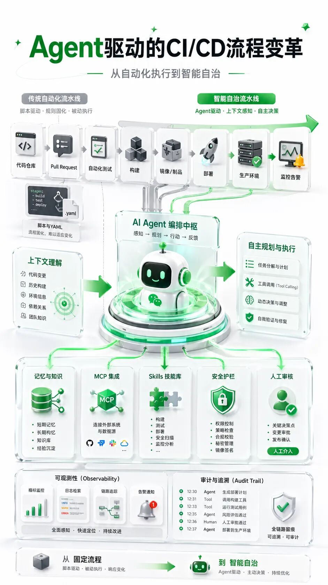
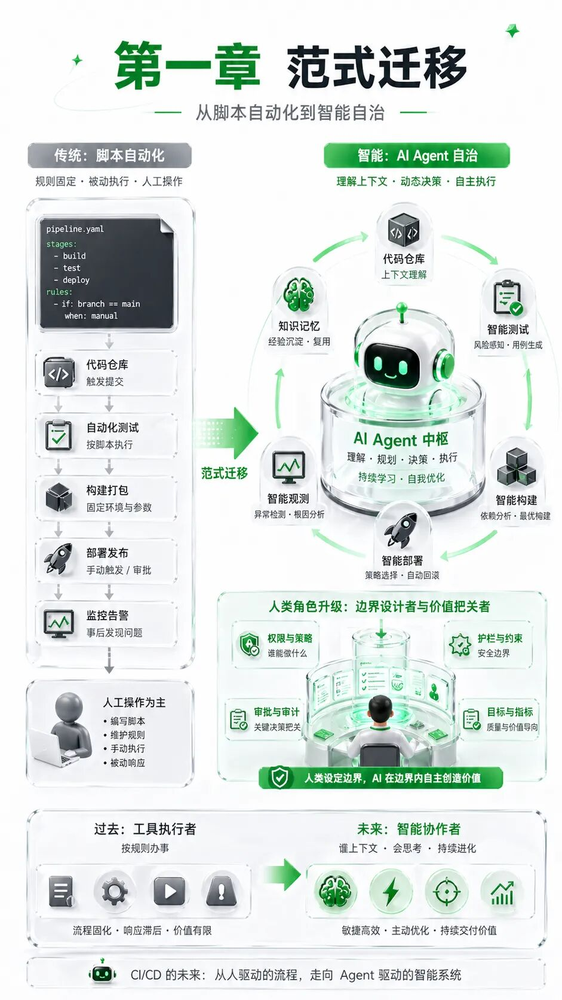
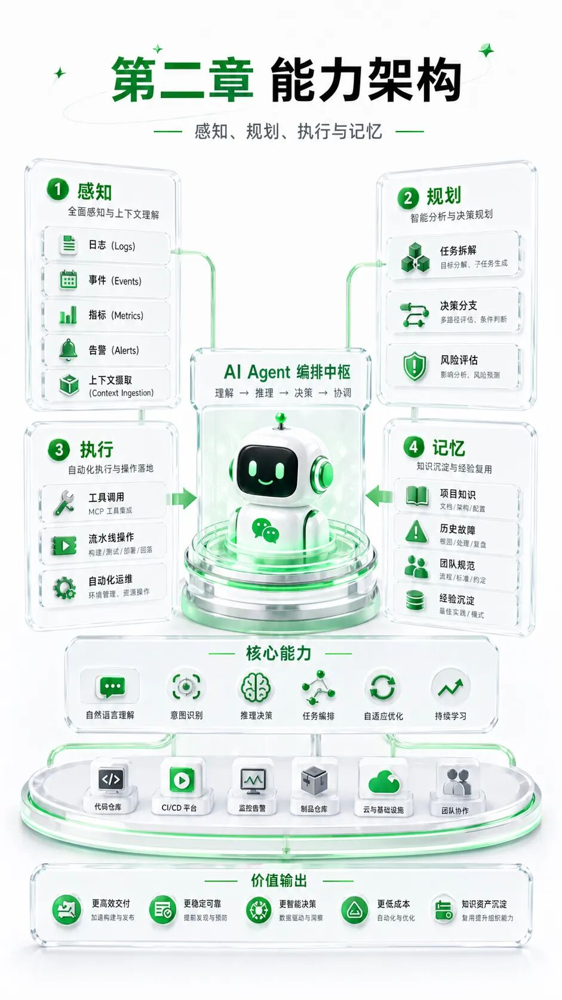
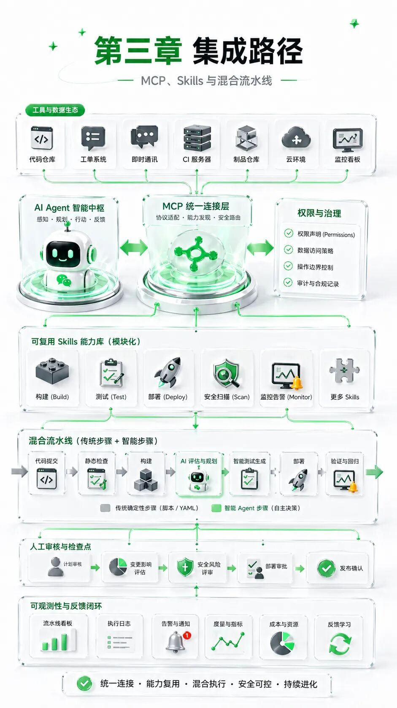
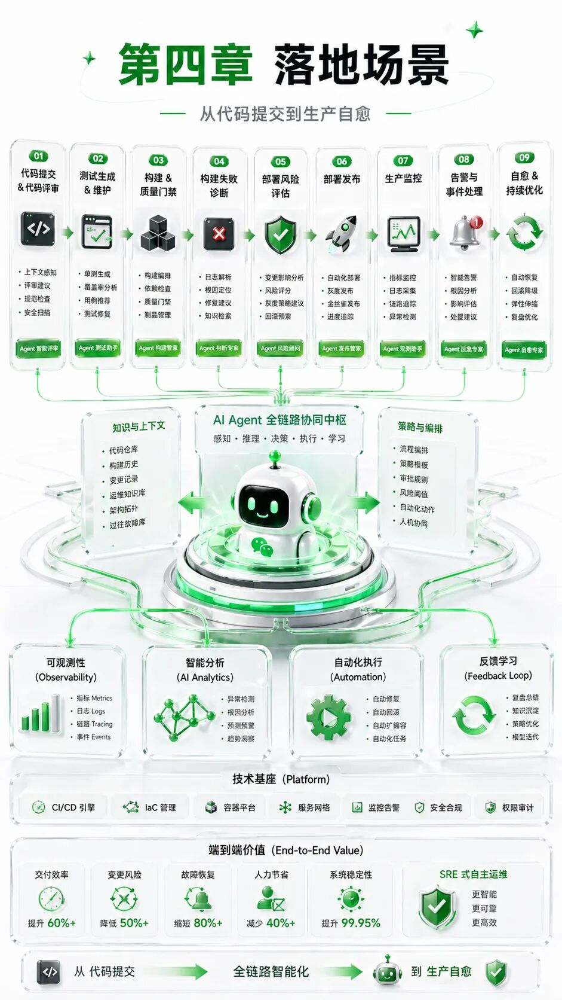
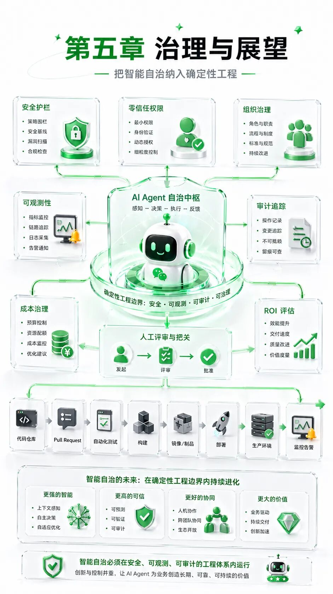

> 原文链接：https://mp.weixin.qq.com/s/pR1vHzPF29tgbdjVupS7kg

# Agent驱动的CI/CD流程变革：从自动化执行到智能自治

面向工程团队的软件交付、DevOps与AI Agent融合观察

摘要

AI Agent 正在把 CI/CD 从“脚本自动化”推向“智能自治”。传统流水线擅长执行确定性步骤，却很难理解日志语义、变更上下文、环境状态和发布风险；Agent 的价值，正在于把这些分散的信息重新组织成可感知、可规划、可行动的工程闭环。

这种变化并不是用大模型替换 Jenkins、GitLab CI、GitHub Actions 或 Kubernetes，而是在既有工具链上增加一层具备上下文理解能力的调度与协作机制。它可以参与代码审查、测试生成、构建诊断、环境部署、发布拦截和生产自愈，让流水线从“按步骤跑完”升级为“围绕目标完成交付”。

但智能自治不是无约束自治。Agent 一旦获得代码仓库、构建节点、云资源和生产环境权限，就必须被纳入确定性工程体系：最小权限、输入校验、全链路审计、Token 成本控制以及 Human-in-the-loop 审核，都将成为企业落地 Agentic DevOps 的基础设施。

导语

过去十多年，CI/CD 的主线非常清晰：把重复操作写成脚本，把脚本放进流水线，把发布过程变成可重复、可追踪、可回滚的工程机制。这一阶段解决了“机器能不能自动执行”的问题，也让持续集成、持续交付和云原生部署成为软件团队的默认能力。

新的瓶颈已经不在执行环节，而在判断环节。构建失败后，工程师仍要阅读大量日志；测试覆盖率下降后，团队仍要判断哪些用例该补；发布风险升高时，值班人员仍要在告警、指标、调用链和版本差异之间来回切换。传统流水线可以把命令跑得很快，却无法独立理解“为什么失败、应该怎么办、做了之后风险多大”。

Agent 技术的出现，让 CI/CD 第一次有机会拥有类似工程师的“工作流理解能力”。它能够读取需求、代码、日志、监控指标和变更记录，拆解任务，选择工具，执行动作，并把结果回写到工单、代码仓库或发布平台。由此，流水线不再只是被动执行脚本，而开始成为主动协作的交付系统。

过渡：真正的变化，不只是多了一个 AI 步骤

在很多团队的初始尝试中，Agent 只是被放进流水线里的一个新增 Stage，例如“自动代码审查”或“生成测试用例”。这当然有价值，但它只是第一层变化。更深层的变化，是 Agent 逐渐连接代码仓库、构建系统、制品仓库、Kubernetes 集群、监控平台和企业 IM，成为跨工具链的上下文枢纽。

因此，讨论 Agent 驱动的 CI/CD，不能只看单个工具是否聪明，而要看它是否形成了感知、规划、行动的闭环；不能只看一次生成是否成功，而要看它是否能在权限、审计、成本和可靠性约束内长期运行。下面从范式、架构、集成、场景和治理五个维度展开。

Agent进入流水线后改变了什么

维度

传统CI/CD

Agent驱动CI/CD

触发方式

按脚本和事件执行

围绕目标与上下文动态行动

判断依据

状态码、固定规则、人工经验

日志、指标、代码差异与历史知识

主要价值

提升执行效率

降低认知成本并增强风险控制

治理重点

流水线稳定性

权限、审计、可观测性与成本边界

一、CI/CD的下一次范式迁移：从脚本自动化到智能自治

交付瓶颈从执行速度转向认知成本

传统 CI/CD 的核心逻辑，是把构建、测试、打包、部署和回滚等步骤预先固化为 YAML、Jenkinsfile 或 Shell 脚本。它非常适合处理确定性任务：代码检出、依赖安装、镜像构建、单元测试、制品上传、服务部署。这些任务有清晰输入、清晰输出和稳定规则，机器执行比人工执行更快、更稳。

但软件交付中越来越多的阻塞，并不是“没有自动化”，而是“自动化无法解释上下文”。一次构建失败可能来自依赖版本冲突、网络抖动、缓存污染、编译器差异或业务代码缺陷。一次发布异常可能与某个接口超时、某个灰度分组、某条调用链或某个配置项有关。传统脚本通常只能告诉团队“失败了”，却很难说明“失败的根因是什么”。

Agent 的加入，改变的是认知成本结构。它可以把日志、指标、事件、PR 差异和历史故障记录统一纳入上下文，先理解问题，再生成处理路径。流水线因此从“执行系统”向“判断系统”延伸，交付效率也从单纯的执行加速，转向问题定位、方案生成和风险控制的综合提升。

人的角色从流程操作者变成边界设计者

在脚本自动化时代，工程师承担两类工作：一类是设计流程，另一类是在流程失效时人工介入。随着系统复杂度上升，第二类工作占用的时间越来越多。工程师频繁处理 CRUD、低级缺陷、文档补齐、环境配置、发布检查和告警排查，真正用于架构设计、业务理解和关键决策的时间被不断压缩。

Agent 驱动的 CI/CD 并不是把工程师从流程中拿掉，而是把人放在更高价值的位置。人负责定义目标、权限边界、验收标准和例外规则；Agent 负责在边界内执行大量重复但需要上下文判断的任务。换句话说，人的角色从“每一步都亲自操作”，转为“设计系统如何安全地自动操作”。

这种角色变化对团队管理也有影响。管理者不只需要关注某个开发者完成了多少任务，还要关注交付系统是否足够可观测、权限是否最小化、自动化是否可审计、关键节点是否有人审机制。Agent 越强，组织越需要清晰的边界设计。

Agent让流水线具备上下文理解能力

传统流水线判断成功与失败，多数时候依赖状态码和固定规则。Agent 则更接近“带工具的工程助手”：它能读取 PR 说明、分析代码差异、理解错误日志、调用测试框架、查询监控系统，并在必要时请求人工确认。它不只是生成文本，而是可以围绕一个交付目标连续行动。

这就是智能自治的基本含义：系统不再完全依赖预设分支，而是能在给定目标、权限和工具后，动态选择下一步。例如，构建失败时先归类错误，再判断是否可自动修复；如果是依赖缺失，生成修复补丁；如果是生产风险，则停止发布并向负责人解释原因。

当然，自治并不等于随意。真正可用的 Agentic CI/CD，必须把“能做什么”和“不能做什么”写进工程机制。只读 Agent、审查 Agent、部署 Agent、运维 Agent 应该有不同权限；低风险操作可以自动完成，高风险操作必须进入人工审核。

二、Agent驱动CI/CD的能力架构：感知、规划与行动

感知层：把日志、事件和指标变成上下文

Agent 进入 CI/CD 的第一步，是获得足够可靠的“感官”。它需要读取代码仓库事件，例如分支变更、PR 创建、Issue 更新和 Commit 说明；也需要读取构建日志、测试报告、制品扫描结果、Kubernetes Pod 状态、Prometheus 指标、调用链和告警事件。这些信息原本分散在不同系统里，工程师靠经验手工拼接。

感知层的价值，是把非结构化信息变成可推理上下文。构建日志里可能混杂着警告、错误、路径、版本号和缓存信息；监控平台里可能同时出现延迟上升、错误率抖动和实例重启。Agent 需要先识别哪些信息与当前失败相关，再排除噪声，形成可解释的问题摘要。

如果没有感知层，Agent 只能在盲区里生成建议；如果感知层足够稳定，它就能把“日志太长没人看”变成“问题摘要、疑似根因和建议动作”。这也是 Agent 能够缩短故障定位时间的根本原因。

规划层：在未知问题前生成可追踪的处置路径

CI/CD 中的很多问题不是固定题，而是开放题。一次失败可能既涉及代码，也涉及依赖、环境、权限和资源配额。规划层的作用，是让 Agent 在执行前先拆解任务，明确检查顺序、候选方案和风险点。

例如面对“生产环境接口错误率升高”的情况，一个合格的 Agent 不应直接重启服务。更合理的路径是：先确认告警范围，再查看最近发布记录，接着比对版本差异和关键指标，随后判断是流量问题、配置问题还是代码缺陷，最后给出回滚、限流、扩容或人工介入的建议。

规划层也是可审计性的前提。企业不应只记录 Agent 做了什么，还要记录它为什么这样做、使用了哪些证据、跳过了哪些方案、在哪里触发了人工审核。这样，Agent 的推理过程才能从“黑盒建议”变成“可复盘的工程决策”。

执行层：通过工具调用把决策落到流水线

Agent 的能力不能停留在解释和建议上。真正改变 CI/CD 的，是它能够调用工具完成动作：触发构建、执行测试、创建 PR、修改配置、调用 Docker 构建镜像、通过 kubectl 查询集群、向发布平台提交灰度计划，或在事故场景下启动回滚流程。

这类能力通常通过 Function Calling、CLI 调用、API 调用或 MCP Server 实现。对工程团队来说，重点不是让 Agent “什么都能调用”，而是把工具能力按风险等级分层：只读查询、低风险写入、高风险变更、生产操作分别配置不同授权和审批。

执行层越强，越需要保护机制。一个能自动提交代码的 Agent，必须受到分支保护和 Code Review 约束；一个能操作 Kubernetes 的 Agent，必须在命名空间、资源类型和操作动词上受限；一个能回滚生产环境的 Agent，必须保留完整操作日志和人工兜底路径。

记忆层：让流水线从历史经验中调整策略

传统脚本没有长期记忆。它只按照当前输入执行，不会主动总结过去的故障模式，也不会记住某个项目的特殊约定。Agent 引入记忆机制后，可以记录项目依赖、历史缺陷、常见构建失败、团队偏好、代码规范和发布策略。

这种记忆可以帮助 Agent 做更贴近项目实际的判断。例如某个团队长期使用特定版本的依赖，Agent 在生成修复建议时就不应盲目升级到最新版本；某个系统对延迟特别敏感，Agent 在灰度发布时就应该优先关注 P95、P99 延迟而不仅是平均响应时间。

需要注意的是，记忆层同样要治理。哪些信息可以被记住，哪些信息涉及敏感数据，记忆多久过期，是否允许跨项目共享，都应有明确规则。否则，记忆可能从效率资产变成隐私和安全风险。

三、技术集成路径：MCP、Skills与混合流水线

MCP：让Agent与DevOps工具链有统一接口

Agent 要进入 CI/CD，首先要解决“如何连接工具”的问题。过去，每接入一个工具都要单独理解 API、认证方式、参数格式和返回结构。代码仓库、制品仓库、Kubernetes、Terraform、Grafana、Datadog、Jenkins、GitHub Actions 各有各的接口，集成成本高，维护成本也高。

以 MCP 为代表的标准化协议，试图为 Agent 与外部工具之间建立统一通信方式。它的意义类似“接口层”：让 Agent 能够以标准方式发现工具能力、传递上下文、发起调用并接收结果。对企业而言，这降低了工具链改造成本，也让 Agent 能力更容易复用。

在 DevOps 场景中，MCP Server 可以覆盖多个方向：读取 GitHub 仓库状态、创建 Issue 或 PR；查询 Kubernetes Pod 日志、Deployment 状态和事件；访问 Terraform Registry 模块信息；读取可观测平台中的指标和追踪数据。Agent 借助这些连接，才具备跨系统协作的基础。

Skills：把复杂运维动作封装成可复用能力

另一条常见路径，是将具体能力封装为 Skills。一个 Skill 可以对应“自动代码审查”“Harbor 镜像清理”“Docker 镜像构建”“漏洞扫描策略配置”“微信或飞书消息交互”等场景。它把复杂操作隐藏在稳定接口后面，Agent 只需要理解什么时候调用、传入什么参数、如何处理结果。

Skills 模式的优势是工程边界清晰。团队可以把经过验证的流程封装起来，减少 Agent 直接拼接命令的风险。例如镜像清理 Skill 内部可以固定保留策略、白名单项目和删除前校验；部署 Skill 内部可以固定灰度比例、健康检查和回滚条件。

这种模式尤其适合企业内部平台化。平台团队把常用 DevOps 能力做成可审计、可复用、可版本化的 Skill，业务团队再通过 Agent 调用。这样既能提高效率，也能避免每个项目各自实现一套不受控的自动化。

混合流水线：让存量系统平滑进入Agent阶段

对大多数团队来说，直接把现有 CI/CD 全部改成 Agent 驱动并不现实。存量 Jenkins、GitLab CI、GitHub Actions、Argo CD 和企业自研发布平台仍然承担核心生产任务。更稳妥的方式，是采用混合流水线：保留传统 Pipeline 主体，只在高价值节点引入 Agent Step。

这种集成方式的落地门槛低。例如在代码检出后增加 AI Code Review，在测试失败后增加日志诊断，在发布前增加风险评估，在告警触发后增加根因摘要。传统流水线继续提供确定性执行能力，Agent 则补足上下文理解和动态决策能力。

混合模式还方便分阶段治理。团队可以先把 Agent 限制为只读分析，再允许它生成建议，再允许它创建待审 PR，最后在低风险场景中开放自动执行。每一步都可以通过指标评估收益和风险，而不是一次性把生产权限交给模型。

权限声明和人审节点不能省略

Agentic Workflow 的设计重点，不是让自然语言替代所有 YAML，而是让意图、工具和权限之间形成清晰映射。开发者可以用更自然的方式表达目标，但系统必须明确需要哪些工具、哪些权限、哪些输出可直接生效、哪些输出必须等待人工审核。

这也是 Agent 工程化与普通 AI 应用最大的区别。一个聊天机器人答错了，通常只是建议不准；一个部署 Agent 操作错误，可能造成生产事故。因此，CI/CD 场景必须把权限声明、沙箱隔离、审批流和回滚机制作为默认设计，而不是上线后的补丁。

四、全链路落地场景：从代码提交到生产自愈

代码审查：从静态检查走向上下文审查

代码审查是 Agent 最容易进入 CI/CD 的场景之一。传统静态扫描擅长发现语法问题、格式问题和部分安全规则问题，但对业务上下文、并发风险、边界条件、异常处理和可维护性问题的识别有限。Agent 可以结合 PR 描述、代码差异、历史提交和项目规范，给出更接近技术负责人视角的审查建议。

更进一步，Agent 不只提出问题，还可以生成修复补丁。对于命名不一致、缺少空值判断、测试用例缺失、文档遗漏等低风险问题，Agent 可以创建一个待审 PR，由开发者确认后合入。这种模式能显著减少人工在重复性审查上的消耗。

但代码审查 Agent 不应直接拥有无约束合并权限。比较稳妥的做法是：Agent 提供建议和补丁，保护分支继续要求人工 Review；只有在规则明确、风险很低、测试充分通过的场景下，才逐步开放自动合入。

测试生成：从补用例到维护测试资产

测试用例的生成与维护，是 CI/CD 中另一个长期痛点。需求变化快、代码重构多、测试资产容易老化，导致覆盖率看似存在，实际无法有效保护核心逻辑。Agent 可以根据代码变更自动推导需要补充的单元测试、集成测试或端到端测试，并解释每个用例覆盖的业务路径。

更重要的是，Agent 可以参与测试资产维护。当代码接口变化时，它可以识别哪些旧用例需要调整；当某类缺陷反复出现时，它可以建议新增回归测试；当覆盖率下降时，它可以分析缺口位于分支逻辑、异常路径还是边界条件。

这会让测试从“上线前补一补”变成“随代码变化持续演进”。在成熟实践中，Agent 生成的测试不应直接成为最终答案，而应进入测试框架、覆盖率报告和人工抽检机制，由工程系统共同确认其有效性。

构建诊断：从查看日志到自动定位根因

构建失败往往是流水线中最频繁、也最消耗耐心的阻塞点。工程师需要在日志中查找错误位置，判断是依赖缺失、版本冲突、编译失败、测试不稳定还是环境问题。Agent 可以自动采集构建日志，提取关键错误片段，结合历史失败模式进行分类，并给出疑似根因。

这种能力的价值不只是节省阅读日志时间，更在于让团队形成统一的故障知识库。每次构建失败的摘要、根因、修复动作和验证结果都可以沉淀下来，下一次相似问题出现时，Agent 能更快识别并建议处理。

对于可自动修复的问题，Agent 可以提交补丁或调整配置；对于不可自动修复的问题，它至少可以把“请看日志”变成“问题集中在某个依赖版本和某个编译阶段，建议先检查这三个文件”。这会显著降低新人和跨团队协作中的沟通成本。

部署运维：从无人值守发布到SRE即服务

发布与运维阶段，是 Agent 能力最有想象力、也最需要克制的环节。Agent 可以参与发布前风险评估：比对本次变更范围、历史事故记录、关键指标、调用链依赖和灰度策略，判断是否具备发布条件。对于异常风险，它可以自动拦截并说明原因。

在生产环境中，Agent 可以连接 Prometheus、Grafana、日志平台和告警系统，形成类似 SRE 助手的能力。当错误率突增、延迟升高或实例异常重启时，它先汇总证据，再判断是否触发扩容、限流、切流、回滚或人工升级。

这里的核心原则是分级处置。低风险动作可以自动执行，例如查询日志、生成事故摘要、通知值班人；中风险动作可以需要二次确认，例如扩容或重启非核心服务；高风险动作必须经过明确审批，例如生产回滚、流量切换和配置大范围变更。

案例启发：先在高价值阻塞点落地

从已有实践看，Agent 驱动 CI/CD 最适合先落在“高频、耗时、规则半确定、上下文复杂”的环节。代码审查、测试生成、构建失败诊断、发布风险评估和事故摘要，都具备这些特征。它们既有明确价值，又不必一开始就授予 Agent 过高权限。

不建议从“全自动无人发布”开始。更理性的路径是：先让 Agent 做解释，再让它做建议，再让它做可审查的变更，最后才在小范围、低风险、强审计场景中尝试自动执行。这样可以积累信任，也能在早期发现提示词注入、权限配置、成本失控和幻觉输出等问题。

五、治理与展望：把智能自治纳入确定性工程

安全治理：以零信任约束Agent权限

Agent 一旦进入 CI/CD，就不再只是内容生成工具，而是可能影响代码、制品、基础设施和生产环境的执行主体。它读取的输入可能来自 Issue、PR 评论、提交说明、日志和外部消息，其中任何一处都可能隐藏 Prompt 注入或恶意诱导。因此，安全治理必须前置。

零信任原则应成为默认策略。Agent 不应因为“看起来聪明”就获得广泛权限，而应按任务拆分为不同身份：代码审查 Agent 只读仓库，测试 Agent 可生成补丁但不能合并，部署 Agent 只能操作指定环境和命名空间，生产运维 Agent 必须接受审批和审计。

输入清洗也同样重要。来自外部的 PR 评论、Issue 内容、日志片段和文档，都应被视为不可信输入。Agent 在读取这些内容时，需要明确区分“用户数据”和“系统指令”，并通过策略层阻断越权工具调用。

可观测性：让每一次推理和操作都可追溯

传统 CI/CD 的可观测性关注构建耗时、测试通过率、发布结果和服务指标。Agent 加入后，观测对象必须扩展到提示词、模型响应、工具调用、权限判定、人工审核和最终动作。否则，团队只能看到结果，却无法复盘 Agent 的决策过程。

一个可用的 Agentic CI/CD 系统，至少应记录三类信息：第一，Agent 接收了什么上下文和目标；第二，Agent 调用了哪些工具、得到哪些结果、如何生成下一步；第三，最终动作是否经过审批、执行结果如何、是否触发回滚或告警。

这些记录不仅用于事故复盘，也用于持续优化。团队可以分析哪些任务最适合 Agent，哪些提示词容易带来误判，哪些工具调用失败率高，哪些环节 Token 消耗异常。可观测性越完整，Agent 就越容易从试验品变成生产系统。

成本治理：把Token用在高价值复杂环节

Agent 的运营成本主要来自模型调用、Token 消耗、上下文检索、工具执行和人工审核。并不是所有 CI/CD 步骤都值得交给大模型。拉取代码、上传镜像、执行固定命令、清理临时目录等确定性任务，仍然应该由传统脚本完成。

更合理的分层策略是：高频且规则固定的任务走脚本；低频但复杂、需要解释、容易出错的任务走 Agent；高风险任务走 Agent 辅助分析加人工审批。这样既能发挥模型的上下文理解能力，也能避免把简单任务变成昂贵推理。

成本治理还需要量化 ROI。团队应跟踪交付周期是否缩短、故障定位时间是否下降、测试覆盖质量是否提升、发布拦截是否减少事故、人工审核负担是否降低。只有这些收益能够覆盖模型成本和治理成本，Agent 才算真正进入生产价值阶段。

组织治理：从管人到管系统

Agentic DevOps 会改变工程管理方式。过去管理者更多关注团队分工、任务排期和人员产出；未来还必须关注自动化系统本身的质量：工具链是否标准化、权限是否清晰、知识库是否可靠、审计是否完整、Agent 是否在正确场景中使用。

这不是减少管理，而是把管理对象从单个人的执行动作，扩展到人机协作系统。团队需要定义哪些任务可以自动化，哪些任务必须人审，哪些指标用于判断 Agent 输出质量，哪些异常需要立刻降级回传统流程。

成熟团队不会追求“所有事情都让 Agent 做”，而会追求“每个环节都知道 Agent 应该做到哪里”。这种边界意识，决定了智能自治能否长期稳定运行。

趋势判断：智能自治不等于完全放手

随着模型能力提升、MCP 等协议普及、企业工具链逐步开放标准接口，CI/CD 将继续向智能自治演进。未来的交付系统可能不再是单条流水线，而是由多个专职 Agent 协作的网络：需求 Agent 分析变更，开发 Agent 生成补丁，测试 Agent 维护用例，发布 Agent 评估风险，运维 Agent 监控生产状态。

但最终目标不是让系统脱离人，而是让人从重复劳动中抽身，把注意力放在架构、策略、风险和业务价值上。Agent 是交付系统的能力增强层，不是工程责任的替代者。越接近生产环境，越需要确定性、可追溯和可回退。

因此，Agent 驱动的 CI/CD 最重要的命题，不是“AI 能不能写代码、能不能部署”，而是“企业能不能把 AI 的不确定性，纳入工程系统的确定性边界”。能回答这个问题的团队，才真正具备走向智能自治的基础。

真正成熟的Agent驱动CI/CD，不是让机器替代工程判断，而是让工程判断被更早、更清楚、更稳定地嵌入交付系统。

参考资料

• [http://mp.weixin.qq.com/s?__biz=Mzg2MjYwNjc5NA==&mid=2247507499&idx=1&sn=918cd2492b6e6cc53fa899d062891028&chksm=cf4e69ca67bf66c5561f8667b99ea10984e6c531abd40385eaecb99e294ae52663f7e5c19e7c&scene=21#wechat_redirect](华为大咖说 | 研发人能用AI Agent做什么？)

• [http://mp.weixin.qq.com/s?__biz=MzIwNDI1NDY3Nw==&mid=2247484561&idx=1&sn=ba4a3bb339163f42ca180eba0fc06208&chksm=97052c3d256dda8fb1660c81b426068cde0a17bce3bf72c48618c021797041c6a99f36dc6862&scene=21#wechat_redirect](AI Agent 如何重塑 CI/CD 流程)

• [http://mp.weixin.qq.com/s?__biz=MzIzNzE4OTY5Ng==&mid=2247483879&idx=1&sn=2fe1fcc10af44c030647ed789ae80eac&chksm=e95c6a418987ecc30af2b68d8d37bb4a6b71e3cd6529abcc4140476c427f9e17e51fb1e8aa0f&scene=21#wechat_redirect](当 AI 学会了你的工作流)

• [http://mp.weixin.qq.com/s?__biz=MzAwMzU2MDQ2Ng==&mid=2462726184&idx=1&sn=e7bd44093c4c1cbda2854f8499790bc7&chksm=8d290d77863d0c8def611160e032d2b232a5b8902cc7f1b7b4a2695b297ae7b8612e63ea0052&scene=21#wechat_redirect](当CI/CD开始自己「思考」，产品经理该怎么看？)

• [http://mp.weixin.qq.com/s?__biz=MzA5NDY4NjUwOQ==&mid=2458095547&idx=1&sn=ed9d4a1d74238095a9e6704bf98149a8&chksm=86d2e8961ddbea9866c3c022cf25dad026473b360cd368db8bdc67365a57a32763e41a1d56a2&scene=21#wechat_redirect](AI赋能DevOps：MCP服务器如何让AI代理与真实世界“对话”？)

• [http://mp.weixin.qq.com/s?__biz=MzUxOTc5MjI0MQ==&mid=2247485954&idx=1&sn=a1b9e8a41193aa8ea0581fe9334bf6dc&chksm=f8eb8b03dacfd63de5dc6d60a71ebc35c12a5dd415f59d558971b19bd0852aa0b8e8e883eb8e&scene=21#wechat_redirect](一文详解Agent的工作原理)

• [http://mp.weixin.qq.com/s?__biz=MzI1Njc0OTc3Ng==&mid=2247484377&idx=1&sn=035aaf9a5fa96468925b4e217144d5f9&chksm=ebb7def45d4629945d256073f9dbb324dbd9a185ca9947d05906340df3b00217057fe20c96e6&scene=21#wechat_redirect](AI Agent 浪潮汹涌：子智能体是什么怎么用)

• [http://mp.weixin.qq.com/s?__biz=Mzg3NjgxNDA5Mw==&mid=2247492712&idx=3&sn=df7312d66bd9e342ebc0a865b8e139a1&chksm=ce697c2ded1d6a3f16ca360bdb24a6946b553ef3678f11ae93ea6bc3e6be019c1311462f7322&scene=21#wechat_redirect](华为大咖说丨AI Agent在软件工程工具领域有何应用？未来又将走向何方？)

• [http://mp.weixin.qq.com/s?__biz=MzIwNDI1NDY3Nw==&mid=2247484621&idx=1&sn=bdcc9b3e23e4d72934de1da7aa85a9df&chksm=972b05537627e2033e90b696ddcc8ea2f1ee1827cf9ec0e2c4c2526dbc92180ce2c8fbfd0fe8&scene=21#wechat_redirect](AI Agent 浪潮下，DevOps 的「通用 USB」要来了？)

• [http://mp.weixin.qq.com/s?__biz=Mzg2Mzg3Nzg4Ng==&mid=2247484055&idx=1&sn=d89fe800cb9fcbb40bf1a3ffc364e04f&chksm=cf5b97a386ec4ae7c972863567ac35dcea1e4ad9218a91b54cb490f960d9cf451e10fe0bd902&scene=21#wechat_redirect](告别轮子！AI Agent 接入微信的优雅方案)

• [http://mp.weixin.qq.com/s?__biz=Mzg3NTc2OTcyMw==&mid=2247485948&idx=1&sn=f9c39d58ec3f5a0b0e6c987ab644892f&chksm=cec9c8c372f9d68e20aa0839fc4036b69d85aeec6b22d0f38f47d2946f40ce5404d359851133&scene=21#wechat_redirect](太香了！我用 AI Agent 把 Harbor 运维做成了一个 Skill，附完整开源)

• [http://mp.weixin.qq.com/s?__biz=MzI1NDI3MjY2Nw==&mid=2247483802&idx=1&sn=3dfde4e4e59f777af0b419fe2b083441&chksm=e8c5b591918de39623221560da3d17cbef4287fbdf459242c5c62066716d455e1d9d5312888c&scene=21#wechat_redirect](我把AI塞进了CI/CD流水线，代码审查从此不用等人)

• 【Hermes Agent集成】与CI/CD工作流结合_hermess gitlab-CSDN博客

• [http://mp.weixin.qq.com/s?__biz=MzkyODY4Njk1NQ==&mid=2247483937&idx=1&sn=9d7f7a841c503e500885d5c2b569a776&chksm=c3a5dd7deda00caed2c046e63552f147eaa3c80c286e9cc5cf2bf07795e702a5fba22e6807ea&scene=21#wechat_redirect](基于K8S的CICD方案, 轻松hold住每天上百次部署)

• [http://mp.weixin.qq.com/s?__biz=MzIzMzgzOTUxNA==&mid=2247492028&idx=1&sn=e83d77e0e2994de1785a2d42aa2cff4a&chksm=e9ee67cc911ef75f142d8edc9854f687f552e83781e3faec85dce09d390e564193e78c840121&scene=21#wechat_redirect](AI赋能下的腾讯广告技术团队CICD无人值守实践：从流程重构到研效跃迁)

• [http://mp.weixin.qq.com/s?__biz=MzA4NjAzMjEyOA==&mid=2654576547&idx=1&sn=f4e754519c2fd1f74edface5962d0efe&chksm=85161ef3f7df5edb477a594bc3d689ee1a9d4165fae7d86c97c05ac83397b26a83297f26db62&scene=21#wechat_redirect](释放生产力！DevOps 架构师 Agent：打造自动化、高可靠、可观测的未来 IT 架构)

• [http://mp.weixin.qq.com/s?__biz=MzA3NDUxMTUxOQ==&mid=2455288157&idx=1&sn=2b128f89a8ef87c1f254b15a7473373d&chksm=89fa30b41043a7b8a6e9b51f939a3ad027e65e95ecf01eea37fc573d7b068f8b80a9621ffc63&scene=21#wechat_redirect](基于Hermes Agent 的 AI 可视化协同研发流水线—核心实现机制与实现逻辑)

• [http://mp.weixin.qq.com/s?__biz=MzIzMzcxMTUxOQ==&mid=2247509352&idx=3&sn=fd782009f7199e884b0d325911d9305a&chksm=e93a337a62d597e2da568b4bfd179ed162a5efd40299265c0ebfb1a45adea7d31cb2e9f41cfb&scene=21#wechat_redirect](GitHub智能代理工作流：将“持续AI”带入CI/CD循环)

• [http://mp.weixin.qq.com/s?__biz=MzU2NjE2MDY0MA==&mid=2247488766&idx=1&sn=be3b460637d437787c4bd9757f5c7c3b&chksm=fda2ff64f87ac55d31876faac957526b3888b0db9ce6c0b9e0c31b45769fb509af99aca74a25&scene=21#wechat_redirect](Agentic DevOps 初探：GitHub Agentic Workflow 与 Continuous AI 的实践观察)

• [http://mp.weixin.qq.com/s?__biz=MzYyMjQ3NTY5NQ==&mid=2247483824&idx=1&sn=71383bf10ca8af3be6765e2ef526aec9&chksm=feec1cab1519c88acf5aa25a6832f2b508c2e9aa9f2866a6d86b9eeb623cb8c874ab33f3bea3&scene=21#wechat_redirect](百万级开发者工具 Cline 惊现供应链漏洞：当 AI Agent 掌握了 CICD 的钥匙)

• [http://mp.weixin.qq.com/s?__biz=MjM5MDE0Mjc4MA==&mid=2651280425&idx=2&sn=53bc9ca675780bdcfef972be1996bcd3&chksm=bc0ce95c0f6a2d32f7443c1c9680ed4a29120605f137abc131fa8fc92033dfa8d87fbdbc6f9f&scene=21#wechat_redirect](告别“语义黑盒”：当 Agent 走进生产环境，我们如何驯服它的“不可预测”？)
