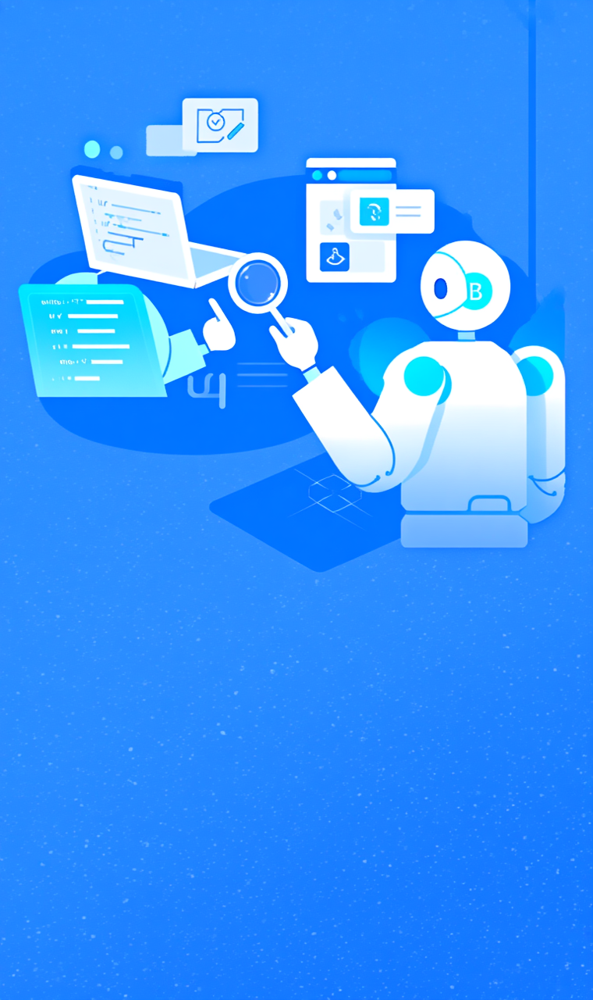
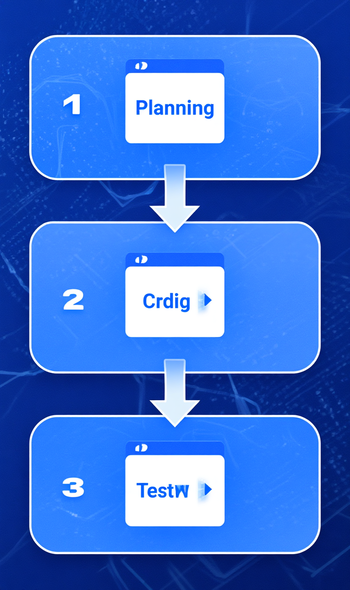

> 原文链接：https://mp.weixin.qq.com/s/hzfVCE18PzpFs54-bACA_g

> 公众号：MingBuilds

# 多智能体怎么落地？Anthropic、字节、NousResearch 给了三套答案

多智能体今年在技术圈几乎成了默认话题。随便打开一个 AI 相关的讨论，总有人在聊多 Agent 协同、上下文管理、自动评估这些概念。

但实际动手做过的人都知道，从"跑通 demo"到"稳定产出"之间有一段不小的距离。两个 Agent 可能会互相附和说"做得不错"，一个长任务跑到后面可能就开始敷衍收尾。问题不在模型本身，在于架构没考虑到这些行为模式。

2026 年 3 月底， Anthropic 的工程师 Prithvi Rajasekaran 发了一篇长文，详细拆解了他们是怎么把 Claude 从"能写个 demo"推到"能连续 6 小时自主开发完整应用"的。几乎同一时期，字节的 DeerFlow 在 GitHub 上冲到了趋势第一，而 NousResearch 的 Hermes Agent 则走了一条完全不同的路线。

三个项目，三种架构思路。不是谁对谁错，而是——**你在什么阶段，就该用什么方法**。

今天不聊概念，直接看这三个项目的底层设计，拆解出多智能体实践中真正 load-bearing 的原则。
## 为什么你的多 Agent 系统会跑飞

Anthropic 的文章里明确指出了两个失败模式，几乎总结了行业 90% 的问题：

**第一，上下文崩溃**。

模型在处理长任务时，随着对话窗口越来越满，开始出现"上下文焦虑"——它判断自己快到极限了，于是倾向于草草收尾。就像 Chrome 标签页开多了之后你会想赶紧关掉浏览器一样。更严重的是，有些模型在上下文接近填满时，判断力和输出质量会明显下降。

Anthropic 的解法叫&nbsp;**Context Reset**——不是原地压缩（ Compaction ），而是彻底清空对话窗口，用一个结构化的 handoff artifact 把之前的状态、进度和下一步任务打包，交给一个全新的 agent 。相当于让一个连续工作 8 小时的程序员去休息，换一个精力充沛的同事接着做。

不过 Opus 4.6 之后这个行为明显改善了不少，新模型的上下文管理能力增强， Anthropic 后来直接移除了这个机制。

**第二，自我评价失效**。

让 Agent 评价自己的产出，它基本会给出正面结论——而且相当自信。这不是模型在撒谎，而是它的训练方式决定了它天然倾向于认可 LLM 生成的内容，包括自己生成的。

Anthropic 的解法是&nbsp;**Generator-Evaluator 分离**，灵感来自 GAN （生成对抗网络）。生成器负责干活，评价器负责找茬。关键一点——评价器不是拿来就好的， Anthropic 的工程师花了好几轮调优才把它从"和稀泥 QA"变成"尖锐质检员"。

这两个问题，是多智能体架构设计要解决的核心痛点。
## 三条路线：同一个问题，三种答法
### Anthropic Harness —— 生成-评价质量飞轮

Anthropic 的方案是一个**三 Agent 系统**，整体架构如下：

- 
- 
- 
- 
- 
- 
- 
- 
- 
- 
- 
- 
- 
- 
- 
- 
- 
- 

```
用户输入（一句话需求）&nbsp; │&nbsp; ▼┌──────────────────┐│ &nbsp; &nbsp;&nbsp;Planner&nbsp; &nbsp; &nbsp; &nbsp;││ &nbsp;需求 → 规格文档 &nbsp; ││（deliverables） &nbsp; │└──────┬───────────┘&nbsp; &nbsp; &nbsp; &nbsp;│ 规格文档拆成&nbsp;Sprint&nbsp;列表&nbsp; &nbsp; &nbsp; &nbsp;▼┌──────────────┐ &nbsp; &nbsp; ┌──────────────┐│ &nbsp;Generator&nbsp; &nbsp;│────▶│ &nbsp;Evaluator&nbsp; &nbsp;││ &nbsp;写代码/交付 &nbsp;│ &nbsp; &nbsp; │&nbsp;Playwright验收│└──────┬───────┘ &nbsp; &nbsp; └──────┬───────┘&nbsp; &nbsp; &nbsp; &nbsp;│ &nbsp;◀ 未通过 &nbsp; &nbsp; &nbsp; &nbsp; &nbsp; │ 通过&nbsp; &nbsp; &nbsp; &nbsp;│ &nbsp; &nbsp; &nbsp; &nbsp; &nbsp; &nbsp; &nbsp; &nbsp; &nbsp; &nbsp;│&nbsp; &nbsp; &nbsp; &nbsp;└────────────────────┘&nbsp; &nbsp; &nbsp; &nbsp; 循环直到&nbsp;Sprint&nbsp;Contract&nbsp;达成
```
三个角色的分工非常明确：
•**Planner**：把用户的一句话需求扩展成完整产品规格文档。它只定义 deliverables ，不规定 implementation details——"做什么"和"怎么验证"它管，"怎么写代码"它不管。•**Generator**：按规格文档一个一个 Sprint 地写。每个 Sprint 开始前， Generator 和 Evaluator 先协商一个 Sprint Contract ，约定"什么算完成"。•**Evaluator**——这是真正的杀手锏。它用 Playwright MCP 直接在运行中的应用里逐项验证 Sprint Contract 里的测试条件，像 QA 工程师一样。
这个循环最关键的设计是&nbsp;**Sprint Contract**——它不是一句话的"把这个功能做了"，而是一个结构化的验收清单：

- 
- 
- 
- 
- 
- 
- 
- 
- 
- 
- 
- 
- 
- 
- 
- 
- 

```
Sprint: 关卡编辑器─────────────────────必须实现：✅ 网格化画布（至少 16x16）✅ 拖拽放置精灵✅ 缩放/平移画布✅ 保存/加载关卡（JSON 格式）验收标准：1.&nbsp;打开页面即显示 16x16 网格2.&nbsp;从侧边栏拖拽精灵到网格任意位置3.&nbsp;鼠标滚轮缩放不影响已放置精灵4.&nbsp;点击保存按钮下载 json 文件，&nbsp; &nbsp;重新加载后精灵位置完全一致不计入本次范围：❌ 精灵动画预览❌ 地形碰撞编辑❌ 多人协作编辑
```
有了这样一份契约， Generator 知道自己要做什么， Evaluator 知道怎么验收——双方不会扯皮。

效果对比——同样是"写一个复古游戏制作器"的需求：
•单 Agent 模式： 20 分钟，$9 ，能搭个界面，但核心功能跑不起来•完整 Harness 模式： 6 小时，$200 ，做出了包含关卡编辑器、精灵编辑器、 AI 辅助设计在内的 16 个功能，游戏真的能玩
贵了 20 倍。但质量差异肉眼可见。

后来 Anthropic 又做了简化版——去掉 Sprint 机制，改用 Planner + Generator + 最终 QA 的三段式。用 Opus 4.6 ，一个"浏览器 DAW 音乐制作器"的需求， 3 小时 50 分钟，$124 ，做出了能实际编曲的作品。

**核心洞察**： Evaluator 的价值取决于任务离模型能力边界有多近。任务在边界内， Evaluator 是噪音；任务在边界处， Evaluator 是决定性杠杆。
### ByteDance DeerFlow —— 研究探索流

字节 DeerFlow 走的是另一条路。全称&nbsp;**Deep Exploration and Efficient Research Flow**，核心定位是**研究型超级 Agent**。

DeerFlow 的架构如下：

- 
- 
- 
- 
- 
- 
- 
- 
- 
- 
- 
- 
- 
- 
- 
- 
- 
- 
- 
- 
- 

```
用户查询&nbsp; │&nbsp; ▼┌──────────────┐│ &nbsp;Researcher &nbsp;│ &nbsp;拆解查询 → 生成搜索计划└──────┬───────┘&nbsp; &nbsp; &nbsp; &nbsp;│ 搜索关键词列表&nbsp; &nbsp; &nbsp; &nbsp;▼┌──────────────┐ &nbsp; &nbsp; ┌──────────────┐│ &nbsp; Searcher &nbsp; │────▶│ &nbsp;Web Crawler ││ &nbsp;多引擎搜索 &nbsp; │ &nbsp; &nbsp; │ &nbsp;抓取/清洗 &nbsp; &nbsp;│└──────────────┘ &nbsp; &nbsp; └──────────────┘&nbsp; &nbsp; &nbsp; &nbsp; &nbsp; &nbsp; &nbsp; &nbsp; &nbsp; &nbsp; &nbsp; &nbsp; &nbsp; &nbsp; │&nbsp; &nbsp; &nbsp; &nbsp; &nbsp; &nbsp; &nbsp; &nbsp; &nbsp; &nbsp; &nbsp; &nbsp; &nbsp; &nbsp; ▼&nbsp; &nbsp; &nbsp; &nbsp; &nbsp; &nbsp; &nbsp; &nbsp; &nbsp; &nbsp; ┌──────────────┐&nbsp; &nbsp; &nbsp; &nbsp; &nbsp; &nbsp; &nbsp; &nbsp; &nbsp; &nbsp; │ Coder Agent &nbsp;│ &nbsp;执行代码/数据分析&nbsp; &nbsp; &nbsp; &nbsp; &nbsp; &nbsp; &nbsp; &nbsp; &nbsp; &nbsp; └──────┬───────┘&nbsp; &nbsp; &nbsp; &nbsp; &nbsp; &nbsp; &nbsp; &nbsp; &nbsp; &nbsp; &nbsp; &nbsp; &nbsp; &nbsp;│&nbsp; &nbsp; &nbsp; &nbsp; &nbsp; &nbsp; &nbsp; &nbsp; &nbsp; &nbsp; ┌──────┴───────┐&nbsp; &nbsp; &nbsp; &nbsp; &nbsp; &nbsp; &nbsp; &nbsp; &nbsp; &nbsp; │ Reporter &nbsp; &nbsp; │ &nbsp;汇总 → 最终报告&nbsp; &nbsp; &nbsp; &nbsp; &nbsp; &nbsp; &nbsp; &nbsp; &nbsp; &nbsp; └──────────────┘
```
DeerFlow 的架构特点：
•基于 LangGraph 构建，子 Agent 编排能力更强•**沙箱执行**——代码在隔离环境中运行，安全性大幅提升•多层持久记忆管理•自定义 Skills 系统，可动态扩展能力•2026 年 2 月 DeerFlow v2 发布后，在 GitHub Trending 登顶
和 Anthropic Harness 对比很清晰： DeerFlow 侧重**研究探索**——信息搜集、代码执行、多步推理、内容创作;Anthropic Harness 侧重**工程构建**——从零到一搭完整应用。

47K stars 说明开源社区的选择。如果你需要的是一个能快速调研、写报告、执行代码的"数字研究员"， DeerFlow 更合适。
### NousResearch Hermes —— 个人 Agent 的极简路线

Hermes Agent 的设计理念完全不同。 slogan 是&nbsp;**"The agent that grows with you"**——它不是企业级多智能体系统，而是**个人智能 Agent 框架**。

- 
- 
- 
- 
- 
- 
- 
- 
- 
- 
- 
- 
- 
- 
- 
- 

```
┌─────────────────────────────────────┐│&nbsp; &nbsp; &nbsp; &nbsp; &nbsp; &nbsp;Hermes&nbsp;Agent&nbsp; &nbsp; &nbsp; &nbsp; &nbsp; &nbsp; &nbsp; &nbsp;││&nbsp;&nbsp;┌─────────┐&nbsp;&nbsp;┌─────────┐&nbsp; &nbsp; &nbsp; &nbsp; &nbsp; &nbsp;││&nbsp;&nbsp;│&nbsp;Profile&nbsp;1│&nbsp;&nbsp;│&nbsp;Profile&nbsp;2│&nbsp;&nbsp;...&nbsp; &nbsp; &nbsp;││&nbsp;&nbsp;│&nbsp;(工作) &nbsp;&nbsp;│&nbsp;&nbsp;│&nbsp;(个人) &nbsp;&nbsp;│&nbsp; &nbsp; &nbsp; &nbsp; &nbsp;&nbsp;││&nbsp;&nbsp;│&nbsp; config &nbsp;│&nbsp;&nbsp;│&nbsp; config &nbsp;│&nbsp; &nbsp; &nbsp; &nbsp; &nbsp;&nbsp;││&nbsp;&nbsp;│&nbsp; memory &nbsp;│&nbsp;&nbsp;│&nbsp; memory &nbsp;│&nbsp; &nbsp; &nbsp; &nbsp; &nbsp;&nbsp;││&nbsp;&nbsp;│&nbsp; skills &nbsp;│&nbsp;&nbsp;│&nbsp; skills &nbsp;│&nbsp; &nbsp; &nbsp; &nbsp; &nbsp;&nbsp;││&nbsp;&nbsp;│&nbsp;sessions&nbsp;│&nbsp;&nbsp;│&nbsp;sessions&nbsp;│&nbsp; &nbsp; &nbsp; &nbsp; &nbsp;&nbsp;││&nbsp;&nbsp;└─────────┘&nbsp;&nbsp;└─────────┘&nbsp; &nbsp; &nbsp; &nbsp; &nbsp; &nbsp;││&nbsp; &nbsp; &nbsp; &nbsp; &nbsp; &nbsp; &nbsp; &nbsp; &nbsp; &nbsp; &nbsp; &nbsp; &nbsp; &nbsp; &nbsp; &nbsp; &nbsp; &nbsp; &nbsp;&nbsp;││&nbsp;&nbsp;┌────────────────────────────┐&nbsp; &nbsp; &nbsp;││&nbsp;&nbsp;│&nbsp; &nbsp; &nbsp;&nbsp;Gateway&nbsp; &nbsp; &nbsp; &nbsp; &nbsp; &nbsp; &nbsp; &nbsp;│&nbsp; &nbsp; &nbsp;││&nbsp;&nbsp;│&nbsp;&nbsp;Telegram/Discord/Slack&nbsp; &nbsp;│&nbsp; &nbsp; &nbsp;││&nbsp;&nbsp;└────────────────────────────┘&nbsp; &nbsp; &nbsp;│└─────────────────────────────────────┘
```
核心能力：
•**持久记忆（ Persistent Memory ）**——Agent 的对话经验持续积累，不是用完就扔。这个能力听起来理所当然，但在主流框架里并不默认提供。•**多 Profile 隔离**——同一台机器上跑多个独立实例，各自有自己的配置、 API Key 、记忆、会话、技能和 Gateway 服务。•**多平台 Gateway**——支持 Telegram 、 Discord 、 Slack 、 WhatsApp 多种消息通道。
它解决的不是"多 Agent 协作完成复杂任务"，而是"怎么让一个 Agent 真正成为你的个人助手——认识你、记住你的偏好、随着时间越来越好用"。

如果你不需要多 Agent 编排，只是想在工作流里嵌入一个有记忆、有技能的长期 Agent ， Hermes 的路线最简洁。
### 三项目对比一览
维度Anthropic HarnessDeerFlowHermes Agent定位工程构建研究探索个人助手架构三 Agent 循环多 Agent 流水线单 Agent + 记忆质量保障Evaluator 循环验收沙箱隔离执行无（靠模型本身）上下文管理Context ResetLangGraph 状态图持久记忆文件适用场景从零搭完整应用调研/报告/代码分析日常助理/知识库上手难度⭐⭐⭐⭐⭐⭐⭐⭐成本高（$100-200/次）中低## 从这三套方案中提炼的 5 个设计原则
### 1. 做的人跟评价的人必须分开

这是三个项目里共识最强的一条原则，也是实践时最容易踩的坑。

不要让你的 Agent 自己检查自己的工作。不是它做不到，是它做不到你期望的那种严格程度。

正确做法：
&nbsp;- 生成 Agent 负责产出
&nbsp;- 独立评价 Agent 负责验收
&nbsp;- 两个 Agent 之间通过**契约（ Contract ）**或**结构化文件**传递信息
&nbsp;- 评价标准要具体、可验证，不是"做得好不好"而是"这 5 个测试用例过了几个"

调优 Evaluator 是必要投入。 Anthropic 明确表示 QA Agent 从"和稀泥"变成"尖锐质检员"，经过了好几轮 prompt 迭代，每一轮都是拿 Evaluator 误判的 case 反过来修正它的 prompt 。

**最小可跑实现——生成器-评价器双 Agent 循环**：

- 
- 
- 
- 
- 
- 
- 
- 
- 
- 
- 
- 
- 
- 
- 
- 
- 
- 
- 
- 
- 
- 
- 
- 
- 
- 
- 
- 
- 
- 
- 
- 

```
def&nbsp;run_gen_eval_loop(user_request, max_iterations=5):&nbsp; &nbsp;&nbsp;"""最简 Generator-Evaluator 循环"""
&nbsp; &nbsp;&nbsp;# 第一轮：生成&nbsp; &nbsp; conversation = [&nbsp; &nbsp; &nbsp; &nbsp; {"role":&nbsp;"system",&nbsp;"content": SYSTEM_GENERATOR},&nbsp; &nbsp; &nbsp; &nbsp; {"role":&nbsp;"user",&nbsp;"content": user_request}&nbsp; &nbsp; ]&nbsp; &nbsp; code = llm.chat(conversation)
&nbsp; &nbsp;&nbsp;for&nbsp;iteration&nbsp;in&nbsp;range(max_iterations):&nbsp; &nbsp; &nbsp; &nbsp;&nbsp;# 评价&nbsp; &nbsp; &nbsp; &nbsp; eval_prompt = [&nbsp; &nbsp; &nbsp; &nbsp; &nbsp; &nbsp; {"role":&nbsp;"system",&nbsp;"content": SYSTEM_EVALUATOR},&nbsp; &nbsp; &nbsp; &nbsp; &nbsp; &nbsp; {"role":&nbsp;"user",&nbsp;"content":&nbsp;f"需求:\n{user_request}\n\n代码:\n{code}"}&nbsp; &nbsp; &nbsp; &nbsp; ]&nbsp; &nbsp; &nbsp; &nbsp; eval_result = llm.chat(eval_prompt)
&nbsp; &nbsp; &nbsp; &nbsp;&nbsp;# 检查是否通过&nbsp; &nbsp; &nbsp; &nbsp;&nbsp;if&nbsp;"ALL PASS"&nbsp;in&nbsp;eval_result:&nbsp; &nbsp; &nbsp; &nbsp; &nbsp; &nbsp;&nbsp;print(f"通过！共&nbsp;{iteration +&nbsp;1}&nbsp;轮")&nbsp; &nbsp; &nbsp; &nbsp; &nbsp; &nbsp;&nbsp;return&nbsp;code
&nbsp; &nbsp; &nbsp; &nbsp;&nbsp;# 不通过 -&gt; 带着反馈重新生成&nbsp; &nbsp; &nbsp; &nbsp; conversation.append({&nbsp; &nbsp; &nbsp; &nbsp; &nbsp; &nbsp;&nbsp;"role":&nbsp;"user",&nbsp; &nbsp; &nbsp; &nbsp; &nbsp; &nbsp;&nbsp;"content":&nbsp;f"审核反馈:\n{eval_result}\n\n请修复所有 FAIL 项。"&nbsp; &nbsp; &nbsp; &nbsp; })&nbsp; &nbsp; &nbsp; &nbsp; code = llm.chat(conversation)
&nbsp; &nbsp;&nbsp;print(f"达到最大迭代次数 ({max_iterations})，输出当前最佳版本")&nbsp; &nbsp;&nbsp;return&nbsp;code
```
这段代码只有 30 行，但涵盖了 Generator-Evaluator 模式的核心逻辑。你可以用 OpenAI 、 Anthropic 、或者任何兼容 Chat API 的模型来跑。关键在于&nbsp;**SYSTEM_EVALUATOR**&nbsp;这个 prompt——如果你发现它总是给 PASS ，说明需要加更多约束。
### 2. 上下文管理比架构花哨更重要

长任务失败的主要原因不是 Agent 能力不够，是上下文管理没做好。

实践要点：
&nbsp;- 如果模型有上下文焦虑倾向（早期 Claude Sonnet 4.5 很明显），用 Context Reset
&nbsp;- 如果模型上下文管理较强（ Opus 4.6 ），可以不用 Reset ，但要注意 Compaction 策略
&nbsp;- 每次会话切换必须通过结构化 artifact 传递状态，不能靠"大概说一声"
&nbsp;- 任务分解到单 Agent 能专注的范围，不要试图用一个 Agent 干所有事

**Handoff Artifact 模板—Agent 交接时的状态快照**：

- 
- 
- 
- 
- 
- 
- 
- 
- 
- 
- 
- 
- 
- 
- 
- 
- 
- 

```
#&nbsp;Handoff Artifact## 任务概要- 原始需求: {user_request}- 当前阶段: {phase} (如 Sprint 3/5)## 已完成- {item 1}: {状态}- {item 2}: {状态}## 待完成- {item 3}: {下一步具体做什么}## 已知问题- {bug 1}: {描述}- {依赖}: {外部依赖项}## 关键文件- 主入口: {file_path}- 配置文件: {file_path}- 测试文件: {file_path}## 注意事项- {架构决策或约束}
```

每次 Agent 切换（无论是 Context Reset 还是多 Agent 之间的 handoff ），都通过这个模板传递。不要依赖"上一轮对话里应该提过"这种事情——如果没写在 artifact 里，就是不存在。
### 3. 契约化协作是 Agent 间通信的唯一可靠方式

Planner 说"你去做"， Generator 说"好的"——然后做出来完全不是 Planner 想的那回事。这不是 Agent 的错，是契约没说清楚。

DeerFlow 通过 LangGraph 做状态管理， Anthropic 通过文件做契约协商（ Generator 和 Evaluator 就"什么算完成"反复迭代直到达成一致）。核心思想一致：**Agent 之间不靠自然语言模糊交流，靠结构化的、双方确认的约定**。
### 4. 复杂度必须与模型能力匹配

这是 Anthropic 文章里最有价值的一句话，我用自己的话翻译：**Harness 的每个组件都在编码一个关于"模型自己做不到什么"的假设**。

Anthropic v1 Harness 用了很多复杂机制（ Sprint 分解、三 Agent 、 Context Reset ），升级到 Opus 4.6 之后， Sprint 机制可以直接去掉，因为模型本身能长时间专注了。

这意味着：
&nbsp;- 别一上来就搭三 Agent 系统
&nbsp;- 先看看单 Agent 能做到什么程度
&nbsp;- 找出模型失败的边界
&nbsp;- 只在边界处加组件

最简单的架构 + 最强的模型 = 最优解。模型不够强，用架构补；架构太复杂而模型够强，你会花不必要的钱和延迟。
### 5. 简单 Agent 用持久记忆，复杂任务用多 Agent 编排

Hermes 和 DeerFlow/Anthropic 代表了两个方向，不是取舍关系，而是不同场景的工具。

**什么时候选持久记忆架构**：
&nbsp;- 只需要一个 Agent
&nbsp;- 需要它记住偏好和上下文
&nbsp;- 任务相对简单但不是一次性的

**什么时候选多 Agent 编排**：
&nbsp;- 任务需要多种能力（规划、编码、测试、搜索）
&nbsp;- 需要质量保障机制
&nbsp;- 任务超出单 Agent 的上下文和能力边界
## 你该从哪里开始

从没做过多智能体系统的话，别学 DeerFlow 从复杂编排入手，也别学 Anthropic 一上来就搭三 Agent 。

**第一步**：先搭一个带持久记忆的单 Agent 。 Hermes Agent 的架构是很好的起点——记忆 + Skills + Gateway ，这是任何 Agent 系统的底层能力。

**第二步**：发现这个 Agent 在某些任务上不稳定或质量参差不齐时，引入评价器。不用三 Agent ，先用上面给的那个 30 行代码的 Generator + Evaluator 双 Agent 循环。

**第三步**：任务越来越复杂，双 Agent 也开始力不从心时，加入 Planner ，变成三 Agent 。这时候你已经有足够的经验来调优每个 Agent 的 prompt 和契约了。

别一上来就画那种复杂的架构图。先把第一个 Agent 跑通。

Anthropic 、 DeerFlow 、 Hermes——三个项目给出了三条路。它们共同说明了一件事：多智能体的核心竞争力不在 Agent 数量，在于你怎么设计它们之间的关系。

关系对了，两个 Agent 能做出一个 Agent 花 20 倍代价也达不到的效果。关系错了，十个 Agent 也只是十倍噪音。
