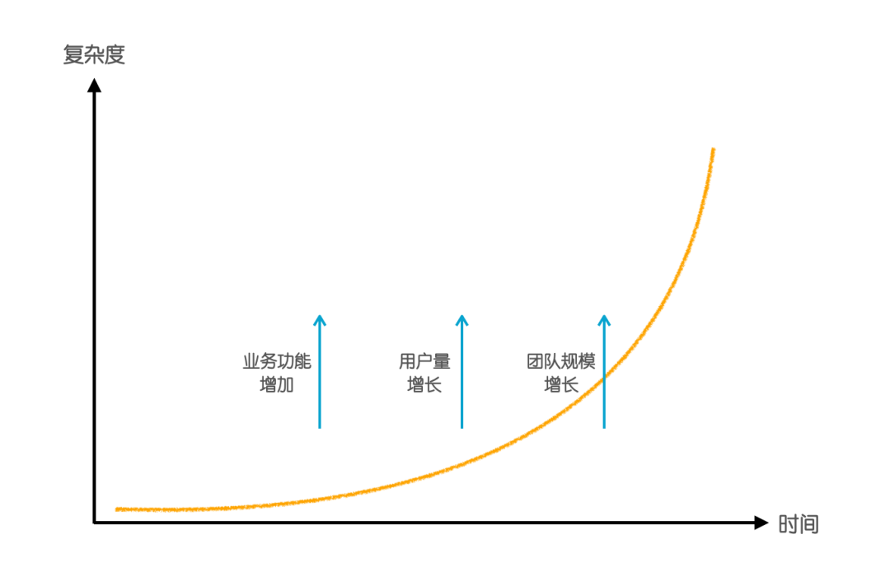
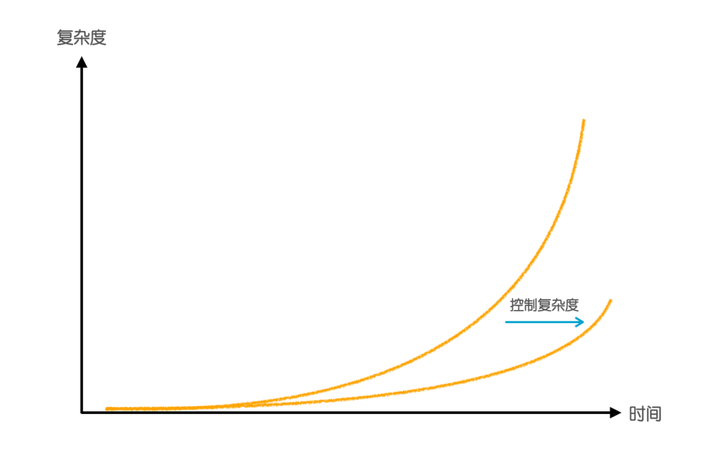
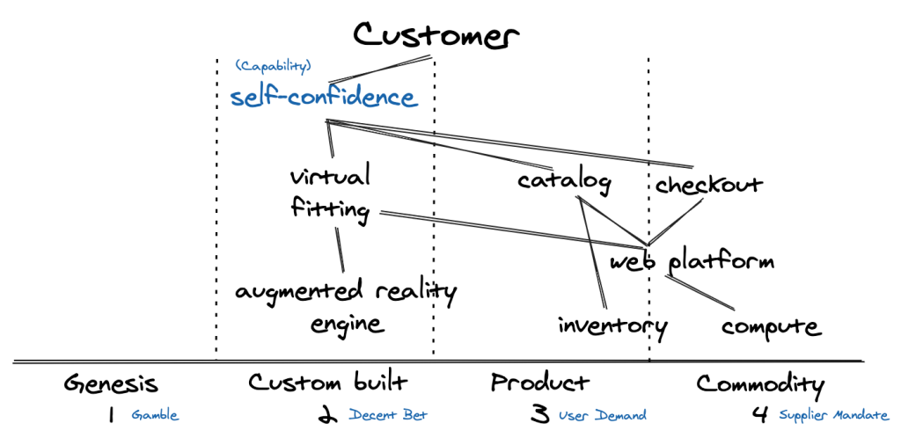
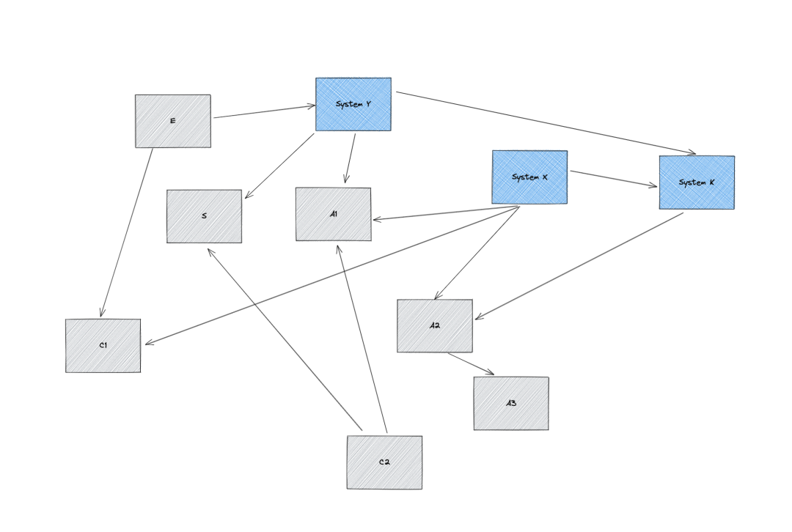

> 原文链接：https://mp.weixin.qq.com/s/f82GBadLcQJCiFHcGWzkCA

> 公众号：阿里云开发者

# 对抗软件复杂度的战争


阿里妹导读

服务一个人的系统，和服务一亿人的系统，复杂度有着天壤之别。本文从工程师文化、组织战略、公司内部协作等角度来分析软件复杂度形成的原因，并提出了一些切实可落地的解法。

一、何为研发效能？
当我们谈研发效能的时候，我们在谈些什么？这个议题被抛出来，有人讨论，是因为存在问题，问题就在于实际的研发效率，已经远低于预期了。企业初创的时候，一个想法从形成到上线，一个人花两个小时就完成了，而当企业发展到数千人的时候，类似事情的执行，往往需要多个团队，花费好几周才能完成。这便造成了鲜明的对比，而这一对比产生的印象，对于没有深入理解软件工程的人来说，显得难以理解，可又往往无计可施。
细心的读者会留意到，前文我既用了“效能”一词，也用了“效率”一词。这是为了做严谨的区分，**效能往往是用来衡量产品的经济绩效，而效率仅仅是指提升业务响应能力，提高吞吐，降低成本。**
这里的定义引用了乔梁的《如何构建高效能研发团队》课程材料，本文并不讨论产品开发方法，因此后面的关注都在“效率”上。
本世纪 10&nbsp;年代，早期的互联网从业者开发简易网站的时候，只需要学会使用 Linux、Apache、MySql、PHP（Perl）即可，这套技术有一个好记的名字：LAMP。可今天，在一个大型互联网公司工作的开发者，需要理解的技术栈上升了一个数量级，例如分布式系统、微服务、Web 开发框架、DevOps 流水线、容器等云原生技术等等。如果仅仅是这些复杂度还好说，毕竟都是行业标准的技术，以开发者的学习能力，很快就能掌握。令人生畏的复杂度在于，**大型互联网公司都有一套或者多套软件系统，这些软件系统的规模往往都在百万行以上，质量有好有坏（坏者居多），而开发者必须基于这些系统开展工作。这个时候必须承担非常高的认知负荷，而修改软件的时候也会面临破坏原有功能的巨大风险，而风险的增高就必然导致速度的降低。**
因此**研发效率的大幅降低，其中一个核心因素就是软件复杂度的指数上升。**

二、本质复杂度和偶然复杂度
Fred Brooks 在经典著作《人月神话》的「没有银弹」一文中对于软件复杂度有着精彩的论述，他将软件复杂度分为本质复杂度（Essential Complexity）和偶然复杂度（Accidental Complexity）。这里的本质和偶然两个词来源于亚里士多德的《形而上学》，在亚里士多德看来，本质属性是一个物体必然拥有的属性，偶然属性是一个物体可以拥有的属性（也可以不拥有）。例如，一个电商软件必然会包含交易、商品等业务复杂度，因此我们称它们为本质复杂度；而同一个电商软件，可以是基于容器技术实现（也可以不是），可以是基于 Java 编写的（也可以不是），因此我们称由于容器技术或者Java 技术而引入的复杂度，为偶然复杂度。
Fred Brooks 所描述的软件本质复杂度，指的就是来自问题域本身的复杂度，除非缩小问题域的范围，否则是无法消除本质复杂度的。而偶然复杂度是由于解决方案带来的，例如选择了 Java，选择了容器，选择了中台等等。
此外，我们可以从所谓问题空间（Problem Space）和方案空间（Solution Space）来理解这两个复杂度，问题空间就是现实的初始状态和期望状态，以及一系列约束规则（我们常常称之为业务），方案空间就是工程师设计实现的，一系列从初始状态达到期望状态的步骤。缺乏经验的工程师往往在还没理解清楚问题的情况下就急于写代码，这便是缺乏对于问题空间和方案空间的理解，而近年来领域驱动设计为那么多工程师所推崇，其核心原因就是它指导了大家去重视问题空间，去直面本质复杂度。Eric Evans 在 2003 年的著作《Domain Driven Design》，其副标题是&nbsp;“Tackling Complexity in the Heart of Software”，我想这也不是偶然。
《人月神话》写于 1975 年，距今已经有 47 年了，Brooks 认为软件的本质复杂度是无法得到本质上的降低的，同时认为随着高级编程语言的演进，开发环境的发展演进，偶然复杂度会得到本质的降低。他的论断前半部分对了，然而后半部分是错了，我们今天的确有更高级的编程语言，功能更丰富的框架，能力更强大的 IDE，但是大家逐渐发现学习这些工具已经成为了一个不小的负担。
三、复杂度的爆炸
软件只要不消亡，只要有人用，有开发者维护，那么它的复杂度几乎必然是不断上升的。软件的生存发展意味着商业上的成功，随着时间的积累，越来越多的人使用它，越来越多的功能被加入进去，它的价值越来越大，给企业带去源源不断的收入。前面我们解释过，软件的本质复杂度实际上是问题空间（或者称之为业务）带来的，因此给软件加入越多的功能，那么它就必然会包含越多的本质复杂度。此外，每解决一个问题，就对应了一个方案，而方案的实现必然又引入新的偶然复杂度，例如为了实现支付，需要实现某种新的协议，以对接一个三方的支付系统。软件复杂度是在商业上成功的企业所必须面对的幸福的烦恼。
和Brooks的时代所不同的是，今天的软件已经从深入到人类生活的方方面面。稍有规模的互联网软件，都服务着数百万、千万级的用户。阿里巴巴的双11在2020年的峰值实现了每秒58.3万笔的交易；Netflix 在2021年Q4拥有了2.2亿的订阅用户；而 TikTok 在2021年9月宣布月活数量超过10亿。这些惊人的商业成功背后，都少不了复杂的软件系统。而所有这些复杂软件系统，都不得不面对巨大的 Scalability 的挑战，**服务一个人的系统，和服务一亿人的系统，其复杂度有着天壤之别。**
本质复杂度是一个方面，毕竟更多用户意味着更多的功能特性，但我们无法忽略这里的偶然复杂度，其中最典型的就是分布式系统引入的偶然复杂度。**为了能够支撑如此大规模的用户量，系统需要能够管理数万机器（调度系统），需要能否管理好用户的流量（负载均衡系统），需要能够管理好不同计算单元之间的通讯（服务发现，RPC，消息系统），需要能够保持服务的稳定性（高可用体系）。**这里的每一个主题都能延展开用几本书来描述，而开发者只有在初步掌握了这些知识后，才能够设计实现足够 Scalable 的系统，服务好大规模的用户。
相比于分布式系统引入的复杂度，团队的扩张更易带来偶然复杂度的急剧增长。成功产品的软件研发团队动辄数百人，有些已经达到了一两千人的规模。如果企业没有严格清晰的人才招聘标准，人员入职后没有严格的技术规范培训，当所有人以不同的风格，不同的长短期目标往代码仓库中提交代码的时候，软件的复杂度就会急剧上升。
例如，团队成员因为个人喜好，在一个全部是 Java 体系的系统中加入了 NodeJS 的组件，当该成员离开团队后，这个组件对于其他不熟悉 NodeJS 的成员来说，就是纯粹多出来的偶然复杂度；
例如，团队新人不熟悉系统，为了急于上线一个特性，又不想影响到系统的其他部分，就会很自然地在某个地方加一个 flag，然后在所有需要改动的地方加 if 判断，而不是去调整系统设计以适应新的问题空间；
例如，同一个领域概念，不同的人在系统不同的模块中使用了不同的名字，核心内涵完全一致，但又加入了差异的属性，平添了大量理解成本。
类似的复杂度都不是软件的本质复杂度，但它们会随着时间的流逝而积累，给开发者带来巨大的认知负担。如果软件存在的时间很长，那除了当前开发团队的规模之外，还得一并考虑历史上给这个软件贡献过代码的所有人，也难怪当程序员看到“祖传代码，勿动！”之类调侃的时候，会会心一笑。
我喜欢学习各种能力强大的编程语言，例如具备元编程能力的 Ruby 和 Scala，使用这些能力你可以尽情发挥自己的兴趣和创造力。但是我对在有一定团队规模的生产环境中使用这些编程语言持保留意见，因为除非花很大力气 Review 和控制代码风格，否则很可能 10&nbsp;个人写出来的代码是 10&nbsp;种风格，这种复杂度的增长是个灾难。相反，使用 Java 这种不那么灵活的语言，大家写代码的风格就比较难不一致。
团队的扩张还会带来另外一个问题，在大规模的团队中，关键干系人的目标事实上是影响软件复杂度的关键因素。我亲眼见过许多案例，其方案空间中明明放着简单的方案，但因为这个原因，当事人不得不选择复杂的方案，例如：

- 
原本方案只需要直接改动系统 A，但由于负责系统 A 的团队并没有解决该问题的动力，其他人不得不绕道去修改系统 B，C，D 来解决该问题。

- 原本方案只需要直接改动系统 A，但迫于系统 B 负责人或者上司的压力，方案不得不演进成同时改 A，B，甚至引入 C。

更有甚者，为了各种各样的原因，提出一些完全假设出来的问题（即，事实上并不存在的本质复杂度），然后拿着软件系统一阵无谓折腾。最后个人或者某个团队的目标实现了，但软件没有提供任何增量的价值，而复杂度却不会因此而停止增长。因此，只要软件有价值，有用户，有开发者维护，那么就不断会有功能增加，而商业上获得成功的软件必然伴随着用户量的增长和研发团队的增长，这三个因素会不断推动软件复杂度的增长直至爆炸，研发效率自然会越来越低。**软件工程要解决的一个核心命题，就是如何控制复杂度，以让研发效率不至于下降的太厉害，这是一场对抗软件复杂度的战争。**

四、错误的应对方式
面对效率地不断下降，研发团队的管理者必须做点什么。不幸的是，很多管理者并不明白效率的降低是由软件复杂度的上升造成的，更没有冷静地去思考复杂度蔓延直至爆炸的根因是什么，于是我们看到许多管理者其肤浅的应对方式收效甚微，甚至起到了反作用。
最常见的错误方式是设置一个不可更改的 Deadline，用来倒逼研发团队交付功能。但无数经验告诉我们，软件研发就是在质量、范围和时间这个三角中求取权衡。研发团队短期可以通过加班，牺牲假期等手段来争取一些时间（长期加班实际有百害无一利），但如果这个时间限制过于苛刻，那必然就要牺牲需求范围和软件质量。当需求范围不可缩减的时候，唯一可以被牺牲的就只有质量了，这实际就意味着在很短的时间内往系统中倾泻大量的偶然复杂度。
另一种做法是用“更先进”的技术去替换现有系统的技术，例如用 Java 的微服务体系技术去替换 PHP + Golang 体系的技术；或者用支撑过成功商业产品的中台类技术去替换原来的微服务体系技术；或者简单到用云产品去替换自建的开源服务。这些做法背后的基本逻辑是，“更先进”的技术在成功的商业场景中被验证过，因此可以被直接拿来解决现有的问题。
但在现实情况下，决策者往往忽略了当前的问题是否是“更先进”的技术可以解决的问题。如果现有的系统服务的用户在迅速增长，Scalablity 面临了严重的困境，那么这个答案是肯定的；如果现有的系统的稳定性堪忧，经常不可用且严重影响了用户体验，那么这个答案是肯定的。但是，**如果现有的软件系统面临着研发效率下降问题，那么“更先进”的技术不仅帮不了什么忙，还会因为新老技术的切换给系统增加偶然复杂度。**
五、正确的技术战略
前文我解释了导致复杂度增长的几个核心因素，包括业务复杂度的增长，分布式系统规模的增长，团队规模的增长，以及关键干系人目标的因素。这其中，分布式系统引入的偶然复杂度是最容易被消除的。为了更好得理解这个观点，我先简单介绍一下 Wardley Map。
Wardley Map 是一个帮助分析技术战略的工具，它以地图的方式展现，地图中的每个组件可以被理解成一个软件模块，纵坐标是价值方向，越往上越靠近用户价值，横坐标是进化方向，越往右越靠近成熟商业产品。

例如上图中，Compute 是计算资源，在今天有许多成熟的云计算公司提供，但它离图中上下文业务的用户价值非常远。Virtual Fitting（虚拟试衣）则离用户价值非常靠近，因为它可以让用户更有信心自己是否购买了合适的衣服，但是这个技术显然还谈不上是成熟产品，只是自己研发的模块，远没有达到开放商业化的阶段。
设计研发一套用来支撑百万、千万级用户的分布式系统，是非常有挑战的事情，而且会给系统引入大量的复杂度，管理好这些复杂度本身则又是一项巨大的挑战。**幸运的是，今天的云厂商，包括阿里巴巴，亚马逊，谷歌和微软等，在这方面都具有丰富的经验，并且已经通过多年的积累，把这些经验通过商业产品提供给市场。**
从 Wardley Map 的方式去分析，我们就会发现，几乎所有的业务，其左上角（贴近直接用户价值，不成熟）都必须是要自己研发和承担复杂度的，而只要做好正确的软件架构，那么就能把右下角的部分（远离直接用户价值，有现成商业产品）提取出来，直接购买。所以在今天，一个合格的架构师，除非自己是云厂商，否则绝对不应该自己去投入研发数据库、调度系统、消息队列、分布式缓存等软件。通过购买的方式，研发团队完全不用承担这些复杂度，也能轻松地支撑好用户规模的增长。
六、微观层面的复杂度控制
正确的技术战略能够在宏观层面帮助系统控制复杂度，在微观层面我们需要完全不同的方法。在讨论方法之前我想先引用一个来自《Grokking Simplicity》书中的一个简单例子。（有趣的是，这本书的副标题&nbsp;“Taming complex software with functional thinking”&nbsp;也是在表达对抗复杂度的意图。）
让我们来看两个函数（JavaScript）：
- 
- 
- 
- 
- 
- 
- 
- 
- 
- 
- 
- 
- 
- 
- 
- 
- 

```
function emailsForCustomers(customers, goods, bests) {  var emails = [];  for(var i = 0; i &lt; customers.length; i++) {    var customer = customers[i];    var email = emailForCustomer(customer, goods, bests);    emails.push(email);  }}
function biggestPurchasePerCustomer(customers) {  var purchases = [];  for(var i = 0; i &lt; customers.length; i++) {    var customer = customers[i];    var purchase = biggestPurchase(customer);    purchases.push(purchase);  }}
```初看起来这两个函数没什么问题，都是准备一个返回值，写一个循环，根据具体业务逻辑提取需要的数据，差别只是在于，前一个函数的业务逻辑是获取客户的 Email，后一个函数的业务逻辑是获取客户下过的最大的单。然而就这么简单的代码来说，也是存在可以降低的复杂度的，理解阅读这两个函数，每次都需要去理解 for 循环，这个复杂度是否可以进一步被降低呢？答案是肯定的。
对于这种到处可见的逻辑，即遍历集合的每个元素，对其中每个元素做一些处理，返回一个新元素，最后装成一个新的集合，可以被抽象成一个 map 函数。在这个例子中，我假设 JavaScript 支持 map 函数，那么上面的代码可以写成：

- 
- 
- 
- 
- 
- 
- 
- 
- 
- 
- 

```
function emailsForCustomers(customers, goods, bests) {  return map(customers, function(customer) {    return emailForCustomer(customer, goods, bests);  });}
function biggestPurchasePerCustomer(customers) {  return map(customers, function(customer) {    return biggestPurchase(customer);  });}
```
抛开语言语法的因素不谈，这段代码除了这个 map 函数，剩下的就是函数名了，而函数名只要是命名得当的，那它其实就是本质复杂度，就是业务逻辑。行业先辈，大家耳熟能详的 Martin Fowler、Kent Beck、Robert C. Martin，无不在他们的书籍中强调命名的重要性，都是希望代码能够清晰地沟通意图，而这里最核心的意图应当是与问题域匹配的。

这个例子中的代码是极其简单的，所有程序员都能理解，可即便在这些地方还有降低复杂度的空间。可以想象在数年日积月累的代码中，会存在多少复杂度可被消除。我又想起多年前的一位同事兼长辈的程序员的教诲，他说优秀的代码应该是：

- 
It&nbsp;works

- 
It&nbsp;is&nbsp;easy&nbsp;to&nbsp;understand

- It&nbsp;is&nbsp;safe&nbsp;to&nbsp;change

事实上要做到第二点已经是非常高的要求，这需要软件工程师精心地设计，清晰地沟通好需求，思考和遗留系统的融合，还需要压制住自己使用新技术（新语言，新的范式）的冲动。而第三点实际上是教会我们认真的写单元测试。
我不知道大家是否体验过这种感觉：在需求讨论清晰后，我编写了对应的代码和单元测试，具体是在原来的几万行 code base 上加了几百行，并原来 1000&nbsp;个左右的单元测试上加入了 3-5 个单元测试，然后我在本地执行了一次 mvn clean test，这个过程也就消耗几分钟，全部测试都通过了，这时候我非常有信心把代码提交，而且我知道代码在生产环境运行出问题的概率极低。
这种感觉的核心是质量反馈，这个反馈时间越短，效率就越高，反馈时间越长，效率就越低。除了控制复杂度之外，软件工程师必须明白及时质量反馈的重要性，如果一行代码写下去，要等好几个小时，甚至好几天才知道其质量有问题，效率的低下可想而知。所以当我看到当组织自上而下提倡写单元测试，但大家实践中的一些怪现象时，常常会感到匪夷所思，这些现象会包括：

- 
低质量的单元测试：包括不写 assert，到处是 print 语句，要人去验证。

- 
不稳定的单元测试：代码是好的，测试是失败的，测试集无法被信任。

- 
耗时非常长的单元测试：运行一下要几十分钟或者几小时。

- 用代码生成单元测试：对不起，我认为这个东西除了提升覆盖率虚荣指标外，毫无意义。

七、软件道德观
在微观层面控制软件复杂度，认真编写单元测试以保障代码编写的质量反馈，对于研发效率来说是至关重要的，但同时也是耗时耗力的。而且由于这种投入对商业的价值需要很长时间才能体现出来，因此容易被研发主管所忽视。
开发者都是在生产代码、文档、API 服务等软件中间产物，这些中间产物被逐渐组装起来成为产品，产生商业价值。软件中间产物的质量对于研发组织的整体效率是至关重要的，而复杂度得到很好控制的代码和系统，就是高质量的软件中间产物；良好的软件研发道德，或者有时候也会认为这是良好的工程师文化，就是大家形成一种以交付高质量软件中间产物为荣，以交付低质量软件中间产物为耻的共识文化。
**软件研发的核心职责之一是关注软件复杂度，通过开放代码、文档，Code Review 等方式让软件复杂度的信息透明，并且让所有在增加/降低复杂度的行为透明，并且持续激励那些消除复杂度的行为。唯有如此，在微观层面的控制复杂度的方法才能得到落实。**
八、系统架构对复杂度的影响
介于宏观的技术战略和微观的工程师文化之间，存在着一块重要的决策区域，也对软件复杂度有着关键的影响，我称之为系统架构。在面对需求的时候，缺乏经验的工程师会直接想着在自己熟悉的模块中直接解决，而经验丰富的工程师会先思考一下系统上下文。在《Design Docs at Google》这篇优秀的技术文档写作指导中，就重点提到了，设计文档应当写清楚系统上下文图（system-context-diagram），这背后的原因是什么呢？
我近期对一个遗留系统做了一个依赖链路的梳理分析，这个系统是负责生产环境中各类资源的管理的，包括资源的规格，版本，依赖关系等等，梳理完成后，整体的结构吓了我一跳，这个图大致是这样的：图中蓝色的部分是控制和执行的子系统（System X，Y，Z），例如控制容器的调度，控制镜像变更的执行等等，是比较清晰的。但是其余部分就不是这样了（A1, A2, A3, C1, C2, S, E），它们都是在管理一个资源的运行态版本，包括镜像的版本，容器的规格，是否有 GPU，容器的数量，关联的网络资源等等，但却演进出了七个子系统，这实际上是非常高的偶然复杂度。当一个领域的概念被分散到这么多子系统之后，就会产生一系列问题：

- 
不同子系统对于同一个概念有不同的名称，交互的时候会涉及各种翻译。

- 
不同子系统承担了同一个实体的部分概念，导致修改的时候需要大范围一起修改，且容易出错。

- 更高的运维成本。

仔细去分析这一复杂度形成的因素，我发现这既不是技术战略的问题，也不是微观层面工程师生产低质量代码导致，而是有其他更深层次的问题。其中的最核心的因素是，这些子系统在不同时期是归属于不同的团队的，有的甚至是不同部门的，具体来说，当各个部门各个团队目标不一致的时候，而这个系统又不幸地被拆到各个团队，那么就不会有人会对系统整体的复杂度控制负责。当有的团队在负责把这套系统商业化对外输出，有的团队在负责把这套系统从虚拟机模式演进到容器模式，有的团队在负责资源的成本控制，有的团队在思考全局高可用架构，而没有一个全局的架构师从整体控制概念，控制边界的时候，系统就自然而然地腐化成这样的一个状态了。
当一个问题域没有系统架构，或者其系统架构是错误的时候，你就会发现不同的人在发明不同的语言，这就好比相隔几十公里的两个村子，常常对同一个概念有不同的用词或者发音。日常生活中语言的不精确不是问题，因为日常的沟通是充满上下文的（表情，气氛，环境等），但在计算机的世界，语言的不精确就意味着需要写代码翻译，一旦翻译错误软件就会执行出错。这也就是为什么领域驱动设计那么强调统一语言，强调限定上下文。但领域驱动设计是方法论，而知道方法并不能取代系统架构角色的缺位。
这个复杂系统是康威定律的绝佳例证，康威定律说：“任何系统设计的系统，其系统结构会复制组织的沟通结构。”这句话其实还是有些抽象的，更具体的一些阐述是：
“康威定律&nbsp;…&nbsp;是一个合理的社会学观察。…&nbsp;除非模块 A 和模块 B 的设计及实现者能有效沟通，否则这两个软件模块是无法正确对接的。因此软件系统的接口结构，就必然会和生产软件系统的社会结构及组织相对应。”
康威定律所揭示的事实，就是软件架构在很大程度上是由组织的结构和协作模式决定的，这实际上已经不再是一个软件技术问题了，而是一个组织管理问题。因此，解决系统架构层面的软件复杂度问题，就必须面对组织管理的挑战。关键问题域是否有唯一的负责人？当不同的团队在同一个问题域重复建设系统的时候，如何整合团队？当已有团队为了自己的生存，不断夸大其负责系统的重要性和特殊性，如何识别这种问题？组织如何给予大家充分的安全感，让工程师愿意为了架构的合理性，放弃自己辛苦耕作的系统模块？
讨论管理工作似乎已经超出了这篇论述软件复杂度的文章的范畴，但很多工程师或者隐隐感觉，或者思来想去最终领悟，这是我们的软件系统或优雅健壮或千疮百孔的根本因素。

**小结**

我曾经的大老板郭东白曾在一次 QCon 的演讲中讨论优秀架构师的特质，除了大家都很好理解的有眼光、善于思考、能感召等几个特质外，还特别强调了“有良知”，他说：
有良知，这是一个架构师随着时间的流逝，沉淀在身上最重要的品质。什么是有良知？为人正直，选择做正确的事情。很多人是非常聪明的，业务理解能力强，技术实践丰富，但他不一定为公司或为组织做最正确的事情。有良知是非常重要的一个事情，如果架构师没有素质，他会让一家公司的损失很惨重。
软件复杂度是人的行为引起的，无论是微观层面的重视质量和工程师文化，在系统架构层面让组织结构和沟通符合客观问题域，还是在技术战略层面做符合公司利益的决策，这里都存在客观无法改变的规律。如何认识到这些规律，并基于这些规律制定决策（可改变可影响），努力为公司创造价值，努力让每个工程师被尊重，是每个工程师、架构师、技术管理者所应当秉承的基本态度。本文讨论软件复杂度的初衷，就是尽量去揭示复杂度背后的客观规律，希望帮助大家认清现实，用更务实的态度去思考和决策，创造更有价值，也更让自己满足的软件系统。
**参考阅读：**
- Why choose Domain-Driven Design? &nbsp;这篇文章清晰地解释了本质复杂度和领域驱动设计的关系。
- 《人月神话》-「没有银弹」一篇阐述了本质复杂度和偶然复杂度的概念。
- 《The Lean Product Playbook》-&nbsp;本书的第2章清晰地解释了 Problem Space 和 Solution Space。
- Wardley Map &nbsp;-&nbsp;分析技术战略的绝佳工具，合理地选取商业产品可以帮助降低系统复杂度。
- Grokking Simplicity &nbsp;-&nbsp;在微观层面，使用函数式的思维降低软件复杂度。
- Design&nbsp;Docs&nbsp;at&nbsp;Google
- Conway’s&nbsp;Law
- 
警惕复杂度困局：关于软件复杂度的思考&nbsp;

**阿里云开发者社区，千万开发者的选择**

阿里云开发者社区，百万精品技术内容、千节免费系统课程、丰富的体验场景、活跃的社群活动、行业专家分享交流，欢迎点击【阅读原文】加入我们。
