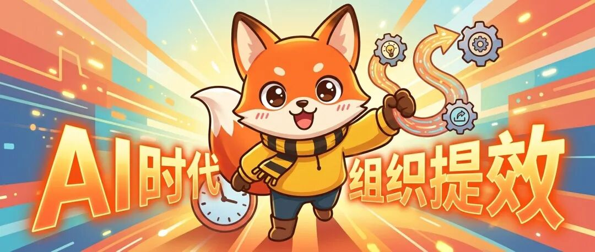
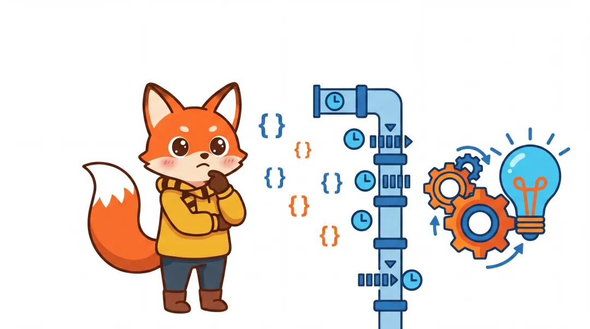
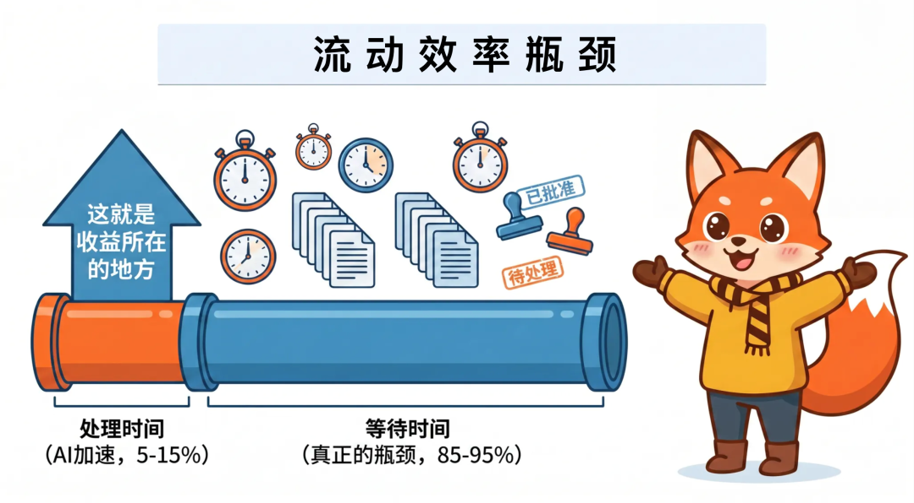
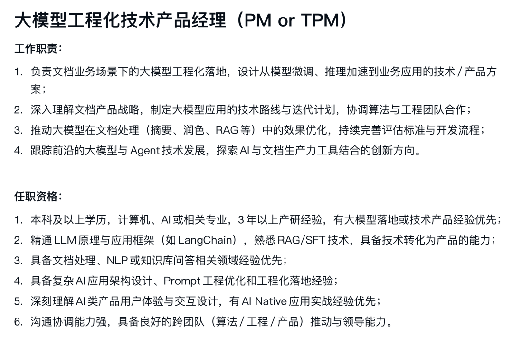
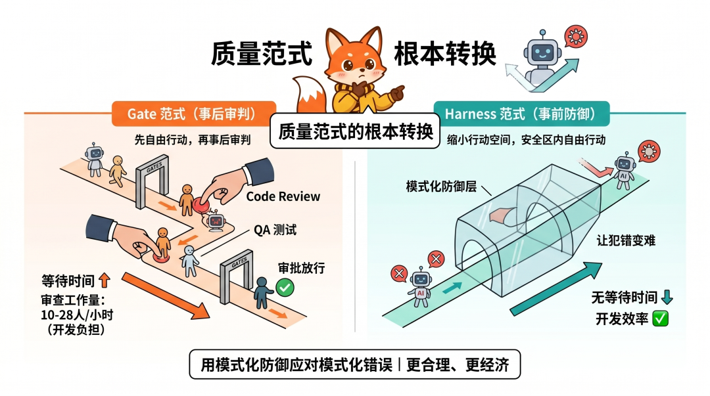
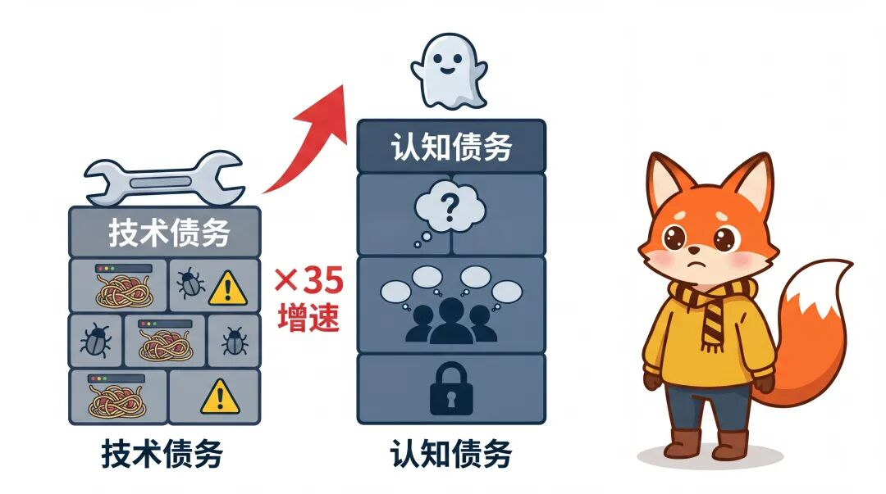
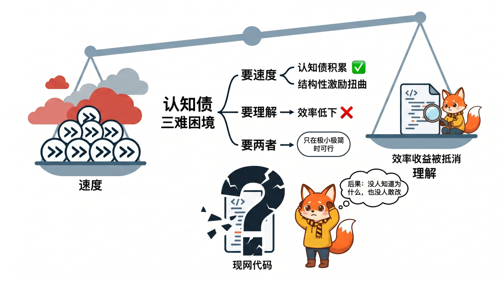
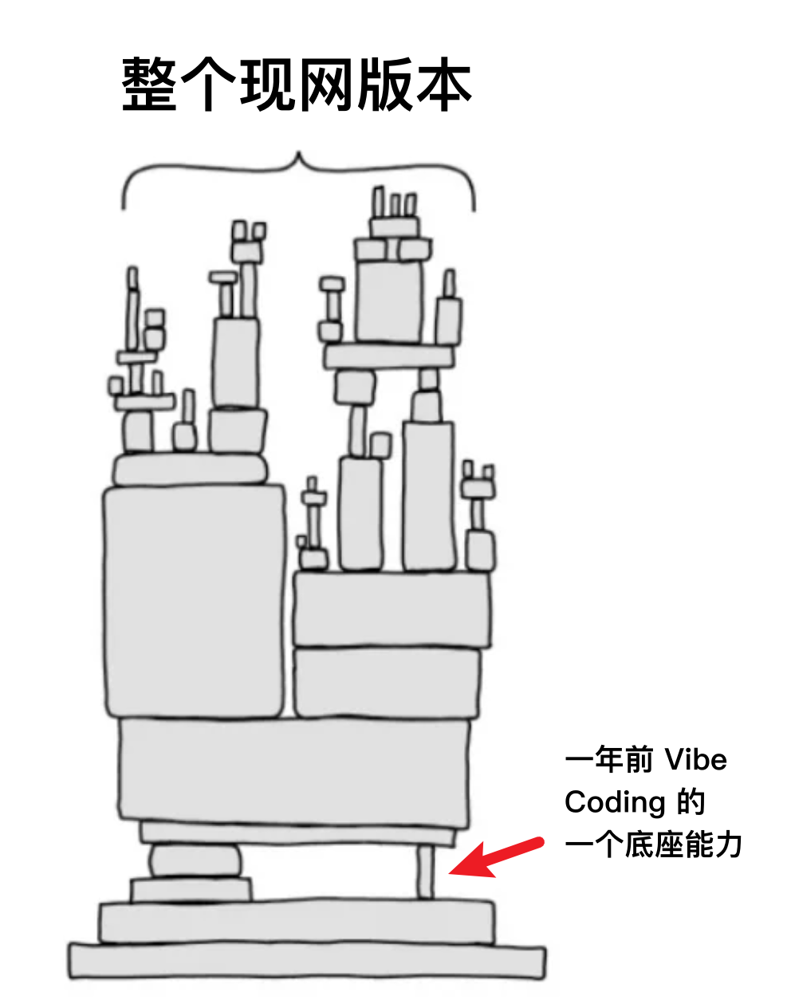
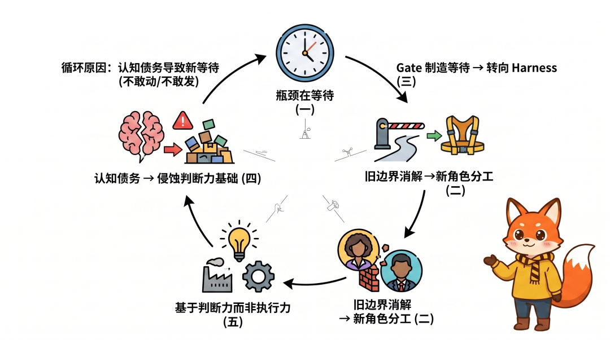

> 原文链接：https://mp.weixin.qq.com/s/IwJfhJa_CxsQr8P4fcJtFg

> 公众号：洛小山

# 当 AI 把开发速度干到 10 倍，但为什么交付还是慢得不行。

Hi，我是洛小山，你学习 AI 的搭子。

今天我们聊聊 AI 组织提效。

过去半年推动团队全面拥抱 AI 提效的过程中，有不少收获，也有不少困惑。

这篇文章是我对这些困惑的一次系统梳理，试着把实践中的直觉拆解成可以讨论和验证的命题。

## 01｜引言：从一个悖论说起

思考的起点，是我最近常常想到的一个悖论：当 AI 让做事变得极其容易的时候，「做事」本身还是组织效能的核心吗？

或者我们换一个更基本的提问：当 AI 改变了生产要素的稀缺性，组织效能的定义本身需要怎样重构？

以下是我围绕这个问题的一些思考，欢迎交流。

## 02｜AI 提效的真正战场：等待环节，不是生产环节

精益管理里有一个重要的概念，在一条价值链中，总交付时间由加工时间和等待时间所构成。

现阶段，AI 编程工具（Cursor / VS Copilot / Claude Code）主要压缩的是加工时间，也就是说，围绕产研设计的编码、原型、设计稿生成环节。

但我发现，在大多数研发组织中，等待时间远大于加工时间。

Scaled Agile 对流动效率的定义是：一项工作项处于被积极处理的时间占端到端总时间的比例。

Mik Kersten 博士在《Project to Product：价值流动》这本书里，基于多家企业样本写道，许多在大型组织中，需求的端到端流动效益通常只有1% 到5%。其余多为等待与排队。

所以，即使 AI 将加工时间压缩了 10 倍，如果加工时间本身只占总时间的 5–15%，AI 对总交付时间的改善上限也只有 4.5–13.5%。

那么，要实现交付效率的质变，必须同时压缩等待时间。

用具体数字举例，可能会更直观：假设一个功能从想法到上线总耗时 10 天，其中加工时间 1 天、等待时间 9 天。

AI 把加工时间从 1 天压缩到 2 小时，总时间变成 9 天 + 2 小时 ≈ 9 天，改善幅度不到 10%。

但如果同时把等待时间从 9 天压缩到 2 天（通过消除审批、缩短反馈周期、自动化测试），总时间变成 2 天 + 2 小时 ≈ 2 天，改善幅度能超过 80%。

等待时间的压缩对总效能的杠杆效应，远大于 AI 加工时间的压缩。

反过来想也一样。

如果 AI 提效的主战场真的在生产环节，那全员使用 AI 后，总交付效率应该接近 10 倍提升才对。

但在我的实际体感下，代码生产速度 10 倍提升后，端到端时间仅缩短了 30%。

差距来自哪里呢？

我认为，来自等待时间没有被 AI 优化。

当然，这里有一个隐含假设：等待时间是可以被组织改革压缩的。

但很多等待来自组织边界之外，比如跨部门协调、合规流程审批、外部依赖等等。

这些不是某一个团队的变革能解决的。

所以，等待时间优化的适用边界是：部门内部能闭环、外部耦合度低的团队。外部耦合度越高，杠杆效应越弱。

个人很快，团队却难以快速跟进，这是组织的问题，不是用不用 AI 的问题。

## 03｜AI 消解了旧的角色边界，但没有自动建立新的栅栏

24 年底，我在年终推文提到了未来存在技术产品的岗位，类似游戏的 TA，AI 行业必然也要有技术产品经理。

> AI 行业的持续迭代，需求与解决方案逐渐复杂，必然也会产生横跨技术、模型和产品的 TPM。能力融合是必然的趋势。而且… 这个岗位在短期内可能不会消失。洛小山，公众号：洛小山[2025伊始，万字长文刷新AI产品20个认知](https://mp.weixin.qq.com/s/D43hlCa0ew_zMLVykwGWJQ)

但现如今，我发现我还是粗浅了，现在开发和产品经理的边界越来越模糊，已经不是产品经理懂技术那么简单…

上个月，我对我们部门工位排列进行了调整。

产品不再聚在一起，而是分散到她们 Feature Team 的开发附近，以期开发和产品能更快沟通交流，Vibe Coding。

我想，AI 时代下产研的角色边界会进一步被消解。

传统研发分工的底层逻辑是技能稀缺性。

产品经理不会写代码，所以需要开发；开发不懂用户，所以需要产品。

分工因能力互补而存在。

但现在&nbsp;Vibe Coding 时代下，AI 正在逐渐消解掉这种稀缺性。

产品经理借助 AI 可以生成可运行的代码；开发借助 AI 可以做产品分析和设计；设计师借助 AI 可以直接修改代码。

当分工的底层逻辑被削弱，原有的角色边界就失去了存在的理由。

而且，角色边界的消解是不可逆的。

但消解不等于消失，它需要被重新建立在新的稀缺性之上。

那么，AI 时代里还有哪些是稀缺的？

•判断力：什么值得做？什么是好的代码？什么是真正的用户需求？

•系统理解：代码之间的耦合关系、架构演进的方向、技术债务的分布

•风险直觉：哪里可能出问题？哪里需要人工介入？

新的角色边界或许应该沿着这些稀缺性重新划分。
划分的依据，从「谁会写代码」，变成「谁负责判定」、「谁负责理解」、「谁负责承担风险」。

你可能会想，如果全员 Vibe Coding 之后，团队应该会自发形成新的有效分工吧。

但我最近实际观察到的恰恰相反：我发现边界消解后的第一反应是混乱，每个人都在做，但没人能知道谁能负最终的责任。

每天都是：这活谁在干，他怎么在干这个？woc，他怎么在干我的活？

然后，代码重复造轮子、架构疯狂漂移、认知债务在快速积累。

产研团队的 Leader 需要有意识地重新设计角色和职责，因为这个过程不会自发发生。

不过，判断力作为新的角色边界基础，本身也是模糊的、难以度量的。

传统分工的优势在于清晰：你是前端，你是后端，你是 QA，职责明确，考核方式也明确。

新的分工基于「判断力」和「系统理解」，这咋考核？咋招聘？咋培养？

未来，我们团队期望优先招有技术背景的产品经理，这是我们部门对外招聘的 JD ，供参考。

但在组织内，他们目前仍只能挂在产品经理的方向上，我会尝试推进「技术产品经理」的角色分工，只是还有许多的问题，我还没有完整的答案。

但有一点是清楚的：用旧的角色定义去套新的工作方式，大概率是行不通的。就像马车夫的岗位说明书，套不到汽车司机身上。虽然他们看起来都在「驾驶」。

不过，已经有公司在用行动回答这个问题。

上个月，Block CEO Jack Dorsey 与红杉资本合伙人 Roelof Botha 发表的一篇文章，讲述了他们 Block 怎样用公司世界模型承接传统层级中的信息路由，并明确不再保留永久性中层管理岗位；人员结构归并为 IC（深度专家）、DRI（跨职能问题负责人）、Player-Coach（仍动手做交付并带人）。

旧的角色边界基于「技能稀缺性」，新的角色边界基于判断力与对客户的理解深度，他们的行动给了我挺多参考输入。

## 04｜护栏（Harness）和门禁（Gate）是两种根本不同的质量范式

聊完产研，就不得不提及测试。

传统质量管理的核心机制是门禁式的（Gate）。开发写完代码之后做 Code Review，测试通过后做发审批。

Gate 是事后的、离散的、基于人工判断的。

紧接着的问题在于，每一道 Gate 都是一个等待卡点。

在未来，Vibe Coding 高频交付的场景下，Gate 的等待成本被急剧放大。

Vibe Coding 带来的效能提升，快速作用在每一个人身上时，各家公司研发效率拉齐的时候，哪家公司流程快，哪家公司就更容易抓住 Timing，从而赢得先发优势。

然而，护栏（Harness ）带给我的启发，不完全是 AI 产品的工程化策略，对组织管理可能是一种不同的思路：产品不在产出之后检查，而在产出过程中约束。

Lint 规则、CI 自动测试、Prompt 约束、代码模板、架构 Fitness Function 都是属于 Harness。

下面对比两种范式的底层逻辑

•Gate：先自由行动，再事后审判。这的潜台词是假设人会犯错，所以设置各种检查点

•Harness：缩小行动空间，在安全区内自由行动。让犯错本身变得更难，而不是等犯了错再审查

关键的区别：Gate 增加等待时间，Harness 不增加等待时间。

举个例子，在两天发一个版本、5–7 个功能并行推进的节奏下，如果还用 Gate 模式，每个功能完成后都需要 Code Review、QA 测试、审批放行。

按这样计算，每天 10–28人/小时的纯审查工作量。因为代码审查本身就会成为团队最大的工作负担。

而且 AI 犯的错往往是模式化的（重复造轮子、改坏现有逻辑），用模式化的 Harness 来防御模式化的错误，比用人工 Gate 来审查更合理、更经济。

从 Gate 转向 Harness，是质量范式的根本转换，而不仅仅只是效率上的优化。

但 Harness 也有明显的能力盲区：它只能防御已知的错误模式，没办法发现未知的问题。&nbsp;

Lint 规则能捕捉代码规范问题，但捕捉不了业务逻辑错误；

CI 自动测试能发现回归 Bug，但发现不了这个需求压根就不应该干。

所以这两种手段不是非此即彼的二元选择，更多需要有选择性地处理：Harness 处理已知风险，Gate 保留给未知风险。

AI Vibe Coding 的应用，需要风险分级。

低风险的变更走 Harness（自动化检查通过即发布），高风险的变更仍然需要 Gate（专家审查 + 灰度发布）。而纯粹的 Harness 乌托邦是危险的。

OpenAI 在 2026 年 2 月发布的工程博文描述了一个内部实验：约五个月、从空仓库到约百万行量级代码、初期仅三名工程师驱动 Codex，人类未直接手写业务代码。文中写道：在智能体吞吐量远超人类注意力的前提下，纠错相对便宜，等待相对昂贵。

Thoughtworks 的 Kief Morris 则将人的位置概括为&nbsp;On the loop：不逐行盯代码（in the loop），也不完全放任（outside the loop），而是站在循环上方设计和维护 Harness。

可见，有效的质量体系，需要是 Harness 和 Gate 的分层组合。

速度从来不是问题，AI 已经解决了；问题是产品的目的地，还得自己选。

## 05｜认知债务是 AI 时代的系统性风险

Birgitta Böckeler 在 Thoughtworks《Exploring Gen AI》系列中提到：即使在 AI 时代，开发者仍然需要能够理解代码，因为不理解代码就没办法做可靠的风险判断；生成式 AI 是推断器而不是编译器，使用它本质上是持续的风险评估。

地址：https://martinfowler.com/articles/exploring-gen-ai/i-still-care-about-the-code.html

AI 生成的代码通常质量还不错，大概率能通过 Lint、能通过测试，但它不自带「方法论」，没有人经历过这段代码的全部思考过程（撑死就是写一下 PRD 或者架构.md）。

而且 AI 越高效、产出越快，团队投入在理解每段 AI 生成代码上的时间占比就越低。

紧接着就带来了新的问题：AI 越能减少技术债（通过生成更规范的代码），同时就越能增加认知债（因为团队跳过了「理解」的过程）。

Paper 地址：https://arxiv.org/abs/2506.08872

所谓认知债，就是团队对自身系统的理解与系统实际复杂度之间的差距。

我尝试用有点点粗糙的公式来表达：

认知债增速 ≈ 代码产出速度 × (1 - 团队理解率)

当代码产出速度被 AI 提升 10 倍，如果团队理解率从 80% 降到 30%（因为没时间逐行的代码审查），认知债的增速就是：10 × 0.7 = 7，对比传统模式的 1 × 0.2 = 0.2…

认知债的积累速度提升了 35 倍。

认知债的后果反倒不是代码出 Bug（因为那是技术债的后果）。

认知债的后果是：有一天团队需要修改系统时，发现没有人知道为什么系统是这样的，也没有人敢改（哪怕 Vibe Coding，也不敢轻易改现网版本代码）。

这其实构成了一个三难困境：

1.要速度（不审查，快速发布）， 认知债积累

2.要理解（逐行审查，确保理解）， 效率收益被抵消

3.要两者（又快又懂），只能在团队极小、系统极简时可行

绝大多数团队会选择要速度，因为速度是可见的、要参与考核的，而认知债是隐性的、滞后的。

认知债的积累，是目前组织结构性的激励扭曲导致的必然结果。只要组织考核产能，团队必然会追求产能与速度。

不过，在 Vibe Coding 时代下，把团队理解率当作一个只会下降的变量，也过于悲观了。

我们探索了一些机制，尝试在不大幅牺牲速度的情况下维持理解率。

•Showcase：每周一次的集体演示，强制每个人把自己做的东西讲出来，而这讲的过程本身就是一种理解。

•架构决策记录（ADR）：不要求理解每行代码，但要求记录每个架构决策的 Why，这个可以通过 Cursor 每次编辑源码之后生成。

• 结对编程：两人共用 AI 时，一人驱动、一人检验（最好是产品和开发搭配，而不像以前那样纯开发结对），国内产研很难做到面对面的结对编程，大概率就是开发做出功能后，产品快速 Review。

这个可能会牺牲一部分开发速度，但能够换取这个团队更高的共同理解与纠错能力。

不过这也有一个问题：这些机制的有效性，高度依赖于团队的开发纪律和团队文化。

如果在交付压力大的时候，这都是最先被砍掉的。毕竟在赶版本的时候，哪有那么多时间和你搞这些。

这才是认知债容易积累问题的地方，因为这个防御机制是软性的，而制造它的力量（AI 的速度 + 交付压力）是硬性的。

认知债会比技术债务更加地隐蔽。

因为代码可以被 Linter 扫描，但「团队有没有理解这段代码」没法被自动化检测，而且更危险的是，这个认知债永远不会主动报错，直到有一天这个系统需要重构，需要改了，才发现优化的代价变得巨高无比。

## 06｜当生产成本趋近于零，瓶颈从执行力转移到判断力

经济学有一个基本原理：当某种生产要素从稀缺变为充裕时，价值会从这个要素转移到仍然稀缺的互补要素上。

AI 正在让代码生产从稀缺变为极度充裕。

而代码生产的互补要素是：方向判断（做什么）、质量判断（做得对不对）、价值判断（值不值得做）。

上图是我的 OA 签名。

当生产不再稀缺时，组织效能的定义本身需要改变。

传统的组织效能衡量的是执行力，就是在同样的时间内能产出多少功能、修多少 Bug、交付多少 Story。

这个定义有一个潜台词：生产是瓶颈，所以优化生产就是优化效能。

现如今，AI 打破了这个假设。

当生产不再是瓶颈时，优化生产的边际收益急剧递减，新的瓶颈是判断力（选哪些方向、做哪些取舍、什么时候说不）。

我的下属会经常给我看一些他们自己做的，很有意思的小demo。

一方面我非常的开心，大家都能非常积极地去思考产品体验。

但另一方面我又挺忧虑的，因为过多地在一些新方向里探索，会让他对当前目标失焦。

管理工具全部失效了吗？

传统的研发效能管理（排期、估工时、迭代、发布计划、资源调配…）本质上都是围绕「执行（产能）」设计的。

当瓶颈转移到「判断」，这些管理工具不一定还能适配。

因为在极致的效率之前，你很难「排期」一个价值判断，不能给「取舍」估工时。

燃尽图能告诉你做了多少，但没法告诉不了你方向对不对。

Google Cloud 《Accelerate State of DevOps Report 2024》的核心发现之一，大意就是&nbsp;AI 在提升个体生产力、心流与满意度的同时，也可能对软件交付的稳定性与吞吐量产生负面影响。

也就是说，生产得更快了，但如果工程实践和组织的流程没跟上，更快的速度可能意味着更多错误方向的产出。

举个例子：一个团队用 AI 一个月做了 10 个功能，其中 7 个方向是错的，最终只有 3 个留下来。

另一个团队没用 AI，一个月做了 3 个功能，方向全对，3 个都留下来了。

如果用「有效产出」而不是「总产出」来衡量，判断能力才是真正的杠杆。

但！也要警惕过度判断

不过，如果把「判断能力」抬到一个很高的位置（因为一刀切在企业里总是常常会发生的），也可能走向另一个极端：就是过度决策带来分析瘫痪。

如果一个团队觉得「判断比执行重要」时，就极有可能花大量时间讨论「这个功能到底值不值得做」，论证再论证，讨论再讨论，对齐再对齐…

而不是快速做一个原型让用户验证，平白丧失市场机会。

Vibe Coding 的精髓就是用极低成本的实验来替代冗长的决策讨论。

与其各种找资料 Argue 个一两天，不如赶紧花一俩小时快速搞做个 Demo 看个感觉，找用户 CE 一下子。

所以，对这个问题，更准确的表述可能是：判断力和执行力的最优比例发生了根本变化，而不是说判断力替代执行力。

以往的模式下可能是 20% 判断 + 80% 执行，AI 时代可能翻转为 60% 判断 + 40% 执行。

但绝不是 100% 判断 + 0% 执行，那就从员工可以摸鱼变成了领导开始摸鱼。

而且，AI 时代最好的判断方式，可能是先干了再说。

做的成本已经足够低，实验本身也是一种判断。

## 07｜上面五个 AI 组织提效点之间的关系

这五个思考不是孤立的，AI 组织提效需要系统性优化，单点优化不够。

它们之间存在因果关系是：一家公司尝试 AI 提效，然后流程的等待成为瓶颈 ，公司消除评审减少等待，但需要新机制防御风险，然后需要重新分工，然后新分工基于产品判断力，判断力被认知债侵蚀，认知债务导致新的等待（不敢改、不敢发、等人来看）最后回到起点。

打破这个循环的关键需要于五个方向的同步推进。&nbsp;

只优化等待时间不重建角色边界，带来混乱；

只转向 Harness 不管理认知债务，产品脆弱；

只强调判断力不提供快速实验的能力，进度瘫痪。

## 08｜这些判断的局限性

写完上面这些，其实也有必要对我的框架做一些审视。

1、 样本偏差。&nbsp;我的思考基于一个特定类型的团队：一个小团队、低耦合、没有那么多历史负担且快速迭代的 ToC 产品。

但对 100 人的大型平台团队、强合规的金融系统、需要跨 10 个部门协调的基础设施项目，可能完全不适用。

这样的进化适用边界大致是：团队规模 ≤ 30 人、外部依赖 ≤ 3 个、发版周期 ≤ 1 周的场景。

2、 幸存者偏差。&nbsp;我能观察到的主要是「全员 Vibe Coding 跑起来了」的案例，因为跑不起来的团队不会写文章分享。

可能有大量团队尝试了同样的策略，然后因为代码质量崩溃、关键开发离职、认知债务爆发而失败了…这些数据我其实没有看到。

3、 时间尺度还不够。&nbsp;我的判断主要基于最近半年的实践周期。但组织变革的真正考验往往会在 2–3 年后。

因为当初始的兴奋期过去，当团队人员更替了一轮之后，当系统复杂度增长到立项指出的 5 倍之后…

这些认知债务是否会在某个时间点集中爆发？这些问题，我现在还没法验证。

&nbsp;4、 人。&nbsp;组织变革中最重要的变量，还是人的情感，而不是业务逻辑和组织架构。

当开发听到「你的核心价值不再是写代码」时；当 QA 听到「你的岗位前提假设变了」时；一个 Leader 发现自己的审批权被 Agent 取代时…

那么，对抗的情绪往往会超过积极配合（人之常情）。

那么，他们这些个人感受可能不能遵循逻辑来推演，但它们是组织变革成败的最大变量。

我们的逻辑推演可以告诉团队应该怎么做，对下属的理解才能告诉你能不能把这件事真正做成。

## 终｜结语

这五个判断不一定都是对的，但有一点我是很相信的，那就是：当生产成本趋近于零，旧的组织效能架构（还有对应的 CICD 系统）需要被重新审视。

传统组织效能的核心假设是「产能会是瓶颈」。

围绕这个假设，我们建立了排期、估工时、迭代、评审、测试、验收的完整体系，然后这个体系的每一个环节都在优化「生产效率」。

Vibe Coding 的时代到来，打破了这个假设。

当生产不再是瓶颈。那么等待是，判断是，理解也是。

但我们的组织结构、管理工具、考核体系、职级定义，仍然还建立在旧的假设之上。

AI 提效的转型，本质上是一个组织认知的范式转换，技术的重构只是开始。

这个范式转换最难的部分，是我们能不能放下旧范式。

理解这个新范式只是开始，毕竟，在生产成本趋近于零的时代，不做什么，往往比做什么更重要。
## 参考文献

[1] Scaled Agile Framework. Accelerating Flow with SAFe. Last Update: 12 March 2025. https://framework.scaledagile.com/accelerating-flow-with-safe

[2] Kersten, Mik. *Project to Product: How to Survive and Thrive in the Age of Digital Disruption with the Flow Framework*. IT Revolution Press, 2018.

[3] Böckeler, Birgitta. "I still care about the code." *Exploring Gen AI* series, martinfowler.com, 2025-07-09. https://martinfowler.com/articles/exploring-gen-ai/i-still-care-about-the-code.html

[4] Morris, Kief. "Humans and Agents in Software Engineering Loops." *Exploring Gen AI* series, martinfowler.com, 2026-03-04. https://martinfowler.com/articles/exploring-gen-ai/humans-and-agents.html

[5] Böckeler, Birgitta. "Harness engineering for coding agent users." *Exploring Gen AI* series, martinfowler.com, 2026-04-02. https://martinfowler.com/articles/exploring-gen-ai/harness-engineering.html

[6] Dorsey, Jack &amp; Botha, Roelof. "From Hierarchy to Intelligence." Sequoia Capital, 2026-03-31. https://sequoiacap.com/article/from-hierarchy-to-intelligence/

[7] Google Cloud / DORA Team. *Accelerate State of DevOps Report 2024*. https://dora.dev/research/2024/dora-report/

[8] GitHub &amp; Accenture. "Research: Quantifying GitHub Copilot's Impact in the Enterprise." github.blog, 2024-05-13. https://github.blog/news-insights/research/research-quantifying-github-copilots-impact-in-the-enterprise-with-accenture/

[9] Lopopolo, Ryan (OpenAI). "Harness engineering: leveraging Codex in an agent-first world." openai.com, 2026-02-11. https://openai.com/index/harness-engineering/

[10] Ford, Neal; Parsons, Rebecca; Kua, Patrick. *Building Evolutionary Architectures*, 2nd ed. O'Reilly, 2023.

[11] ThoughtWorks. *Technology Radar*, Vol. 34, April 2026. https://www.thoughtworks.com/content/dam/thoughtworks/documents/radar/2026/04/tr_technology_radar_vol_34_en.pdf

### 关于我

我是洛小山，一个在 AI 浪潮中不断思考和实践的大厂产品总监。

我不追热点，只分享那些能真正改变我们工作模式的观察和工具。

如果你也在做 AI 产品，欢迎关注我，我们一起进化。

本文知识产权归洛小山所有。

未经授权，禁止抓取本文内容，用于模型训练以及二次创作等用途。
