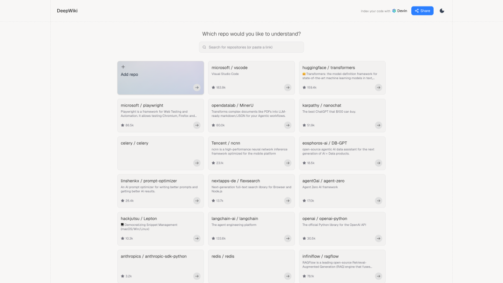
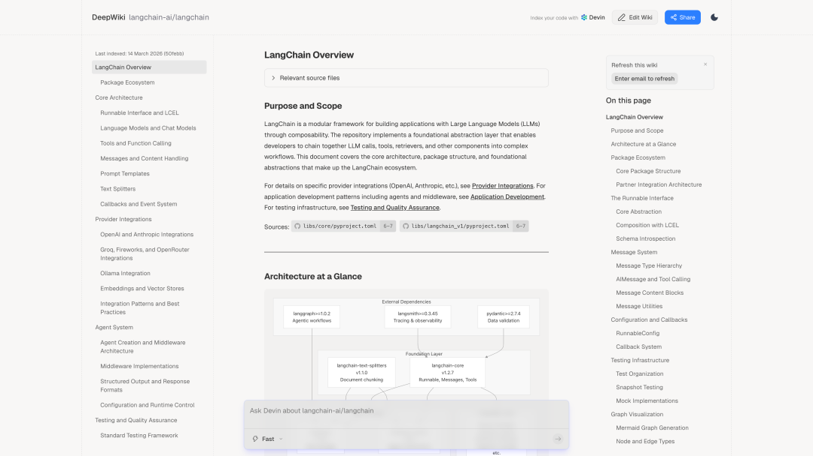
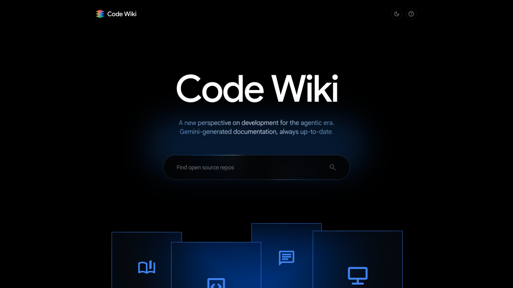
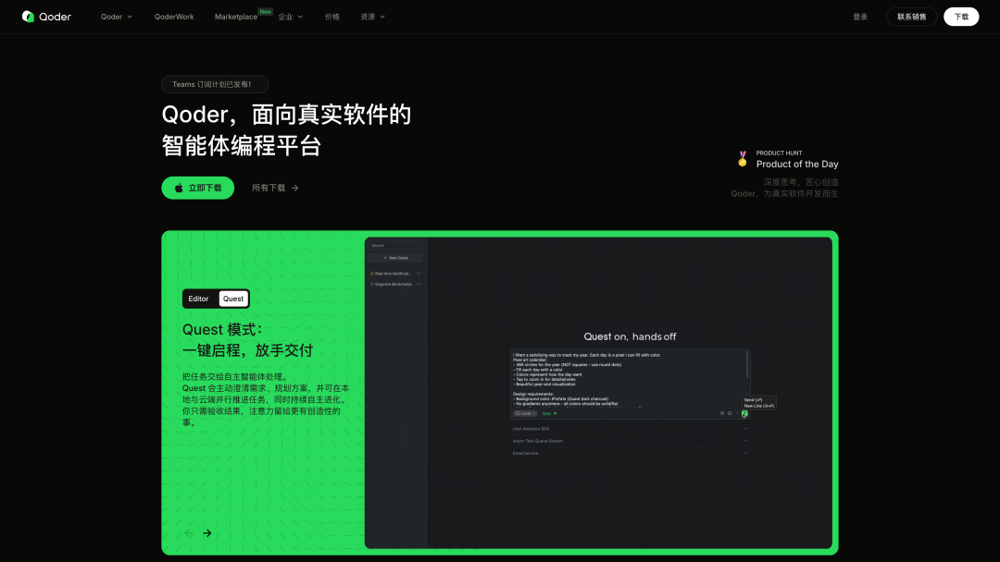
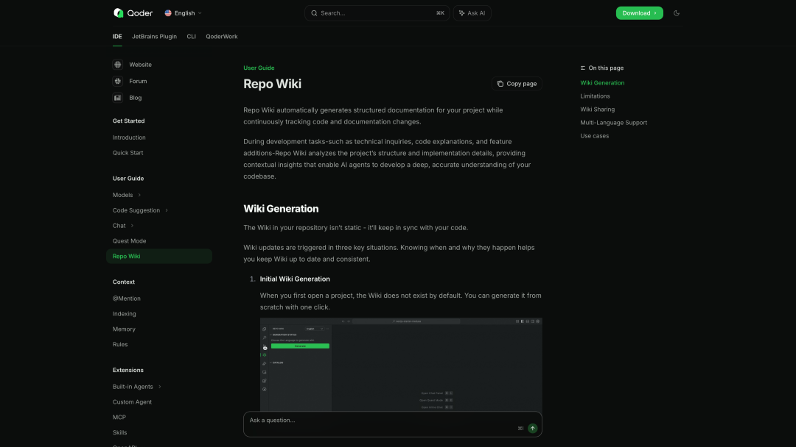
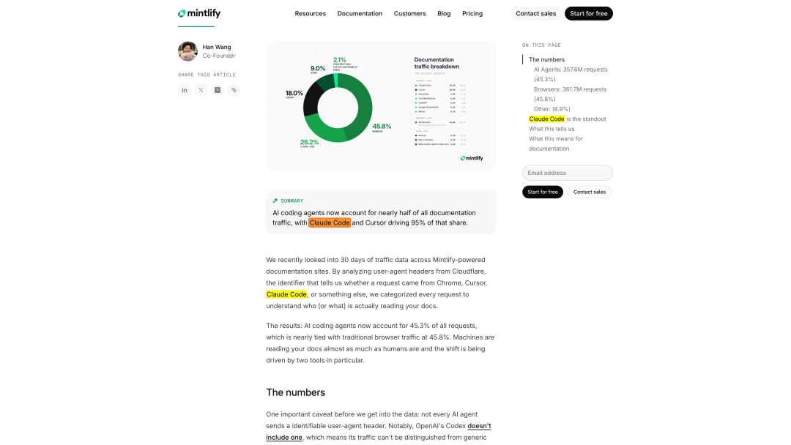
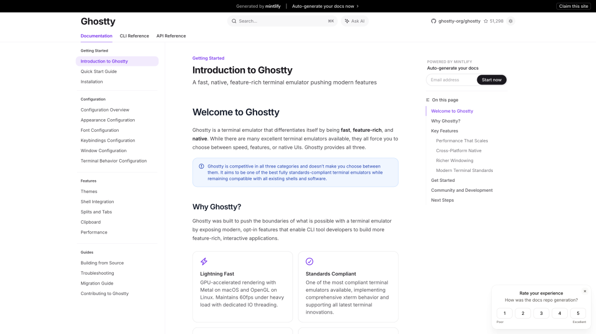

> 原文链接：https://mp.weixin.qq.com/s/R9zhDXvwYO7qjabVmd2HaA

Koding Koding


> 知识就是那个摇柄。知识不是给到你，你就会了，然后你去应用——知识是给到你，这次没用，那就接着给、接着摇，不断地转，一直到有机会你突然一下被它点燃，砰，火苗起来。——罗振宇

2026 年春天，技术世界正在同时发生三件事：Google 发布 Code Wiki，Cognition（Devin 的母公司）把 DeepWiki 开放给所有公开仓库，Andrej Karpathy 在 X 上分享他用 LLM 构建个人知识库的完整工作流。三件事指向同一个方向—— **知识的生产者和消费者都在从人类迁移到机器，而 Markdown 正在成为这个时代的通用知识介质** 。

这不是一个纯技术话题。罗振宇用十年跨年演讲反复讲的一个道理——知识的伟大不在于有用，而在于凝聚共识——在 AI 时代获得了全新的注脚：当 AI agent 成为文档的最大读者群体时，"共识"的含义从人与人之间扩展到了人与机器之间。

---

## 一、文档已死，Wiki 永生

### 旧世界的痛：文档写完即过期

每个程序员都经历过这样的场景：花三天写了一份架构文档，两周后代码重构，文档就变成了历史遗迹。Stack Overflow 的调查数据显示，过时或不准确的文档是开发者对内部工具最大的不满。开发者 30% 的工作时间花在阅读和理解别人的代码上，其中大量时间浪费在与代码脱节的文档上。

传统文档工具——GitBook、Docusaurus、Read the Docs——的根本问题不是功能不够，而是它们把文档当作一个 **独立的产出物** 。文档和代码是两条并行的河，靠人力维护同步，而人力永远是最不可靠的。

### 新范式：代码即唯一可信文档

2025-2026 年涌现的一批产品，共同验证了一个假设： **唯一 100% 可信的文档就是代码本身** 。如果文档能从代码自动生成、自动更新，"文档过期"这个问题就从根上消失了。

这个赛道上，四个重要玩家的路径各不相同，但目标完全一致：

| 产品 | 背后团队 | 发布时间 | 核心特点 | 定位 |
| --- | --- | --- | --- | --- |
| **DeepWiki** | Cognition (Devin) | 2025.5 | 5 万+公开仓库索引，自动生成架构图，内置 Devin 问答 | Agent 的"读书笔记" |
| **Code Wiki** | Google | 2025.11 | Gemini 驱动，每次 commit 自动重新生成文档，动态图表 | 开发者工具，免费公共仓库 |
| **Repo Wiki** | Qoder | 2025 | 存储在 `.qoder/repowiki` ，git 提交共享，支持中英双语 | IDE 内嵌的 agent 知识层 |
| **Mintlify Wiki** | Mintlify | 2026 | 替换 GitHub URL 即可生成文档站，零配置 | 面向外部的文档托管 |

---

## 二、DeepWiki：Agent 给自己写的"读书笔记"

DeepWiki 的故事要从 Devin 说起。Cognition 在 2024 年发布 Devin——号称"第一个 AI 软件工程师"——引发了巨大争议。但争议之下有一个被忽略的产品细节：当 Devin 接入一个新仓库时，它做的第一件事不是写代码，而是 **给自己生成一份 wiki** 。

这个逻辑非常自然。一个人类开发者入职新团队，前几天干的也是同一件事——读代码、画架构图、记笔记。Devin 只是把这个过程自动化了，并且把产出物开放给了人类。

2025 年 5 月，Cognition 将这个内部工具以 DeepWiki 的名义公开发布。把任何 GitHub 仓库的 URL 从 `github.com` 替换为 `deepwiki.com` ，就能看到这个仓库的自动生成文档。上线不到一年，DeepWiki 已经索引了超过 5 万个公开仓库。



 



上面这张 LangChain 的 wiki 页面展示了 DeepWiki 的核心能力：自动生成的架构图（展示了 LangGraph、LangSmith、LangChain-core 之间的依赖关系和版本号），每个概念都链接到源码文件，左侧导航覆盖了从 Core Architecture 到 Testing Framework 的完整知识树。底部的 "Ask Devin" 输入框让你可以用自然语言提问——不是和一个通用模型对话，而是和一个 **已经读过整个代码库** 的 agent 对话。

DeepWiki 还提供了 MCP Server，暴露 `ask_question` 、 `read_wiki_structure` 、 `read_wiki_contents` 三个工具。这意味着其他 AI agent 可以直接调用 DeepWiki 的知识—— **agent 产生的知识被其他 agent 消费** ，形成一个代码理解的供给网络。

对于私有仓库，用户可以通过 Devin 账户获取 wiki，或者在仓库根目录放一个 `.devin/wiki.json` 配置文件来控制文档生成的重点和结构。

---

## 三、Google Code Wiki：大厂的时代宣言

Google 在 2025 年 11 月发布 Code Wiki 时，官方博客的副标题是： **"A new perspective on development for the agentic era."** 这不是一个文档工具的 slogan，这是一个时代宣言。





Google 做这件事的背景和 DeepWiki 不同。Google 内部有全球最大的单体代码库（monorepo），几十年来一直在解决"如何让工程师理解不是自己写的代码"这个问题。Code Wiki 是这套内部经验的外化产品。

Code Wiki 和 DeepWiki 的关键差异在于 **更新策略** 。DeepWiki 是索引时生成一次（可以手动刷新），Code Wiki 则在 **每次 commit 后自动重新生成文档** 。这意味着你看到的架构图、类图、时序图永远反映代码的当前状态，而不是上次索引时的快照。

Code Wiki 的另一个特点是 Gemini chat 的集成方式：整个最新的 wiki 作为上下文注入 chat，所以 Gemini 的回答能精确地链接到具体的代码文件和函数定义。Google 的愿景很明确——新人入职第一天就能提交代码，资深工程师几分钟内理解一个新库，而不是几天。

目前 Code Wiki 的公开版免费支持公共仓库（codewiki.google），私有仓库的 Gemini CLI 扩展正在 waitlist。

---

## 四、Qoder Repo Wiki：存在 Git 里的 Agent 知识层

如果说 DeepWiki 和 Code Wiki 是云端的文档生成服务，Qoder 的 Repo Wiki 走了一条更"接地气"的路—— **生成的 wiki 直接存储在你的代码仓库里** 。





Qoder 是一个 agentic coding 平台，Repo Wiki 是它的核心功能之一。当你在 Qoder IDE 中打开一个项目，可以一键生成整个仓库的结构化文档。生成的 wiki 存储在 `.qoder/repowiki` 目录下——它就是你仓库的一部分，可以 `git commit` 和 `git push` ，团队成员 `git pull` 就能拿到。





这个设计选择看似简单，实际上解决了一个 DeepWiki 和 Code Wiki 都没解决的问题： **wiki 的所有权和版本控制** 。当 wiki 和代码在同一个 Git 仓库里时，你可以看到 wiki 的变更历史，可以在 code review 时同时审查文档变更，可以在分支之间切换时看到不同版本的文档。这不是"文档作为外部服务"，这是 **文档作为代码的一等公民** 。

Repo Wiki 的更新机制分三种触发方式：

1.**初始生成** ——对一个 4000 文件的仓库，大约需要 120 分钟。这个时间不短，但只跑一次。

2.**代码变更检测** ——当你修改了被文档引用的文件（函数签名、类定义、API 端点等），系统检测到不匹配，只重新生成受影响的部分。

3.**Git 目录同步** （v0.2.0+）——如果你直接编辑了 Git 目录下的 Markdown 文件，系统检测到差异后可以同步更新。

截至目前，Qoder 已经生成了超过 **40 万份** 代码库 wiki。这个数字透露了一个信号：开发者（和 agent）对"自动理解代码"的需求远比想象中要大。Repo Wiki 还支持中英文双语生成——在 `repowiki/zh/` 和 `repowiki/en/` 下分别维护不同语言的文档，这对跨国团队是刚需。

Repo Wiki 的核心使用场景是 **agent 驱动的开发任务** 。当 Qoder 的 agent 需要加新功能、修 bug 或重构时，它首先读取 Repo Wiki 来理解项目架构和实现细节，然后才动手写代码。这和 DeepWiki 的理念完全一致——agent 要高效工作，第一步是给自己建一份"读书笔记"。不同之处是 Qoder 把笔记留在了仓库里，而不是云端。

---

## 五、Mintlify：从文档美化到知识基础设施

在这个赛道里，Mintlify 的起点和上面三家不同——它不是从 AI agent 的需求出发的，而是从"让开发者文档变好看"出发的。2022 年从 YC W22 毕业时，Mintlify 做的事很简单：极简配置就能生成带搜索、暗黑模式、代码高亮的文档站。Anthropic、Perplexity、Vercel 等 AI 公司都在用它。

但 Mintlify 有一组数据让整个行业侧目。2026 年 3 月，它分析了旗下文档站 30 天内约 7.9 亿次请求的 Cloudflare User-Agent 数据： **AI Agent 的请求量（45.3%）几乎追平了浏览器（45.8%）** 。Claude Code 单月 1.994 亿次请求，超过了 Chrome on Windows。





这组数据有一个重要的 caveat：它的样本全部来自 Mintlify 托管的 2 万多个文档站，这些站主要服务开发者工具和 API 文档——本身就是 AI coding agent 最频繁访问的内容类型。统计单位是请求数而非独立用户（一个 Claude Code session 调 API 时可能几分钟发几十次请求），所以不能简单推论为"45% 的人在用 agent 看文档"。但即便打折扣，趋势本身是清晰的： **机器正在成为文档的主要消费者** 。

这个发现促使 Mintlify 转型。它在 2026 年 4 月以 5 亿美元估值完成了 a16z 和 Salesforce Ventures 领投的 4500 万美元 B 轮融资（累计融资 6700 万美元），定位从"文档平台"变成了"AI 知识基础设施"。新产品线包括 Workflows（自动化文档更新）、MCP 支持（让 agent 直接查询文档）、以及零配置的 Mintlify Wiki（把 GitHub URL 的 `github.com` 替换为 `mintlify.com` 即可生成文档站）。





## 六、Karpathy 的 LLM 知识库：当 AI 不再只是写代码

上面四个产品解决的都是"代码文档"问题。Andrej Karpathy 在 2025 年底分享的 LLM Knowledge Bases 工作流，把这个话题推向了更广阔的维度： **AI 不只是代码的消费者，它可以成为任何领域知识的编译器。**

Karpathy 的方法很直接。原始材料（论文、文章、仓库、数据集、图片）被丢进一个 `raw/` 目录，然后让 LLM"编译"出一个 wiki——一组带目录结构的 Markdown 文件。wiki 包含所有原始数据的摘要、反向链接，按概念分类，为每个概念写文章，并互相链接。

```bash
project/├── raw/                    # 原始材料，只读│   ├── papers/│   ├── articles/│   └── images/├── wiki/                   # LLM 编译产物│   ├── index.md│   ├── concepts/│   ├── entities/│   └── sources/└── outputs/                # 查询/分析的输出    ├── reports/    └── slides/
```

这套系统的精妙之处在于 **知识复利** 。当你向 wiki 提问，LLM 会遍历相关文章，综合出答案。如果这个答案涉及三个以上已有页面、产生了新的综合洞察，它就被写回 wiki。每一次使用都让知识库变得更完整。Karpathy 自己的一个研究 wiki 已经积累了约 100 篇文章、40 万字。在这个规模下，LLM 通过自动维护索引文件和文档摘要，不需要复杂的 RAG 系统就能很好地回答问题。

Karpathy 用 Obsidian 作为前端，用它的图谱视图来发现概念之间的涌现性连接。他还会定期跑"健康检查"——让 LLM 找出不一致的数据、填补缺失信息、发现有趣的连接点来产生新文章候选。这不是 AI 辅助写作—— **这是 AI 作为知识管理员** ，人类反而变成了偶尔提问和审阅的角色。

他在帖子末尾写了一句意味深长的话：

> I think there is room here for an incredible new product instead of a hacky collection of scripts.

这句话在发布后不到半年就被验证了。

---

## 七、LLM-Wiki 项目：Agent 的外脑

Karpathy 的帖子引爆了一个社区运动。nvk 的 `llm-wiki` 项目把 Karpathy 的思路变成了一个可复用的系统，作为 Claude Code 插件发布，安装只需一行：

```nginx
claude plugin install wiki@llm-wiki
```

也可以用一个 `AGENTS.md` 文件做到全平台兼容——Codex、OpenCode、Gemini、任何能读写文件和搜索网络的 agent 都能用。SamurAIGPT 的 fork 版本（llm-wiki-agent）已经获得了超过 2100 个 GitHub star。

这个系统的核心设计是 **四个操作形成闭环** ：

```bash
/ingest（原始来源 → wiki 页面）    ↓/query（问题 → 合成答案 + 写回）    ↓/lint（健康检查 + 自动修复）    ↓/research（引入外部源）    ↓  (循环回 /ingest)
```

知识被分为严格隔离的三层：原始材料（ `sources/` ）永远不修改，提炼知识（ `wiki/` ）由 agent 维护，操作日志（ `wiki-log.md` ）记录每一次变更。这种分层的核心理念用一句话概括： **vault 是 agent 的外脑** 。llm-wiki 把"知识库"从人类工具变成了 agent-native 工具——由 agent 写，给 agent 和人类读。

用户提到的 OpenCLI 实践更进一步：wiki agent 作为 agent team 的一部分参与项目管理，实时摄入项目的设计决策和交付成果。两层架构（AGENTS.md + Skill）是这个设计理念的产物——AGENTS.md 定义 agent 的行为规范和工作流，Skill 文件提供领域知识。wiki 的产出物是知识库图谱，兼容 Obsidian 进行可视化浏览。初始阶段不做 GUI，因为内容维护是 Agent 本身的工作——GUI 只做展示用。

这种设计暗合了一个更深层的趋势：在 multi-agent 架构中，共享知识库不是可选项，而是 agent 协作的基础协议。没有 wiki，agent 之间就只能通过上下文窗口传递信息，这既昂贵又有损。

---

## 八、罗振宇的隐喻：知识的摇柄与信用的长期主义

把一个知识付费领域的创业者和 AI 代码文档放在一起讨论，看起来跨界得有些离谱。但罗振宇在最近的访谈中说的几段话，恰恰切中了这一轮"wiki 热"的哲学内核。

**第一层：知识是摇柄，不是说明书。**

罗振宇用东北冬天启动大卡车的曲柄来比喻知识：知识不是给到你就能用的，你得不断摇、不断转，直到某个时刻被点燃，生命按这种方式燃烧起来。

这个比喻精确地描述了 Karpathy 的 LLM 知识库在做的事。原始材料被 ingest 进来的时候，它们只是"生的"——论文摘要、代码注释、API 文档。LLM 把它们编译成 wiki 的过程，就是"摇"的过程：建立链接、发现矛盾、产生综合。你向 wiki 提问，答案被写回去，知识库变得更完整。这不是一次性的知识传递，是持续转动的飞轮。

**第二层：知识的伟大不在有用，在凝聚共识。**

罗振宇在被追问"知识是不是太实用化了"的时候回答：知识最主要的价值不是教你怎么做药、怎么造机器，而是凝聚共识。他做跨年演讲，生产的不是知识本身，而是"共识的议题"——提出一个议题，大家讨论这个议题，好的议题推进文明的进步。

这和代码 wiki 解决的问题本质上是同构的。一个代码库的 wiki 不只是告诉你"这个函数做什么"，它提供的是 **整个团队（包括 AI agent）对系统的共享理解** 。当 Google Code Wiki 说"你不是在和一个通用模型对话，而是在和一个完整了解你代码库的模型对话"时，它在说的其实就是：我们为人和 agent 之间建立了关于这份代码的共识。

**第三层：信用胜于流量。**

罗振宇在访谈中反复强调：互联网时代永远的逻辑是"点赞、关注、转发"，但正常社会的状态是"谁有信用我看谁"。信用是长期积累的、难以伪造的资产。他选择做得到、做文明之旅、坚持 3652 天日更 60 秒语音，本质上都是在积累信用。

文档——可靠的、准确的、永远最新的文档——是软件产品的信用。一家公司改了定价，帮助中心没更新，所有基于这个内容构建的 AI support agent 就开始给客户报错误的价格。流量（agent 请求量）可以很高，但如果内容不可信，流量越大伤害越大。

罗振宇说"以万变引入自己体内来保持自己不变"——接受新技术、新工具、新的内容形态，但核心不动。这个"不变"的核心是什么？对 DeepWiki 是代码的准确理解，对 Qoder 是存在 Git 里的可信文档，对 Karpathy 的 wiki 是经过编译和验证的知识——都是 **信息的准确性** 。形式从静态文档变成 AI-powered wiki，读者从人类变成 agent，但"信息准确"这件事永远不变。

---

## 九、一个正在发生的融合

把上面所有的线索拉在一起，我们看到的是一幅正在拼合的图景：

```css
┌──────────────────┐           │   代码 / 原始知识   │  ← 唯一可信源           └────────┬─────────┘                    │ 自动编译           ┌────────▼─────────┐           │    Wiki / 知识库   │  ← Markdown，结构化           └──┬────────────┬──┘              │            │     ┌────────▼──┐    ┌───▼────────┐     │  人类阅读   │    │  Agent 消费  │     │ (Obsidian, │    │ (Claude Code,│     │  浏览器)    │    │  Cursor,     │     └────────────┘    │  Codex)      │                       └──────────────┘
```

**代码文档领域** （DeepWiki、Google Code Wiki、Qoder Repo Wiki、Mintlify Wiki）解决的是"从代码到可读文档"的自动化，核心价值是 **消灭文档过期** 。

**个人/团队知识库领域** （Karpathy 的 LLM Knowledge Bases、nvk 的 llm-wiki、OpenCLI 的实践）解决的是"从任意来源到结构化知识"的编译，核心价值是 **知识复利** 。

两者正在融合。Qoder 的 Repo Wiki 存在 Git 里，本质上已经是代码仓库的知识层。llm-wiki 的 `/research` 命令可以引入外部源，做的事和代码 wiki 一样。Google Code Wiki 的 Gemini chat 和 Karpathy 的 wiki Q&A 在技术路径上几乎完全一致——区别只在于知识源是代码还是论文。DeepWiki 的 MCP Server 让 wiki 成为 agent 可调用的工具，而不只是人类阅读的页面。

这个融合的底层逻辑是： **AI agent 需要一个比上下文窗口更持久、比 RAG 更结构化的知识层** 。上下文窗口是工作记忆——昂贵、有限、易失。RAG 是按需检索——适合问答，但缺乏整体图景。Wiki 是编译后的知识——结构化、持久、可增量更新、人机共读。

当 agent 成为文档的主要消费者，文档的形态必然会进一步向"机器友好"演进——不是牺牲人类可读性，而是两者恰好在 Markdown + 良好结构这个交叉点上高度兼容。

---

## 十、这意味着什么

对于不同角色的人，这场变化的实际含义不同。

**如果你是开发者** ——你的文档正在被 AI agent 阅读的频率可能已经超过了人类。API 参考的一致性、代码示例的完整性、参数描述的精确性，这些"过去觉得可以凑合"的东西，现在直接决定了 AI agent 能不能正确地帮用户使用你的产品。考虑用 DeepWiki、Code Wiki、Qoder Repo Wiki 这类工具，让文档自动保持最新。

**如果你是个人研究者或知识工作者** ——Karpathy 的方法论值得认真实践。不需要等待一个完美的产品，现在就可以用 Claude Code + llm-wiki 或者类似的方案开始构建自己的知识库。关键心智转换是：你不再是知识库的维护者，而是提问者和审阅者。LLM 负责写、链接、发现矛盾、填补缺失，你负责输入高质量的源材料和提出好问题。

**如果你在做团队管理** ——团队的共享知识库从"nice to have"变成了"agent 协作的基础设施"。当你的团队开始使用 AI agent 开发时，agent 理解代码库的能力直接取决于有没有一份好的 wiki。Qoder 的 Repo Wiki 给出了一个直接的方案——wiki 存在仓库里，随代码一起版本控制。OpenCLI 的实践给出了另一个范式——wiki agent 作为 team 的一部分，实时维护，Obsidian 可视化，AGENTS.md 定义规范。

罗振宇说人这一辈子就是"奋力向前爬行"。知识也是。从泥板到纸张到网页到 wiki，知识的载体在变，但"凝聚共识、点燃他人"的内核不变。只不过现在，被点燃的不只是人，还有机器。

---

### References

`[1]` DeepWiki: AI docs for any repo:*https://cognition.ai/blog/deepwiki*  
`[2]` DeepWiki:*https://deepwiki.com/*  
`[3]` DeepWiki - Devin Docs:*https://docs.devin.ai/work-with-devin/deepwiki*  
`[4]` Introducing Code Wiki: Accelerating your code understanding:*https://developers.googleblog.com/en/introducing-code-wiki-accelerating-your-code-understanding/*  
`[5]` Qoder Repo Wiki 文档:*https://docs.qoder.com/user-guide/repo-wiki*  
`[6]` Qoder 官网:*https://qoder.com/*  
`[7]` The state of agent traffic in documentation (March 2026):*https://www.mintlify.com/blog/state-of-ai*  
`[8]` Mintlify Series B 融资公告:*https://www.mintlify.com/blog/series-b*  
`[9]` Mintlify Wiki - Ghostty 自动文档示例:*https://mintlify.wiki/ghostty-org/ghostty*  
`[10]` Andrej Karpathy - LLM Knowledge Bases (Gist):*https://gist.github.com/karpathy/442a6bf555914893e9891c11519de94f*  
`[11]` nvk/llm-wiki (GitHub):*https://github.com/nvk/llm-wiki*  
`[12]` SamurAIGPT/llm-wiki-agent (GitHub):*https://github.com/SamurAIGPT/llm-wiki-agent*  
`[13]` LLM Wiki 官网:*https://llm-wiki.net/*  
`[14]` AI Native Knowledge Infrastructure - Salesforce Ventures:*https://salesforceventures.com/perspectives/ai-native-knowledge-infrastructure/*  
`[15]` 罗振宇 2026 跨年演讲：用愿力，做一件只有你能做的事:*https://view.inews.qq.com/a/20260101A00KDA00*  
`[16]` 罗振宇 2024 跨年演讲：所有的行业都是知识服务业:*http://www.duozhi.com/industry/insight/2024010115784.shtml*  
`[17]` 罗振宇访谈：能力没那么重要，愿力 > 业力 > 能力: *https://bibigpt.co/video/BV1Sm97YGEyJ*
