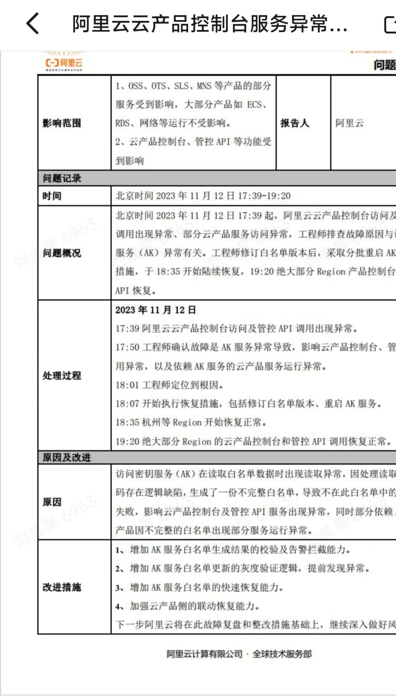
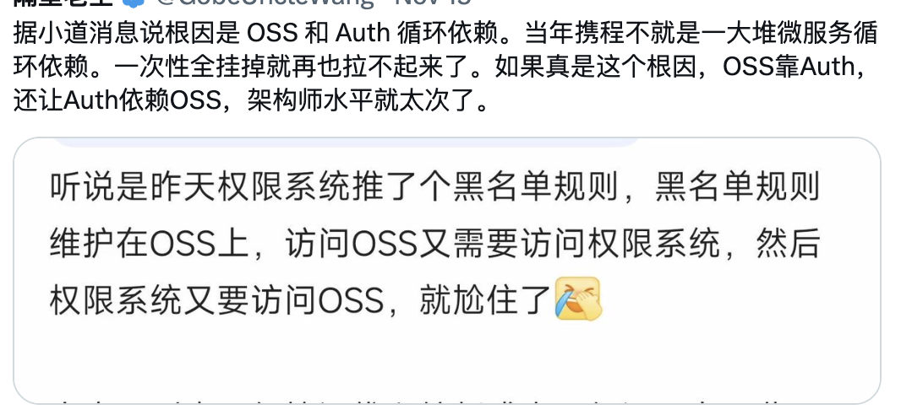
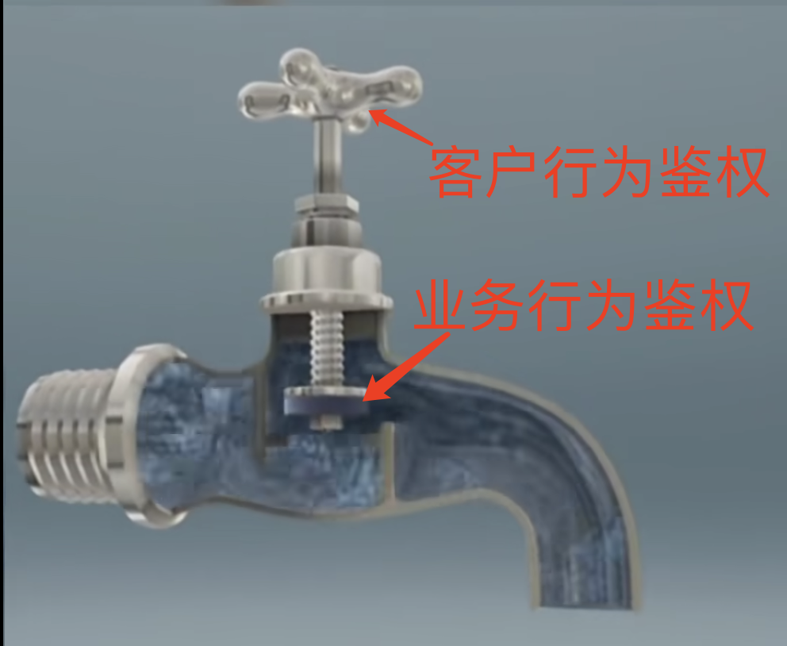
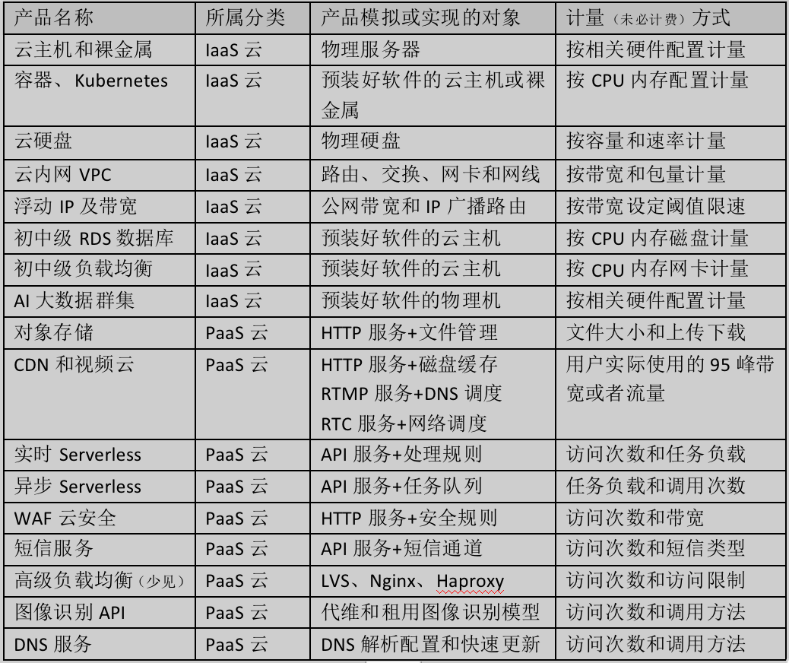

> 原文链接：https://mp.weixin.qq.com/s/JLGulYq3QGbj4euuyfmJdw

> 公众号：云算计

# 阿里云的P0故障和PaaS产品的特性

**目录
**

- 
读者的关注点有问题

- 
硬核资料的来源

- 
真实的故障叫PaaS鉴权故障

- 
PaaS云的鉴权和IaaS不一样

- 
为什么故障动静那么大

- 
我为什么感谢阿里云

**0.&nbsp;开篇曲**

我不是故意的，找图的时候找到的

- 
她唱着他乡遇故知 —— 客户端走过广域网来访问PaaS云产品

- 
一步一句是相思 —— 每一次访问都要做认证

- 
台下人金榜正提名 —— 鉴权服务拿到一个新的白名单

- 
不曾认台上旧相识 ——&nbsp;直接把客户端访问给拒了

**1. 读者的关注点有问题**

我从写公众号至今，为了装薄一，我从来不追热点，只写硬核知识分享，阅读量老是在1000-3000之间徘徊，写的最好的那篇《[一文谈尽边缘计算](http://mp.weixin.qq.com/s?__biz=MzU5NDAzNDEyMA==&amp;mid=2247484164&amp;idx=1&amp;sn=cebb77ba31a66a6068227905bd6df4cd&amp;chksm=fe062fa3c971a6b5ffd1b6d9acbce5150dff5c0180bc3b0d08a945c878e427f72d77ab537065&amp;scene=21#wechat_redirect)》，阅读量也才32767左右。

在这次杭州云故障喜提热搜以后，我凑个热点，趁着各位云计算爱好者发炎之前，写了一篇《[去年今日的杭州云故障不同](http://mp.weixin.qq.com/s?__biz=MzU5NDAzNDEyMA==&amp;mid=2247486210&amp;idx=1&amp;sn=b7aef5b9fbf73362b2b2352f60904cff&amp;chksm=fe0627a5c971aeb30d7da833d7f849568f12e11924e3bcc3fb6a67623ed02c4f47dcbeea5833&amp;scene=21#wechat_redirect)》，阅读量到4万多我是很懵的，你们肯定是把这个当做娱乐内容了。

这次阿里云的故障，我搜集了一些硬核资料，再发一篇凑热点的文章，我看这次凑热点的阅读量能到65535吗。

毕竟我要出书，毕竟本文介绍的观点，也是我书中的核心观点：

- 
应该以什么标准IaaS云和PaaS云？

- 
区分IaaS云和PaaS云产品是故弄玄虚还是真有价值？

**2. 硬核资料的来源**

我发布带厂商标题的《[阿里云故障理性分析](http://mp.weixin.qq.com/s?__biz=MzU5NDAzNDEyMA==&amp;mid=2247486234&amp;idx=1&amp;sn=2eee13babd29f26231a24b77a947b2c9&amp;chksm=fe0627bdc971aeab48404f33de02e5e7b5da0884806b6366f244ae187151e8971525d670dd10&amp;scene=21#wechat_redirect)》的名字，既不怕阿里云说我造谣，也不怕云计算爱好者笑我迂腐，绝不是只看了公开的故障报告，我也拿到了一些硬核资料。

- 
我[前篇文章](http://mp.weixin.qq.com/s?__biz=MzU5NDAzNDEyMA==&amp;mid=2247486210&amp;idx=1&amp;sn=b7aef5b9fbf73362b2b2352f60904cff&amp;chksm=fe0627a5c971aeb30d7da833d7f849568f12e11924e3bcc3fb6a67623ed02c4f47dcbeea5833&amp;scene=21#wechat_redirect)火了以后，有兄弟让我瞅了一眼内部的复盘结果。我从其他渠道确认，要被咔嚓的员工所属部门就是故障部门。

- 
随着故障发酵，该云高管需要去客户现场做解释。恰好有个朋友要接待该云，我戴着口罩混在会议室里，听着一个货真价实的云高管解释了故障现象。

- 
我也有其他朋友是阿里云的用户，他们的反馈是当天没什么感觉，或者快速将业务切走了，或者虽无故障但预防性将业务切离了。

- 
全球各地的运营商都可以查一下故障时段，阿里云的带宽是彻底归零了，还是仍然有较为活跃的业务负载？

阿里云这次故障，确实就是访问密钥业务异常了，异常原因就是写错了访问密钥服务的白名单。网上传来传去的阿里云故障报告，和我从内部拿到的信息基本相同。

阿里云这次故障，是本文的解释一个硬核问题的关键证据。但很多朋友不懂IT，他们只想知道阿里云有没有故障。我多次尝试都很难把两个事情一并写好，所以我单独发了一篇《[阿里云故障理性分析](http://mp.weixin.qq.com/s?__biz=MzU5NDAzNDEyMA==&amp;mid=2247486234&amp;idx=1&amp;sn=2eee13babd29f26231a24b77a947b2c9&amp;chksm=fe0627bdc971aeab48404f33de02e5e7b5da0884806b6366f244ae187151e8971525d670dd10&amp;scene=21#wechat_redirect)》，今天单独发出本文，解释阿里云如何帮我解释了PaaS云产品的分类问题。&nbsp; &nbsp;&nbsp;

**3. 真实的故障叫PaaS鉴权故障**

很多云计算爱好者，受限于个人的技能水平，看到阿里云的公开故障报告以后，只能分析出，“阿里云连真实故障原因都不说，ta都不知道怎么凑热点”。下图是随机选了个小丑，如果云厂商情真意切的又高调发出几万字的罪己诏故障复盘，不过是在对牛弹琴。（下图的东北是那个凑欧盟热度的东北，不是我国东北）。

我并没有必要给阿里云洗地。因为认证服务故障确实会导致灾难性故障，而淘系APP集体扑街并不代表阿里云用户会集体故障。从我的角度看，这次故障现象的严谨解释方法是：

- 
**PaaS云产品 共同依赖的 业务行为鉴权系统&nbsp;**出现了**逻辑异常**，有一部分PaaS用户的访问请求被直接驳回。

- 
不用PaaS云产品的客户和CDN客户不受故障影响；遭遇PaaS云故障的客户可以快速迁移到其他云厂商。

- 
淘系APP遭遇PaaS云故障，确实逃无可逃，这个故障监测点无法描述真正的故障现象。

网上有个段子，说鉴权服务获取白名单的DevOPS脚本，需要从对象存储内获取数据，偏偏对象存储服务本身也被鉴权系统关起来了。从阿里云公开的信息中，发现故障后花了28分钟完成杭州节点业务恢复，花了45分钟完成全球节点恢复……故障处理的时间对得上，但是这么大的公司，获取配置不走专门的配置服务，而是使用“湿漉漉”的配置文件吗？

我不愿意对故障提技术意见，我提的意见或者让自由发挥的网友不开心，或者能够咔嚓咔嚓再切几个人责任人出来。

**4. PaaS云鉴权和IaaS不一样**

经过上文的解释，一帮吃瓜观众都要拿西瓜砸我了，“就这？”

就这……但也不只是这，我先解释什么叫“业务行为鉴权系统”——就是阿里云故障里说的这个AK系统。

最早的鉴权系统，可以被称为“客户行为鉴权系统”。比如客户要在Web界面上删除一台云主机、客户要用DevOPS脚本卸载一块云磁盘，这些鉴权服务关注的都是管理控制工作，只是一个旁路管理系统。

但是PaaS云产品还需要“业务行为鉴权系统”，也是阿里云故障里说的AK鉴权系统。虽然都叫鉴权系统，甚至就是同一套鉴权系统，但这是在同时完成两个性质完全不同的工作。在PaaS云产品里，鉴权系统是客户每一步行为都需要访问的硬核业务系统。以对象存储为例，用户的每一次上传下载文件的动作都需要鉴权，鉴权系统挂了，对象存储就是403拒绝访问了，其他PaaS云产品也是类似的道理。（CDN的特殊性看文末）

考虑到读者里有非技术从业者，我再用水龙头打个比方。

- 
有人说“水龙头坏了”，等同于本文中的“鉴权系统坏了”。

- 
水龙头有很多组件，如果坏的是开关把手，只会影响用户开关水龙头，正在开着、已经关了的水龙头完全不受影响。这等同于本文中的“客户行为鉴权系统”出现故障。

- 
如果水龙头是阀门、管道这类业务系统坏了，每一滴水珠流过水龙头时，都会受到影响，打不开、流不尽、关不严的故障都会出现。这等同于本文中的“业务行为鉴权系统”出现故障。

PaaS云产品遇到鉴权系统挂了，就可以认为是PaaS云产品全部挂了，所以这确实是一次全局大范围P0故障。这个故障现象和阿里云的公开报告里是相同的内容，PaaS云产品全挂、IaaS云产品不能操作但依旧在正常运行。

我并不太愿意跟装薄一大师傅一样，给别人出技术改进的方案，之前文章给的改进方案也是越聊越虚。

一般情况下，笨人笨办法，给不同的PaaS云产品拆分出不同的鉴权系统，就能将故障控制在同一个产品内部。但这次故障的详细原因是，鉴权系统的“白名单”推送错了。就算各个PaaS云产品用各自独立的鉴权系统，最终这些鉴权系统还要依赖同一个叫做“白名单”的配置文件或者配置字段。肯定有大聪明说不要把配置信息集中化管理，但这又会带来一堆新问题……

**5. 为什么故障“动静”那么大**

那天的故障现场，鸡飞狗跳的热闹，淘系APP喜提热搜，我看着我也懵。后来我想明白了，这次故障中，淘系APP根本不是一个合格的观测点，实际故障根本没那么大。

阿里云那个故障报告里，写的很清楚：“影响范围：OSS（对象存储）、OTS（表格存储）、SLS、MNS等产品受到影响”，结合我前文的介绍，那故障现象就对得上了——淘系APP多少都会依赖某种PaaS服务。（CDN的特殊性看文末）

PaaS云产品最大的优点是易于迁移，PaaS云产品最大的缺点是 —— 为了计费必须能看到PaaS云用户的访问日志。其他APP可以从阿里云自动无缝迁移到其他云厂商的PaaS云产品那里，而淘系APP敢在其他云厂商这里放表格存储吗？这是其他大客户能快速切换业务，而淘系APP只能硬挺着的原因。

非技术人员应该不太理解，什么叫PaaS云必须看到访问日志，我很清楚对象存储不是网盘，但我就要用网盘给外行举个不靠谱的例子：

- 
当你买了个200G的云磁盘，不管你实际使用多少空间，云厂商只看你下订单的时候写的是200G，就要收你200G的钱，这就是IaaS云产品。

- 
当你往云网盘里存储了200G的高清小电影，云厂商是因为识别出你塞进来一个200G的电影，才找你收这200G的容量费用，然后还要根据你是不是SVIP决定你的下载线路，这就是PaaS云产品。

- 
PaaS云产品必须扫描你的文件，确认你有个200G的高清小电影，他才能给你收取PaaS云产品使用费。PaaS云产品发现这是个小电影，它既能为你提供高清播放服务，也能为了您的身体健康，帮您替换成葫芦娃一类的健康宣传视频，这就是PaaS云产品合理合法看你数据的权利。

结合这个故障解读，我们再看外部客户的故障反馈，就完全对得上了。

- 
首先，淘系APP喜提热搜的根本原因是，故障出现时他们跑不了。为了数据保密，他们不可能使用有竞争关系的大云PaaS；而那几个中立云的PaaS产品质量并不太牢固……

- 
其次，大客户即使在使用阿里云的PaaS产品，故障瞬间也会快速切走，这是大型客户普遍没有报故障的根本原因。甚至有一些大客户在得知阿里云存在故障以后，没故障也预先把业务迁走了。

- 
最后，很多IT从业者都反馈，自己这次故障没什么感觉。他们用的是云主机、容器等IaaS产品，确实不在故障的作用域之内。我咨询了几个做网络游戏的工程师，他们的服务端都没有出现大范围掉线；《原神》在故障时段的微博上发了个短信异常的通告——对，短信通道真的也是PaaS服务。

因此，阿里云的故障影响范围，其实并没有我们脑补的那么大。技术男评估故障，不要靠公众号、不要靠热搜、多看数据少看情绪……

**6. 我为什么感谢阿里云**

自从想透这次故障以后，我挺感激阿里云的，所以冒着被喷子们喷一次（但我也可以钓鱼）的风险，特地写了一篇《[关于阿里云故障的理性分析](http://mp.weixin.qq.com/s?__biz=MzU5NDAzNDEyMA==&amp;mid=2247486234&amp;idx=1&amp;sn=2eee13babd29f26231a24b77a947b2c9&amp;chksm=fe0627bdc971aeab48404f33de02e5e7b5da0884806b6366f244ae187151e8971525d670dd10&amp;scene=21#wechat_redirect)》。因为阿里云这次故障以身证道，帮我证实了一个很重要的议题。

我在公众号里多次提到，很多人对IaaS、PaaS的偏见即无逻辑，也无价值。很多用后槽牙思考的沙滩之子，他们眼里的IaaS就是傻大黑粗的卖资源，PaaS放屁都是技术屁、擤鼻涕都有利润的香味。他们特别擅长嘲笑IaaS和跪舔PaaS，但是让他们列个云产品分类标准，或者给个清晰的PaaS云产品列表，他们只会顾左右而言他……

我从2021年开始，就给大家科普《[什么是IaaS云、什么是PaaS云](http://mp.weixin.qq.com/s?__biz=MzU5NDAzNDEyMA==&amp;mid=2247485104&amp;idx=1&amp;sn=63a23ca725496b0ae825b9d920cc6bc4&amp;chksm=fe062a17c971a301749070058eef9b32925b285b87226aa7199136ec2db0ed919c7425699c51&amp;scene=21#wechat_redirect)》。因为IaaS和PaaS的区别实在太大了，而IaaS产品内部、PaaS产品内部的共性太有意思了。但这篇文章被当做了吐槽闲侃文章，阅读量1800。

今年的《[云卖资源，天经地义](http://mp.weixin.qq.com/s?__biz=MzU5NDAzNDEyMA==&amp;mid=2247486053&amp;idx=1&amp;sn=2c89d8b76923832a86974fa45c4c7556&amp;chksm=fe0626c2c971afd4148dd642298b6d574b41c1b8a959970fc4497fab0eaf3ccbfdc39061404f&amp;scene=21#wechat_redirect)》一文中，我直接将书稿中，对IaaS和PaaS产品的列表截图发出来了，标题都用了震惊体了，阅读量2000。现在我再发一次产品分类图，大家看看，阿里云这次的故障产品，完全是顺着我对PaaS云产品的定义出的故障。

IaaS和PaaS的关键区分方式，就是用“资源上限”还是“实际用量”来计量收费。PaaS云产品最典型的特点就是，按照实际用量计量和收费，PaaS云产品里的鉴权模块不是旁路管理模块，而是核心功能模块。IaaS云和PaaS云的区分，不仅有宣传价值，更有产品价值和技术价值。

- 
很多只会DevOPS的爱好者们，喜欢狂吹容器和RDS。这次故障中，从主机到VPC、到RDS到容器这几个服务都没故障。云主机和RDS、容器有什么共同点哪？它们都是货真价实的IaaS云，在我的书中，RDS等产品被统称为“模板化云主机”，对容器的点评也归属IaaS云章节。

- 
很多吹嘘PaaS的云计算爱好者们，你们眼里高大上的技术型PaaS，怎么都没资格出现在故障通报里哪？一款云产品要想创造海量营收，必须有充足的价值依据，就凭几个程序员的那点工资，无法称为营收上亿产品的价值依据。而且我还是那个揭老底的话题，你们对自己公司的程序员有多么的孝顺，能让他们给你们打工，而不是自行创业上市（RTC公司点了个赞）。

这次故障报告没有出现CDN产品，并不是说CDN产品不是PaaS，而是因为CDN下载文件的时候不需要鉴权。CDN没出故障，这其实是阿里云故障报告诚恳真实的佐证。如果对象存储或者其他PaaS云产品都设置为匿名使用，也不会出现客户可以感知的故障。

****
