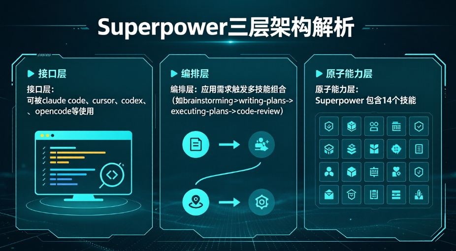
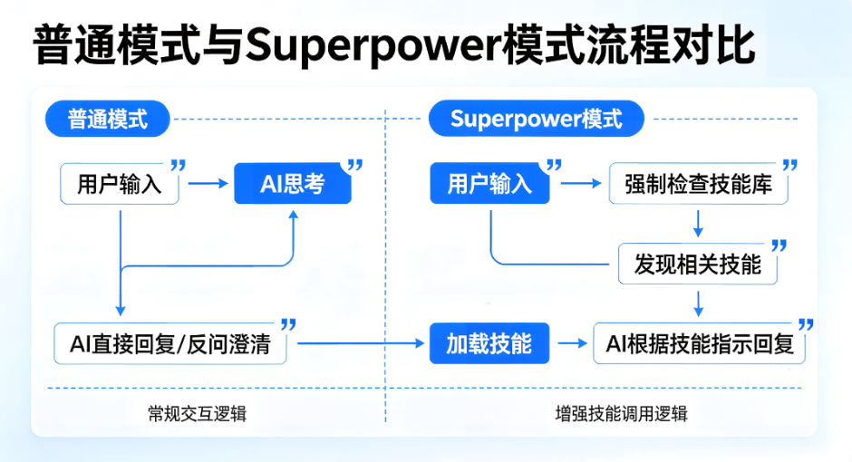
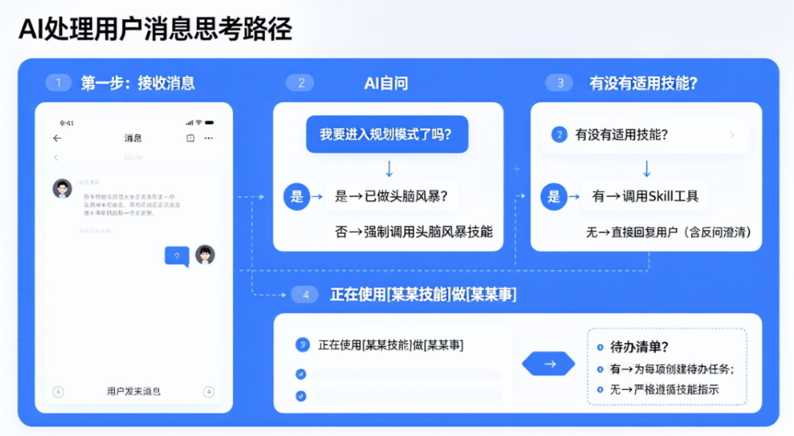

> 原文链接：https://mp.weixin.qq.com/s/-elbJezcr_58OpPaAS7Sdg


关于superpowers的使用和底层实现，已经有不少解读，但是“纸上来的终觉浅”，还是实际梳理一遍，心里踏实。另外，关于如何使用，不在本文讨论范围内。本文的目的：

1. 深入superpowers的底层实现，加深了解，更好的使用这一工具
2. 更进一步：借鉴superpowers的底层实现，可以构建个人的组合技能

## Superpowers 是什么

## 全景概览——有个物理印象

Superpowers可以分为3层，接口层-编排层-原子能力层，其中接口层是指：可以被claude code、cursor、codex、opencode等使用；编排层是指：在应用中提出的需求，会触发多个技能组合（比如：brainstorming->writing-plans->executing-plans->code-review）；原子能力层是指：superpowers有14个技能。如下图所示：



Superpowers 不是工具，不是框架—— **它是一套给 AI 装上"职业习惯"的标准化开发流程** 。如何理解呢？在https://skills.sh 中搜索superpower时，出现的不是一个单一技能，而是一个技能合集：


通过官方插件市场安装后，本地安装目录在~/.claude/plugins/cache/claude-plugins-official/superpowers/5.0.7，其文件组织形式如下（有删减，不影响理解）：

```
.
├── agents
│   └── code-reviewer.md
├── AGENTS.md -> CLAUDE.md
├── CLAUDE.md
├── CODE_OF_CONDUCT.md
├── commands
│   ├── brainstorm.md
│   ├── execute-plan.md
│   └── write-plan.md
├── docs
├── hooks
│   ├── hooks-cursor.json
│   ├── hooks.json
│   ├── run-hook.cmd
│   └── session-start
├── LICENSE
├── package.json
├── README.md
├── RELEASE-NOTES.md
├── scripts
│   ├── bump-version.sh
│   └── sync-to-codex-plugin.sh
├── skills
│   ├── brainstorming
│   ├── dispatching-parallel-agents
│   ├── executing-plans
│   ├── finishing-a-development-branch
│   ├── receiving-code-review
│   ├── requesting-code-review
│   ├── subagent-driven-development
│   ├── systematic-debugging
│   ├── test-driven-development
│   ├── using-git-worktrees
│   ├── using-superpowers
│   ├── verification-before-completion
│   ├── writing-plans
│   └── writing-skills
└── tests
```

## using-superpowers——引导技能

### 模式对比

在确定superpower是如何实现工作流编排之前，首先引导技能—— `using-superpowers` ，其功能描述如下：

> description: Use when starting any conversation - establishes how to find and use skills, requiring Skill tool invocation before ANY response including clarifying questions
> 
> **不管用户说什么，你必须先查技能库，绝不直接回复。**

也就是安装了Superpower之后，用户的问题将由各个专家（skill）负责拆解回答，而不是直接丢给模型，体现了“ **工具优先** ”的思想。下图直观展示了，「不使用技能」 VS 「使用superpower」智能体的响应模式。



### 1%命中原则

在 `using-superpowers` 的SKILL.md中，使用 `<EXTREMELY-IMPORTANT>` 特别强调了如下内容：

> <EXTREMELY-IMPORTANT>If you think there is even a 1% chance a skill might apply to what you are doing, you ABSOLUTELY MUST invoke the skill.
> 
> IF A SKILL APPLIES TO YOUR TASK, YOU DO NOT HAVE A CHOICE. YOU MUST USE IT.
> 
> This is not negotiable. This is not optional. You cannot rationalize your way out of this.</EXTREMELY-IMPORTANT>
> 
> **在任何响应或行动之前，先检查是否有适用的技能。哪怕只有 1% 的可能性，也必须调用。**

为什么是 1%？因为 AI 太容易"觉得不需要"了，所以在 `<EXTREMELY-IMPORTANT>` 之外，有用大写强硬语气写道：

```
IF A SKILL APPLIES TO YOUR TASK, YOU DO NOT HAVE A CHOICE. YOU MUST USE IT.
```

这样，其他技能被调用的可能性大大增加了，这是后续工具链的起点。

---

一点思考：我们在开发自己的技能时，对于特别需要重要的内容/约束，也可以采用 `<EXTREMELY-IMPORTANT>` +大写组合的方式！

### 指令优化级

这么强硬的约束，不是1+1=2也要触发技能吧？不会的，在引导技能中确立了 **指令优先级** ，可以人为控制（自动化的情况下还真有可能会触发 -\_-）：

```
1. User's explicit instructions (CLAUDE.md, GEMINI.md, AGENTS.md, direct requests) — highest priority # 用户指令永远优先
2. Superpowers skills — override default system behavior where they conflict # 元技能指令覆盖系统prompt
3. Default system prompt — lowest priority # 系统prompt优先级最低
```

SKILL.md还特地举了个例子，如果你的 CLAUDE.md 写了"不要用 TDD"，技能规范就会被覆盖。 **用户始终掌握控制权** 。

用户的指令虽然是最优先的，但是为了防止Agent“偷懒”，把用户指令中的what，理解成How。skill.md的最后特地又强调了一遍 —— **用户只负责提需求，AI 必须按规矩办事。**

> ## User Instructions
> 
> Instructions say WHAT, not HOW. "Add X" or "Fix Y" doesn't mean skip workflows.

这里给Agent划定了红线：用户的指令只是提需求，不是告诉你(Agent)怎么干，老老实实干活，不要以为用户说了啥，你就可以跳过某些步骤，举个例子：

- **用户说** ：“把那个按钮变红。”（这是 WHAT）
- **AI 错误做法** ：直接去改 CSS 代码。（跳过了 HOW）
- **AI 正确做法** ：先检查有没有“UI修改规范”或“颜色管理技能”，按照那个技能规定的步骤去改。（这才是正确的 HOW）

### 技能使用原则

#### 应该做什么

**强制检查** ：在给出任何回复或采取行动之前，AI 必须先判断是否有现成的“技能”可以处理这个问题。

**极低门槛** ：只要觉得有 1% 的可能性某个技能能用得上，就必须去调用它来确认一下。

**容错机制** ：如果调用后发现这个技能其实不适用，那就不用它，但这一步“检查”的动作是省不掉的。

除此之外，引导技能文档中还定义了技能调用流程，结合个人使用经验，是不是有点熟悉。



#### 不应该做什么

除了告诉Agent如何正确调用skill之外，还做了反向约束——明确不能做什么！ 要求Agent彻底放弃“凭经验”、“凭直觉”或“图省事”的想法， **无条件地、机械地** 优先执行“技能检查”流程。下表中的每一项都在告诉Agent不要试图“偷懒”（Hi哥们，我已经看透你了！^\_^）

| 常见借口 | 现实真相 |
| --- | --- |
| “这只是个简单的问题。” | 只要是问题就是任务。先去查技能！ |
| “我得先搞清楚上下文。” | 查技能这一步，甚至要排在“问清楚问题”之前。 |
| “让我先探索一下代码库。” | 技能会告诉你该怎么探索。先查技能！ |
| “我快速看一眼 Git 或文件就行。” | 文件里没有对话的上下文。先去查技能！ |
| “让我先收集点信息。” | 技能会告诉你该怎么收集信息。 |
| “这事儿没必要用正式的技能。” | 只要有现成的技能，就得用。 |
| “我记得这个技能是啥样的。” | 技能是会更新的。去读最新版本，别凭记忆。 |
| “这不算个任务吧。” | 只要涉及行动就是任务。先去查技能！ |
| “用技能有点杀鸡用牛刀了。” | 简单的事也会变复杂。用技能才稳。 |
| “我就先做这一件事。” | 动手之前必须先查技能。 |
| “感觉这样挺高效的。” | 没纪律的瞎忙最浪费时间。技能就是防这个的。 |
| “我知道那是啥意思。” | 懂概念 ≠ 会用技能。去调用它！ |

#### 工具链的齿轮开始转动——技能调用优先级

> When multiple skills could apply, use this order:
> 
> 1. **Process skills first** (brainstorming, debugging) - these determine HOW to approach the task
> 2. **Implementation skills second** (frontend-design, mcp-builder) - these guide execution
> 
> "Let's build X" → brainstorming first, then implementation skills."Fix this bug" → debugging first, then domain-specific skills.

当存在多个技能都符合1%原则时，该怎么排个 **“出场顺序”** 。核心原则就是： **先想好怎么干（Process skills first），再动手干（Implementation skills second）。**

Process skills（ **流程类技能** ）：头脑风暴、调试流程等，这些技能决定了Agent **“该怎么去搞定这个任务”** 。它们是用来制定战术的。

Implementation skills（ **实现类技能** ）：前端设计、MCP 构建器等，这些技能是用来指导 **具体干活** 的。

举个例子：

“咱们来做个 X 功能吧”：先调用 **头脑风暴** （理清思路），再调用 **实现技能** （开始写代码）

“修一下这个 Bug”：先调用 **调试流程** （学会怎么查错），再调用 **具体领域的技能** （去修复代码）

**总结** ：别一上来就写代码！先看看有没有“怎么做计划”或“怎么排查bug”的技能，搞定思路后，再用“怎么干活”的技能。

还有一个细节： `using-superpowers` 开头有一段 `<SUBAGENT-STOP>` 标记：

```
<SUBAGENT-STOP>
If you were dispatched as a subagent to execute a specific task, skip this skill.
</SUBAGENT-STOP>
```

这防止了工具链“无限套娃“问题，被委派执行特定任务的subagent跳过元技能，直接执行任务，引导技能只对主 Agent 生效。

#### 关于执行的力度——刚柔并济

> ## Skill Types
> 
> **Rigid** (TDD, debugging): Follow exactly. Don't adapt away discipline.
> 
> **Flexible** (patterns): Adapt principles to context.
> 
> The skill itself tells you which.

这部分主要告诉Agent，确定技能之后如何执行？太死板有时会显得蠢，太灵活有时会显得自作聪明（Agent：我太难了！！！），如何抉择 —— 区分 **刚性技能** 和 **柔性技能**

**刚性技能** ：测试驱动开发、调试等，此时应该“严格照搬，一步都不能差”

**柔性技能** ：设计模式、代码规范等，灵活变通，你要理解它的核心原则，然后根据当下的实际情况去调整应用

---

一点思考：引导技能文档读下来，你可能会觉得作者考虑的真周到，个人认为这是作者不知道“踩了多少坑”之后的智慧结晶；后续，我们在开发自己的skill或者prompt时，需要注意：

1. 告诉AI 需要做什么的同时，也要明确不要做什么
2. 明确刚性要求是什么（必须遵守的规则），柔性要求是什么（可以发散的点）
3. few-shot，适当的提供样例
4. 可以在skill.md中指定当前技能调用之后，后续应该调用什么技能，形成工具链
5. 罗马不是一天建成的，skill的研发，需要不断的打磨

---

### 为什么这么关注引导技能

一句话，引导技能的skill.md，在每个新会话中都会被完整的加载，而非普通技能那样，在Claude Code启动时仅加载skill.md中的name 和 description。这样做是为了让 Agent一开始就知道"如何使用技能系统"

引导技能的skill.md是通过hooks被完整加载的，其主要逻辑是：

```
# 让claude code自己总结的逻辑如下：
  会话启动/clear/compact (clear/compact是我在查看hooks.json时的意外发现)
    ↓
  Claude Code 触发 SessionStart 事件
    ↓
  读取 hooks.json，发现需要执行 run-hook.cmd session-start
    ↓
  run-hook.cmd 调用 bash ./session-start
    ↓
  session-start 脚本：
    1. 读取 using-superpowers/SKILL.md 完整内容
    2. 转义并包装成 <EXTREMELY_IMPORTANT> 块
    3. 输出 JSON 格式的 additionalContext
    ↓
  Claude Code 接收 JSON 输出，将 additionalContext 注入到上下文中
```

下面把session-start中最重要的部分，摘出来大家看下：

这里明确要读取引导技能的全部内容：

> #Read using-superpowers contentusing\_superpowers\_content=$(cat "${PLUGIN\_ROOT}/skills/using-superpowers/SKILL.md" 2>&1 || echo "Error reading using-superpowers skill")

这里说明引导技能的内容如何使用的，再次见到了<EXTREMELY\_IMPORTANT>：

> session\_context="<EXTREMELY\_IMPORTANT>\\nYou have superpowers.\\n\\n **Below is the full content of your 'superpowers:using-superpowers' skill - your introduction to using skills. For all other skills, use the 'Skill' tool:**\\n\\n${using\_superpowers\_escaped}\\n\\n${warning\_escaped}\\n</EXTREMELY\_IMPORTANT>"
