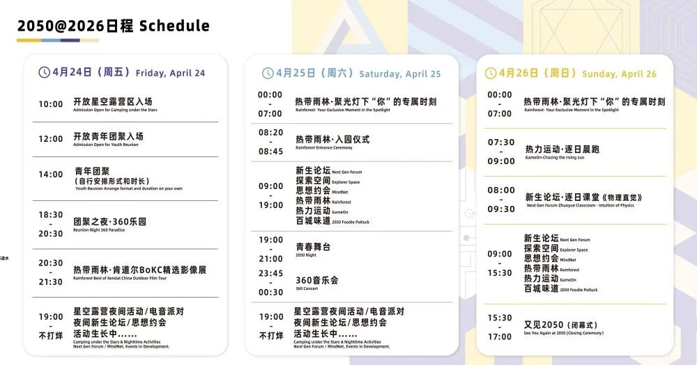

> 原文链接：https://mp.weixin.qq.com/s/Ye3JA3IuAQ_PgBSO6GokmA

> 公众号: 瑞典马工 Agents特区

# （大多数）年轻人玩不转AI

科技行业一直有一种年龄崇拜，特别偏好年轻人。以前崇拜盖茨乔布斯这样的大学退学生，后来发展到Peter Thiel直招高中生，现在的高等是媒体到处塑造“14岁AI少年”。

不敢想象再过几年会怎么样，会不会有“含着奶嘴开发一款智能体指导新生儿父母育儿”的神童？

前几年，还有创始人一定要强调自己是“95后创始人”。我知道90后非主流曾经大战80后独生子小皇帝，没想到90后内部还分高级婆罗门95后和普通刹帝利90后。今年是2026年了，不知道现在他们会不会用“96后创始人”来划成分。

我国有一个天使投资基金，特别喜欢投年轻人。只要你有个过得去的简历，又没达到法定晚婚年龄，随便胡诌个故事，就能拿到他们的投资。

这个做法对天使投资基金是可行的，毕竟他们只押宝独角兽。只是绝大多数公司做不起来，创始人浪费时间，还不如去厂里打工。

从我有限的观察看，这些年轻人都很厉害，也很勤奋。不过很多人试图解决的是挠背问题，基本逻辑是：“我背很痒，我发明一个挠背神器，一定有很多人需要”。&nbsp;

一个“留学生AI情感伴侣”的产品，让人印象深刻。我看了下创始人的背景，果然是留学生。

不论是互联网还是AI，终究要解决他人的问题以创造价值，才能获得回报。

很多年轻人并没有太多生活经验，根本找不到有价值的问题去解决。我已经见过一百个“小红书发帖skill"，一千个“写作智能体”，一万个“日常文档管理系统”。这些玩意不是没用，但确实没什么大用。

现在媒体打造的AI神童，当然都是非常聪明的孩子，但是做来做去，就是做一个又一个APP。这些孩子并没有真正着迷的问题去解决，他们更享受被挑出来晾晒。

王坚院士最近搞的2050年大会，企图让“年青人因科技而团聚”。愿景非常好，但是年轻人团聚之后，行程安排是这样的：

全球最有趣的年轻开发者，创客，和AI爱好者聚齐到杭州，然后就一起看电影？

每个社会都有大量的问题值得解决

1. 即将临近的6·18促销会让电商客服团队过载。

2. 留守儿童缺乏系统性的学习监督和辅导。

3. 零汉语知识的外国游客无法使用大部分中文App。

4. 软件行业的探索性项目反馈周期长，风险大，成本高

5. 公务员需要内网环境下可用的公文索引。

集体看电影和贴95后标签只能小圈子自娱自乐，社会不会奖励自我感动，AI不能帮你做决定。
